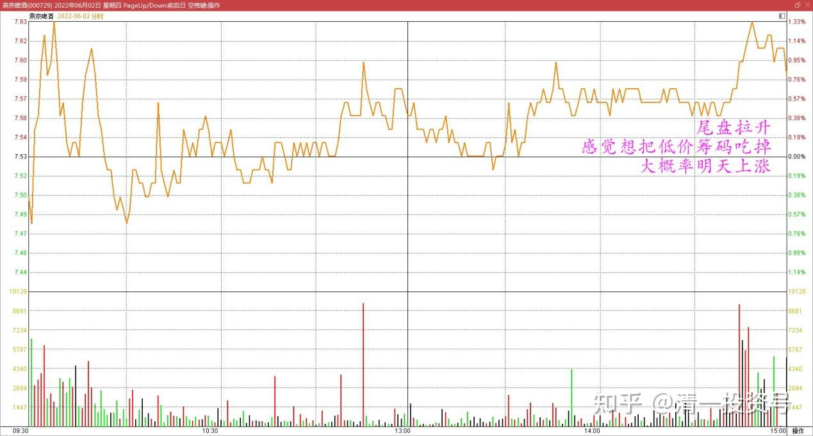
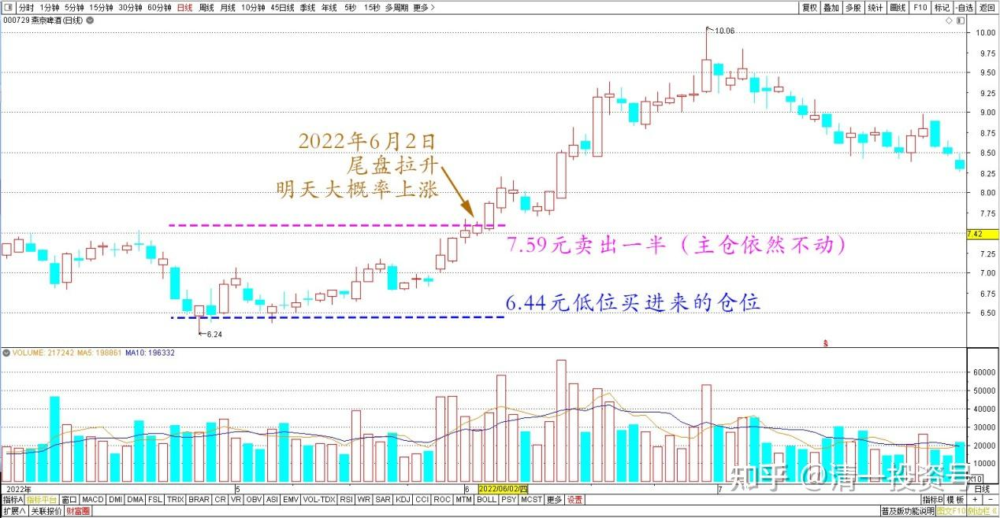
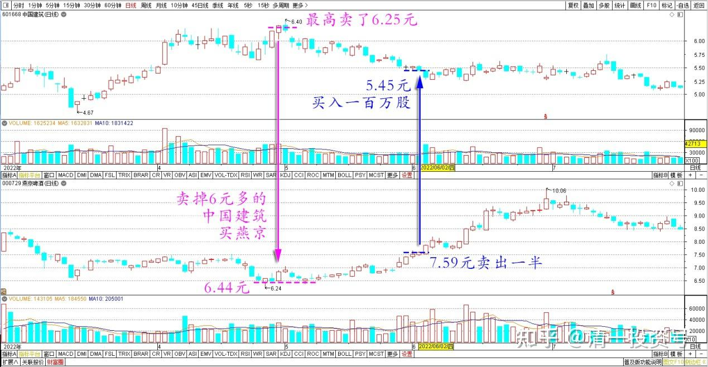

专篇33.多赚了几十万股

清一山长2022年6月2日

前几天说燕京正在酝酿一场攻势，现在证明的确如此。今天尾盘拉升更是典型，感觉想把低价筹码吃掉的样子，大概率明天是上涨的。

燕京啤酒2022年6月2日分时图

只是我今天挂单7.59元卖出，计划是把6.44元低位买进来的这部分低价燕京仓位，卖掉一半出去。**做股票别太贪了，燕京每股已经赚到一元多了，算够了**。燕京主力很抠的，要给这点钱，已经很不容易了。但主仓我依然保持不动。小仓位做点T，保持账户的灵活性，也帮券商赚点钱。

燕京啤酒2022年4月～7月日线图

特别是买燕京的钱，是卖掉6元多的中国建筑换来的资金，中国建筑最高卖了6.25元。今天看跌到了5.45元，就买入了一百万股。

中国建筑、燕京啤酒2022年3月～7月日线图

看成交回报单，基本上是一大群散户卖给我的。没有啥大单，就只有几个百手级别的单子，没有千手的单。一点也不起眼的小单积累了几百次成交完成的一单买入。由于我是挂单排队，慢慢买的股票，相对用了“较长时间”来买进，可以看出中建的成交是很活跃的，很多小散在进进出出的忙，成交量其实不少。**这次中建——燕京——中建的买进、卖出交易很漂亮，多赚了几十万股燕京进来。感谢资本市场的无序和疯狂。**

另外，今天看账上多了一百多万快两百万的现金，看看明细，是华菱钢铁的分红到账了。**每年靠这些股的分红，日子就过得很不错了，还去操心啥打工赚钱？不如去做自己喜欢的事情去。做好，做漂亮了。这就是财富自由。**

(标题、图片为编者所加)

**文章音频：**

[459篇.多赚了几十万股](http://link.zhihu.com/?target=https%3A//www.ximalaya.com/sound/739581161)

**参考链接：**

[专篇24.涨停但不像拉升出货](https://zhuanlan.zhihu.com/p/657944680)

[专篇25.裘国根清仓式减持华能国际电力港股](https://zhuanlan.zhihu.com/p/659254254)

[专篇26.主力倒手，游资被动替主力杀跌](https://zhuanlan.zhihu.com/p/660162209)

[专篇27.看多不做多，主力在第二阶段](https://zhuanlan.zhihu.com/p/661469607)

[专篇28.走势打破正常思维，看空不做空](https://zhuanlan.zhihu.com/p/662755132)

[专篇29.股票•期货](https://zhuanlan.zhihu.com/p/665201830)

[专篇30.谁是真强势？谁是真弱势？](https://zhuanlan.zhihu.com/p/676527421)

[专篇31.中建换啤酒和资源股](https://zhuanlan.zhihu.com/p/677138763)

[专篇32.三种涨停的原因](https://zhuanlan.zhihu.com/p/688788024)

