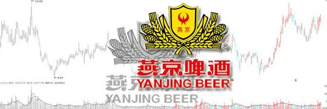
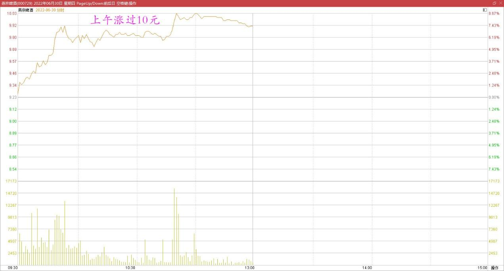
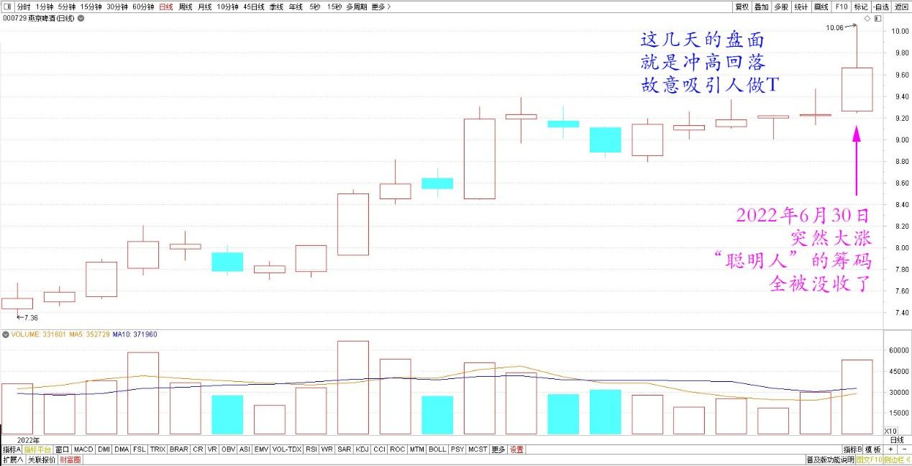
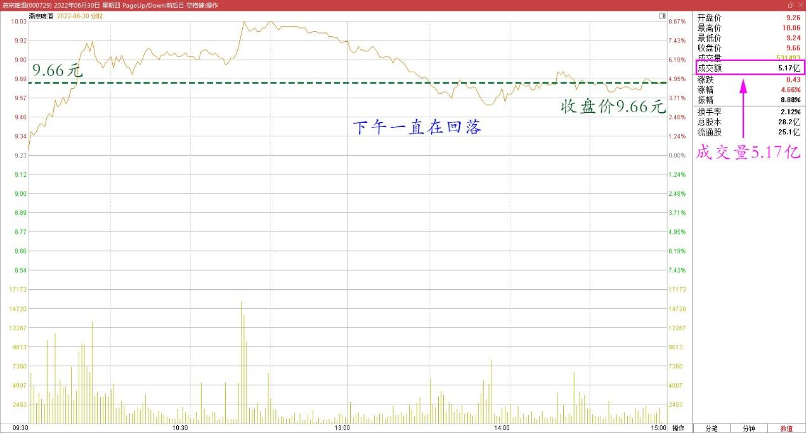
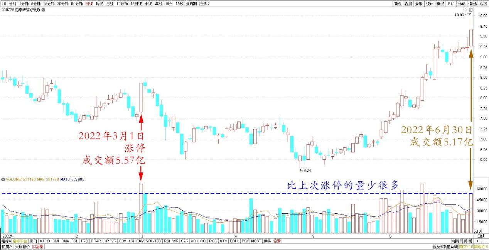
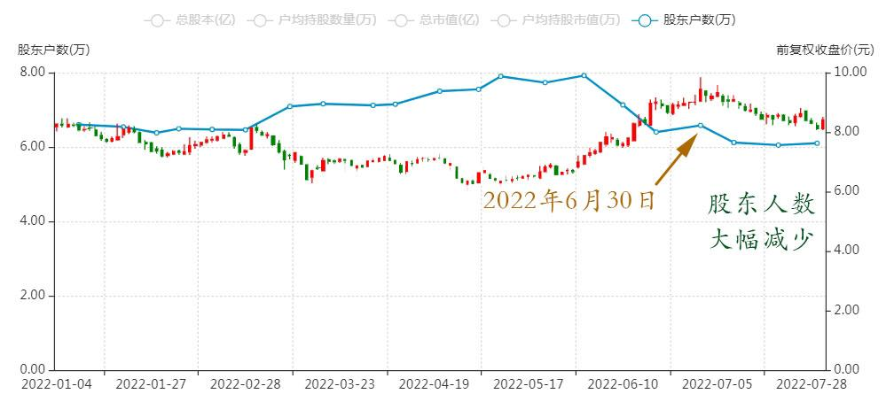
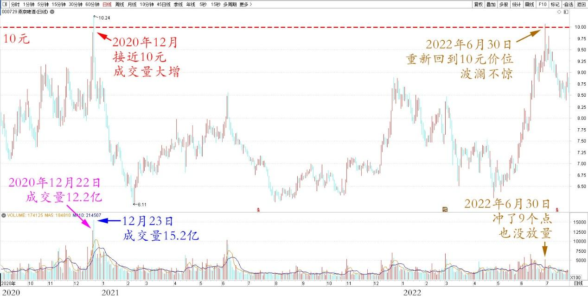
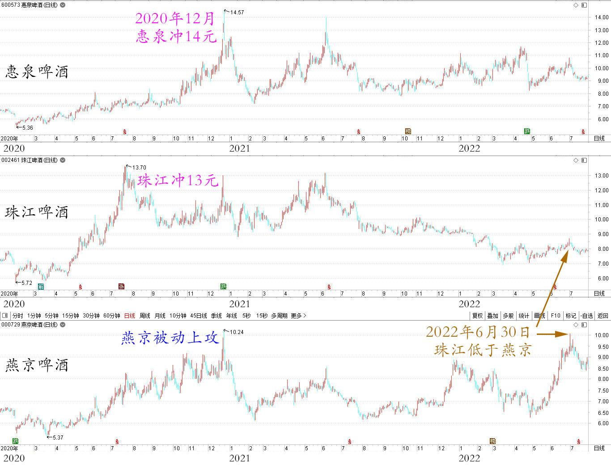

专篇38.燕京过10元，今昔对比

清一山长2022年6月30日

**一、上午涨过10元，可喜可贺**

今天上午给公主班学生上课，中午回来看到燕京涨过10元了，可喜可贺。

燕京啤酒2022年6月30日上午分时图

**这几天的盘面，就是冲高回落，故意的吸引人做T**，每天看到冲高回落，似乎这种钱不赚白不赚。傻乎乎的主力只会傻乎乎的送钱，但不知道，**别人让你养成惯性，是有目的的**。越是这个时候，越要管住手，别出手。我看到这种盘中走势，就判断燕京快拉升了。但何时不知道，我连账户都不打开，不去理他。**这种一两毛的小钱钱，根本就不要**。果然，**今天突然大涨，这些“聪明人”的筹码，今天就全被没收了**。别以为自己能够算计过主力，我是认输的。

燕京啤酒2022年6月日线图

这段时间，一直提示大家注意守住筹码，恭喜信我的人，今日全都赚钱了。燕京今天正式超过中建，成为我赚钱最多的个股。希望目前暂时落后的中建，以后也能赶上来。今天重点是下午的成交量，如果成交量上不来，今天只是未来大幅涨升的开始。10元是底，而不是顶。如果今天成交量比较大，就需要在10元前后继续调整。目前燕京盘面已经能够看懂了，与两年前的惠泉差不多了。过去几年，我就是看不懂。导致在燕京上一直不赚钱。所以——我们只能赚我们看得懂的钱。**专心提升自己的境界，比抓技术走势，看财务报表都重要**。

**二、下午一直回落，量少很多**

收盘了。下午一直在回落，成交量5.17亿，比上次涨停的量少很多，收盘价9.66元。

燕京啤酒2022年6月30日分时图

燕京啤酒2022年1月～6月日线图

正好今天是30日，下周公布的股东人数，将比上期大幅减少。因为今天这样涨，肯定洗走了很多人。我判断股东人数现在只有五万多人了。

燕京啤酒2022年1月～7月股东人数

这种局面，证明韭菜是拯救不了的，穷人就不该去帮忙。无论你怎么花心思分享正确的投资理念，甚至送给他标的，并做好示范买入，但，**本性上他们只相信自己**。燕京目前只是走了初升阶段而已，主升阶段还没有来，我猜下周该来了。今天还不是真心上涨，只是大幅洗盘罢了。继续强化“上午冲高就要卖”的散户投机思维。所以，你们就发现了：**散户永远是一群可怜虫。就算底部抓到牛股，也只是赚一点小钱就被洗掉了。但中了陷阱，亏起来是亏大钱，真的是想跑都跑不掉**。

记得两年前，上一次接近10元的时候。成交量大增，一天就12亿，以及一天15亿。今天重新回到10元价位，居然波澜不惊，今天冲了9个点，也没放量。

燕京啤酒2020年9月～2022年7月日线图

好处是主力没有出局，坏事是散户不肯跟进。为啥：如果大批的散户不看好，没有追进来。主力也没有出货。但**主力为啥不赶快乘机拉升呢？这种情况下，新的散户没有吃到货，原来的散户都跑掉了。没有形成短线赚钱效应，怎么吸引人气跟随？**一路上涨，就是主力自拉自唱最傻的主力才会这样做。两年前燕京的上攻放量，是因被动上攻导致的人气自然的聚焦。因为珠江和惠泉当时都很热，都冲13-14元了。燕京怎么可能不跟？所以很多散户去追买相对价值更便宜的燕京。因此燕京主力准确判断了当时的啤酒股，只是过江龙行情，不可能持续。干脆与过江龙一起，顺手吃一波散户。主动倒货给散户了。如果判断反了，燕京的筹码就被抢了。但现在：珠江、惠泉主力已经退了，股价低迷，珠江居然低于燕京了，这几年很难得的情况。

燕京再来今天这样拉升，其实没有群众基础。但上轮的燕京坑害股民，记忆深刻的人解套就走了。这样白送给主力两三年的免费站岗。对主力来说，帮他们解套很划算。可以极大地降低整体持仓的成本。但**如果你们真的发现下周的股东数大幅下降、你就知道情况真不妙——将来谁来接盘呀？现在都是散户丢给主力筹码，主力如果不断拉升，人气越来越少，不就把自己弄到高山上站着，再也下不来了吗？它解放了所有的散户，把自己成功套牢了**。所以，**只有傻庄才一路拉高。基本上主力都要吃掉90%以上的货才能随意做高股价。但却让自己无法出货，只有"纸面富贵"，拿去银行抵押套现**。因此，**真正聪明的主力，不会弄到自己这样被动，他们在吃掉相当部分的仓位后，基本消灭低位进货的小散（这就是主力不怕你低位拿货的原因）。之后会锁主仓。然后会利用高抛低吸，用操作手法来制造一条漂亮的上升趋势线。并不断吸引人进入，提高持仓成本。此时主力目标不是赚钱，也不赚股（不想多买），反而会不断让散户赚钱。甚至反复的赚钱，散户赚钱之后，就会不断“分享心得”，夸耀自己的本事。于是无意中，就做了主力的宣传员**。不断扩大燕京的钱很好赚的美誉度（此前的燕京，在股民心中都是；一只千年不涨的烂股，谁买谁倒霉）。散户最终都会发现，燕京这是“善庄”。因此会纷纷加入，来割主力（其实是互相割）。**如果散户加入，但主力没有派货的话，就是低成本的散户，抛货给了高成本的散户，互相换了一拨人，但股东总数不增加。于是大家知道：主力没有走，还在吃货，涌来的人就越来越多**。此时主力需要制造大幅的震荡，吃一点差价，用这些利润来拉升。但现在还不会出货，一出货就破坏了上升走势。接下来，**人气聚焦了，网上到处宣扬燕京是当今热股，机构到处推荐了，此时主力就已经准备出货了**。但出货不是看到消息直接出，这不是打机构的脸吗？他们会反向出的。不断拉高，也许还会不断的出现涨停的热情，不断拉升股价到散户们不敢想象的地步（茅台谁敢想象超过千元？超过两千元？但它就是超过了）。让散户认为机构推荐果然有道理，相信了啤酒的逻辑，是永恒的逻辑。于是散户蜂拥而入，只是成交量持续放大，这就是一般的坐庄规则。幅度——参考顺鑫农业。完美的坐庄操作，**我坚信燕京是下一个顺鑫。而不是下一个珠江**。珠江的主力太小了，实力不够。这种超级主力，运作的时间，空间幅度都很高的。一旦走起来，需要有三五年的运行周期来操作一只股票。我一直在等这一天，现在都还没有等来。燕京的利润，我吃定了。赚钱来给全世界的冠军发高额出场费，让我们的木兰抢走她们的冠军称号。一次批发买50个冠军回来。这生意我认为划算——“**燕京杯世界格斗冠军大赛**”[大笑]。

(标题、图片为编者所加)

**文章音频：**

[525篇.燕京过10元，今昔对比](http://link.zhihu.com/?target=https%3A//www.ximalaya.com/sound/793617224)

**参考链接：**

[专篇32.三种涨停的原因](https://zhuanlan.zhihu.com/p/688788024)

[专篇33.多赚了几十万股](https://zhuanlan.zhihu.com/p/693300690)

[专篇34.涨跌无意，笑看云起云落](https://zhuanlan.zhihu.com/p/708781915)

[专篇35.燕京主力已吃饱，唯一办法“屁股功”](https://zhuanlan.zhihu.com/p/6778261298)

[专篇36.燕京逆势大涨，自觉卖出部分](https://zhuanlan.zhihu.com/p/11402979763)

[专篇37.卖洛阳钼业，燕京换中建](https://zhuanlan.zhihu.com/p/15817619966)

