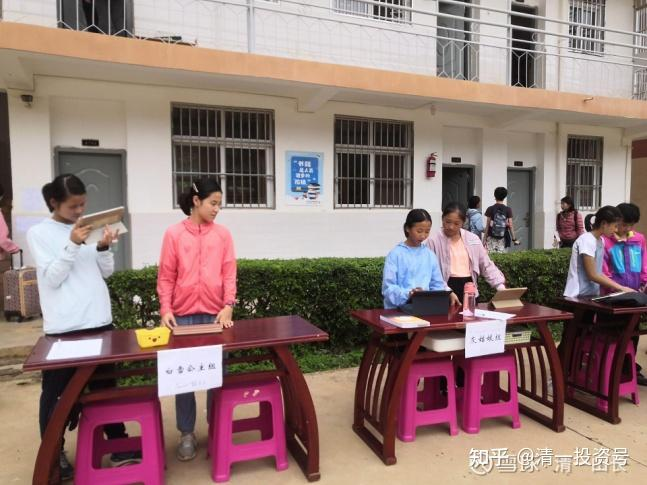

原雪球专栏[185篇.15岁少年自学拿到了清一大学全额奖学金！](http://link.zhihu.com/?target=https%3A//xueqiu.com/9310099567/187919210)

清一山长 2021年6月30日

谁说的新教育是有钱人玩的游戏？不花钱，不补习，小孩子自己在家自学，三年多四年不到，15岁就拿到了清一大学的全奖入学！

[微信网页链接](http://link.zhihu.com/?target=https%3A//mp.weixin.qq.com/s/Uzjna_y4vLAl9TRMExV5Zg)

[https://mp.weixin.qq.com/s/Uzjna_y4vLAl9TRMExV5Zg](http://link.zhihu.com/?target=https%3A//mp.weixin.qq.com/s/Uzjna_y4vLAl9TRMExV5Zg)

我今天，才第一次知道这个孩子的故事。原来，真的有一批家长，正在跟随我分享的教育理念，自己教育孩子。**这是最低成本，但最高收益的教育投资**，这还是北京的家长。原来我很郁闷，我该教的，都全教出来了，但家长们表示就是不懂。就是要我背着走，要送钱给我带孩子。这明明很简单的事情，已经说得够清楚了，家长就是不做，也不相信自己也能做出来。弄得去年我只好把示范班的课程直播放出来，让你一步一步的跟学，这总该会了把？这还不会？还跟不上？我看你就没救了。

现在，有真实故事结果了：有个2016年来过今日学堂上过一个学期短训课程的孩子，用我们的方法，在家自学三年多，还自己练武术，**15岁就通过了SAT官考1410分，还跑了马拉松，获得了清一大学的全奖入学资格**。这个学生9月份就可以正式入学了。

我在家长群的回复信息：朱彻的逆袭故事，我都稀奇。这孩子的家长，很有智慧，把新教育学到身上了。我看一些新教育学堂的某些教师，未必有家长这样——理解得这么透彻的。一些关键地方的处理，就是使用了新教育的核心：**关心过程，关心信念是否正确，不关心结果如何（结果交给上帝来控制）。**家长们迫使孩子自己去关心结果，关键是迫使孩子明白了一件事情，**建立一个基本的信念系统：学习是自己的事情，不是家长的事情。**

很多家长，就是犯了这个毛病，知道学习很重要，就“替孩子操心”学习的事情，结果孩子自然不重视学习了。**只有孩子自己真的明白了，学习是自己的事情，他才会认真学习。他如果没有这种信念，被你逼着学习，效率很低，还随时会反水。而一旦他明白了这个道理，就算是自学，他的学习效率也比家长花钱选名校，找名师，花功夫陪读，效率要高很多倍。**

实际上，朱彻同学这三年多四年时间，真正花在学习上的时间并不多——我看一半还不到——就轻松取得了美国前50名大学的入学成绩，说明啥？说明学习真的很简单，三年学完12年，不是啥高难度的指标。这不是只有今日学堂的优等生才能做到的成绩，而是**一个智力正常的孩子，可以不要老师，甚至不要伙伴，自己跟学网络课程，也可以做到的成绩**。真别神话了体制教育的课程设计和课程大纲，真就这么弱智的，它照顾的是最差的学生的进度，让正常智力的学生根本就吃不饱，反而在学习中养成坏毛病——拖沓、低效。我一直说，**今日学堂的学生不是啥天才，都是正常人。取得天才一般的成绩，是因为他们的对手都在用错误的方式学习。**

这个孩子，作为第一届突破班的学生，在没有示范班跟随模仿的情况下，就能实现这个成绩，可见**孩子的学习动力是第一位的**。当年他的同学，你们还有一年时间来准备考试。后来的突破班学生，分流的，没分流的，都要知道：这个考试指标，**1400分，基本上是放水指标**，不是啥难度指标（1500以上，的确有点难）。**如果考不上，绝对是学习态度有问题。**

随便说说结论——朱彻的自我奋斗说明：**新教育，真的不是有钱人的游戏，而是有心人的教育。只要有心，你们自学都能通过，一分钱不要，也能学得很好。**这孩子，11岁只上了半年的突破班，15岁考上全免费的三语高中。现在给的机会，都是突破班一年学习的时间，您再考不上，就太不成体统了。未来，**只要你们15岁通过官考SAT 1400分，通过半马和运动，想来读清一大学少年班，我就照单全收，全奖的名额不限，考进来我全部供养。进入后，教你们外面不懂的思维和心理行为课程。**

你们看懂了这篇文章的奥妙，上今日学堂就轻松了，我们的教师就不必浪费时间在教英语上了。你们家长也省下大笔的学费，不如用来存起来，给孩子上大学用。这就是志气——有志气的家庭，怎么都有出路。分流也是一种教育，但家长要利用好。特别送给今年突破班毕业，落选挑战班的几十个家庭。你们要给孩子树立一个信念：**花钱上学的是钱多人傻，我们不花钱，照样考上今日高中，考上清一大学。**

照片是今天，公主班体验夏令营的报道现场。照片中就是公主预备班的小助教，第一届公主预备班的成员。她们现在13岁，大概率两年后均能全奖入读清一大学少年班。

本次公主夏令营。有接近200个年龄13岁左右的小公主们报名参加，已经是我们接待能力的极限。我们将从中选出10～20人，作为第二届公主班的预备成员。每一届公主班，都将学习一门新的第三国语言。**她们18岁的时候，将去一个新国家的名牌大学，奋斗四年，拿到四个不同国家的四个本科学位**，宣告新一代学霸的诞生。**代表中国，展现新教育学生的风采和荣耀。并带动这个国家的上层社会，了解新教育，帮助这个国家，建立实行新教育的新型学校，让新教育走向全世界。**

**每年一个国家，20年后，我们将在20个国家生根和开花。新教育就真的实现了国际化生存，不再依赖任何国家了。**

小公主们都很期待能够加入这一场伟大的游戏，很好玩。但入学要求显然极高。学生们不仅仅要求是学霸，还必须同时是运动达人，还要同时是“社交达人”！交流和沟通课程，贯穿在公主班的整个教学过程中。也会在本次公主夏令营中充分的展现。可以说，公主班是新教育皇冠上的明珠。对于男生来说，新教育的顶尖殿堂，是[国学馆](https://www.zhihu.com/people/mkaga)（[清一武道馆](https://www.zhihu.com/people/mkaga)）。

由于公主班是我的创意，以及全新的实践，与传统的突破班，和直通车班都不一样。而且今年是**首届公主班体验夏令营**，要接待来自全国的200位学生。所以，作为指导教师，课程设计师，我现在同时得带两个不同的班上课，有点压力。

第一天的课程，是德鲁克的人生管理智慧

[雪球网页链接](http://link.zhihu.com/?target=https%3A//xueqiu.com/9310099567/184339542)：[https://xueqiu.com/9310099567/184339542](http://link.zhihu.com/?target=https%3A//xueqiu.com/9310099567/184339542)

我们从这个时代的顶尖智库中，找来教材学习。我们不学弱智的中小学课本。这些让您的孩子学吧！我们只学你们不学的东西。不然，将来怎么可能跟你们不一样？

想进来学的，可以跟上面文章介绍的一样——自己15岁考进来，我免费教你，包食宿。考不进来，你就去体制学校的红海里面，“奋斗终身”了。

**附录问题一：**

**您担心，考不上清一大学咋办？或者错过了15岁，孩子18岁才考出这个成绩咋办？**

**您这样想，就是人太傻了。这个成绩，可以申请入读全世界的绝大多数大学（除了中国的大学）。SAT 1400分，可以入读美国前50名的大学，以及世界前100名的大多数大学了。如果拿到东南亚来，可以上几乎每个国家的第一名大学（估计就是新加坡的第一名大学有点难，因为这是世界第10名大学。但您考上前三名大学，肯定没问题）。**

**附录问题二：没有学籍怎么办？没有高中毕业证，您怎么申请国外大学？**

**答案：只要你考过了SAT 1200分，你就可以来我们这里挂今日高中的学籍，发给国家认可的高中毕业文凭。就算你成绩连这最基本的要求都达不到，只要你是学新教育的，你就可以来找我们帮忙，给你挂泰国高中的学籍。别担心学籍，担心学到了什么本事，才更靠谱。**
