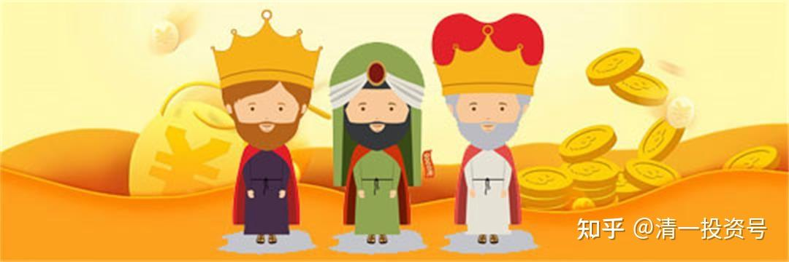
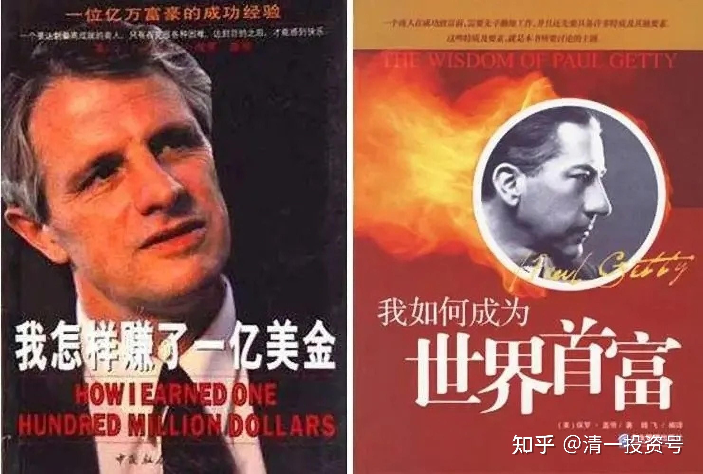
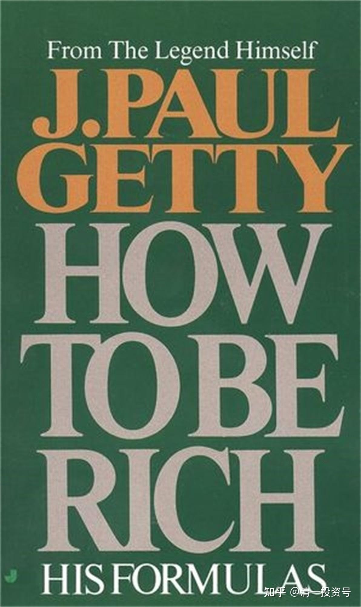

14篇.跟国王散步，让首富帮我们赚钱——清一山长2018年演讲《教育与财富的前世今生》节选

清一山长 2018-08-26

**1.跟国王散步，向首富学习**

大家的掌声那么热烈，我知道是有要求的，需要分享一些能够让大家简单赚钱的方法。

我在1991年下海的时候，有一个人对我的指导很重要，我为什么能够在1993年进入股市，然后到现在稳赚到资金，跟这个人有非常非常大的关系，这个人就是原来的美国首富**保罗·盖蒂**。估计现在很多人都不知道这个人了，他是七八十年前的美国首富。他有一本书，叫做**《[我如何成为世界首富](http://link.zhihu.com/?target=https%3A//pan.baidu.com/s/1nt8zSoT%23list/path%3D%252F)》**。我仔细看他的书，看来看去发现一个很大的道理，他虽然做石油起家，但真正成为世界首富，靠的是（二十世纪）30年代在美股狂跌的时候，在经济崩溃的时候，果断买进一些最优质的公司，后来上涨了几十倍，上百倍，迅速地把他推向首富的宝座。我就发现，**第一，股票是个好东西。第二，在别人恐慌的时候入市有很大的好处。**

那么今天是不是让大家继续向保罗·盖蒂学习呢？我觉得保罗·盖蒂可能离我们比较远，我们能不能找一些身边的案例？比如我们身边的中国首富，我认为是值得大家学习的。另外，上海首富好像也值得我们学习。**这就是我们跟国王散步的一个密码**。我们想要赚钱，想要获取巨额的财富，你们跟我学习的话，我觉得档次低了一点。我都是跟他们学习的，直接把最厉害的人，比我强得多的人介绍给大家，让大家跟他们学习，我也在跟他们学习。我把我的学习心得或学习成果给大家汇报一下。**希望大家像我一样，跟首富学习**。

我们能不能借助他们俩的优势帮我们赚到钱？第一，马云的优势在哪里？他的优势是眼光。在我们大家根本不知道互联网为何物的时候，他得到了一个机会，到美国去邀请别人来中国参加一个会议。邀请没成功，但是他英语好，美国朋友给他介绍了几个新东西，他一看，哇，这东西叫互联网，中国那时候根本没有互联网，他当时马上就有眼光，他知道互联网是代表未来的趋势，回过头来他就开始搞互联网，搞到现在他成功了。马云的眼光大家佩服吗？所以我们要借用马云的眼光。

另外一个人郭广昌，佩服他什么呢？他1993年才开始创业。1993年他只有人民币3.8万元，1993年有人民币3.8万的人应该也不少，当然那时也不是特别多。但是1994年他就变成了100万，1995年就变成了1000万，然后第三年就变成了一个亿。我发现郭同学有几大优点，他的管理能力很好，他的团队融合能力很好，他的战略执行能力很好，这就是我们要学习他的地方。

**2.让首富帮我们赚钱**

不过现在大家听了一句，觉得有点难了。第一，马云的眼光不是谁想学就能学的，郭同学的管理能力也不是谁想学就能学的。

那怎么办？**我们怎样让他们帮我们赚钱呢？**太简单了，让他们替我们打工好不好？**我在教一种让他们替我们打工的方式。**不要说没可能，世界上没有不可能的事情，只有我们怎样才有可能的问题。

郭广昌号称是中国的巴菲特，他的特点在哪里呢？他很善于投资。我们在座很多人可能认为他就是炒股的，但是他比炒股有个更高级的地方，我们做不到的地方。我们炒股就是把股票买进来放着，这是我的公司，不想要就把它卖出去。他认为这跟他的投资不一样，他的关键点是投后管理。他说投资只是价值创造的开始，而投后管理才是真正的价值投资，真正的价值是从投后管理出来的。投后管理就是你要投资后对它进行管理。

我举一个很形象的例子，我带我们家女儿到国内的任何城市一逛，我都会非常神气地告诉她，你看这是我们家的银行，你看招商银行，我们家的银行；然后再看这边民生银行，这也是我们家的银行；兴业银行，这也是我们家的银行。然后我们家小姑娘瞪着她幼稚的双眼问：“爸爸，我们为什么有那么多家银行？”我就告诉她一句很实在的话：“女儿，因为银行有钱啊！”有时候我还会告诉她，我们是不是进去看看，比如招商银行，我们进去看看我们家的员工，他们工作努不努力，如果他们努力的话，给他们一个表扬，说你们干得很不错。女孩就问：“如果他们干得不好怎么办呢？你能不能把他们开除掉？”然后我说：“这个不能，我回去股东开会的时候，提提意见，看有没有用。”

我投前管理做得到，投后管理我做不到。我虽然可以自吹，我是这些大银行的小老板，是他们的股东，是他们的老板。我还可以很自豪地告诉你，这些银行每年分给我的红利比银行行长的年薪还高。这就是比银行行长还舒服的位置，但是我就没有银行行长的权利，我不能去管，我不能开除任何一个人。

但是郭广昌这点他做得特别棒，这些企业他投资了，他都可以去做一个投后管理，用他的话叫“赋能”，就是给予它一个让它比原来更会赚钱的本事。我只能选一家赚钱的公司买进去，但是他是把一家可能原来不那么赚钱的公司，经过他加入之后让它赚更多的钱。

比如说大家知道他买下了海外的一家做旅游的公司叫“地中海俱乐部”。他买下“地中海俱乐部”之后，他就对它进行赋能，利用他复星的资源，让“地中海俱乐部”在两年之内，中国客户增长了10倍以上。

还有大家看到去年他收购了一家中国公司，青岛啤酒，大家很熟悉，肯定在座的几乎所有人都喝过青岛啤酒。他也说要对它赋能，因为青岛啤酒最近十年的盈利状况不是太理想，他说他要通过赋能让它赚钱，甚至让它赚十倍以上的钱。青岛啤酒，他是从日本招日啤酒手上把它买下来的。他买过来之前十年没赚到钱，招日啤酒也蛮可怜的，只好不赚钱，把它让出来了。他让出来之后到了郭广昌手上，不到一年，这个啤酒公司就涨了很多，涨了40多亿。他还没开始赋能，等他开始赋能之后，说不定能涨得更多。这就是他的一大特色。我们在座的任何一个人都可以买股票。但是有一点我们做不到，就是我们没办法赋能，没办法让它更赚钱。

那么想不想学会为这些优质企业赋能的方法，我能不能一句话教给大家？其实可以，**我的方法就是委托郭同学帮我们来为企业赋能**。这件工作你愿不愿意做？郭广昌是董事长，然后我们做董事长的董事长。我们说这件事情太复杂了，我也搞不清楚。郭同学你负责来做，你能干些。然后让他乖乖地帮我们做就得了。然后你赚多少钱，咱们一起分，合伙人，这就是我给大家出的主意。这行吗？行。他很欢迎你。

然后再看看马云的眼光在哪里？我们都说了，马云的眼光特别好，马云投资了郭广昌，投资了复星国际，在2015年，他花了20块钱买了复星国际。你买了复星国际，就是买了郭广昌的公司。郭广昌的身家就在里面。所以郭广昌他赚一分钱，他要按照比例分给你。你该得的那个比例，就看你钱多钱少了，你钱多你买他公司的50%、60%。当然最好别买那么多，买那么多的话，你得自己来赋能，你最好买少一点，像我一样，买个1%还不到，千分之一也可以，他赚了100块钱，他就应该分一块钱给你。你买的太多了的话，你得自己去管，太复杂了。我们没这个本事，包括我。我觉得我有一个地方比郭广昌自豪，他只能一天抽半小时去练练拳，如果我高兴，我可以练一天的拳。然后我不用管事。为什么？别的时间他得干事情去。我们就干这件事情，就是委托他去做。

那么郭广昌他自己吹牛复星很好，但是马云眼光很好，**马云买了它，证明马云认为复星是没问题的**。特别是马云的眼光，认为复星20块钱是没问题的。所以现在我告诉你们，现在你可以去买复星，你只需要花13块多，有时候我在怀疑会不会我的眼光比马云还好。他20块钱买他，我13块钱买它，你看谁划算？

**3.不推荐大家炒股，跟住会赢的人**

最后一个结论，**对90%以上的投资者来说是不适合炒股的，所以我不推荐大家炒股**。虽然大家认为我过去25年的历史很好，大家都希望复制这段历史。不过我很坦率地跟大家说，我认为这段历史是无法复制的，因为过去中国股市腾飞的这二十几年历史是很难复制的。我熬垮了好几家证券公司，我的证券号是三个数字，有三家证券公司接手，前面几家都垮掉了。那么就证明我的个人生存能力超过了机构，超过了这些公司。当年在一起炒股的战友们一个都不见了，全消失了，我估计他们都回家抱孙子去了。而我还活跃在我们的经济第一线，所以就证明很不容易。可能是百分之一，甚至千分之一、万分之一才剩下来我们这批老股民、老鸟，或者叫老马。太少了。你怎么知道你是剩下的那个呢？万一你是没剩下的那个呢？

但是我想告诉大家，**最稳妥的方式就是你去买像郭广昌（的复星国际）那样的公司**，你去跟他一起投资，你肯定是剩下来的那个人。你不放心的话多买几个，比如买了上海首富，你再去看看，再买山东首富。山东首富的公司，我也买了。想买，你们自己买，山东首富是谁？张世平，对吧？他的公司我也买了，你看我都跟首富在一起，如果我的公司都是首富帮我做，我以后当不了首富的话，当我们家的首富还是可以的。

我不希望在座各位去炒股，不希望你们去天天看着股票这样来跟着它涨跌，起伏。因为90%以上的概率，我很负责任地告诉你，你会被收割，被我这样的人收割，我们在一起，我们不见得是共进退的。万一你跟我反着干，可能我赚的钱就是你输的钱。所以，不要跟这些股市里面几十年血雨腥风闯出来的老将面对面。你就是个菜鸟，**你是个菜鸟怎么办？跟着老鸟走**，千万别被老鸟甩下去了。然后不要自以为是，你自以为是，很可能你要吃亏，这是我的肺腑之言，不希望你去炒股。**希望你跟住一个大家，跟住一个肯定会赢，我们认为大概率会赢的人，然后你就问题不大**。那么跟上我们的山东首富，跟上我们的上海首富，你们再找找云南首富是谁，我不知道。找到这些人，他愿意让你跟投的话，你跟着他投，你是最安全的。然后到十年之后你一定会赚很多的钱，40年之后你会赚更多的钱，说不定到时站在台上的是你，不是我了。

**《[我如何成为世界首富](http://link.zhihu.com/?target=https%3A//pan.baidu.com/s/1nt8zSoT%23list/path%3D%252F)》（**保罗·盖蒂，2006年）

