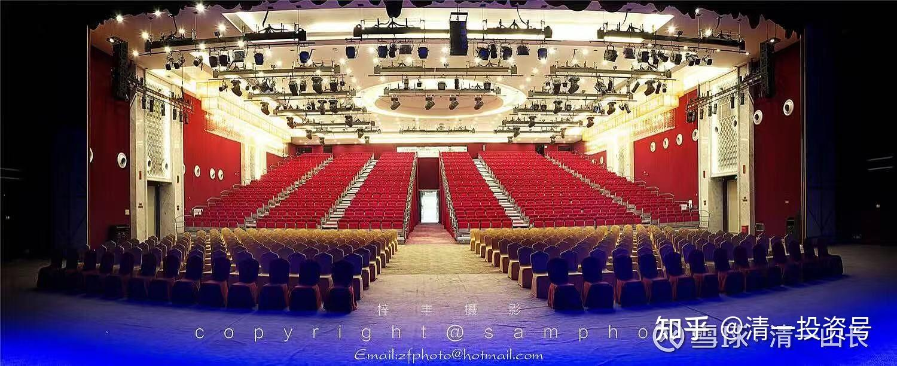

[原雪球专栏](https://zhuanlan.zhihu.com/p/591552552/edit)[213篇.国庆新教育新财富分享会：您参加了吗？](http://link.zhihu.com/?target=https%3A//xueqiu.com/9310099567/199351540)

清一山长 2021年10月2日

我的国庆公开的、公益的新教育、新财富演讲，未来三天内将要开讲了。我被这一次深圳就有2000人参会的“大点菜”给惊到了：第一就是，要求我做的菜太多，我没法做这么多菜；第二就是，有些菜，明显是我做不出来的菜式。比如，有些问题您是该去问钟南山的，像疫情啥的，却要我回答，不是明显为难我吗？我只好乖乖地公开承认，有一些问题是超出我的能力范围的，是我回答不出来的。数量上，我最多只能回答所有这些问题的五分之一。如果我贴出的内容中，有一些是你们最想知道的问题，可以在回帖中提出来，点赞最多的，我会尽量选择回答。以后会议组织者，可能会放出我的现场回答的。

**一、疫情给世界带来的改变和应对**

1.由于病毒不断变异，全球疫情会不会一直持续5年甚至10年以上？

2.随着防控疫情措施对经济的不利影响日益显现；随着包括打疫苗、停学、停工在内的人为控制被证明属于徒劳；随着人们心理承受力越来越强，大多数国家会不会完全放开管控，让人们在疫情延续中恢复正常生活、学习和工作，而不是等疫情消失后才恢复正常？如果大多数国家在付出了经济和较多的人口死亡的代价后，实现了群体免疫，中国大陆反而成为最脆弱的地方，如果继续闭国，将严重妨碍人员往来和经济开放，影响民族复兴目标的实现；如果放开管控，疫情重新蔓延，又会让多年的努力好像白费，老百姓难以接受。请山长预测未来大陆会出现这样的两难困境吗？如果未来真的出现这种情况，作为个人今天该做什么准备来应对？东南亚疫情严重，中国劳动密集型服装、针纺织行业，到底是走出去开拓，还是应该坚守中国大陆？

3.疫情对阶层变化会产生怎样的影响？实现阶层跃升的机遇对比过去是更少，还是更多？资本利用疫情大发其财，普通人要怎么应对才能减少经济损失？后疫情时代有哪些财富机遇及如何把握？

4.疫情让人们对健康更加重视，那会改变哪些细分行业？未来医疗会有哪些机会？疫情让人们的防范意识更加强烈，自媒体或者个性化会更加突出，餐饮行业是不是会朝着自助餐方向发展？大众餐饮行业（例如燕京啤酒等）还值得投资吗？

5.从目前来看，疫情对中国的国家企业中国建筑、中国铁建、中国电建等的国际化步伐产生了怎样的影响？会不会中断中国企业的国际化进程从而形成发展的天花板？在疫情影响逐步弱化后，美国的打压对这些企业的未来发展又会产生怎样的影响？会完全制约这些企业的国际生存空间吗？

6.互联网经济结束“一铺旺三代”的商铺投资机会，后疫情时代以建设厂房“部分自用、部分收租”的固定资产投资模式是否可行？

7.如果新冠疫情常态化、长期化，孩子、家长和老人三类人群接种疫苗的利与弊有哪些？如何决策？

8.怎样借助疫情让中医更好发展？疫情是否会提升人类对老子思想的认识？

9.疫情加剧了世界格局的重新洗牌，包括教育在内，我们对孩子的教育规划要如何调整来顺应未来的变化趋势？因为疫情导致低龄出国留学学生减少，这部分学生的高端教育需求，是否给新教育带来了新的机遇？如果疫情会常态化，是不是意味着网络教学或者线下小规模教学才能适应这样的变化？

10.非常钦佩山长的家族传承计划，请问在疫情下山长的计划有没有根据最新情况做一些局部更改？

**二、中美博弈带来的挑战与机遇**

1.中美博弈的背后，反映的是一种怎样的生存法则？疫情是否会一直被美国利用作为西方长期持续打压中国的工具？当前形势下，中华民族所能承受的最大动荡是什么？最负面的预测是什么？

2.中美博弈中，中国的优势有哪些？劣势有哪些？我们有可能战胜美国吗？中美博弈大概会经过哪些阶段和节点？有哪些可能的重大风险？中美将来是否会持续对抗，发生局部热战的可能性有多大？若是在中国周边发生了局部热战，比如台湾战争，大量的资本会撤离中国，中国的物价也会飞涨，这种情况下，我们老百姓如何应对？资本市场走向如何？我们在A股投资，需要做好哪些应对准备？对于个人，如何在这两大国博弈中不受到负面影响？我们怎么做才能抓住中美博弈带来的挑战和机遇？

3.疫情让美国彻底露出了赤裸裸的唯利是图的真面目，以前的货币政策完全不适用，美国政府MMT政策，大量超发货币薅全世界羊毛，导致全球通货膨胀，大宗原材料物价上涨，中国政府的对应策略是什么？对中小企业的生存有什么影响？中小企业该如何面对？作为普通投资者，在资本市场怎么跟紧国家战略？如何抓住投资机会？哪些类型的企业值得我们关注？

4.中美博弈期间中国的资本市场如何助力科技创新发展，以解决芯片、高端专用化学品等卡脖子技术难题？对国内科技行业（尤其芯片设计制造业）的发展，带来好的还是坏的影响？3年内科技股是否值得投资？在中美博弈军备升级的情景下，3年内军工股是否有投资价值？中美博弈对国际物流行业会有什么影响？

5.中国在国际舞台是否能争取到更大的话语权？中国的国际地位未来走势会怎样演变？

6.请问怎样观察、判断美股暴跌的大致时间点？如果可能的话，想买入美股看空期权。

7.教育是否会在中美博弈中体现出越来越重要的地位？

8.中美博弈的情况下，疫情给中国道家文化的复兴，特别是道医、武术，是否带来了很大机遇？我们该如何把握好机遇？

9.中美博弈是未来数十年的大趋势，做最好的中国人，新教育的孩子是更应该立志于成为“桥梁般的传道者”，还是“卫士般的保护者”？

10.作为有3个孩子的新教育家庭，中美之争对我们来说，“危”和“机”分别是什么？如何做才是最好的选择？

**三、关于社会分层和家族传承**

1.共同富裕政策对不同行业有什么影响？对于应对中美博弈有什么样的作用？共同富裕目标对社会分层将产生怎样的影响？处于不同层级的人，如何抓住共同富裕的机遇，实现阶层提升？作为父母的我们，如何更好地提升阶层？

2.共同富裕大背景下，国务院将浙江省作为共同富裕示范区，这对浙江省乃至长三角、珠三角的新教育家庭，会带来哪些财富和个人发展机会？

3.随着5G兴起的万物互联经济时代即将到来，万物互联的场景和应用目前还不是很多，后面5年最大的机遇在那些领域？哪些行业未来机会大？

4.目前国家对文化的管控比较紧，我们如何才能实现获得社会认可的文化上层地位？

5.经济不再高速发展，社会阶层固化和内卷越来越严重，如何在新的竞争环境下实现财富管理和家族文化的传承，继承和发扬家族的优良传统，从而打造家族的百年基业？

6.我们人到中年，夫妻都选择去做新教育老师和学习中医（我们内心认为这是最好的选择）。如果多数新教育家长这样选择，是否合适？

7.离异家庭如何谈家族传承？如果孩子都是女孩（也没有机会再生男孩），家族传承的意义何在？

8.家族传承首先需要的是人，但是目前新教育面临的问题也是阴盛阳衰，优秀的男生少，山长除了婚恋课外是否还有其他的招？

9.物质文明的高度发展，对家庭及教育会带来什么影响？当下家长应如何选择？

10.将来在哪里生活工作最好？是中国云南还是东南亚国家或其他？

11.U兄带三个孩子农耕、读书，有传有承，我们是否可以效仿？

12.新教育讲传承，现代社会讲创新更多一些，是传承更重要，还是创新更重要？

**四、国家新政尤其是“双减”政策对新教育影响**

1.国家现在提倡的共同富裕，双减政策团灭校外教培资本等重大举措，体育提到与主科同等地位，学区房与学位脱钩，教师轮岗制度等，对中国体制教育有什么样的影响？给新教育提供了什么样的发展机遇？两种教育下的孩子，需要做好哪些积极应对？对想去欧美的家庭和孩子，未来会产生哪些有利和不利的影响？

2.六年前，我在武汉创办了一家少儿素质教育公司，开了2家少儿艺术培训中心，成为了四个教育加盟品牌的湖北总代理，这几年发展了300多家加盟校。2020年疫情、2021年“双减”政策对我们这些校外培训机构打击很大，据我了解约50%的加盟机构已经关门倒闭，我们自己的直营校还在苦苦挣扎。请问山长如何看待校外艺术培训机构的现在和未来？我的公司应该如何应对当前的危机？

**五、人生价值与意义（个人喜欢与社会责任）**

1.人快到中年，感觉还是没有办法很好地过自己喜欢的生活，该如何做选择？为什么总会觉得自己不够好？

2.对未来的人生选择，应该以什么为基点？是对社会的价值体现，是个人的爱好满足，还是别的什么？怎么做才能让这样的人生规划能够彻底落实？

3.知道自己不想要什么，但却不够清晰自己到底想要什么？怎样才能更聚焦地知道自己想要什么呢？

4.孩子走入新教育后，经常在学堂梳理使命、愿景和目标，但是很多新教育父母自己依然找不到自己使命和愿景，怎么办？有什么方法可以让父母也能找到自己愿景和使命？

5.由于从事新教育不赚钱，被人看不起，该如何调整自己？

6.在这个物质丰裕的时代，如何帮助少年立志？

7.一个15岁的孩子，对于社会责任的概念还很模糊，如何建立起大的格局？在这方面家长可以做些什么？

8.假如您没有学习《道德经》等经典，您会不会有今天的股票投资成就和新教育成就？

9.现在舆论导向是一个人的兴趣最重要。是否有兴趣，是否喜欢，是衡量一个工作是否适合自己的最关键因素。请问山长认可这种观念吗，为什么？一个很有科技天赋的孩子，因为新教育的原因他改变了他成为科学家的理想，而只想做一名新教育老师，而家长则仍然希望他成为一名科学家，该如何引导家长？

10.孩子表现出对物质世界感兴趣，但是对于领导别人不太感兴趣，请问对其人生设计是让他成为一个理工男，还是引导其“换一个人生”，让他过一个擅长和人打交道的人生？

11.新教育并不鼓励孩子学艺术，但有个6岁多的孩子非常喜欢绘画，每天自己会找纸画好多画，画面的故事性也非常丰富，家长是否可以培养孩子的绘画特长呢？要注意些什么呢？

12.山长对作家、编剧这类职业如何看待？

**六、信念系统建立与心理行为调整（儿童、成人的不同）**

1.成人的信念系统，例如：我的孩子必须成功；我要把最好的资源都抢给我的孩子，如何调整？

2.践行几年新教育理念，发觉前期进步很快，改自己的问题也很快，但越往后，越发觉深层的东西太难改了。怎样才能把骨子里的东西改过来？遇到瓶颈该怎么办？有时候认识到了自己的错误，也很想改正，为什么在生活中还是很难改？一做就错，到底应该怎么调整才能真正改过呢？

3.作为家长如何帮助孩子破除旧有的信念，从而重塑正向积极的信念系统？孩子说废话，家长如何帮助他改变这一行为习惯？

4.如何通过一个孩子的行为分析其背后的信念系统？比如，一个5岁的孩子，家庭条件很好，爸爸妈妈都非常热情、乐于分享，但孩子对自己的东西（玩具、用品、食物等）看的非常重，不肯与别的小朋友分享（他会接受其他小朋友的分享）。这个行为背后的信念是什么？如何调整？

5.有些12岁左右的孩子由于没有得到较好的心理行为教育，因此出现了知道的理论很多，可行动上却不改的情况，作为老师应该如何对这个孩子进行引导？

6.穷人家的孩子容易教育出来，还是富人家的孩子容易教育出来？家庭财富地位和孩子可塑性是否存在数据比例上的相关性？为什么？

7.小孩每天跑半马作心理行为调整时，配合度不高，为了吃饭勉强完成，怎样提高动力，主动去完成？

8.如何更好地影响身边的另一半建立正向的信念？

9.越学习，越实践，越觉得自己不行，越觉得自己差得远，生怕一点点错误会影响到孩子们，怎么办？

10.新教育中比较强调找自己的不足，孩子们普遍对自己的不足很清楚，对自己的优点却认识不到，这种情况会对孩子造成怎样的影响？如何进行纠偏？对于孩子的优缺点，是强化其优点，还是帮助他改正缺点，弥补短板？或者是两者都同时进行？

11.对于有些孩子，他的成长是为了证明自己或者超越别人，如何转变成自动自发地热爱学习的信念？

12.在心理行为调整上，往往大多采用断后路的方式让孩子去吃苦，虽然家长与老师都付出了很大的努力，甚至调整几年，仍收效很小，请问这类调整失败的主要原因是什么？需要注意什么才能提高这种调整的成功率？

13.人先天性格可以通过后天塑造吗？如果可以，那么怎么解释“江山易改，本性难移”？成功的人也有性格缺陷和不良习性，比如曹操的生性多疑，就很难改变。

14.孩子之间总是喜欢监督别人的缺点，但自己身上同样的缺点却视而不见。孩子之间“帮助对方发现改正缺点”往往变成互相攻击，起情绪的局面。如何引导？

15.一位11岁的孩子对于老师讲的做人要真实发生了误解，平时对自己和对别人都毫不掩饰说出真实想法，因此得罪了很多同学，很迷茫，该如何掌握对待别人的原则，让自己获得良好的同学关系？如何正确引导孩子如何交友、交什么样的朋友？

16.今年插班的高中新生与往届有什么差异，需要注意哪些行为可以成长得更优秀？

**七、家校关系**

1.家长不理解学校的做法时，家长该如何处理，以便能更好地达成家校合力？

2.对于一些知道新教育好并把孩子送进新教育的家长，但是家长自己不愿意学习改变，该如何办？

3.家长要么全面深入地学习新教育，要么全然地信任学校，忌讳学得不好却又对学校指指点点。这样理解对家长的要求，对吗？

4.家长对孩子的认知，有的时候会和孩子的实际情况或者老师对孩子的认知有很大的差距，在交流时，家长往往配合老师，认可老师的观念，但实际上无法有效进行家校配合，基于这样的情况，老师如何做，才能避免双输的结果（孩子不打招呼的离开以及对学堂口碑的影响）？

**八、家长成长**

1.刚踏进新教育的家长，该如何高效学习和成长？

2.四十岁以上的成年人，受体制教育多年，已经意识到是乱元思维，如何做才能提高思维水平？

3.如果要问是我们需要山长还是山长需要我们，毫无疑问是我们需要山长。我们和山长的差距太大了且越来越大，导致这种差距越来越大的原因是什么？

4.我们被低俗文化包围，被利益集团洗脑，山长的智慧使我们觉醒。可是觉醒了，发现自己思想的贫瘠，思维混乱，黄金时间已经错过了，着急于进步却很慢，如何奋起直追呢？

5.女性偏感性，怎样做可以减少感性，增加理性？

6.家长如何培养孩子的独立思考能力？哪些事情该由父母决定孩子执行？

7.哪些事情需要征求孩子的意见？

8.请山长多分享和明慧相处的故事。

9.山长如果与“神”对话，会是怎样的对话内容？

**新教育教师和堂主答疑（2021年10月5日下午）**

1.对于自控力不太好、竞争力不强的17岁少年，通过港澳台政策考进中国985名校学习四年，再去国外名校，这样的路径是否可行？

2.如果今后师资充足，今日是不是会开设更多的培养方向？

3.外围学堂新教育教师未来的发展机遇有哪些？

4.很多外围学堂收的孩子比天使之翼班的孩子问题更严重，请问怎么学习天使之翼班的问题孩子逆袭调整方案？

5.今日示范对于外围学堂有很大的影响。但是外围学堂模仿的时候往往抓不到核心，比如跑半马、跑50公里，大家都在追求速度、追求距离，结果很多孩子身体跑出了问题。如何避免这样的事情发生？

6.如何提升外围小学堂的生存与竞争力？

7.今日学堂的教师培训可否也增设网络示范课？让一批自助教育的家长可以学习如何成为新教育老师？

8.如何帮助已经踏上新教育岗位，但是信念系统还有偏差的老师？

9.有些家长不考虑孩子本身的基础，只要孩子考不上今日就觉得学校不行，老师不行。是否还需要去做家长的思想工作？

10.对于17～18岁才进入新教育的孩子，考三语高中已经超龄，请问新教育能否帮助到他们升学？

11.对7岁以下的学生，如何培养中文思维？需不需要学习经典？如果需要学习，请问学习什么内容？用什么样的方式来学习？对于10岁的新教育老生，不喜欢中文学习，理解力弱，如何帮助他学好中文？

12.如何解读国家对培训机构的处理以及对民办教育的限制措施？国家教育系统管控越来越严格，新教育学堂办学越来越受限，这些变化对未来新教育发展具有怎样的影响，今日外围学堂应该分别如何应对？如果搬去国外，国家不对义务教育年龄的孩子发放护照怎么办？

13.请山长展望新教育未来十年的发展趋势、规划和对外围学堂的期望要求。

演讲会场
