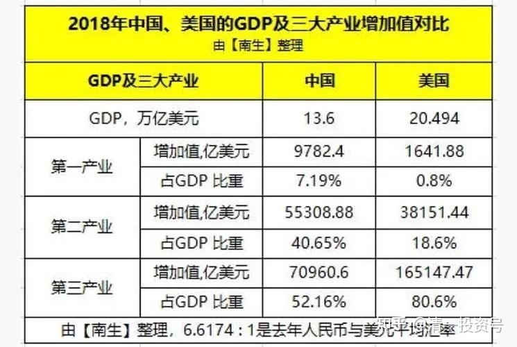
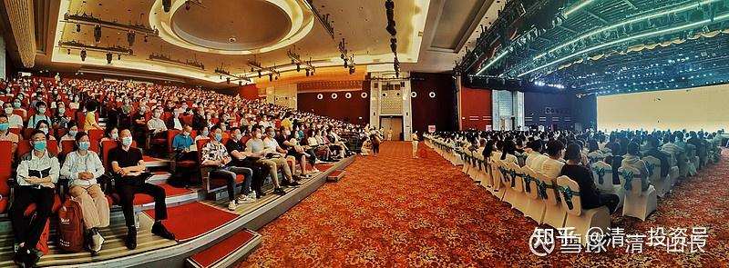
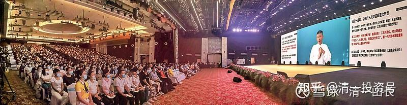

[原雪球专栏](https://zhuanlan.zhihu.com/p/591552552/edit)[214篇.没人会愿意为你办素质教育，只是做秀罢了！](http://link.zhihu.com/?target=https%3A//xueqiu.com/9310099567/199380256)

原标题：**[其实，没有人愿意出来办素质教育，都喊喊玩的！](http://link.zhihu.com/?target=https%3A//xueqiu.com/9310099567/199380256)**

清一山长 2021年10月4日

上午我说今天的内容，对每个人都价值百万。真真切切的百万，或者省出来百万，或者赚到百万，只要你听懂了。对于现在开启的第三次财富大分配、大转移，做了系统的解释和分析。也顺便说了我买燕京啤酒的理由——就是它现在是十年前的价格,而且十年后它还在。十年、二十年后还在的企业，我能确定的很少。比如恒大这种，仅仅五年前，我敢肯定它10年后还在吗？这就是巴菲特说的：要买一只交易关闭十年，你依然愿意买入的股票。这个标准，市场上能找到的的确不多——有些肯定符合要求，但价格现在已经太高，比如[贵州茅台](http://link.zhihu.com/?target=https%3A//xueqiu.com/S/SH600519%3Ffrom%3Dstatus_stock_match)。要找到一家现在的价格是10年前的价格，而且它10年后肯定还在的公司，难度其实真有点高！比如我就很担心，我重仓的[中国宏桥](http://link.zhihu.com/?target=https%3A//xueqiu.com/S/01378%3Ffrom%3Dstatus_stock_match)，十年后还会在吗？我其实是没有特别强的把握的。我很可能在未来几年的某个高光时刻，就会卖光中国宏桥。原因？就不说了？说出来讨人嫌！[大笑]

上面这张图中，2018年美国第一、二产业只有0.8%。如果中国不干重活了（如钢铁、煤炭之类的轻重工业），美国就必须全球买，直到把全球都买飞起来。美国这个专做全世界的脑子，专做服务业，专门以设计、思路、品牌、金融等，让全世界为它打工的模式，真彻底，做得很漂亮。但身子都快没了，遇到紧急情况咋办？所以，美国卡脑子，中国卡身子！今天下午，我的演讲核心是谈教育主题：中美PK局面下，未来教育的变迁。

我特别分析了**家长们让孩子去英美，去“五眼”国家留学**，意味着什么？我认为**意味着高价买抽。未来投资回报为负值的，就是这种教育路径安排。**不信您自己拿钱砸去，我就留言在这里，等您十年后获得高回报，您来公开损我好了。

至于新教育的未来出路，我讲了六条：**三条是接轨世界教育和职场的方式。三条是独创的教育和职场方式。家长们对号入座，喜欢什么方案，就执行什么方案。每一条，都比国内外的体制教育方案更接地气，更容易成功！而且成本更是低得多——无论是资金成本，还是时间成本。**

实际上，公主班的计划是只用四年到五年的时间，去拿到四所一流大学的文凭，包括中国985大学，以及英美一流大学，以及小语种国家大学的毕业文凭，就是学习效率的象征。估计这种模式，是新教育对传统教育模式的颠覆。因为用传统的教育模式，没有人能够完成这个任务。

中国的家长们，都期待我国的教育改革，能够帮助家长们提升学生的社会竞争力。而我的观点是：**其实政府没有责任，也没有义务来帮你们提升教育素质的。任何国家的政府，都只管把你们培养成合适的社会工具，只要不犯罪就好。**

因为，这个社会其实真的并不需要太多的精英，更不需要太多的管理者。你不读书，可以去工厂流水线打工；你学习好，可以去研发部门工作；素质好，可以去当领导。所以呢，学习好，是你自己受益。别人不在乎的，甚至你太优秀了会抢掉别人的饭碗。至于你学习不好，你正好去做别人不愿意做的工作，没谁会嫉妒你。所以，站在国家的立场上，其实你做啥都行，做学霸、做学渣，都无所谓的。应该有所谓的，是你自己！[俏皮]

下课后，看到这个文章，觉得正好是我讲的内容的回应案例，把它发给学堂的教师做示范教材了。

[知乎网页链接：](https://www.zhihu.com/zvideo/1423596641614557184)

**[真实拍摄工厂流水线纪录片，满屏绝望，读书和不读书的人生差距](https://www.zhihu.com/zvideo/1423596641614557184)**

[https://www.zhihu.com/zvideo/1423596641614557184](https://www.zhihu.com/zvideo/1423596641614557184%20)

今天的深圳演讲现场

（以下内容为编者收录）

**评论回复：**

**malone88回复[清一山长](http://link.zhihu.com/?target=http%3A//xueqiu.com/n/%25E6%25B8%2585%25E4%25B8%2580%25E5%25B1%25B1%25E9%2595%25BF)：**

我的孩子目前在国内读国际高中，每年费用40万人民币，以后肯定也是国外读本硕。我这就是找抽了？夏虫不可以语冰。在孩子教育上肯花上几百万的家长，是没有人会去算计孩子以后的工资怎么能把历年学费赚回来的。孩子有更好的世界观、价值观、眼界、思维，今后找到自己真正热爱的方向并努力追求，就够了。比如，哪怕只是去做月薪只有几千块的博物馆员工。人的内心的富足，不是金钱可以衡量，教育的投资更加不能用未来有多少现金流来折现。

**清一山长[2021-10-03 23:36](http://link.zhihu.com/?target=https%3A//xueqiu.com/9310099567/199385323)回复malone88：**

看来，您追求的教育档次是真高[很赞]。不过，如果仅仅是比钱的话，清一商学院的学费是7万美金，似乎比您所在的国内的国际学校更高呢！这是按照美国私立大学的标准学费算的。如果是比成绩的话，15岁入读今日高中的入学分数线要求，是SAT 1400分。**似乎中国还没有这么高档次的，用美国前50名大学的入学成绩，来作为一所高中入学申请资格要求的国际学校**[大笑]。

您愿意花这么多钱，去让**“孩子有更好的世界观、价值观、眼界、思维”**，真是有心人。要不，以后有机会来和我们的高中同龄人交流一下国际价值观的心得？或者与我们计划用四年时间读完四个国家的一流大学的小公主们，比比看谁更国际化？谁更有世界的观？不知道您的孩子，是否在国际学校，已经学到了值得我们的孩子学习的地方？还是您要等出国去学完美国人的宝贝，才能回国来展示他的优势与教养？[献花花]

**清一山长[2021-10-03 00:17](http://link.zhihu.com/?target=https%3A//xueqiu.com/9310099567/199386040)回复malone88：**

对了，11岁来上今日学堂的学生。15岁就能批量达到SAT 1400分的水准，还有超过1500分的学生。然后，他们才有资格入读今日高中。您孩子既然已经上了这么贵的国际高中，考分应该会比他们更高，对吧？不然我就只能说：你支付的学费，超过今日这么多，成绩应该也好很多才对。如果没有达到超越这些学生的成绩，恰好证明了你已经被老美们抽了。您居然还不自知。我常说：“**家长们本来自己看看示范班的课程，免费就可以实现我们的教育水准。**”需要花钱把孩子送来今日学堂的家长，都是钱多人傻的人。如果按照我的这个标准来看的话，至少我发现：这些送孩子来今日读书的家长，钱可能没你多，人应该也没你傻[大笑]。
