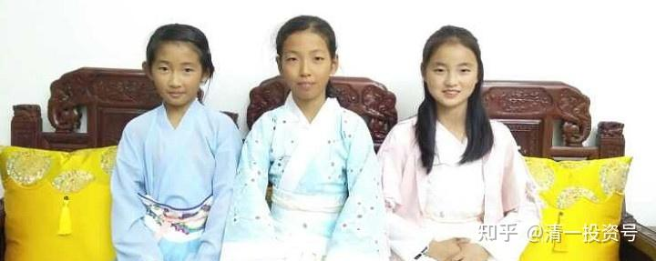

**原专栏54篇.教育与投资一样，回报率是不平均的！**

[清一山长](http://link.zhihu.com/?target=https%3A//xueqiu.com/9310099567/column)2019年11月8日

我写的关于我的小女儿，可以用四年时间，分别去上四个不同国家的大学，读不同的四个专业，用一年就达到本专业毕业水平的文章（[网页链接](http://link.zhihu.com/?target=https%3A//xueqiu.com/9310099567/135296236)：[https://xueqiu.com/9310099567/135296236](http://link.zhihu.com/?target=https%3A//xueqiu.com/9310099567/135296236)），

其实是想给大家分享**一种完全不同的，走捷径的教育思路**，供大家参考的。希望大家别把上学的事情弄得这么神圣，要牺牲孩子的健康和快乐，甚至牺牲一家人的幸福和快乐，去辛苦地拼一个其实很容易到手的现代大学文凭。没想到惹得球友们议论纷纷，好像我是个大骗子，跑来这里发文，考验你的基本智商一样。可是，很多发言人却连链接都没看一眼，就跳出来乱贴标签，很可笑。

我的学校根本就不愁生源，根本就不对外招生。光是老家长介绍的新家长都接待不了，某些球友别自恋到以为我发文的目的，就是想忽悠你的孩子来上学，以为我缺你的一份学费了。实话说：还真轮不到你，多少已经了解新教育多年的家长，都没机会进入我的学堂。更别说网上的陌生人了，别说入学，你连申请都找不到门的（球友千万别找我，不在我这里）。这种教育模式，本来就不是提供给大众的普惠教育。普通人还是去走普通的华山一条路吧！也许，再过50年会普及？那时候也不关我的事情了，因为我届时也不在地球上了。

**大多数中国人其实并不懂教育的目的是什么，也不关心教育的目的，只管盲目地跟随别人行动。**这种人，跟他谈教育规划方案，就像是跟只会在银行存钱的人，谈应该把钱用来投资股票一样，两种人根本就不在一个频道上，只能是鸡同鸭讲而已。

教育的选择，其实也是分流派的，就像投资一样，并不是只有一种投资的原则和方式。当然，回报也不一样。一些人能够获得高额的回报，而另一些糊涂蛋，只能获得被收割的命运。你选择什么样的教育，反应了你是什么样的思维和价值观，你最终的选择和行动方式以及教育结果，也是很不一样的。比如：我最欣赏的投资人，并不是巴菲特，而是索罗斯。只是我从来不推荐身边的朋友和我的学生弟子们去学索罗斯，甚至不推荐他们学金融理论。我只推荐他们学习巴菲特，学习格雷厄姆。原因就是：**巴菲特的价值投资，很简单有效，只要“听话照做”即可。理论上一点也不难，难的是不要起贪心，学会踏实做人，老实投资，买好放手别乱动，就够了。**当然，学巴菲特，你也别指望意外的高收益，获得超过市场的正常收益，也就可以了。

要获得非正常的收益，你就必须学“非正常的人”，比如**索罗斯**，他**的反身性理论，是我最佩服的投资原则**，我认为**与老子的行动原则“反者道之动”很相似。**我特别喜欢用这种思路去选择买入和卖出的时机。这种思维模式，可以极大地提高投资的收益率。可惜的是：**这种理论，是无法“量化”的，是不稳定的。完全依赖市场的波动，通过反向的随波而动而获取更多的利益。**而且也不能保证每次都成功，要允许有一定的失败率。所以，索罗斯的东西，其实是学不来的。只有“悟性”高的人，才可以勉强学到。

我的投资模式，自我总结的派别，就是一个混杂的矛盾体——“价值投机派”，我在巴菲特的投资基础上选择股票（**离开巴菲特的价值基础去投资，我认为很危险**），选择了索罗斯的反身性理论，反人性法则，进行持仓和买入、卖出的操作。所以我的投资方法，其实并不老实，**主要依据博弈学的逻辑来做。**但是收益率还不错。实话说：从我进场以来（27年）的年收益率，是高于巴菲特任意起点27年的。假如我能够持续下去，未来几十年继续保持这个收益率，结果会很吓人的。可惜我认为，我原有的记录难以保持下去。因为这不是说我比老巴强，而是中国过去27年的股市“傻羊”实在太多了，造成的波动异常的大，收割市场的机会很多，将来估计不会这么容易了。

另外，现在教育的事情越来越忙，我同时带了几个不同的试验班（要指导武道班和天使班，还要带我小女儿的“小公主教育计划”班）。所以用来分析市场和股票的时间越来越少，甚至几个月不看股市和行情。将来，我只能慢慢采用巴菲特的稳定模式来投资了。不能像原来一样，有大量时间看盘做投资。我认为未来几十年，最重要的事情是教育，没事了才来做做投资。我的投资仓位，每年仅靠股息分红，都可以给我带来比银行行长工资还高得多的收入，不用去收割韭菜也可以活得很不错。

这种“巴式加上索式的价值投机法则”，带给我什么样的投资结果呢？有个很好的例子：今天我打开账户，看到中国建筑又跌到接近5元的价格了，我在考虑是不是该开始买入了，我当年卖出中建的时候，公开说过：一旦未来它的价格低于5元，我一定用百万股级别的仓位买入中建，以表“个人救市”的决心。其实考虑到这一两年中建赚到的钱（每年接近一元），现在的5元价格，只相当于一两年前的4元，相当于2013年的3元，算是相当的低估了。我对中建这只票是很有感情的，因为它是我目前赚钱最多的个股。比我从顺鑫农业和珠江啤酒上赚的钱加在一起还多。当然，看珠江目前的趋势，有可能我的啤酒投资最终会超越中建的总利润。但是，如果静态地看我的中建持仓记录，却没有什么大赚的理由——我账面上的中建买入均价是4.837元（证明我其实并没有买到地板价，这几年中建最低见过2元多，常常买入就被套牢），现价是：5.21元，差价只有三毛多（这个账上的差价，是自动除权了的）。我是2014年开始买入的中建，原来的持仓量是三四百万股。如果我学巴菲特，低价拿上后就不动，持有到现在，我看能不能跑赢通胀都成问题。如果我不幸以最近四年的均价拿了中建，我还会亏本，但我的中建居然是“大赚”的结果。因为我在2015年的高点，全部减仓了中建。然后在2015-2016年的低点，中建跌到五元左右的价格，我又全部买回来了，没有超过原来的仓位。2016年年底，几乎以最高价（11.35元）卖出了买入一年左右的全部持仓。大约是去年中建再度跌破5元，又再次买了一些。它冲6元的时候，我担心美国股市高企的危险，不敢长持，又全部卖掉了。现在的持仓仅几百股（我习惯留几百股作为“纪念股”）。这样操作几次的结果，现在每股的中建持仓成本是负128957.5996元。所以，如果我没有用索罗斯的反身性理论来操作中建，这只股的投资结果，是很寒酸的，每股只赚了三毛多钱而已。其实，我的港股投资结果就是比较“寒酸”的，业绩并不突出。因为港股我用的投资模式，更偏向于巴菲特一些，长期持有，结果经常坐电梯。比如中国宏桥就让我做了一两千万的盈利电梯。因为我在港股上的感觉不够灵敏，意识不到进出的机会。也可以说，港股就算涨了一两倍，往往也比A股的低位估值还低。因此习惯了A股的我就拿在手上了。结果——港股低估了还会低估。

回过头来说教育：教育跟股票一样，不同的家长，会选择不同的教育方式，得到完全不同的教育结果。比如，最多的就是糊涂派的家长，也是不动脑子，不愿意为自己的选择负责的家长。他们跟股市上只会跟风的大批韭菜一样，毫无头脑和判断力，只会跟随市场瞎起哄。只看到他们忙得要死，不断进进出出的。最终结果往往是严重亏本。教育投资上亏本的结果，要比投资亏钱严重多了——很多家长，通过十几年的“教育”，各种高价短训班，花大钱出国留学等等，家长也忙死了。但是造出的“产品”，是培养出一大批无能且无脑的啃老族，根本无法胜任工作，甚至无法胜任日常的生活。糊涂虫家长，有没有好的教育结果案例？当然也还是有一些的。虽然这些家长没有规划，没有脑子，但是有些人还是有点好运气，也有不少子女通过无脑教育，也避免了失败的命运，甚至还获得了一个好的前途。这就是糊涂派的投资者，也有买到了好股票，赚到了钱的人。不能说糊涂就一定失败，只是失败率很高罢了。单次看，虽然糊涂虫似乎也有机会赢。但长期看下来一定是亏本的。比如有些家庭的孩子，有的孩子一切都好，名校出身，工作、生活都不错。但同样的家庭其他孩子，就是完全的失败者。这种事情很多的。也就是说：**糊涂家庭的成功，是不可复制的。依赖运气，是很不靠谱的事情。**

另外一些聪明的教育投资者，会选择“教育的巴菲特路线”。老老实实的，研究好教育的基本面，为孩子选择最佳的教育路线，认真、踏实的带领孩子一步一步的走下来。最终，让可能资质平庸的孩子，也获得了很好的教育回报。这种人，大约只有3%的家长是这样的。

我的教育选择，也是“教育巴菲特和教育索罗斯”的结合——我会从全球教育市场基本面，来研究教育的可行方案、最佳方案。我一定选择有真正教育价值的内容给孩子学习，而不是把市场上到处推销的教育垃圾弄给孩子去吃。我认为**最有价值的教育内容，就是健康教育，以及思维教育、阅读教育、心理教育、行为教育、社会实践教育等**。**其他的应试教育、课程教育、专业教育**，我认为就是鬼扯蛋，根本就**不是真正的教育。**我根本不碰这些**垃圾品**。所以，我的三个孩子，根本就不上体制内的学校（K12)，国内的不上，国外的去过，交了钱，孩子不肯上，我也就算了。避免少儿时期的15年伪教育，给她们的心理和思维带来不可恢复的损害。等她们长大了，**18岁以后，心理成熟了，有了免疫力，再去大学里面混去**。这时候就算是大学里面的垃圾课程，垃圾人，垃圾环境，也无法毒害他们了。因为我已经打好了真正的教育基础，他们可以自由选择专业知识的学习，想学什么就学什么。

但是，要实现“一年学完四年大学课程”的超级教育目标，仅仅使用这种“常规新教育模式”，也是无法实现的。因为大多数大学的专业，都实现不了这个目标——一年学完四年课程，还要当学霸！因此，我给女儿的教育设计，肯定是做了“教育索罗斯”的策略精选——找到现代教育系统的漏洞来下手，投机了一把现代教育体系。目前世界教育系统最大的漏洞肯定被我发现了，我肯定是安排女儿在教育体系最弱的一环下手去，才可能有“靓丽出镜”的绝妙机会。这样做，考上国内外的名牌大学，自然会很容易，很轻松。上学之后自然会取得惊人的“教学成绩”。其实，如果换了场景，了解到我的做法，就一点也不稀奇，你都知道就是必然的结果。所谓的“会者不难，难者不会”。

我研究多年发现的这个漏洞，我现在就公开告诉你，不要专利费了。可是，你能否掌握，也把这个绝佳的机会利用起来呢？我就不知道了。

全球教育系统中，教学效果最差，水平最弱智的专业和课程，是什么专业？是数理化、语文、生物、地理、政治吗？还是各种大学的专业课程？我相信考过大学，考过研究生的经历者都知道：整个的教育系统，从小学直到研究生，甚至博士阶段，最花时间，最折磨你的课程，不是上述这些专业课程，而是——外语课。中国人刻苦学习了十几年的外语，还是开不了口，无法熟练地看外文书。甚至不看翻译的字幕，就看不懂国外的电视剧！连国外的小学生都不如。我就是这样的人，尽管我是当年的“学霸”，还是全国第一批通过了六级考试的人！考研究生时，我是本专业的外语第一名成绩。但外语，其实是我教育和知识结构中最大的弱项。我跨专业考研究生，只用了半年就学完了哲学系四年的课程内容，还考到了很好的成绩。可是外语----学了多年的外语，第一次考研究生时，居然差几分没通过。陈丹青最有才华的学生，专业第一名，却因为外语多次考试无法通过而落选。说明：在现代教育体系中，外语的学习难度，比任何专业课都高。

但我创造的新教育，与体制教育正好相反：我们把外语学习做成了整个教育系统中最简单、最容易的课程。可以让智力正常的11岁以上学生，仅需四个月就学会全世界任何国家的语言，只要想学就行。之所以要强调智力正常，行为正常，还是很有必要的。因为一个就是不想学外语的学生，你没法逼他学外语。脑子有问题的学生，我们也没有办法教出来的。采用了这个领先全世界的外语教学法，自然可以很容易地颠覆建立在“外语霸权”至上的国际教育体系。很多国际名牌大学的入学考试，仅仅是只要你提供一个优秀的外语成绩就够了。所以，这就是全球现代教育系统的漏洞：因为，在这些大学录取者看来，外语是所有学科最难的一门课，只要外语课程能够学好，其他课程肯定是没问题的，考都不用考了。所以，上大学，采用这条路径，可以说是最轻松的，像玩一样就考上名牌大学了。

这个外语突破的方法，目前已经有数百学生实施了，并且得到了理想的教育结果，也有很多人考上了国外的大学。在新教育圈子里面，这些东西都已经是“常识”了。如果有人一定要去质疑的话，不如你先去调查一下现在很多人实践过的教学结果，再出来说话。否则只能说你是无理取闹了。这个教育方式，不仅仅适合中国人，外国人也一样。我开办的学校，下周就要接待来自马来西亚国际学校的一批15岁的学生，尝试用新的方式来学中文。这是我们以私人身份，为国家的教育荣誉而做的分享的事情。

下面转发一个现场参与人员的记录，也许能够让关心教育的家长，多明白一点教育方向：“ 2019年10月26日上午，听山长讲完小明慧目前的每日作息以及对她3到22岁的核心教学内容，目送山长离场，我止不住内心的激动，很想流泪。为什么？因为我认为小明慧的教育路线代表未来“5G教育”的设计路线，**这是真正帮助思想人格完善提升的教育，让人生命自由绽放的教育，能接受这种教育的人，未来的人生会走得很成功、很幸福！**山长太慈悲了，毫无保留地把这个教育方案公布于众，这将改变多少人的命运?！这份方案太宝贵、太有价值了！这将真正提升中国人乃至地球人的生命品质。”

我在深圳联谊会的学习收获

[网页链接](file:///C:/Users/lenovo/Documents/%E5%B1%B1%E9%95%BF%E4%B8%93%E6%A0%8F%E6%96%87%E7%AB%A0/%E7%BD%91%E9%A1%B5%E9%93%BE%E6%8E%A5)：

[https://mp.weixin.qq.com/s/1Q8HmWo0_Sk8xbih0SzM9Q](http://link.zhihu.com/?target=https%3A//mp.weixin.qq.com/s/1Q8HmWo0_Sk8xbih0SzM9Q)

评论回复：

@炒股买油回复**[清一山长](http://link.zhihu.com/?target=https%3A//xueqiu.com/9310099567)**：为什么？

**[清一山长](http://link.zhihu.com/?target=https%3A//xueqiu.com/9310099567)**2019-11-07 23:43回复@炒股买油：如果遇到一头牛，只可以喂它草料，但不能弹琴给它听的[俏皮]。浪费表情。

@虚合道：这么巧，点开就看到山长的发文，开心，感恩山长！[笑][笑][笑]

**[清一山长](http://link.zhihu.com/?target=https%3A//xueqiu.com/9310099567)**2019-11-08 09:24回复@虚合道：多谢高额打赏。不过建议以后不用打赏给我了，反正我也用不掉。不如去鼓励其他勤奋努力的雪球作者[干杯][赞成]

@明达野老回复**[清一山长](http://link.zhihu.com/?target=https%3A//xueqiu.com/9310099567)**：深为认同并支持山长的“道家教育模式”[献花花]为山长打call，并祝福新教育取得卓越成果。这种新模式我相信仍然会像道家哲学一样被绝大多数人所忽视甚至糟践，所以我很支持山长的“精英模式”，把这种好东西分享给努力想够到的人士。其欲待而然，我何逆以反？一心想证明自己“简单、从众”模式很高明的人，就祝他们“心想事成”就好了，好比一个认定了古中医的“通闭解结，反之以平”理论是胡扯蛋，而找西医或者假中医的病人，最好的选择是不要凑上去求着他治疗，而是祝福他能在西医那边得到康复，否则就是自讨苦吃。[干杯][赞成]。

**[清一山长](http://link.zhihu.com/?target=https%3A//xueqiu.com/9310099567)**[2019-11-08 14:15](http://link.zhihu.com/?target=https%3A//xueqiu.com/2029742712/135428128)回复@明达野老：**教育和投资，都一样需要“独立思考”，还需要“远离大众”。**

[@tulip郁金香](http://link.zhihu.com/?target=https%3A//xueqiu.com/8059043600)回复**[清一山长](http://link.zhihu.com/?target=https%3A//xueqiu.com/9310099567)**：这位栏主的有些观念我是认同的，只是我不敢让孩子脱离普通传统教育。我自己会抽点时间额外给孩子加实用英语和世界观，生活常识课。比如我会让他去跟读刘欣怼美国主播翠西的英语视频。我会更早跟他讲解“世界两种相反市场规律-优胜劣汰、物竞天择和劣币驱逐良币原理及相关英语术语”，对于初三的孩子我认为一点不早，事实上我从初二开始启蒙学股市理论。

我最大的困惑在于小孩的应试学业基本要求占用时间太多，和家人给予孩子的社会补课时间。但我也尊重家人走寻常路的选择，因为我自己并没有把不寻常路路实践走出来，自然不能要求别人冒险跟随我。所以在这点看，我佩服楼主。内容是否适合其他人，再议。因为以上，所以转发。

**[清一山长](http://link.zhihu.com/?target=https%3A//xueqiu.com/9310099567)**[2019-11-08 13:55](http://link.zhihu.com/?target=https%3A//xueqiu.com/8059043600/135431865)回复[@tulip郁金香](http://link.zhihu.com/?target=https%3A//xueqiu.com/8059043600)**：**【我最大的困惑在于小孩的应试学业基本要求占用时间太多】[很赞]：你很敏感，抓住了中国体制教育的核心——拼体力、拼时间。英美标准制式的学校，虽然教育内容也很弱智（不然我们也不可能花两三年就过了），但是给了家长大量的空余时间。因此有心的家长，可以给孩子进行补课，把孩子培养得与众不同。

**中国的体制教育，会尽量把学生的全部时间都占用掉，就算家长有能力，也有心做做弥补工作，但绝对没时间操作。只能看着孩子给比自己能力差劲很多的平庸教师去蹂躏**。因此，中国体制教育培养出来的人，都是一个模式的，很难出有个性的人才。

你要培养孩子做金融、做投资，就千万不能让他从小习惯“从众”，不然学的知识再多，也是韭菜的命[俏皮]。

**我认为11岁以后的孩子，让她放松下来，多阅读好书，多锻炼身体，开朗、活泼，就是最好的基础教育。18岁快高考了，临时补补课，花半年、一年突击一下，就足够考上一个好大学了。但她之前在有指导的情况下阅读了七年的深厚底子和见识，在进入大学之后，连大学的毕业生都赶不上的，很容易就成为大学的意见领袖。这就是给孩子最好的教育礼物。**
