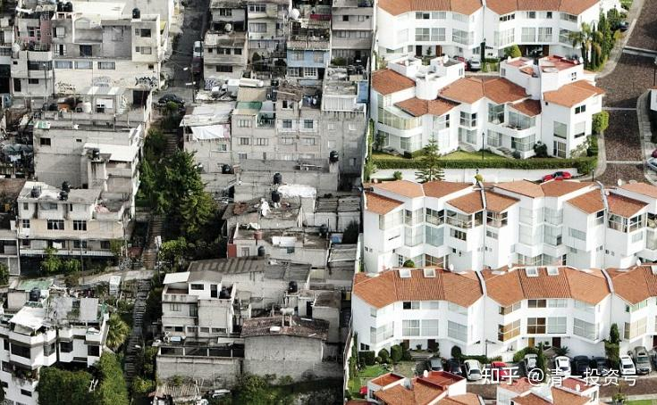
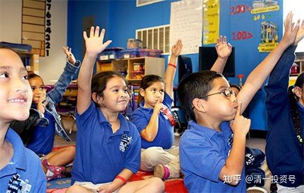
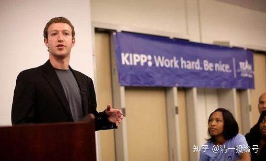

原雪球专栏[43篇.教育是分层的：底层应试教育，中层素质教育！](http://link.zhihu.com/?target=https%3A//xueqiu.com/9310099567/114393914)

清一山长 2018年9月28日

链接：**[底层应试教育、中产素质教育、顶层精英教育](http://link.zhihu.com/?target=https%3A//mp.weixin.qq.com/s/PGTMuv4kPHLZdV-mDGLW-w)**

微信网页链接：

[罗辑思维：即将到来的阶层社会](http://link.zhihu.com/?target=https%3A//mp.weixin.qq.com/s/PGTMuv4kPHLZdV-mDGLW-w)

说明：这个内容东西很实在。可惜**在中国，所有的阶层都在拼“应试教育”，都是一副穷人相。因为我**们自己，以及上一辈，基本上都是穷人出身的。因此，中国现在基本上没有高端的“精英教育”，只有穷人的教育。一些富人们热捧的，所谓高端“素质教育”，骨子里面是“度假村和养老院的教育"。这些学校收费高昂，但其实根本不关心孩子的素质和成长的问题，只是迎合家长们的虚妄心理，伺候好这些少爷小姐们，让孩子们“吃好，玩好，住好”，在没有压力的情况下，学一点“文艺范”的东西，以为就是“高级教育”了。可笑！

我认为：**穷人的教育——应试教育**，本质上就是要“学会做事”。用机器流水线一般的“教育过程”，**学会当一个服从命令、会干活的、简单的“机器人”**就好。不接受这种教育，就是穷人的教育失败。因为孩子长大后无法被社会接受（找不到工作），只能流落街头，当混混。

至于**中产阶级的教育，是要通过更多人性化的培养，通过所谓的“素质教育”，让孩子具备更多的，更复杂的工作技术和能力，还要学会让人喜欢。有点“学会做人之‘自我管理’+做事”，这样才能够承担更需要创造力、更复杂的工作任务。骨子里面还是为了打工、做事。只不过是高级打工仔**（其实中产阶级，都是高级打工仔罢了，包括自我雇佣的高级打工仔，如开诊所的医师。赚钱多一些，也谈不上“上层社会”），只是他们的能力更全面罢了。

而高端的所谓“精英教育”，核心是要让参与教育的学生，学会做人（自我管理+管理别人）。就是要学会领导力、决策力。对于具体的做事和“技术知识和能力”，并不太关心，当然也不反对，只是次要的任务。比如马云自己并不懂计算机的专业技术，但他懂如何去“管理懂计算机的人”。当然，他不是某个学校培养出来的，而是社会大学教育出来的，是自己成长起来的精英分子。但美国小众的精英私立教育，就是可以专门用各种独立思考以及思维和哲学的训练课程，加上各种社会和集体的活动，去专门培养这种人（具有领导能力的人）。比如耶鲁、哈佛的校长，公开说他们的本科毕业学生，如果居然掌握了某种专业的技术和知识的话，就是哈佛教育的失败。其实就是公开的宣称：他们根本不培养打工仔。想去哈佛、耶鲁学知识和技术的学生，就是个笑话。

如果你自己就是打工仔的命，将来就是想拿个文凭去打工，其实根本就别去哈佛学什么“屠龙术”了，学了回来也没人用你的。所以精英教育，主要是适合上层的家庭，能够提供后台支持的家庭。精英教育其实不适合普通的工薪家庭。工薪阶层，孩子要找工作吃饭的，还是走“应试教育”，学工程和技术专业，或者学一门实实在在的手艺，更靠谱一些。

对于中国人来说，由于文化和土壤的区别，西方精英私立大学，培养的“西方领导人教育”，并不符合中国人的精英阶层和上层的要求。这些洋思维、洋手段，很难适应中国的土社会，所以导致“格格不入”，无法回国承担真正的领导和经营示范的任务。所以，**中国必须成长出自己的精英教育，而不是依靠美国人赐予。**

可惜，目前甚至连国家级的决策人员，都不懂这一点，都不懂去建构中国自己的精英教育。当官的、有钱的上层人士，几乎唯一的手段，只是送孩子出国读书——往往是去学别人的“打工仔教育”。勉强去了精英学校上学，还水土不服，也不懂别人教这些东西干啥。**中国人无论穷富，都还停留在最底层的“应试教育”思维理解阶段。**最多有人出来呼吁一下素质教育，还不知道到底什么才是“素质”。更不知如何培养了。

**评论回复：**

[爱猫的薛定谔](http://link.zhihu.com/?target=https%3A//xueqiu.com/3361547055)回复清一山长[：](http://link.zhihu.com/?target=https%3A//xueqiu.com/3361547055)

“请问清一山长，今日学堂的理念既然定位是精英教育 。也开办了十几年 。到底出了几个名牌大学生？有多少成功人士，科学家、名企高管？怎么查不到资料？”

[清一山长](http://link.zhihu.com/?target=https%3A//xueqiu.com/9310099567)2018-09-28 20:28回复爱猫的薛定谔：

关于：今日学堂到底培养出了几个名牌大学生？原来教过的学生中，虽然有不少已经考取了排名全国前10的大学。只是这些学生都是“中途退学生”，不算是我们“培养”的。虽然很多退学生，回去后据说都是学校的“学霸”。我们也不认为考取中国的大学，算是什么了不起的事情，也没有去统计这个数据有多少。

由于我们明年高中部才开始正式招生，首期只招收40人，入学年龄14～15岁。所以，您只好耐心的等四年了（今年到明年，再加上三年高中期满）。等**四年后，您就会看到这个新高中的学生，将100%被世界排名前100的名校录取的消息。其中大多数将考上世界前50名的大学**。虽然提前了四年，但做出这个判断，要比判断国庆节后股市是涨是跌要容易多了。因为我知道这些学生今年才13岁多一点（平均年龄），已经考出了SAT数学780的平均分。以他们的成绩推算，我说四年后被世界前100名大学录取，算是很谦虚的说法。

至于企业高管？成功人士啥的。您真想看结果的话，就慢慢多等20年、30年吧！教育不是说“百年树人”吗？您干嘛这么急呢？一看就知道不懂教育。

其他不信的人，对你们的建议就是“等”。也许我们需要的时间久一点，您需要一些耐心。但应该不需要100年的。

参考链接：

[山长 清一：教育是用来分层的：香港开放入籍新规TOP100证书](https://zhuanlan.zhihu.com/p/588534552)

**[罗辑思维：即将到来的阶层社会](http://link.zhihu.com/?target=https%3A//mp.weixin.qq.com/s/PGTMuv4kPHLZdV-mDGLW-w)**

本文是《罗辑思维》第185期内容 原标题《即将到来的阶层社会》 版权归属于原作者

今天要聊教育公平的话题。在中国的未来会不会出现一个教育极度不公平的时代呢？罗胖的答案是肯定的。这是他对中国未来的一个趋势预测。

在我们这一代人的有生之年，会看到一个不可逆的趋势，一个中国人几千年来从来没有见到过的局面，那就是教育分层。教育的不公平在这里包装成为教育分层。你会说，难道教育不是分层的吗？

一个山村小学的孩子和北上广深名校的孩子，享受的教育资源难道不是分层的吗？不是，我今天讲的分层不是这个维度上的。

在中华文明的传统结构当中，尤其是一千年来的科举制度，它的核心使命，就是防止社会分层。中国古代是皇权社会，任何一个王朝，只要还有政治活力，它就一定会打击豪强抑制兼并，避免大地主、大官僚威胁皇权。

**科举制让整个社会呈现一个开放式的格局，上下层是流动的。**能通过科举就能光耀门楣。而官僚地主的儿孙只要通不过科举大门，就富不过三代。中国的教育主张：有教无类。一直到明清时期，山村的私塾里的学生和皇家子弟念的教材是四书五经，教育的方法都是死记硬背。在**教育内容和方法上其实并没有出现分层**，虽然教育资源可能不平等。**所以今天说的分层，不是教育资源上的分层，是西方意义上的分层。**

要想理解这一点，需要知道什么叫阶级社会？中国古代的阶级社会，定义不确切。中国古代其实就皇帝和百姓。皇帝不是一个阶级，任何一个普通老百姓只要造反成功，就是刘邦、朱元璋，就能当皇帝，所以这不叫阶级。**印度的种姓社会和欧洲中世纪的贵族社会，才是真正的阶级社会。一个人的阶级是由他的血缘决定的，而不是有什么财富状况、社会地位决定的。**你父辈是贵族，那你混得再穷仍然是一个贵族。这一点我们中国人不理解。**中国人相信“三十年河东三十年河西，王侯将相宁有种乎”**。只要好好学习考上科举，就能飞黄腾达。

这一套西方人是不理解的，你不是贵族，你不能站到贵族的队列里。即使你发财了，你是暴发户，你跟我们也不是一回事。当然，**现在随着民主、自由的发展，西方社会也没有这种概念上的贵族。但是西方那种社会分层的结构一直留到了今天，今天的美国仍然是一个分层的社会**。

拿房价来举个例子来说明这个现象。中国很多大城市房价很贵，但是房价从市中心向城乡结合部，价格是缓慢均匀下跌。二环、三环房价不一样。可是在美国穷人区和富人区可隔一条马路，房价是一个天一个地，价格是断崖式的下跌。

**斯坦福大学所在的美国硅谷的核心区帕拉阿图**，它东面还有一个城市叫**东帕拉阿图**，名字就差一个字，两个城市隔着一条15米的小溪。但这两个城市的房价就有天壤之别。一边住的当年的乔布斯，今天的小扎和一些全球化的精英。而另一边是黑人、拉丁族裔，用美国人的说法叫**老墨**。

两个城市的治安状况是那边有组织犯罪、黑帮、杀人、枪击，各种偷拿拐骗频发，是美国治安最差的城市之一。而这边呢？治安状况是空前的好。两个城市警察出警的时间一边是5分钟，而东帕拉阿图就要25分钟甚至更多。试想，在一个治安状况很差的城市，20分钟可能就是几十条命。

这两个城市最核心的区别就是**人不一样，尤其是培养下一代的资源不一样。**这就牵扯到我们今天讲的教育公平问题了。在中国我们好歹对政府发劳骚，要求政府资源分配更公平。在美国，**所有的教育都是当地人社区自治的，美国的公立学校不是联邦政府、州政府拨的款，是这个城市的房产税、物业税供给的。**帕拉阿图**房价格高，物业税就高**、学校的资金就充足。而另一边刚好相反。

教育分层会带来什么样的结果呢？就这个问题，请教了居住在美国的万维钢。万维钢原来就是美国大学的教授，他的孩子现在在美国上小学，所以他对美国上上下下都是比较了解。他说，**第一，如果你不了解美国教育，那你会惊讶于中美两国教育的差异。第二，如果你了解美国教育，你会惊讶于中美两国教育的相同**。这让人非常费解，这两个国家的教育水准是天差地别，怎么会相同呢？

万维钢举了个例子，一个是中国学生小明，还有一个美国学生大卫。小明是典型的穷孩子，一步一步考取了清华大学，成绩很好。但是他知识视野非常狭窄，课外知识没怎么接触过，穿着土气，不会说话，见到女孩子就脸红，甚至手机都没怎么见过。而大卫家境不错，知识面广，才艺多。游泳、击剑、高尔夫球水平都不错。其他如画画、钢琴也都练过。参加学生会各种活动：演讲比赛、计算机比赛，当过学生会副主席，还特别有爱心，经常到社区医院去照顾老人。这么一个好孩子，放在中国家长面前，小明是典型的应试教育的产物，而大卫是典型的素质教育的产物，这就是中美教育的差异。小明很苦，很惨，大卫非常幸福，任意的挥洒自己的禀赋、兴趣和才能。

但是，万维钢说，你不要被骗了，其实他们俩都是应试教育。只不过小明自古华山一条路，就奔着考试去了，而大卫，你看他干那么多事，其实也是疲于奔命。他也是为了**凑够美国精英学校，诸如常春藤盟校的入学标准，他才去学这些才艺和特长**，他并不是对每样东西都有兴趣，所以从根子上说，**都是应试教育。**

大卫处境其实还不如小明，**因为小明毕竟面对的是一个确定性的未来，你只要达到分数，好的大学就一定能进。**可是大卫不一样，他不管凑够多少东西，他进学校都是不确定的事情。

2013年一个华人学生把哈佛告上法庭，这在当时轰动一时。这个孩子的SAT的成绩甩掉了99%的考生。社会实践获各种奖，在奥巴马总统的就职典礼上还参加了中学生的合唱团。可为什么在申请常春藤盟校的时候，只有宾夕法尼亚大学给他发了入学通知书？哈佛、耶鲁、普林斯顿、哥伦比亚全部把他给拒绝了。这种现象在美国的华人族群当中很普遍。他们甚至办了一个网站，就叫：“**哈佛不公平”**，里面例举了大量这样的事例，要抗议。对这些孩子来说，标准是你们定的，我努力达到了，然后你们又不要我，这不是欺负人吗？这是不是不公平？

万维钢说很难讲。因为这些**常春藤盟校，主流全部是私立大学，他们从来没说过自己要公平，甚至招生的规则都是不确定的，从来不公布是按照什么规则来招生**，甚至这些学校的招生办的官员也说不清楚招生规则，连执行的人都说不清楚，那就不存在公平不公平的问题，**公平总是对规则而言的。**这中间的分歧是**华人学生带着自己的文化传统去理解人家的规则导致的误会**。

我们回到美国历史当中，去看这些招生规则是怎么形成的。**美国是一个移民国家，它的民族的主体是WASP，就是白人的盎格鲁-撒克逊的新教徒，他们觉得他们是国家的精英**，哈佛、耶鲁这些学校，就应该培养他们的孩子。他们故意设置门槛：读哈佛、耶鲁必须考希腊语和拉丁文。因为其他的族群和公立学校是不教这两门语言的。这个规定实行了一段时间之后，WASP的主流精英的孩子因为没有竞争，考哈佛、耶鲁很轻松，尽管他们的成绩不是很好。那长此以往，不能把其他族群的精英纳入体系，国家也有问题，这个族群本身也会产生危机。所以第一次世界大战的前后，他们就取消了希腊语和拉丁文的考试。其他的族群就开始涌现出来。

最先起来的就是犹太人，犹太人在常春藤盟校的入学标准，大概是从7%一路上涨到了20%多。在哥伦比亚大学一度达到了40%多。这时WASP的主流精英又不干了，因为自己孩子的机会被剥夺了。他们又搞出一套标准，社交能力和体育技能。这样又把犹太学生的比例降了下去。

第二次世界大战之后，这个趋势又开始出现逆转。上个世纪的五六十年代，美苏争霸，美国人心里清楚，这一仗是不能输给苏联的，美国人还得登月亮呢！所以那个时候的美国名校，算是对全民敞开了大门，只要考试成绩好，上哈佛、耶鲁是可以的，所以你看，美国前总统克林顿就是赶上了这拨好时候。

但是这个阶段很快又过去了，美国的名校又开始故态复萌，开始强调那些乱七八糟的素质教育的标准。他们其实是**在两个极端之间摇摆，要找到一个均衡点，一方面要用考试成绩，把其他族群的精英给挑进来，另外一方面，要靠这些素质教育的标准，把他们拦出去**，所以不管怎么变化，这些标准的设立不是让你过来的，是让你出去的，这个实质我们心里要清楚。

一直演化到现在，现在的一个美国高中生，如果要上哈佛、耶鲁，也有三条路：

**第一条路，就是你得有特长，尤其是体育特长**。一个中国学生，会中华武术，不行！在项目上要符合WASP的文化标准。比如说**击剑、花样滑冰、高尔夫球**。**这是一个文化认同问题，因为本来人家就是要维护族群本身的稳定。**这些体育项目的设立，还有一个妙用。**能把有钱的家庭给挑出来。**万维钢说：**其实上这些学校，不在于你上学之后花费了多少钱，而在于上学之前你能为这些特长花多少钱，因为这些技能都是靠金山银海堆出来的，钱花得多才能培养出一个高手，所以它自然就把贫困家庭和富裕家庭分别出来了。**

**第二条路，就是家长是校友**。美国名校有一句话，叫“**一代藤校，代代藤校”**。新生入学的时候必须得经过一道门槛：**校友面试**。你想，他老爹是哈佛毕业的，那他在面试的时候，当然要照顾自己的儿子或是照顾自己认识的朋友或者同学的儿子，他们官官相护，所以读名校就容易得多。美国的前财政部部长，也是哈佛大学的前校长萨默斯，他讲了一句痛快话，说哈佛**招收校友的孩子入校，这是我们建设自己社区文化的一个部分**。

**第三条路就是捐款**。华人不爱捐款，因为华人的家长和学生觉得，大学就是一个工具，上完就完了。可是**白人的很多私立学校不是这个传统，校友和校友的孩子，跟这个学校是同气连枝的关系，终身都保持联系**，所以**校友捐款，是这些私立学校很重要的财政来源**。华人不爱捐款，学校就不愿招收华人的孩子，**招收华人越多，意味着这个学校将来的财政基础就越薄弱。**华人的收入在美国是比较高的少数族群，但是**华人对于这些私立学校的捐款，甚至比自己在人口中占有的比例还要低。**

也有一些华人大亨，比如说**杨致远、黄仁勋、李嘉诚给斯坦福大学捐款**，占比达到斯坦福大学接受捐款的10%。美国人还是比较讲规矩的，香港慈善家叫陈乐宗，一次性给哈佛捐了3.5亿美元，这是哈佛历史上单笔最大个人捐款，第二年，据吴军老师说，就在斯坦福附近就是硅谷地区，招收的华人学生比例马上就提高了一倍。**一个族群给大学的贡献越多，它 就当然更愿意招收你的孩子**。中国房地产商潘石屹和张欣夫妇，给哈佛大学捐款1500万美金，国内舆论一通骂，你在中国人身上赚的钱，你不捐给中国大学？**中国大学是国家拨款的，从来没有接受捐赠的这样一种传统。**但是**捐给哈佛是为华人在美国主流社会当中，打下一代一代的基础，你这个族群爱捐款，你的孩子将来就能上美国的名校，将来毕业之后，就会成为主流社会有影响的一群人。所以潘石屹、张欣这笔捐款，我们应该为他们点赞。**

回头看考取清华大学的小明，你是愿意要美国式的应试教育？还是小明的应试教育？中国的应试教育让社会的底层人士，还能看到一点希望。但是**在美国的应试教育下，那个社会分层，那可叫铁门槛，想越过它太难了。**

教育的分层，在中国的未来会不会出现？**教育是社会的一个侧面，实质上就是社会分层的结果。**美国穷人的标准是家庭年收入低于2万美金，相当于13万人民币，在中国就不算穷人。而且美国的穷人还能享受大量的福利：国家发食品券甚至是直接发钱，申请廉租房，而且美国的公用设施非常好，穷人和富人是同等享受。美国的底层人民的生活看起来还不错，但实际上你要是了解美国社会的话，你会发现美国的穷人面对的挑战比中国的穷人要大，因为中国社会它毕竟没有形成那个分层的结构，穷人的上升之阶还是存在的。在北上广深这样的大城市，即使你来自于乡村，只要你肯吃苦肯学习，你哪怕当保姆呢，月收入也在6000到1万人民币。蓝翔技校毕业的厨师也好，还是开挖掘机也好，一个月也挣不少。所以穷人在中国，你只要肯干，你不至于落到社会的彻底的底层。

但是美国穷人可就不一样，其实在美国这么富裕的国家，你想摆脱贫困非常简单，你只要做到三条就可以了。但**让人觉得匪夷所思可是美国穷人做到这三条就很难。**

第一就是结婚之后再生孩子。一个人在自己性成熟之后，能够有起码的控制力。做爱至少戴套，就不至于怀孕。但是穷人就真没有自控力。很多十六岁就生下孩子，男方也不负责。美国的底层穷人一大半都是出生和生活在单亲家庭。一个母亲，既要养育孩子又要照顾生计，她根本没有时间教育孩子。美国有一个统计，孩子长到四岁之前，穷人家的孩子比富人家的孩子少听3000万个单词。富人家庭父母跟孩子有大量的交流，对孩子的智力和理性发育是有重大帮助的。穷人的妈，你喊她几遍，她可能答应两句就完了，没空跟你说话，所以这样的孩子在这样的家庭，**他的智力发育就被锁死在一个水平线上，再也没有出头之日。**

**第二条是高中毕业。**穷人的孩子为啥毕不了业？因为他不像中国的那些高中的差学生，顶多是学习成绩不好，或者是考试做个弊。美国的那个差生就是，经常忘了去上学，你让他填一张助学金的表，也懒得填。那种社区文化，穷人孩子、黑人孩子在一起，互相觉得就这样挺好，吸毒、聚会，不想变成白人那个样子，所以他又进一步被锁死。

**第三条有一个全职工作。在美国，只要有一个全职工作，基本上你就不会年收入低于2万美金。穷人的智力发育水平和社会认知水平，不可能进入全职工作**。他们随便找一个工作，干两天就烦了，一点小事就辞职了，所以这样的人，他就会变成穷人。年收入低于2万美金，就被牢牢地锁定在社会的底层。美国有女作家叫芭芭拉，写了一本书《我在底层的生活》。她潜入底层跟穷人一起生活、工作，挣一样的钱。她想搞清楚美国穷人到底能不能通过自己的勤劳摆脱穷人的命运。这本书写出来后，答案是几乎不可能。**不是社会不给穷人机会，而是穷人自己的认知能力把它牢牢地限定在那个社会层次上，**所以这本书里有一句话是很刺目的，**说“贫穷本身就是一种专制”。**芭芭拉有一个同事，在美国餐馆里打工。她一天大概挣40到50美金，但是她住在汽车旅馆，一天房费是40美金。为什么她不租一套公寓？她说公寓是要先付一个月租金，差不多1000美金做定金，她没有那么多钱，所以宁愿住汽车旅馆。这就是认知水平问题，她一个月的收入1000多美金，借也好，贷款也好，只要找到1000美金启动，每个月的财务状况就进入一个良性循环。但是她没有这个认知水平，她不想更长远的事情，所以她当然就只能在这个底层。**这些都是认知水平对他的局限，而不是社会对他的迫害**。

**认知水平取决于小时候的教育环境还有周边的朋友、他所身处的社区。这就是美国穷人和中国穷人的实质性的差别。**如果说中国穷人对自己的境况是感到愤怒，而美国穷人对自己的情况只能感到绝望。**认知的局限，存在于每个阶层。**

中产阶级同样受限于自己阶层的认知水平和思维方式的局限，想往上突破也是很难很难的。中国能看到很多有钱人，混得也不错，但是他去理解社会顶层精英的想法也办不到。**他们总是用自己的想法来套别人的想法。**比如说，我就亲耳听过一个中产阶级身份的人说，马化腾捐100个亿做慈善，那就是给腾讯做个广告，他们商人有一个好东西吗？还有人说马云，“马云说办企业就要有核心价值观，找商机就是为社会解决问题，都是唱高调。”“马云办那个淘宝就是天天要挣我老婆的钱。”王石说万科不行贿，“呸，我才不信呢！”你看，我们身边持这样论调的人是不是有的是？

**乔布斯说：“活着就为改变世界**。”很多人虽然嘴上这么说，心里是真不信。固守在他处的那个阶层，虽然看不见，但是无比牢固，看不清外面人怎么想的。

**我们要理解社会真正分层是观念分层之后，**再回头来看教育分层，那就是另外一副光景了。

**教育的内容、目标、使命各个阶层是完全不一样。美国的社会底层办教育，目的就是让你够着一个饭碗**，**变成一个有用的社会工具就可以了。**美国教育界有个完全正面的典型，叫KIPP，其实就是一种公立学校。这种学校办底层平民聚集的地方。学校办得特别好。刚进来的那些底层的孩子的水准，比其他中产阶级的学校可能要低两个年级，经过学校培训之后，马上就追上了其他中产阶级。这个学校办学有诀窍，很简单，**就是跟中国一样，做应试教育。对底层来说，应试教育是最好的教育。**

这种KIPP的学校**核心就是要考上大学**。应试教育两个基本点**Work hard，Be Nice**，就是努力学习，好好做人。它的基本方法就是让这些底层的孩子，尤其是那些黑人或者拉丁族裔的孩子跟他们原来的社区切割干净，延长他们在校的时间，布置大量的作业，让他们没时间和坏小孩接触。从进入学校开始就设立各种复杂的奖励系统：上课认真，考试成绩优异，从奖励几只铅笔到表现好奖励课桌椅、吃饭可以戴耳机听音乐。学校从课堂纪律到上厕怎样用卫生纸。

脸书(Facebook)创始人扎克伯格在KIPP学校演讲

大家都说中国安徽毛坦厂中学是“高考集中营”，其实美国的KIPP才叫“高考集中营”。因为只有这种高负荷的压力训练，才能让那些底层的孩子克服自己的习性，进入一个大学的门槛，他们的一生的命运才能被改变。虽然这是一个正面的例子，但是告诉大家的正好是一个反面的信息，这就是**底层人所享受的最好的教育**，跟中国的应试教育是一模一样的，没有什么素质教育。

**素质教育是在中产阶级的学校**，这样的学校培养孩子，更多的体育特长、更多的才艺，唱歌、跳舞、画画，还有独立思考的能力、口语表达的能力、社会交往的能力、组织人群的能力、还要探索问题的能力。比如说这样的学校要上历史课，老师往往就会布置一个作业，我们全班小朋友会不会就这段历史事实，拍一个电影？有人专门写本子，有人专门拍画面，最后弄得非常好，你看这就是中国中产阶级最羡慕的美式素质教育。**这样的素质教育仍然不是培养顶级精英的。它培养的是一种中产阶级人格。**用万维钢的话说，这叫“**培养工艺品”**。工艺品和艺术品是不同的，艺术品每一个不同，可是工艺品一个档次的它是一样的。因为它的价值取决于材质，我们谈工艺品的时候会说，这个是黄金打造的，这个是花梨木雕刻的，中产阶级的教育就是**给自己的孩子“披金戴银”，来创造更多的才智，让他变得更加的优秀，这样他将来到社会上之后才能被挑选上，才能在竞争中脱颖而出。这叫中产阶级的教育，也就是我们一般说的素质教育。**

那美国顶级精英的教育是什么样呢？这种教育往往是由私立学校来承担的，它的**核心使命不是要让孩子变得更好，因为变得更好是被人挑选上，他们那个阶层的人是挑选别人的。**他们不需要懂怎么做ppt。**真正顶级精英的教育核心只有一条，就是培养他们决策的能力。**这样的学校也不讲究纪律：**你是你的船的主人，开得慢，开得快，你自己决定，别人是没有办法来判断你的对错的，我们要教你的就是你要学会怎样决策你的快和慢**。在这样的学校，你要上历史课，老师就不会布置作业拍电影了，那都是中产阶级孩子的事。老师会引导大家讨论，比如说在伯罗奔尼撒战争期间，伯里克里他犯了什么样的错误，而雅典公民又犯了什么样的错误，这样的讨论可能会持续一天。**这种教育的核心使命，是要让孩子学会怎样欣赏、选择和改变世界，这才是顶级精英的教育**。

刚才我们是描述了美国的社会分层和教育分层，**现代教育最擅长的是改变底层人民的命运，他们的家庭也不必过度介入**了，只要你找到像KIPP这样的好学校，他就有本事把你的孩子变成一个对社会有用的人，在这一层上教育是非常起作用的。

**到了中产阶级，教育的作用就没有那么大了，最主要起作用的是家庭**，必须是家庭和学校联手合作，才能让这个孩子变成一个更优秀的人，来等待社会的挑选。

**而最顶层的精英教育，学校说白了，那就是提供一个基本的环境，最终起作用的是家庭本身的思想观念，社会阶层和财富地位，家庭的作用是越来越重要**，这当然是美国的情况了。我们关心的还是中国，**中国社会的财富分层正在形成，但是社会分层还没有形成**，**教育分层也没有形成，**现在即使是一些巨富，他也是希望自己的孩子变得更好，变得对社会更有用，变得更优秀，而不是培养他的决策能力。所以**中国虽然已经在财富上出现了中产阶级和顶层精英，但在教育分层上还没有展开**。

未来中国会不会出现美国那样的社会分层和教育分层？每一个阶层的人的教育，从内容、工具到目标都完全不一样，而且阶层之间很难穿越，会不会呢？不好意思，我的答案是会。

当然前面我也声明了，这不是一个价值判断，这不是我的主张，它只是一个事实判断，那我为什么得出这样的判断，主要是以下三个理由。

第一个是**经济上的理由**。中国的财富分层正在形成，贫富分化已经是一个事实，现在“北上广深”多少富家子弟，从初中开始就到美国去读名校，读私立学校，将来必然有一部分会考取美国的名校，那美国名校在美国社会分层当中，起到的那个固化的作用，将来就会在中国社会也同样起这个作用，一家人越有钱，孩子就越享受越好的教育，将来就越有钱，所以社会阶层被固化。比如潘石屹和张欣夫妇，给美国哈佛大学捐了1500万美金，一个附带的结果就是他们的孩子上了美国的哈佛大学。

第二个是**社会上的理由。**现代社会有一个基本的趋势，就是变得越来越复杂，大家可能还记得，我们以前节目介绍过一篇文章，叫《铅笔的故事》，那是讲的工业社会的复杂，你看生产一根铅笔，要卷入全世界几百万人的劳动，而每一个劳动者只知道自己的分工，对外面的情况完全不清楚，但是工业社会的复杂，价格还能够让把握，但是到今天这个社会，没有任何人敢说我还能驾驭这个复杂性了。举个例子说，比如说你是一个生产铅笔的工人，你不会知道一个叫雷军的人，他的小米公司生态链进入哪个产业，都会搅乱这个产业的价格。他背后有资本，他可以一开始补贴，所以从价格这个因素也很难理解这个世界。再比如说你的铅笔厂开在上海，上海的房价的波动，会不会影响你的铅笔厂的生存？你的生产成本变得越来越高。房价是由什么导致的？因素就更加的复杂。再比如说，机器人的普遍运用，会不会导致你的生产工艺和工人永久性的失业？你也不知道，所以**现代社会越来越复杂，不同社会分层的人共享价值观、信息和认知水平，所以他把握这个世界的能力是不一样**。**你到不了那个认知水平，你跟其他人在实际上的差距就越来越大**。

第三个是**技术上的理由**，其中**最关键的就是人工智能。**大数据将导致社会的产业升级和变迁。对比每一次产业革命前后产业的变化，就会发现，其实人类很多基本的需求并没有变，只是采用了新技术后，**新的产业会取代旧的产业满足人类的需求，固守旧的产业是没有出路的。每一次工具突破，都是“单点突破 ”，都会让这个世界“分层”。一部分人获得巨大的机会，而另一部分人则被甩在鸿沟的那边。**

《智能时代》的作者吴军先生提出，只有2%的人能够把握人工智能这一拨机会。15 亿中国人，只有 3000 万人能够穿越这道“窄门”。稳定社会状态里的“二八法则”都不再适用， 98%的人都可能陷入或迟或早被人工智能替代的担忧。**（此部分内容见罗辑思维公众号9月28日《离你最近的一次变革红利》）**人工智能给人类带来的剧烈的分化，结果可能是超出我们的想象。比我们现在预测的要严峻得多。

我们刚才给出了三大理由，就是**经济的社会的和技术的，这三个趋势无一不在证明，整个人类正在进入一个剧烈的分层期**。中国是在全球化的浪潮之中，我们怎么躲得过这样的趋势呢？我们是要在这个剧烈的社会分层中被动等待，接受命运将我们固化在一个阶层里吗？当然不是，我们还有别的可能性。

这个世界会出现一种人物，叫英雄，什么是英雄？**他能够超越自己的父母、环境、血缘、出生、性格特质，不按写就的剧本表演，让大数据对自己的行为无法预测，永远会给全人类以惊喜的人，这样的人才叫“英雄”**。在美国文化当中，英雄当然也指什么蝙蝠侠、蜘蛛侠、超人、美国队长。但是美国人更崇拜什么样的英雄？是**能够超越自己命运的人**，比如说一个小镇警察警衔不高，武功也不高，但是勇斗歹徒，这是英雄；一个弱队的教练，如果带着自己的球队一路夺冠，这是英雄！一个单亲母亲原来非常不幸福，但是通过自己的努力，后来找到了幸福，这也是英雄。美国人是在阶层社会中长大，他们知道这样的跨越阶层，超越自己出生的人有多么的了不起，他们是真正值得我们尊敬和祝福的人。

而**反观今天的中国，社会分层还没有形成，教育分层还远着呢！所以这是一个大好的时机，是一个英雄辈出的时代，每一个人都可以通过提升自己的认知而超越自己的阶层**。

本期节目的策划人万维钢老师，开了一个专栏，叫精英日课。他的使命就是在美国盯住那些美国精英新近形成的认知，通过专栏，转述给中国的用户。那这个专栏的使命就是帮助每一个人，提升认知，成为英雄。

**知识扩展：**

**常春藤盟校**（Ivy League）常春藤盟校指的是由美国东北部地区的八所大学组成的体育赛事联盟。它们全部是美国一流名校、也是美国产生最多罗德奖学金得主的高校联盟。此外，建校时间长，八所学校中的七所是在英国殖民时期建立的。这八所院校包括：**哈佛大学、宾夕法尼亚大学、耶鲁大学、普林斯顿大学、哥伦比亚大学、达特茅斯学院、布朗大学及康奈尔大学**。
**wasp：**即White Anglo-Saxon Protestant的简称，意为新教徒的盎格鲁撒克逊裔美国人，现在可以泛指信奉新教的欧裔美国人。最早的WASP精英阶层自从19世纪早期起便牢牢占据着美国的上流社会。子女从私立中学直接升入常春藤盟校，学习上流社会的习俗、礼仪、举止，与其它名门望族建立关系，掌控着美国的财经、文化和政治等重大领域。族内通婚防止遗产外流。一切都和暴发户严格区分开来。
