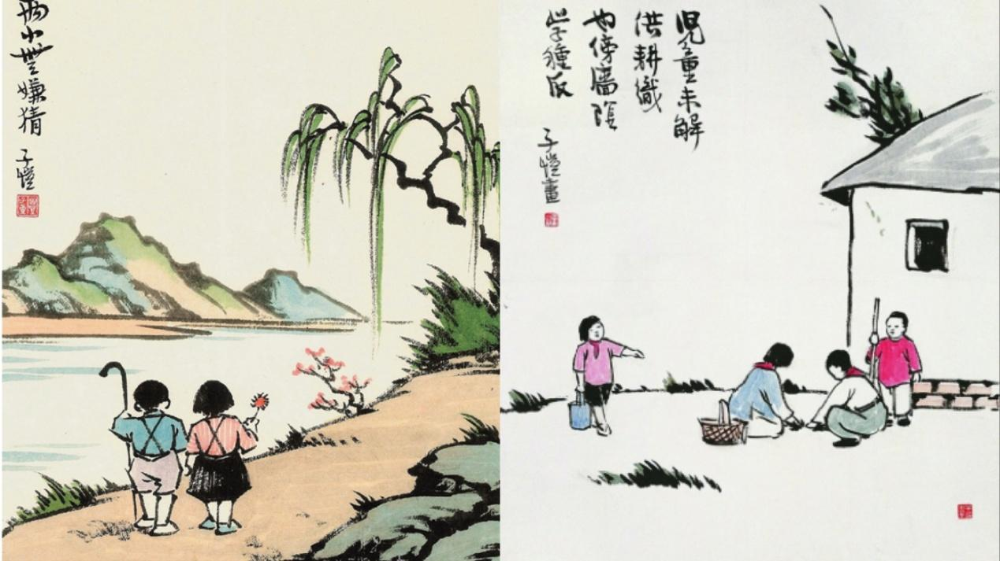

23篇.那些被定义为多动症、有问题的正常孩子

清一山长 2021年3月29日

清一山长雪球非专栏帖子整理文章，第23篇《那些被定义为多动症、有问题的正常孩子》

此文整理自山长专栏文章《借用外脑，是最低成本的改错方式！》[https://xueqiu.com/9310099567/178528522](http://link.zhihu.com/?target=https%3A//xueqiu.com/9310099567/178528522)的评论跟帖

//[@一十三号](http://link.zhihu.com/?target=http%3A//xueqiu.com/n/%25E4%25B8%2580%25E5%258D%2581%25E4%25B8%2589%25E5%258F%25B7)[2021-04-29 15:41](http://link.zhihu.com/?target=https%3A//xueqiu.com/5204563146/178980382)回复[@清一山长](http://link.zhihu.com/?target=http%3A//xueqiu.com/n/%25E6%25B8%2585%25E4%25B8%2580%25E5%25B1%25B1%25E9%2595%25BF):

我就是那个13年多，都不了解孩子是啥人的家长。

之前自己感觉相当良好，很自以为是，觉得一切都在掌控之中，直到孩子这次出现问题（其实孩子一直都有状况，只是我看不到），这个问题我很清楚的知道：一是自己没办法解决；二是如果不解决，后果很严重。所以通过明燕校长预约了山长进行咨询。因为孩子不想让我们参与她和山长的沟通过程，所以山长提前与我和爱人进行了线上视频沟通。山长很清晰地分析，让我们看到了孩子的状况，也看到了我们自己的问题，并给出了我们目前最好的解决方案。

整个过程山长都是站在我们家庭的立场来帮我们分析，并给出解决方案，而且这种一对一咨询让我感受到山长更像是我们的大哥或是朋友，用很轻松的方式和氛围就解决了我们最棘手的问题。孩子和山长沟通完了以后，也和我们通了视频，我看到孩子脸上的完全绽放的笑容就知道她的卡点被打通了。

咨询结束后我很激动，又听了两遍与山长沟通的录音，然后再看孩子写给山长的一封信，一边看一边流泪，我终于好像开始看懂孩子所表达的内容，如果不是山长的帮助，我可能一辈子都不知道孩子是什么类型的人，在想什么，会怎么做。

山长的私人咨询价值极高，我们家庭用了最低的成本解决了我们最棘手的问题。通过这次咨询，我更加深刻地感受到了山长的慈悲与大爱，唯有好好消化学习才能对得起山长给我们家庭的这份大礼。

在这里我们也要向我的孩子郑重地表达：我们的成长赶不上你，我们没有能力引领你，我们不会再阻碍你的成长！你现在自由了，你的人生由你自己作主！

爸爸妈妈会好好学习，不断提升自己，我们有我们自己的人生目标，期待我们家庭每个人都努力去做我们最好的自己！[拳头]

[清一山长](http://link.zhihu.com/?target=https%3A//xueqiu.com/9310099567)[2021-04-29 16:27](http://link.zhihu.com/?target=https%3A//xueqiu.com/9310099567/178639230)回复[@一十三号](http://link.zhihu.com/?target=http%3A//xueqiu.com/n/%25E4%25B8%2580%25E5%258D%2581%25E4%25B8%2589%25E5%258F%25B7):

原来你就是这个家长，也在雪球[笑]。祝福你们一家！

你们夫妻都挺实在的，对付不了这种精灵古怪的孩子。一般人也对付不了她，谁都敢去挑战一番，的确难弄。当家长是个技术活！

幸亏你们会请外援。我从小就是孩子王，练武之后，更是孩子王。一群孩子都喜欢跟我玩。

不过，也有家长乱请外援的。今天刘老师接受家长要求，辅导一个孩子：几乎是痴呆了。家长说她是抑郁症，在服用抗抑郁药物，才15岁的孩子，啥抑郁症？鬼话连篇的。结果瞎治疗，弄到像是痴呆一样。家长是当病人来找刘老师看的，把刘老师累坏了，说真难弄。下来跟我骂了一顿西医，以及糊涂家长。

估计这孩子，就是跟你们家孩子类似，有点青春期问题，不开心、闹情绪。家长就送医院，服药，结果——把孩子的智力都损害了。**西医治疗一些所谓的多动症、抑郁症的精神类药物，就是让神经系统钝化的鬼东西，害人不浅**。

家长们请这种外援，就完蛋了。很多病人，越吃药，越抑郁，就是吃死掉的，都变废人了。这孩子就是：反应都很差，听话都听不懂的样子。

如果这家长刚开始就找我，不是乱找西医乱治一气，我给的方法，就很简单，还不花钱：**尽量多运动，让运动来治疗孩子。别读书了，开心了再去读书。**（现在这样子更是读不了书，都傻了，家长还问：如果治好了，能不能上学去[滴汗]，她现在能自理，不啃老，你就谢天谢地了！）

10年前，见过我一个朋友的傻儿子，胖胖的、憨憨的、不爱说话、也不爱动。来证券公司大户室等他妈一起回家（他妈和我一个大户室）。坐在沙发上，挺老实的样子，已经成年了。她说：他儿子小时候，不是这样的。特别调皮、机灵。老师说他有多动症，她去找医生，开药，吃了就变这样了。

我听说了大骂：这些混蛋！坑人。因为治疗多动症，一样是神经抑制药物。

如何治疗？也一样，用运动来治疗。因为小孩子多动，是阳气太足了，静不下来。你就让他多动，做有点难度的、消耗体力的运动，耗完体力，他啥也不闹了，而且越来越有序。

我说：一个聪明孩子，就毁在你们手上。这位大户妈妈听了，后悔得不得了：说当初孩子小时候，怎么不认识我！

这妈妈是谁呢：她是省委书记的秘书的妻子。

她儿子上的是啥学校？烂学校吗？是省级的重点小学、中学，专门为省委高干们办的学校。

就这样子，害人不浅！[捂脸]

//[@永耕明a](http://link.zhihu.com/?target=http%3A//xueqiu.com/n/%25E6%25B0%25B8%25E8%2580%2595%25E6%2598%258Ea):回复[@清一山长](http://link.zhihu.com/?target=http%3A//xueqiu.com/n/%25E6%25B8%2585%25E4%25B8%2580%25E5%25B1%25B1%25E9%2595%25BF):

认真看了您写的这些案例，吃惊之余还有点后怕，我儿子小学时，老师也常跟我说他有多动症，要我带他去看医生，必要时治疗一下，我琢磨儿子好动还是精力旺盛了，就让他去训练球类，结果他很爱打球。如今，打球成了他生活中的一部分。今天看了山长大哥的文章，庆幸没把他送去医治。长知识了！

[清一山长](http://link.zhihu.com/?target=https%3A//xueqiu.com/9310099567)[2021-04-29 17:37](http://link.zhihu.com/?target=https%3A//xueqiu.com/9310099567/178651506)回复[@永耕明a](http://link.zhihu.com/?target=http%3A//xueqiu.com/n/%25E6%25B0%25B8%25E8%2580%2595%25E6%2598%258Ea)：

所谓的“老师”们，害掉的孩子太多了！您孩子有您真有福气，不然害惨了！

[三工](http://link.zhihu.com/?target=https%3A//xueqiu.com/5901774752)2021-04-29 19:33[@清一山长](http://link.zhihu.com/?target=https%3A//xueqiu.com/9310099567)：

万幸！我女儿从幼儿园到一、二年级经常头疼，做过很多检查，包括核磁共振都没找到原因，就去了医生推荐的广州的一家医院看。我把病历和影像胶片给医生看，医生问一些问题后就开药，没说有什么副作用。回家上网一查，是神经抑制方面的药，觉得可能会影响智力，决定不吃药，跟女儿说，再头疼就熬过去算了。后来逐渐好转，现在四年级很少疼了。庆幸没吃药！

[小尹花花](http://link.zhihu.com/?target=https%3A//xueqiu.com/8375846703)2021-04-29 22:55//回复[@清一山长](http://link.zhihu.com/?target=http%3A//xueqiu.com/n/%25E6%25B8%2585%25E4%25B8%2580%25E5%25B1%25B1%25E9%2595%25BF)：[¥200.00]

老师，我儿子幼儿园体检老师告诉我孩子贫血，叫我多给他喝牛奶，多吃牛肉、鸡蛋这些东西，但是现在都是工业养殖，不敢给他吃。然后去医院咨询医生，就给我开了一盒铁粉，我老公不准我乱给小孩吃这些东西，就也没给他吃，所以现在快五岁了，还是贫血。我想请教老师从中医来说，有没有比较好的治疗或改善贫血的方法？

[清一山长](http://link.zhihu.com/?target=https%3A//xueqiu.com/9310099567)[2021-04-29 23:01](http://link.zhihu.com/?target=https%3A//xueqiu.com/9310099567/178695525)回复[@小尹花花](http://link.zhihu.com/?target=http%3A//xueqiu.com/n/%25E5%25B0%258F%25E5%25B0%25B9%25E8%258A%25B1%25E8%258A%25B1):

我知道怎样处理，但我没法这样回答你。这几乎是一门课程。所以红包退回。

最简单的方式，是您**认真去模仿我们[清一武道馆](https://www.zhihu.com/people/mkaga)的生活方式、运动方式，自然就好了**。很简单的，您可以找到链接的。（红包已退回）

//[@郡岚空间](http://link.zhihu.com/?target=http%3A//xueqiu.com/n/%25E9%2583%25A1%25E5%25B2%259A%25E7%25A9%25BA%25E9%2597%25B4):回复[@清一山长](http://link.zhihu.com/?target=http%3A//xueqiu.com/n/%25E6%25B8%2585%25E4%25B8%2580%25E5%25B1%25B1%25E9%2595%25BF):

我的孩子早先也上过一段幼儿园，那个时候新教育没有幼儿学堂，孩子提出来想上，就让她去了，结果没多久老师也反应孩子有多动症，让我带去医院看看。我详细地问了老师哪些事情，她认为是多动症的情况，结果是孩子不能和其他孩子统一节奏，包括上课手背在后面，喜欢摸摸这里动动那里，有时候又好像进入自己的世界，听不到老师的指令。我当时就觉得好正常，一个三四岁大的孩子，就让她安安静静地坐着听课，循规蹈矩的，那样的孩子，我反而觉得不正常了。孩子放学回家以后，就比之前烦燥了许多，表现就是停不下来，到了晚上12点还睡不着，睡着以后满床滚，这就是白天太压抑，她说老师要小朋友在教室里趴着不说话，看谁保持的时间久。

我对老师的做法是不接受的，随后就退回家了，一直到大一点进了新教育学堂。第一个学期，打电话回来说每天不上课，老师就是让她做事，各种做事、运动，[捂脸]打扫卫生啥的。

当时的确对新教育没了解透，我对做事、运动是认可的，但是不知道为什么不学习，大部分时间都花在做事、运动上，直到假期接孩子回来，看到孩子面色红润，我自己学过自然疗法，虽然孩子一直都没病没灾的，也一直用了新教育的方式在带她们两个，但是她的脸色一直都是那种没什么光和血色的，我们全家也都反对孩子这么小就离开家里去那么远读书，但是一直到长辈们看到她红扑扑的面庞，就都解除了心中的疑虑。

这还不是最大的礼包。回来以后我惊奇地发现，她能静下来了，做家务比我强多了，我自己也被称为“处女癌”晚期患者，没想到她做的超过我，而且看到她从未有过的眼睛里透着的自信的光，和过去那个对啥都无所谓的样子形成鲜明的对比。而且爱上了阅读，以前都是老母亲一本接一本的读到口干舌燥还不能停。现在她不仅自己读，还会带领妹妹，一起运动、学习、做事，我才领会到老师的深意。让孩子在做事上慢慢找回自信，锻炼动手能力，所以心灵手巧，应该是手巧心也灵。同时心也跟着沉静了，心静了才能生出智慧的光。

运动方面，我也发现她提升到距离过去我给的量的数倍，晚上观察她睡觉也不会动来动去了，睡眠好很多，吃饭也不会艰难地吃个把小时才能结束了，吃得香又快，还主动给全家煮一些简单的饭菜。我才意识到，之前给孩子们定的运动量差得太远了！[吐血][吐血][吐血]

以上种种好处太多了，包括对家长的培训，我经常和圈内好友开玩笑说，感觉花了一份的学费，其实同时重塑了一家子[捂脸][捂脸][捂脸]，除了感动都是感激。这种心情，只有真正经历过，才能体会。感恩山长引领[献花花][献花花][献花花]……

[清一山长](http://link.zhihu.com/?target=https%3A//xueqiu.com/9310099567)[2021-04-30 16:28](http://link.zhihu.com/?target=https%3A//xueqiu.com/9310099567/178788495)回复[@郡岚空间](http://link.zhihu.com/?target=http%3A//xueqiu.com/n/%25E9%2583%25A1%25E5%25B2%259A%25E7%25A9%25BA%25E9%2597%25B4):

好真实的案例[献花花]，几乎就是我儿子小时候送去幼儿园的翻版。班主任老师还告状，说我儿子是班上的最后一名。责备我：怎么你这个大学老师，也不懂教育！孩子都这么差。

其实就是这孩子很聪明，有自己的想法。老师却太压抑他了，所以默默反抗。这种省级示范幼儿园，只能培养两种人：一种是压抑的胜利者，将来成书呆子，除了读书，啥也不会；另一种是问题儿童，反抗者。没有第三条可走。我儿子，大概率成为第二种——问题儿童。其实，就算成为第一种，也是很失败的结果。

所以，我才只能在儿子三岁多的时候，接回家，自己办学教孩子了。因为我当时，根本找不到一所合适的学校，我的钱再多都不行。你们，已经比我幸运多了！还有新教育学堂可以上。

//[@郡岚空间](http://link.zhihu.com/?target=http%3A//xueqiu.com/n/%25E9%2583%25A1%25E5%25B2%259A%25E7%25A9%25BA%25E9%2597%25B4):回复[@清一山长](http://link.zhihu.com/?target=http%3A//xueqiu.com/n/%25E6%25B8%2585%25E4%25B8%2580%25E5%25B1%25B1%25E9%2595%25BF):

我女儿刚去学堂那会儿，就跟我说喜欢学堂，老师都很好，我问她怎么好呢？她举例说，过去幼儿园的老师给她凳子，是直接用脚踢过去的，而她们学堂的老师讲话都不用吼的，椅子也是轻轻地递给她。哎，就这个例子，听到我真是既好笑又心酸，之前我们离开幼儿园的时候，孩子的评语上，老师还留下这样的话：要记住，老师骂你都是为你好！我现在还在后悔，当时怎么那么好脾气地离开，没怼回她：你才多动症，你全家都多动症！真是可怜又可恨。

我们周围的孩子，也都是在这种环境里面，家长们无奈又麻木。我们一家子，竟然能够跳脱出来跟随新教育，想来应该是前世积了大德吧！因为有了新教育这个大团体，我才能够坚持下来这么多年，所以每次看《盗火者》的时候，尤其是看到新教育遭遇困难重重，家长们团结一心的部分，都会百感交集，泪流满面。

新教育是改命的教育，面对困难、挫折不理解，放弃是最容易的，坚持下来反而需要巨大的勇气和意志，每当自己快要坚持不下去的时候，我就只要脑补一下过去那些无知麻木的日子，顿时就满血复活了！最后讲真，还是新教育那句老话：明师指路，唯有精进！

参考链接：

[清一投资号：第13篇.人生很多的都不能改，能改的是态度，是“心”](https://zhuanlan.zhihu.com/p/521610482)（整理文）

[你家孩子，是第几等人？要用几等的教育适配？](http://link.zhihu.com/?target=http%3A//www.360doc.com/content/21/0413/13/55056124_972102215.shtml)

[这就是今日学堂：把普通人培养成天才的中国第一学校！（海外版）_哔哩哔哩](http://link.zhihu.com/?target=https%3A//www.bilibili.com/video/BV19K411g7tp)

[喜马拉雅：清一山长雪球专栏](http://link.zhihu.com/?target=https%3A//www.ximalaya.com/album/52603303)（音频）

[哔哩哔哩：清一山长雪球专栏](http://link.zhihu.com/?target=https%3A//www.bilibili.com/audio/am32848405)（音频）
