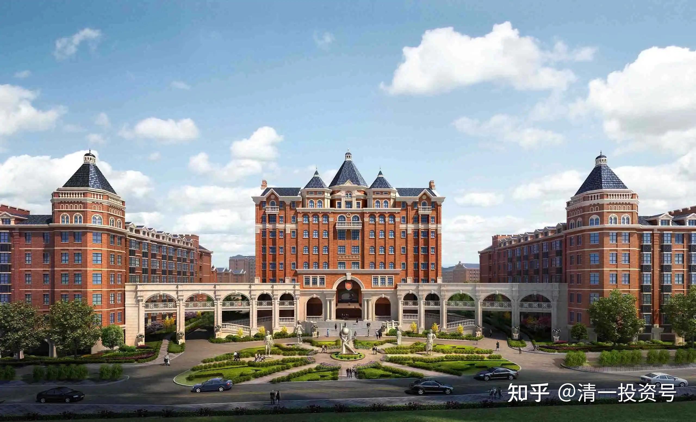

27篇.关于美国SAT和留学

清一山长2020年12月10日

清一山长雪球非专栏帖子整理文章，第28篇《关于美国SAT和留学》

[堤影灼光](http://link.zhihu.com/?target=http%3A//xueqiu.com/n/%25E5%25A0%25A4%25E5%25BD%25B1%25E7%2581%25BC%25E5%2585%2589)回复[借股修行](http://link.zhihu.com/?target=http%3A//xueqiu.com/n/%25E5%2580%259F%25E8%2582%25A1%25E4%25BF%25AE%25E8%25A1%258C):

您好，我是新来的，请问之前财富课程是在哪里开的？线上还是线下，网上能找到吗？我只搜到了[一个年轻人在B站讲的财富课程](http://link.zhihu.com/?target=https%3A//www.bilibili.com/video/BV1nD4y1X7nY)。

[【示范班今日明师荟#12】明瑞老师：“揭秘财富本质”_哔哩哔哩_bilibili](http://link.zhihu.com/?target=https%3A//www.bilibili.com/video/BV1nD4y1X7nY)

[20201127明瑞老师：“揭秘财富本质”_哔哩哔哩_bilibili](http://link.zhihu.com/?target=https%3A//www.bilibili.com/video/BV1w5411K7jq)

[清一山长](http://link.zhihu.com/?target=https%3A//xueqiu.com/9310099567)[2020-12-10 13:46](http://link.zhihu.com/?target=https%3A//xueqiu.com/9310099567/165414784)回复[堤影灼光](http://link.zhihu.com/?target=http%3A//xueqiu.com/n/%25E5%25A0%25A4%25E5%25BD%25B1%25E7%2581%25BC%25E5%2585%2589)：

别找了，我的财富课不对外开放，您找不到的。找到了大概率也是骗你的。您看到的B站的财富课，是我的私人商学院学生讲的公开课，希望你们会满意。

[一手遮天1991回复清一山长：](http://link.zhihu.com/?target=https%3A//xueqiu.com/6473429982)

考虑开一个吗？山长

[清一山长](http://link.zhihu.com/?target=https%3A//xueqiu.com/9310099567)2020-12-10 14:14

现在我没兴趣对外开课，对内都忙不过来。我要教，只会教真本事。一堆我都不认识的外人，跑来学走了我这只老猫的谋生本事，以后跟你们这批“老虎”们去争食，日子就艰难了。现在这样最好：市场上，钱多，人傻，日子最滋润。有空了，内部开开课，教教私人弟子，不比对外开课强？我又不缺这点学费[大笑]。

虽然在国外，我每周都在上课的。**教学是我的主业，投资只是副业。**给我自办的清一大学的学生们上课。这批学生，要代表我去海外大学与世界学生争胜，所以我得给他们补补课。明天他们去某大学与相关专业的大学生和教师交流互动。这个大学的负责人，听说**我们15～16岁的学生，上月刚考完C1、C2**，就说你们说错了，DELE考试，初级证书不是C1、C2，而是A1、A2。我们肯定说错了，反复强调多次，说A1、A2太低了，我们都没兴趣去考。已经考过了B2后，这一次真的是去考C1、C2的。让这个见多识广的西语大学教授大为吃惊，说从来没见过这样的事情。因为他所在的大学，连西语的研究生，很多都没通过C1、C2的。这就是我自办的清一大学学生的成绩水平。

也许明天有照片发给各位看看[笑]。

[清一山长](http://link.zhihu.com/?target=https%3A//xueqiu.com/9310099567)[2020-12-10 15:46](http://link.zhihu.com/?target=https%3A//xueqiu.com/9310099567/165430182)回复[Smarshoo](http://link.zhihu.com/?target=http%3A//xueqiu.com/n/Smarshoo):

马来西亚倒是很欢迎办学，马来西亚有个私立大学办不下去了，想要卖给我，价钱很便宜，我把惠泉卖了可以买两所大学（看你们还迷信海外大学[大笑]），一百多名学生，有一些是大陆学生混文凭的。所以，善意告诉你们：海外的私立大学，大多数都很烂的！不过，我不是太想买下来，因为我办我自己的大学，才不要谁来认证呢！教育官员没资格来管理我的大学的，我发给学生自己签发自己的大学文凭[大笑]。

[Smarshoo](http://link.zhihu.com/?target=http%3A//xueqiu.com/n/Smarshoo)回复[清一山长](http://link.zhihu.com/?target=http%3A//xueqiu.com/n/%25E6%25B8%2585%25E4%25B8%2580%25E5%25B1%25B1%25E9%2595%25BF):

哦，理解错误，原先以为清一大学是纳入当地体系，也会对社会招生，颁发文凭，类似国外那种私立大学，因为是和国外知名大学对标的嘛！现在有点不明白了。

[清一山长](http://link.zhihu.com/?target=https%3A//xueqiu.com/9310099567)[2020-12-11 21:01](http://link.zhihu.com/?target=https%3A//xueqiu.com/9310099567/165562224)回复[Smarshoo](http://link.zhihu.com/?target=http%3A//xueqiu.com/n/Smarshoo):

以为“清一大学是纳入当地体系，也会对社会招生，颁发文凭”，如果这样玩，我们得多平庸才行啊？请您举出一个例子，找出一家中国的私立大学，排名能够排到中国前一百名的大学名字给我？更别说世界前一百名了。

清一大学，是成绩按照美国前30名大学的成绩来录取学生的。您说，能比吗？

[Smarshoo](http://link.zhihu.com/?target=https%3A//xueqiu.com/2247285914)2020-12-14 20:01[清一山长](http://link.zhihu.com/?target=https%3A//xueqiu.com/9310099567)

哦，明白了，清一师范大学是为以后中华清一大学培养师资的！

[Smarshoo](http://link.zhihu.com/?target=http%3A//xueqiu.com/n/Smarshoo)回复[清一山长](http://link.zhihu.com/?target=http%3A//xueqiu.com/n/%25E6%25B8%2585%25E4%25B8%2580%25E5%25B1%25B1%25E9%2595%25BF):

我的意思是：我原先以为，路径是成为一家在国外注册的中国人创办的大学。不是说在国内办私立大学。

[清一山长](http://link.zhihu.com/?target=https%3A//xueqiu.com/9310099567)[2020-12-14 20:35](http://link.zhihu.com/?target=https%3A//xueqiu.com/9310099567/165730004)回复[Smarshoo](http://link.zhihu.com/?target=http%3A//xueqiu.com/n/Smarshoo):

“成为一家在国外注册的中国人创办的大学”，您真觉得这样就好吗？

其实在国外，买下一家已经在运行的私立大学很容易。因为现在的私立大学都办得很艰难，都招不到学生，疫情更加重了他们的经济危机，而且未来看不到希望。专家都说了，美国未来50%的大学都要倒闭。也的确有海外的私立大学，正在谋求出售给我们或者合作。

不过我考虑这样做的话，就很打脸某国了。而且，这样一家注定成为世界名校的大学，落地在哪个国家，就是这个国家的巨大荣誉。目前，泰国也好，马来西亚也好，我的感情还不足以把这个重礼送给他们。我是中国人，我保留这一份大礼的国籍待定，也许它可以送给未来的中国来落地。

我**相信最终一个胸襟、气度，足以容得下全世界创新教育示范者的中国，会迎接这份荣耀的。**

[江湖梦留白](http://link.zhihu.com/?target=http%3A//xueqiu.com/n/%25E6%25B1%259F%25E6%25B9%2596%25E6%25A2%25A6%25E7%2595%2599%25E7%2599%25BD)回复[清一山长](http://link.zhihu.com/?target=http%3A//xueqiu.com/n/%25E6%25B8%2585%25E4%25B8%2580%25E5%25B1%25B1%25E9%2595%25BF):

请问山长，如今越来越多的美国大学（尤其是名校）入学申请都不要求SAT成绩了，（MIT等理工科大学会要求SAT数理化单科成绩），很多人质疑SAT等标准化考试的公平性、有效性。在这样大趋势下，学堂还会继续SAT挑战班么？还会继续以SAT成绩作为入学条件之一么？这背后有何其他思量？谢谢。

[清一山长](http://link.zhihu.com/?target=https%3A//xueqiu.com/9310099567)[2020-12-12 11:32](http://link.zhihu.com/?target=https%3A//xueqiu.com/9310099567/165586457)回复[江湖梦留白](http://link.zhihu.com/?target=http%3A//xueqiu.com/n/%25E6%25B1%259F%25E6%25B9%2596%25E6%25A2%25A6%25E7%2595%2599%25E7%2599%25BD):

我还没听说什么世界名校不接受SAT考试成绩的，只是有人实在考不过，考不好，觉得不公平，不全面，想用其他方式来“补充证明自己”罢了。一些大学校也接受多样化的考评方式，但绝对不会拒绝SAT成绩。至于您说“很多人质疑SAT等标准化考试的公平性有效性”？什么人在质疑？是美国的一批学渣和学渣的老师们在质疑，因为大多数美国学生考SAT成绩是很差的。新教育学生，随便一个学生都可以秒杀他们。他们想要一个更简单轻松的考试方法，比如“素质”“我会玩”，但我们的学生，如果三年就可以考到美国前100大学的SAT成绩，其他的9年时间都可以用来玩，可以比他们玩得还嗨。SAT其实真的不难，但是，如果美国人连简单的东西都应付不来，你知道他们的基础教育有多差了。可叹全世界的教育居然都以美国教育为标杆，这就是大笑话。这也是我有信心自称可以创中华世界名校的原因——因为，考SAT根本就是没有多少技术含量，只要语言过关了，就很简单。中国人、外国人，很多是被语言关卡住了，被美国人算计了。偏巧我们的新教育，可以轻松破关。我们的清一大学附属中学，核心才不是学SAT呢！我们不是考试机构，平时根本就不学SAT，只是打好语言基础，考前半年拿出来练练，就足够拿高分了，因为**我们学的是“家国天下之学”，学了这门学问，考啥SAT以及什么DELE，都是小菜一碟！这就是中国新教育的魅力。**

[江湖梦留白](http://link.zhihu.com/?target=http%3A//xueqiu.com/n/%25E6%25B1%259F%25E6%25B9%2596%25E6%25A2%25A6%25E7%2595%2599%25E7%2599%25BD)回复[清一山长](http://link.zhihu.com/?target=http%3A//xueqiu.com/n/%25E6%25B8%2585%25E4%25B8%2580%25E5%25B1%25B1%25E9%2595%25BF):

多谢山长耐心答复，心情好激动。也感谢山长开放雪球讨论平台，让我们这些不是圈内人却对新教育有兴趣了解的人，有一个和您交流的机会。质疑SAT考试公平性的不是学渣，恰恰相反，很多都是精英。它的不公平性主要体现在：

家庭富裕的孩子有很多通过补习班或是私教提高成绩，生活困难的家庭没有这个机会。

SAT的成绩是可以通过短期的刷题提高的，这不能真实反映学生的学习态度和对知识的掌握。

这背后有很多数据支持，在[网页链接](http://link.zhihu.com/?target=http%3A//www.fairtest.org/)这个网站上有详细的数据分析。这个网站还总结归纳了自2004年起到今天，美国各学校对SAT/ACT考试的决定，可以看到一个趋势，越来越多的学校开始选择test blind。2021年入学是个例外，由于疫情，几乎所有的学校都取消了SAT考试要求。芝加哥大学在2018年就不要求SAT了，加州系统下的十所大学（包括有名的伯克利大学）在今年五月通过了新的政策，五年内逐步取消SAT，2025年彻底取消。网站还有对国际学生的SAT要求追踪，可以作为参考。另外，美国排名第一的Thomas Jefferson高中和哈佛附中波士顿拉丁学校在长达几年的商讨下，今年开始都取消了SSAT/ISEE考试入学要求，这是政治大环境追求平等下的必然结果。

另外我想补充一下美国大学对学术的考核，除了SAT/ACT，大致包括五项：

高中四年的GPA成绩。

在年级的排名。

大学AP课程的数量和成绩，只有成绩在A以上才有资格选修AP课程。

九年级以上的学科竞赛成绩。美国虽然数理化平均水平很差，却有很规范全面的竞赛系统，用来选拔尖子生，这项的权重是很大的。

个别学校某些专业要求单项SAT成绩。

这仅仅是学术上，还有您提到的其他素质项目(其实更难，都是需要从小长期培养的）。在美国的孩子也是压力重重，一到九年级四年内一刻都松懈不了。而且美国大学知道亚裔学生考试厉害，对SAT成绩要求比其他族裔高出许多。SAT的平均分是被一大群受各种原因影响的没好好学习的学生拉低的，不能体现美国教育的真实水平。最后想说的是，作为家长，我不想被各种人为的政策牵着走，本科教育只是人生的一小节，之后的路还很长，把心态调整好，健康的身体、性格乐观、自律自强，该怎么学还是怎么学，以不变应万变。

[清一山长](http://link.zhihu.com/?target=https%3A//xueqiu.com/9310099567)[2020-12-13 12:47](http://link.zhihu.com/?target=https%3A//xueqiu.com/9310099567/165623141)回复[江湖梦留白](http://link.zhihu.com/?target=http%3A//xueqiu.com/n/%25E6%25B1%259F%25E6%25B9%2596%25E6%25A2%25A6%25E7%2595%2599%25E7%2599%25BD):

您说得很好[献花花]，我们也不认为SAT是一个完美的标准，站在精英教育的层次上来看，甚至我们认为它“很平庸，很基础”，没啥精英教育的含量。所以我们自己要补课上一些更重要的课程。这个考试，甚至无法真正的体现学术能力优劣。只是一条您需要思考：这个本来就不难的考试，没啥技术含量的考试，美国人为啥考这么渣？

你看看美国前100大学的入学成绩要求，起点居然还不到1200分。我可以负责任地跟你说：我们自己的学生，不做考前训练，不刷题，学完12年的美国课程之后，都可以达到美国前100大学的入学成绩。如果做一些考前训练，刷题等，应试的技能，就可以考到前30名、50名大学的成绩了，达到3%甚至1%的学生的成绩。我想问：剩下的美国3000多所大学，招收的学生，是什么样分数的学渣？甚至连考SAT都没有考的人吧？美国的数据是：大学录取基准线，才900多分。我看几乎任何人，想上大学都可以上，交钱就行了。普通大学，根本没有啥竞争压力。

你说美国SAT成绩差的理由，是受各种影响，没有好好学习的学生拉下来的。这个理由是很牵强的，不是事实。

因为SAT并不是强制每个高中毕业生都要考的考试，只是一些想上大学的高中生才会去考。所以，很多美国高中毕业生，其实大量地放弃了SAT考试。每年参加SAT考试的人数，2019年增加了25%，也才达到210万人，这还是全世界学生加在一起参加考试的人数，美国自己的人数，最多也就是每年100多万。但美国每年出生的人口数字，是400万到600万之间的（每年不一样）。所以，可以说，每年大约只有三分之一的人参加了SAT考试。都是相对学业素质更高，有信心想继续上大学的学生，才去参加SAT考试。并不是您说的“被素质低的人拉低了分数”，而是高学业成绩的人才去考的。低素质不好好学习的学生，早就从SAT的赛场外就淘汰掉了。

我说的这些数据和事实，也欢迎您去验证一下！欢迎讨论不同的观点。只要基于事实，我认为都是有价值的。

[江湖梦留白](http://link.zhihu.com/?target=http%3A//xueqiu.com/n/%25E6%25B1%259F%25E6%25B9%2596%25E6%25A2%25A6%25E7%2595%2599%25E7%2599%25BD)回复[清一山长](http://link.zhihu.com/?target=http%3A//xueqiu.com/n/%25E6%25B8%2585%25E4%25B8%2580%25E5%25B1%25B1%25E9%2595%25BF)：

再次感谢山长回复。

为何美国学生SAT成绩那么渣，中小学教育水平为何不断的下降？这个问题没有单一的答案，牵涉到很多方面。我觉得主要原因有以下几点：

1）美国绝大多数大学都接受ACT and SAT，两家是竞争者，近几年ACT抢走了不少生源，不少学生两个考试都参加，选择一个成绩好的用来申请学校。这和学渣没关系，部分解释了您提到的为何SAT考生人数那么少的问题。

2）**美国的教师工会组织**是个拖垮教育质量的大毒瘤。教师一旦进入公校系统，基本就是铁饭碗，旱涝保收，只要不犯大错，没人可以质疑他们的教学水平，没有任何评估系统，更不要提淘汰制。不可思议吧！这就是工会。而美国至少90%学生是去的公立学校。大家都看到了这个问题，想解决这个问题难于上青天，这牵涉到背后的党派利益，教师工会是民主党大本营。

3）教学时间。美国教育体系有超长的假期，长达近三个月的暑假，二周圣诞假期，一周寒假，一周春假。**平时下午两点半就放学了**。有研究数据表明，孩子们在学校内学到的其实差别不是很大，拉开差距的主要是在课外时间的利用上。课外时间越长，对**富裕家庭**就越有利，他们**有时间精力去督促孩子学习，培养兴趣爱好。**而贫困家庭的孩子基本就是放养，看电视、打游戏。想改变这个几十年的传统？同样不容易，教师工会第一个反对。

4）越来越左的政治风气，最有名的就是affirmative action(俗称AA)，要求用种族分配制取代择优录取制，很多美国名校都以libral自豪，降低标准以增加黑人西裔的录取率。长期以往的结果就是助长了反智风气，anti-intellectualism and academic disencouragement.盛行，这也直接/间接的影响了大学高中取消标准化考试的决定，我之前提到的两所有名高中，以及哈佛大学和耶鲁大学都有关于歧视亚裔和白人的诉讼。

5）对大学回报率和有效率的认同。美国不少老百姓（包括我的老板）都质疑大学的回报率，坚信上大学不是成功或是学习知识的唯一通道，而且有魄力不随大流，自主创业做喜欢的事情。随着近几年美国大学学费飙升，更多的人主动选择不上大学。华人相对多数保守。

我的总结是美国的大学录取制度是非常非常不靠谱的，不确定因素很多，它的教学体制虽然没能够提高学生平均水平，却相对容易发掘和培养有热情和创造力的天才学生。

[清一山长](http://link.zhihu.com/?target=https%3A//xueqiu.com/9310099567)[2020-12-14 10:12](http://link.zhihu.com/?target=https%3A//xueqiu.com/9310099567/165666557)回复[江湖梦留白](http://link.zhihu.com/?target=http%3A//xueqiu.com/n/%25E6%25B1%259F%25E6%25B9%2596%25E6%25A2%25A6%25E7%2595%2599%25E7%2599%25BD):

您的确专业，说的就是事实。跟我了解的情况也是一致的。甲骨文创始人拉里·埃里森被邀请去大学做演讲，他上来就直接说：他认为上大学根本就没价值，只会培养打工仔。想要成功，就必须离开大学，建议让学生们退学。结果直接让校方人员赶下台了。一个很有趣的笑话，我看过这场演讲的视频。

美国的基础教育很差，不管考SAT，还是ACT。差生怎么考都差不多，好学生随便考什么都无所谓。

**美国的大学教育好，是指的顶尖大学。**这些从全世界吸引来的最优秀的学生，撑起了美国的教育霸权。如果不是这些学生，美国教育根本就是个笑话。美国前100名大学的录取分数线，看了之后只能说：美国恐怕大约就前50名大学还比较像样，其他大学都是渣渣。

教育真办得好的，是日本和德国。

“五眼”国家，澳洲的教育质量都比美国好。

但中国人没判断力，只会把孩子送到美国读书，甚至读中学，觉得这样就有档次了。如果上了不是前50名的大学，就是白花钱的。而且花钱还不少。

相反，欧洲的法国、西班牙等国，第一流的大学，居然是免费的，中国人却不去“占便宜”，有点好笑。

[江湖梦留白](http://link.zhihu.com/?target=https%3A//xueqiu.com/7315603090)2020-12-14 11:35回复清一山长

被山长夸奖专业，受宠若惊。

山长多次文章里提到欧洲大学，是一个不错的选择，性价比高，但相比英美学校在某些地方也有劣势。我中小学在上海，参加高考入读北京211/985高校，一年后公派在西欧一小语种国家学工科三年至本科毕业，研究生在美国波士顿学商科，多元的教育背景让我有很多切身的体会和比较，希望能和山长和对新教育关心的人交流。

[清一山长](http://link.zhihu.com/?target=https%3A//xueqiu.com/9310099567)作者2020-12-14 12:07回复江湖梦留白

你的确比很多家长更懂留学的坑。

美国，也就顶尖的几所大学，水平的确算世界第一，中国人大多数也进不去的，现在更进不去了。但欧洲的德国、法国，以及日本的顶尖大学，教学水平绝对不亚于美国的一流大学。即使亚洲的新加坡大学，最新排名也超过了耶鲁，排进了世界十名左右。南洋理工的排名，也比大陆的顶尖大学更高。所以，美国的教育霸权，正在被分解！全世界都有慢慢起来超过的趋势。

真可惜，**中国这么一个大国**，有顶尖的企业，如华为，但没有顶尖的大学。**大学的世界地位和排名，连新加坡、香港的大学都比不上。**就是说，**光靠投钱，是投不出顶尖大学的，还要看学术精神，讲一点教育理想的。**不知道西湖大学能不能走出来。

参考链接：

[你家孩子，是第几等人？要用几等的教育适配？](http://link.zhihu.com/?target=http%3A//www.360doc.com/content/21/0413/13/55056124_972102215.shtml)

[这就是今日学堂：把普通人培养成天才的中国第一学校！（海外版）_哔哩哔哩](http://link.zhihu.com/?target=https%3A//www.bilibili.com/video/BV19K411g7tp)

[喜马拉雅：清一山长雪球专栏](http://link.zhihu.com/?target=https%3A//www.ximalaya.com/album/52603303)（音频）

[哔哩哔哩：清一山长雪球专栏](http://link.zhihu.com/?target=https%3A//www.bilibili.com/audio/am32848405)（音频）

[\[转\]香港外资高管：花6000万培养失败的儿女的反思](http://link.zhihu.com/?target=https%3A//www.bilibili.com/read/cv28583557)
