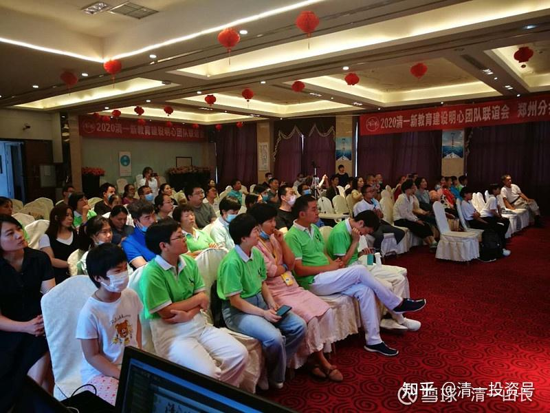
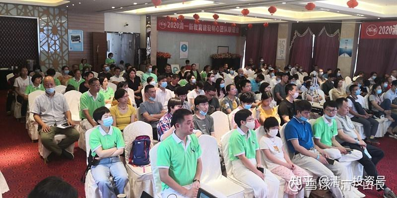
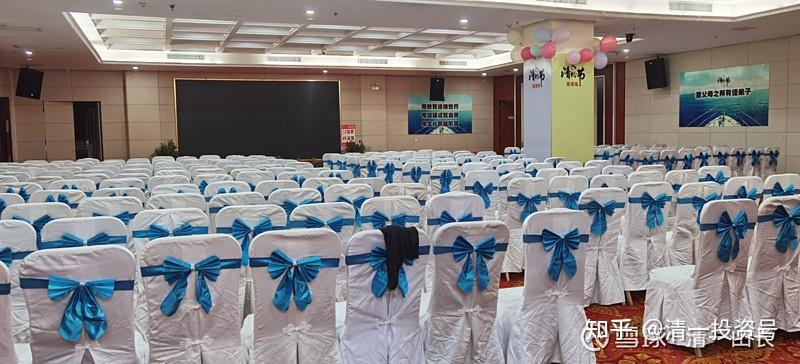
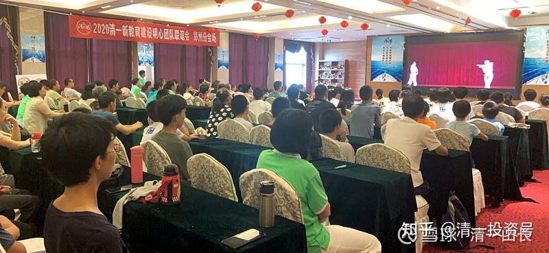
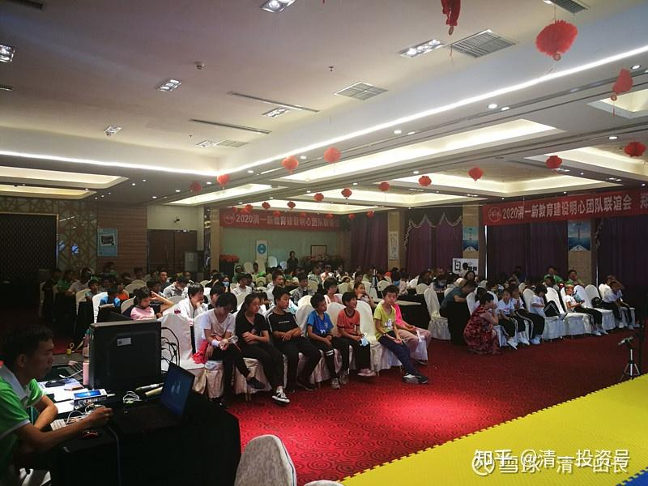

[原雪球专栏](https://zhuanlan.zhihu.com/p/545456103/edit)70篇.没有对手？就自虐吧！新教育的挑战和自我挑战

[清一山长](http://link.zhihu.com/?target=https%3A//xueqiu.com/9310099567/column)2020年6月26日

我创建的今日学堂，国内没对手。出国来看看，国际上也没对手（比的是教学效果，不比校园。我们现在的校园投资，只是8位数级别。不像很多学校是10位数级别的）。泰国最牛叉的国际学校，学费80万泰铢的，在我看来学生的品质也不过如此。就是校园看起来很漂亮，家长反正也得不到这些东西。只有教学的品质才是家长能够得到的东西。

国内业界的评价，就是追赶我们的第二名，用望远镜都看不见。这种一花独秀的局面很危险，老子说：“祸莫大于无敌”。我最担心的就是教师和学生们过于骄傲自满（的确有这种倾向），不思进取，我们就不可能成为真正的世界名校。所以，我去年就创建了一所新的学堂，来和老学堂竞争，这就是“清一塾”的诞生。去年才开始第一届招生。今年是首届学生的“毕业典礼”——11岁的学生，经过一年的学习，已经超过了大学生。今天是学生们的英语课程毕业（结业）大赛，用实战比赛来纪念一年的学习成绩。

学生学了一年是啥样？这所新学校能和创立了17年的成名学校PK吗？今天是两校学生公开决赛的日子，赛场的观众们会评出今天的赢家。为了给大家一个公开的示范，本次两校决赛，就网上现场直播。

顺便公告一下数据：昨天我的线上直播，参与人数是四万多人次。这是一次线上线下同步进行的新教育交流活动，全国各地都有很多自发组织的分会场。说明关注新教育的人还是很多的。昨天讲理论，今天看实战。今天这些12岁的孩子，目标是三年后就上大学，是两校“天才教育班”的候选队员。是今日新教育批量制造天才的成果展示。大家想看看人造天才，就抓紧时间上线，直播[网页链接](http://link.zhihu.com/?target=https%3A//app8q9fauhp6709.h5.xiaoeknow.com/v2/course/alive/l_5eec7b757417c_bKeeKp6N%3Ftype%3D2%26pro_id%3Dp_5eeda3194bf83_8KhzsTFU%26app_id%3Dapp8q9FAuhp6709%26is_redirect%3D1%26from_multi_course%3D1)：

[2020年6月26日 用突破成就自我——今日学堂PK清一塾](http://link.zhihu.com/?target=https%3A//app8q9fauhp6709.h5.xiaoeknow.com/v2/course/alive/l_5eec7b757417c_bKeeKp6N%3Fapp_id%3Dapp8q9FAuhp6709%26from_multi_course%3D1%26is_redirect%3D1%26pro_id%3Dp_5eeda3194bf83_8KhzsTFU%26type%3D2)

比赛的内容是：两校的学生们用20天，学完一部美国电影。要求全部台词熟练，以及场景熟练、表演熟练。双方互相挑战任意电影的片段，谁答不上来，就算输。很有趣的比法。我认为大学生一个月都学不出来。这种比法，对语言熟练度要求太高了。

参考链接：

[2020年清粉节视频目录](http://link.zhihu.com/?target=https%3A//app8q9fauhp6709.h5.xiaoeknow.com/p/decorate/homepage)

[20200627天才是可以批量制造的—新教育12岁天才教育规划的解析](http://link.zhihu.com/?target=https%3A//app8q9fauhp6709.h5.xiaoeknow.com/v2/course/alive/l_5eebfbdd46602_O4s3KZYE%3Ftype%3D2%26app_id%3Dapp8q9FAuhp6709)

[20200627泰国的投资与生活解析——充分利用地球资源，取得最佳人生发展机会](http://link.zhihu.com/?target=https%3A//app8q9fauhp6709.h5.xiaoeknow.com/v2/course/alive/l_5eec0599ce200_9wIZl6Hm%3Ftype%3D2%26app_id%3Dapp8q9FAuhp6709)

[20200625刘老师主题分享：孩子不良习惯背后的深层原因和家长的修行方向](http://link.zhihu.com/?target=https%3A//app8q9fauhp6709.h5.xiaoeknow.com/v2/course/alive/l_5eebfc95999e9_LGnAuxyO%3Ftype%3D2%26app_id%3Dapp8q9FAuhp6709)

[20200627山长、刘老师关于家族传承的答疑](http://link.zhihu.com/?target=https%3A//app8q9fauhp6709.h5.xiaoeknow.com/v2/course/alive/l_5eeda280d7cb7_y11z5iGn%3Ftype%3D2%26app_id%3Dapp8q9FAuhp6709)

[20200626用突破成就自我——今日学堂PK清一塾](http://link.zhihu.com/?target=https%3A//app8q9fauhp6709.h5.xiaoeknow.com/v2/course/alive/l_5eec7b757417c_bKeeKp6N%3Fapp_id%3Dapp8q9FAuhp6709%26from_multi_course%3D1%26is_redirect%3D1%26pro_id%3Dp_5eeda3194bf83_8KhzsTFU%26type%3D2)
