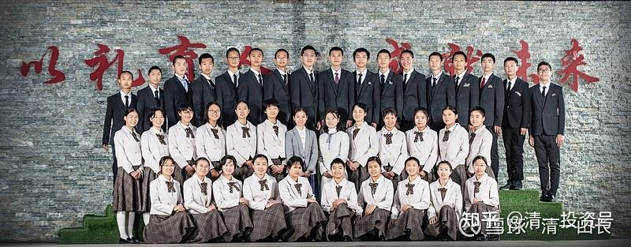
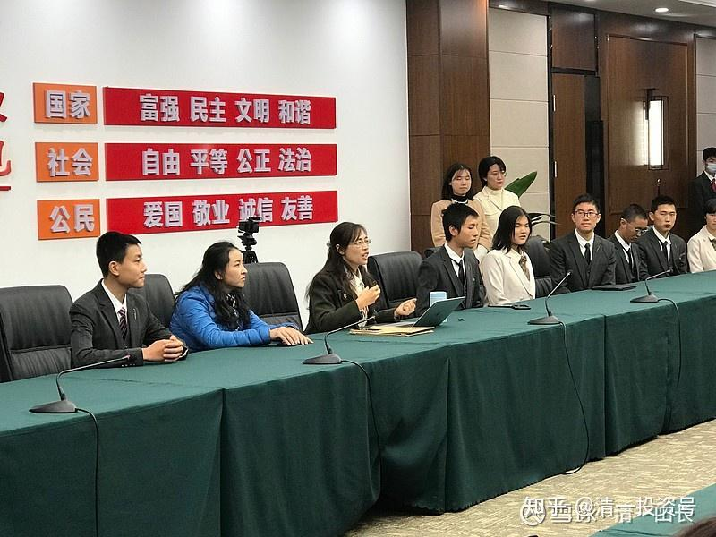
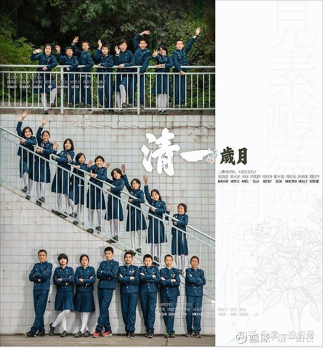

原雪球专栏93篇.创造历史的清一大学：首届学生集体合影

清一山长 2020年12月12日

创造了历史记录的成绩单：

带班教师的报告：今早收到了塞万提斯学院发来的DELE10月考试成绩。西语班23名学生，3名学生直接报考C1，已经通过考试。其他21名学生报考B2，18名通过B2。3名学生没有考过B2，都差得不多，其中一名只差一分。

11月大部队考的是C1，三名学生考C2，考试成绩还没下来，等出来之后再向老师们汇报[笑]

这就是清一大学首届本科学生的成绩单。如果各位懂得DELE考试是什么？这个成绩意味着什么？如果是大学西语专业，西语教师和学生，就知道：只学了一年多一点，首次参加B2考试，通过率就接近90%。甚至还有学生首次考试就自信满满，直接考过C1。第二次考试就**全班直接考C1、C2。这个成绩，意味着已经超过了中国任何外国语大学的教学成绩**。就算是北大外语学院，北京语言大学西语学院，学了四年的学生，都没有这么高的通过率。等于全体学生，都达到了西语专业最优等毕业生的水准。（**C1、C2是相当于西语专业研究生的水平，高级学术级别。甚至连本土学生，都未必能够通过这个专业考试**）

上面这张照片，就是首届清一大学的学生。去年入学的，平均年龄16岁，最小的才14岁。其中一多半是西语班，就是去北京大学西语系交流，把西语教授惊到了的学生。也是昨天联络确认，他们刚刚考完C1、C2考试回来，让某大学西语系教授反复追问强调：“不是A1、A2考试吗？”最终不敢相信结果的学生。

这张照片里面，有学生，也有他们的老师。你们能看得出谁是老师吗？[笑]。学生是首届清一大学本科生班的。带他们的教师，是首届清一大学的私人研究生，我的助教们！

上图是今天清一大学的西语班师生，正在与国内某大学外语学院的院长和西语专业的师生见面交流的现场照片。其中学院的院长，对我们的学生赞不绝口。说精气神与她带过的学生都不一样，西语口语还特别好。有几个西语的外籍教师，与我们学生交流后，都对孩子们的水平赞不绝口。说从来没有见过这样的学生。年龄这么小，学习速度这么快，就学完了全部的大学西语课程，并取得了优异成绩。并对他们的西语沟通能力表达与普通学生的重大不同：就是**一些词汇，他们如果不知道的话，会很自然地用更多的词汇解释出来**。不像一般的中国学生会卡住。其实这就是我首创的“**母语思维教学法**”才能够教出来的结果。普通学生用背单词背出来的，就只会结结巴巴地说话。

不过，该院院长了解到我们的教学发方法后，却叹气：“没法学！”因为他们安排教学课程，必须按照“教学大纲”来做，明知效果不佳，但没有人敢像我们一样去学习。只好天天艰难地教学，啃书本，做作业，背单词，做试题。看到我们的学生轻松、快乐地学习，是他们很想做，但却做不到的。课程管理这关就过不了。

这就是教育管理的笑话：我一个造汽车的，却必须按照马车的方法来造汽车，必须通过马车制造管理局的批准才能下线。这怎么可能造得好！这就是为什么全世界教育界，造出来的车，都这么古怪，浪费时间和精力。全是一样的低效慢速的马车。因为教育管理部门，只让你造“马车”，所有的创新，都必须符合“马车”的要求才能使用。

所以，我们的教育奇迹，是使用全新的教育理念、教育方法，创造的教育标准——是“马车管理局”根本就不知道的新造车标准，当然造车成果，就算是出来一辆最普通的“汽车”，也可以轻松超过他们最优秀的传统“马车”了。大家不用觉得是啥奇迹，只是建立在世界教育界“整体弱智”的情况下，用创新方式取得的教育成果罢了。说穿了，我的**教学方式一点也不难，但偏偏没人去做，老子说的：“吾道甚易知，甚易行。而天下莫能知，莫能行。”**叹息！

下面这张照片，是清一大学附属中学——清一学塾的孩子们的集体照。三年后，他们将凭借优越的实力，超过美国前30名大学的成绩，考进清一大学。这是他们的梦想。世界名校对他们招手，但他们更愿意去读清一大学。除非没有被清一大学录取，就只好去读世界名校了[大笑]

清一大学的录取成绩要求，是按照国际教育标准，**采用美国SAT考试成绩，做为基本学业要求的。必须达到美国排名前30名大学的SAT成绩，学生才有资格申请入读**。**还要通过面试，外加跑半马的运动成绩，德智体全面过关才有机会考上**。简单地说：**清一大学一诞生，就是用超过世界名牌大学的标准来招生的**。而且，还要**用名牌大学毕业生的最高成绩要求才能取得毕业资格！**如西语班的学生，如果没有拿到B2以上的考试证书，就拿不到清一大学的毕业证。这种毕业要求，比中国最牛的大学还要苛刻！

因为，我的要求是，**每一个清一大学的毕业生，都是我们的名片，我们不会允许不合格的产品流向市场的。我们的荣誉，比什么都重要。这种荣誉，不是吹出来的，而是全体师生们奋斗出来的。**

**BTW**（By the way）：这些照片不是毕业照，而是他们的结业照。我承诺如果他们通过了语言考试，我就开始讲中国传统文化课程给他们听，上一点有价值的课程。本周日，给他们上的课程是“**齐家课**”。这是他们最喜欢的课程。考完后回来后，他们每天都在上这个课程。每天忙死了，因为我的课程，是案例教学式的。所以要提前做方案，忙死了，但收获也很大。他们说：“比学外语强多了。”倒也是，**你外语学得再好，在外国也就是外国的乞丐都会说的话，没啥技术含量的，我教的课程，就是古代精英阶层的课程，**价值当然不一样了。他们连财富课都不想要，只想要“**齐家课**”，以及“**策论课**”。[俏皮]

**评论回复：**

**[清一山长](http://link.zhihu.com/?target=https%3A//xueqiu.com/9310099567)2020-12-10 15:46回复：**

马来倒是很欢迎办学。马来有个私立大学办不下去了，想要卖给我。价钱很便宜，我把惠泉卖了可以买两所大学（看你们还迷信海外大学[大笑]），一百多名学生，有一些是大陆学生混文凭的。所以，善于告诉你们：海外的私立大学，大多数都很烂的！不过，我不是太想买下来。因为我办我自己的大学，才不要谁来认证呢！教育官员没资格来管理我的大学的。我发给学生自己签发自己的大学文凭[大笑]。

**[Smarshoo](http://link.zhihu.com/?target=http%3A//xueqiu.com/n/Smarshoo)** **[2020-12-11 17:32](http://link.zhihu.com/?target=https%3A//xueqiu.com/2247285914/165547355)回复[清一山长](http://link.zhihu.com/?target=http%3A//xueqiu.com/n/%25E6%25B8%2585%25E4%25B8%2580%25E5%25B1%25B1%25E9%2595%25BF)：**

哦，理解错误，原先以为清一大学是纳入当地体系，也会对社会招生，颁发文凭，类似国外那种私立大学，因为是和国外知名大学对标的嘛！现在有点不明白了。

**[清一山长](http://link.zhihu.com/?target=https%3A//xueqiu.com/9310099567)[2020-12-11 21:15](http://link.zhihu.com/?target=https%3A//xueqiu.com/9310099567/165562224)回复[Smarshoo](http://link.zhihu.com/?target=http%3A//xueqiu.com/n/Smarshoo)：**

以为“清一大学是纳入当地体系，也会对社会招生，颁发文凭”，如果这样玩，我们得多平庸才行啊？请您举出一个例子，找出一家中国的私立大学，排名能够排到中国前一百名的大学名字给我？更别说世界前一百名了。**清一大学，入学成绩是按照美国前30名大学的成绩来录取学生的。**您说，能比吗？

**[Smarshoo](http://link.zhihu.com/?target=http%3A//xueqiu.com/n/Smarshoo)** **2020-12-11 22:58回复[清一山长](http://link.zhihu.com/?target=http%3A//xueqiu.com/n/%25E6%25B8%2585%25E4%25B8%2580%25E5%25B1%25B1%25E9%2595%25BF)：**

我的意思是：我原先以为，路径是成为一家在国外注册的中国人创办的大学。不是说在国内办私立大学。

**[清一山长](http://link.zhihu.com/?target=https%3A//xueqiu.com/9310099567)[2020-12-14 20:35](http://link.zhihu.com/?target=https%3A//xueqiu.com/9310099567/165730004)回复[Smarshoo](http://link.zhihu.com/?target=http%3A//xueqiu.com/n/Smarshoo)：**

“成为一家在国外注册的中国人创办的大学”，您真觉得这样就好吗？

其实在国外，买下一家已经在运行的私立大学很容易。因为现在的私立大学都办得很艰难，都招不到学生，疫情更加重了他们的经济危机，而且未来看不到希望。**专家都说了，美国未来50%的大学都要倒闭**。也的确有海外的私立大学，正在谋求出售给我们或者合作。

不过我考虑这样做的话，就很打脸某国了。而且，这样一家注定成为世界名校的大学，落地在哪个国家，就是这个国家的巨大荣誉。目前，泰国也好，马来也好，我的感情还不足以把这个重礼送给他们。**我是中国人，我保留这一份大礼的国籍待定，也许它可以送给未来的中国来落地。我相信最终一个胸襟气度，足以容得下全世界创新教育示范者的中国，会迎接这份荣耀的。**

**[2020杨帆起航](http://link.zhihu.com/?target=http%3A//xueqiu.com/n/2020%25E6%259D%25A8%25E5%25B8%2586%25E8%25B5%25B7%25E8%2588%25AA)回复[清一山长](http://link.zhihu.com/?target=http%3A//xueqiu.com/n/%25E6%25B8%2585%25E4%25B8%2580%25E5%25B1%25B1%25E9%2595%25BF)：**

有一点疑惑请教一下山长！您培养的学生能力毋庸置疑，但是中国还是比较注重文凭这个敲门砖的，甚至直接明说非双一流，985毕业的不要，那您的学员毕业后如何面对这个问题呢？

**[清一山长](http://link.zhihu.com/?target=https%3A//xueqiu.com/9310099567)[2020-12-11 21:10](http://link.zhihu.com/?target=https%3A//xueqiu.com/9310099567/165562860)回复[2020杨帆起航](http://link.zhihu.com/?target=http%3A//xueqiu.com/n/2020%25E6%259D%25A8%25E5%25B8%2586%25E8%25B5%25B7%25E8%2588%25AA)：**

他们还有两年就18岁，从我的大学毕业了。如果凭我教的本事，以及拿我亲自签发的文凭，居然找不到工作的话，他们就会再去读一所世界一流大学，拿一所世界一流大学的文凭来找工作。虽然看起来走了弯路，别忘了刚好与您的孩子一样了。**但四年后，能力一样，他拥有的是双大学文凭——清一大学，加上世界知名大学**。而您的孩子，最多拿到一个文凭。而学术能力，综合能力，更不在一个水准上。甚至我的学生可能拿一个文科文凭（我发的）——外加一个“语言大学文凭”国际文凭，再加一个海外理工科大学文凭。这竞争力，是不是无敌了？

不过，我认为他们18岁直接去就业也没问题的。您别忘了我们都是用国际化教育标准来要求的。他们手上都有B2、C1、C2的国际证书。在职场上，这些国际资格证书，比你什么大学的文凭更有用！

**[保持觉知放大格局](http://link.zhihu.com/?target=http%3A//xueqiu.com/n/%25E4%25BF%259D%25E6%258C%2581%25E8%25A7%2589%25E7%259F%25A5%25E6%2594%25BE%25E5%25A4%25A7%25E6%25A0%25BC%25E5%25B1%2580)回复[围城里蚂蚁](http://link.zhihu.com/?target=http%3A//xueqiu.com/n/%25E5%259B%25B4%25E5%259F%258E%25E9%2587%258C%25E8%259A%2582%25E8%259A%2581)：**

对，您千万别信[大笑]好好把孩子送进体制当小绵羊吧！省得都当狮子没肉吃。未来还是需要大量韭菜的。

**[清一山长](http://link.zhihu.com/?target=https%3A//xueqiu.com/9310099567)[2020-12-12 10:07](http://link.zhihu.com/?target=https%3A//xueqiu.com/9310099567/165583061)回复[保持觉知放大格局](http://link.zhihu.com/?target=http%3A//xueqiu.com/n/%25E4%25BF%259D%25E6%258C%2581%25E8%25A7%2589%25E7%259F%25A5%25E6%2594%25BE%25E5%25A4%25A7%25E6%25A0%25BC%25E5%25B1%2580)：**

**善者，善人之师。不善者，善人之资。德善！[笑]**

**[木fll](http://link.zhihu.com/?target=http%3A//xueqiu.com/n/%25E6%259C%25A8fll)回复[清一山长](http://link.zhihu.com/?target=http%3A//xueqiu.com/n/%25E6%25B8%2585%25E4%25B8%2580%25E5%25B1%25B1%25E9%2595%25BF)：**

修身齐家平天下，也有天下课～？^_^

**[清一山长](http://link.zhihu.com/?target=https%3A//xueqiu.com/9310099567)[2020-12-12 10:11](http://link.zhihu.com/?target=https%3A//xueqiu.com/9310099567/165583252)回复[木fll](http://link.zhihu.com/?target=http%3A//xueqiu.com/n/%25E6%259C%25A8fll)：**

您不会认为：齐家比治国平天下更容易吧？**多少贪官，就是没有齐好家，导致身败名裂的；多少富豪，就是不懂齐家，破产破家的。**相反。能够真正地修好身，齐好家，自然就能治国平台下了。修齐治平，是一体的。这个道理，祖宗早就告诉我们了。但我们这些不肖子孙，全忘了[吐血]。

**[建设幸福的家园](http://link.zhihu.com/?target=http%3A//xueqiu.com/n/%25E5%25BB%25BA%25E8%25AE%25BE%25E5%25B9%25B8%25E7%25A6%258F%25E7%259A%2584%25E5%25AE%25B6%25E5%259B%25AD)回复[2020杨帆起航](http://link.zhihu.com/?target=http%3A//xueqiu.com/n/2020%25E6%259D%25A8%25E5%25B8%2586%25E8%25B5%25B7%25E8%2588%25AA)：**

注重文凭，其实是要把孩子培养成打工仔的思维模式！全国大部分家长都应该是这种思维模式！

**[清一山长](http://link.zhihu.com/?target=https%3A//xueqiu.com/9310099567)[2020-12-12 10:22](http://link.zhihu.com/?target=https%3A//xueqiu.com/9310099567/165583652)回复[建设幸福的家园](http://link.zhihu.com/?target=http%3A//xueqiu.com/n/%25E5%25BB%25BA%25E8%25AE%25BE%25E5%25B9%25B8%25E7%25A6%258F%25E7%259A%2584%25E5%25AE%25B6%25E5%259B%25AD)：**

我们也有文凭呀[笑]！**我们学生的文凭。是由国际教育考试组织来发的（国际证书），是由真正的教育家来发的（私人文凭）。是用教育者的个人名誉，来为自己的学生做担保和背书的。这种文凭的档次，就像是“私人订制”一样，是珍稀品、艺术品。**难道不比工业化大批量生产的，由一批不懂教育的管理者们，发出来的文凭更有价值吗？我相信**两年后，正式签发的“清一大学首批私人文凭”，会成为学生和家长一生中最值得珍藏的传家宝和文物。清一大学也必将成为未来职场最高级的学历证书。这是全世界独一无二的“私人大学，私人文凭”**，多靓丽的风景[俏皮]。

**[江湖梦留白](http://link.zhihu.com/?target=http%3A//xueqiu.com/n/%25E6%25B1%259F%25E6%25B9%2596%25E6%25A2%25A6%25E7%2595%2599%25E7%2599%25BD)回复[清一山长](http://link.zhihu.com/?target=http%3A//xueqiu.com/n/%25E6%25B8%2585%25E4%25B8%2580%25E5%25B1%25B1%25E9%2595%25BF)：**

请问山长，如今越来越多的美国大学（尤其是名校）入学申请都不要求SAT成绩了，（MIT等理工科大学会要求SAT数理化单科成绩），很多人质疑SAT等标准化考试的公平性有效性。在这样大趋势下，学堂还会继续SAT挑战班么？还会继续以SAT成绩作为入学条件之一么？这背后有何其他思量？谢谢。

**[清一山长](http://link.zhihu.com/?target=https%3A//xueqiu.com/9310099567)[2020-12-12 11:32](http://link.zhihu.com/?target=https%3A//xueqiu.com/9310099567/165586457)回复[江湖梦留白](http://link.zhihu.com/?target=http%3A//xueqiu.com/n/%25E6%25B1%259F%25E6%25B9%2596%25E6%25A2%25A6%25E7%2595%2599%25E7%2599%25BD)：**

我还没听说什么世界名校不接受SAT考试成绩的。**只是有人实在考不过，考不好，觉得不公平、不全面，多臆想用其他方式来“补充证明自己”罢了。**一些大学校也接受多样化的考评方式，但绝对不会拒绝SAT成绩。至于您说**“很多人质疑SAT等标准化考试的公平性有效性”**？什么人在质疑？是**美国的一批学渣和学渣的老师们在质疑**。因为大多数美国学生考SAT成绩是很差的，新教育学生，随便一个学生都可以秒杀他们。他们想要一个更简单轻松的考试方法。比如“素质”，我会玩。但我们的学生，如果三年就可以考到美国前100大学的SAT成绩，其他的9年时间都可以用来玩，可以比他们玩的还嗨。SAT其实真的不难。但是，**如果美国人连简单的东西都应付不来，你知道他们的基础教育有多差了。可叹全世界的教育居然都以美国教育为标杆，这就是大笑话。**这也是我有信心自称可以创中华世界名校的原因——因为，考SAT，根本就是没有多少技术含量，只要语言过关了，就很简单。中国人、外国人，很多是被语言关卡住了，被美国人算计了。偏巧我们的新教育，可以轻松破关。我们的清一大学附属中学，核心才不是学SAT呢！我们不是考试机构，平时根本就不学SAT，只是打好语言基础。考前半年拿出来练练，就足够拿高分了。因为**我们学的是“家国天下之学”**！**学了这门学问，考啥SAT以及什么DELE，都是小菜一碟！这就是中国新教育的魅力。**

**[江湖梦留白](http://link.zhihu.com/?target=http%3A//xueqiu.com/n/%25E6%25B1%259F%25E6%25B9%2596%25E6%25A2%25A6%25E7%2595%2599%25E7%2599%25BD)回复[清一山长](http://link.zhihu.com/?target=http%3A//xueqiu.com/n/%25E6%25B8%2585%25E4%25B8%2580%25E5%25B1%25B1%25E9%2595%25BF)：**

多谢山长耐心答复，心情好激动。也感谢山长开放雪球讨论平台，让我们这些不是圈内人却对新教育有兴趣了解的人，有一个和您交流的机会。质疑SAT考试公平性的不是学渣，恰恰相反，很多都是精英。它的不公平性主要体现在（1）家庭富裕的孩子有很多通过补习班或是私教提高成绩，生活困难的家庭没有这个机会；（2）SAT的成绩是可以通过短期的刷题提高的，这不能真实反映学生的学习态度和对知识的掌握。这背后有很多数据支持，在[网页链接](http://link.zhihu.com/?target=http%3A//www.fairtest.org/)这个网站上有详细的数据分析。这个网站还总结归纳了自2004年起到今天，美国各学校对SAT/ACT考试的决定，可以看到一个趋势，越来越多的学校开始选择test blind。2021年入学是个例外，由于疫情，几乎所有的学校都取消了SAT考试要求。芝加哥大学在2018年就不要求SAT了，加州系统下的十所大学（包括有名的伯克利大学）在今年五月通过了新的政策，五年内逐步取消SAT，2025年彻底取消。网站还有对国际学生的SAT要求追踪，可以作为参考。另外，美国排名第一的Thomas Jefferson高中和哈佛附中波士顿拉丁学校在长达几年的商讨下，今年开始都取消了SSAT/ISEE考试入学要求，这是政治大环境追求平等下的必然结果。另外我想补充一下美国大学对学术的考核，除了SAT/ACT，大致包括五项，1）高中四年的GPA成绩；2）在年级的排名；3）大学AP课程的数量和成绩，只有成绩在A以上才有资格选修AP课程；4)九年级以上的学科竞赛成绩。美国虽然数理化平均水平很差，却有很规范全面的竞赛系统，用来选拔尖子生，这项的权重是很大的；5)个别学校某些专业要求单项SAT成绩。这仅仅是学术上，还有您提到的其他素质项目(其实更难，都是需要从小长期培养的）。在美国的孩子也是压力重重，一到九年级四年内一刻都松懈不了。而且美国大学知道亚裔学生考试厉害，对SAT成绩要求比其他族裔高出许多。SAT的平均分是被一大群受各种原因影响的没好好学习的学生拉低的，不能体现美国教育的真实水平。最后想说的是，作为家长，我不想被各种人为的政策牵着走，本科教育只是人生的一小节，之后的路还很长，把心态调整好，健康的身体，性格乐观，自律自强，该怎么学还是怎么学，以不变应万变。

**清一山长[2020-12-13 12:47](http://link.zhihu.com/?target=https%3A//xueqiu.com/9310099567/165623141)回复[江湖梦留白](http://link.zhihu.com/?target=http%3A//xueqiu.com/n/%25E6%25B1%259F%25E6%25B9%2596%25E6%25A2%25A6%25E7%2595%2599%25E7%2599%25BD)：**

您说得很好[献花花]，**我们也不认为SAT是一个完美的标准，站在精英教育的层次上来看，甚至我们认为它”很平庸，很基础“，没啥精英教育的含量**。所以我们自己要补课上一些更重要的课程。这个考试，甚至无法真正的体现学术能力优劣。只是一条您需要思考：**这个本来就不难的考试，没啥技术含量的考试，美国人为啥考这么渣？**

你看看**美国前100大学的入学成绩要求，起点居然还不到1200分**。我可以负责任地跟你说：我们自己的学生，不做考前训练，不刷题，学完12年的美国课程之后，都可以达到美国前100大学的入学成绩。如果做一些考前训练，刷题，提高应试的技能，就可以考到前30名、50名大学的成绩了，达到3%甚至1%的学生的成绩。我想问：剩下的美国3000多所大学，招收的学生，是什么样分数的学渣？甚至连考SAT都没有考的人吧？**美国的数据是：大学录取基准线，才900多分。**我看几乎任何人，想上大学都可以上，交钱就行了。普通大学，根本没有啥竞争压力。

你说**美国SAT成绩差的理由，是受各种影响，没有好好学习的学生拉下来的。这个理由是很牵强，不是事实。**

因为SAT并不是强制每个高中毕业生都要考的考试，只是一些想上大学的高中生才会去考。所以，很多美国高中毕业生。其实大量地放弃了SAT考试。每年参加SAT考试的人数，2019年增加了25%，也才达到210万人，这还是全世界学生加在一起参加考试的人数，美国自己的人数，最多就是每年100多万。但美国每年出生的人口数字，是400万到600万之间的（每年不一样）。所以，可以说，**每年大约只有三分之一的人参加了SAT考试，都是相对学业素质更高，有信心想继续上大学的学生，才去参加SAT考试。**并不是您说的“被素质低的人拉低了分数”，而是**高学业成绩的人才去考的**。**低素质不好好学习的学生，早就从SAT的赛场外就淘汰掉了。**

我说的这些数据和事实，也欢迎您去验证一下！欢迎讨论不同的观点。只要基于事实，我认为都是有价值的。

**[清一山长](http://link.zhihu.com/?target=https%3A//xueqiu.com/9310099567)[2020-12-14 10:12](http://link.zhihu.com/?target=https%3A//xueqiu.com/9310099567/165666557)回复[江湖梦留白](http://link.zhihu.com/?target=http%3A//xueqiu.com/n/%25E6%25B1%259F%25E6%25B9%2596%25E6%25A2%25A6%25E7%2595%2599%25E7%2599%25BD)：**

您的确专业，说的就是事实。跟我了解的情况也是一致的。甲骨文创始人拉里·埃里森被邀请去大学做演讲，他上来就直接说，他认为上大学根本就没价值，只会培养打工仔。想要成功，就必须离开大学，建议让学生们退学。结果直接让校方人员赶下台了。一个很有趣的笑话。我看过这场演讲的视频。

美国的基础教育很差，不管考SAT，还是ACT。差生怎么考都差不多。好学生随便考什么都无所谓。

**美国的大学教育好，是指的顶尖大学**。**这些从全世界吸引来的最优秀的学生，撑起了美国的教育霸权**。如果不是这些学生，美国教育根本就是个笑话。美国前100名大学的录取分数线，看了之后只能说：**美国恐怕大约就前50名大学还比较像样，其他大学都是渣渣。**

**教育真办得好的，是日本和德国。“五眼”国家，澳洲的教育质量都比美国好。**

但中国人没判断力，只会把孩子送到美国读书，甚至读中学，觉得这样就有档次了。**如果上了不是前50名的大学，就是白花钱的，而且花钱还不少。**

相反，**欧洲的法国、西班牙等国，第一流的大学，居然是免费的。中国人却不去“占便宜”。有点好笑**。

**[江湖梦留白](http://link.zhihu.com/?target=http%3A//xueqiu.com/n/%25E6%25B1%259F%25E6%25B9%2596%25E6%25A2%25A6%25E7%2595%2599%25E7%2599%25BD)回复[清一山长](http://link.zhihu.com/?target=http%3A//xueqiu.com/n/%25E6%25B8%2585%25E4%25B8%2580%25E5%25B1%25B1%25E9%2595%25BF)：**

被山长夸奖专业，受宠若惊。山长多次文章里提到欧洲大学，是一个不错的选择，性价比高，但相比英美学校在某些地方也有劣势。我中小学在上海，参加高考入读北京211/985高校，一年后公派在西欧一小语种国家学工科三年至本科毕业，研究生在美国波士顿学商科，多元的教育背景让我有很多切身的体会和比较，希望能和山长和对新教育关心的人交流。

**[清一山长](http://link.zhihu.com/?target=https%3A//xueqiu.com/9310099567)[2020-12-14 12:07](http://link.zhihu.com/?target=https%3A//xueqiu.com/9310099567/165682629)回复[江湖梦留白](http://link.zhihu.com/?target=http%3A//xueqiu.com/n/%25E6%25B1%259F%25E6%25B9%2596%25E6%25A2%25A6%25E7%2595%2599%25E7%2599%25BD)：**

你的确比很多家长更懂留学的坑[献花花]。

美国，也就顶尖的几所大学，水平的的确确算世界第一，中国人大多数也进不去的，现在更进不去了。但欧洲的德国、法国，以及日本的顶尖大学，教学水平绝对不亚于美国的一流大学。即使亚洲的新加坡大学，最新排名也超过了耶鲁，排进了世界十名左右。南洋理工的排名，也比大陆的顶尖大学更高。所以，美国的教育霸权，正在分解！全世界都有慢慢起来超过的趋势。

真可惜，中国这么一个大国，有顶尖的企业，如华为。但没有顶尖的大学。大学的世界地位和排名，连新加坡、香港的大学都比不上。就是说，**光靠投钱，是投不出顶尖大学的。还要看学术精神，讲一点教育理想的**。不知道西湖大学能不能走出来。

**[牡丹小妖](http://link.zhihu.com/?target=http%3A//xueqiu.com/n/%25E7%2589%25A1%25E4%25B8%25B9%25E5%25B0%258F%25E5%25A6%2596)回复清一山长：**

谢谢山长，从哪里找直播课？网上搜了搜没找到，另外学校有线下班吗？孩子能不能线下上课？

**[清一山长](http://link.zhihu.com/?target=https%3A//xueqiu.com/9310099567)[2020-12-12 14:04](http://link.zhihu.com/?target=https%3A//xueqiu.com/9310099567/165591614)回复[牡丹小妖](http://link.zhihu.com/?target=http%3A//xueqiu.com/n/%25E7%2589%25A1%25E4%25B8%25B9%25E5%25B0%258F%25E5%25A6%2596)：**

都送到嘴边了，还要人一口一口的喂吗？可以呀！有钱当然可以任性。您可以请私人定制的新教育专职私教。有人干这个活的。[大笑]

**[追随山长新教育](http://link.zhihu.com/?target=http%3A//xueqiu.com/n/%25E8%25BF%25BD%25E9%259A%258F%25E5%25B1%25B1%25E9%2595%25BF%25E6%2596%25B0%25E6%2595%2599%25E8%2582%25B2)回复[清一山长](http://link.zhihu.com/?target=http%3A//xueqiu.com/n/%25E6%25B8%2585%25E4%25B8%2580%25E5%25B1%25B1%25E9%2595%25BF)：**

小女在休制内读初二，每晚晚修后作业做到24点多，厚厚的衣服披在小小身躯，独单只影，除了心痛，也痛恨作业剥夺孩子宝贵的休息时间。接触到山长新教育太迟了，现在每个星期只有星期五晚上挤出时间一家人围着电脑学习示范班公开课，昨天晚上给孩子看了这遍文章，她除了羡慕就是惋惜自己被体制折磨，我鼓励她努力学习公开课也超越很多同学，她还问起三语高中怎么考[大笑]。

**[清一山长](http://link.zhihu.com/?target=https%3A//xueqiu.com/9310099567)[2020-12-12 14:26](http://link.zhihu.com/?target=https%3A//xueqiu.com/9310099567/165592357)回复[追随山长新教育](http://link.zhihu.com/?target=http%3A//xueqiu.com/n/%25E8%25BF%25BD%25E9%259A%258F%25E5%25B1%25B1%25E9%2595%25BF%25E6%2596%25B0%25E6%2595%2599%25E8%2582%25B2)：**

您这**“子女教育的生产线”**，好高端约！还是“柔性生产线”。您既不耽误造“马车”，还要同时把“新能源车”一块造出来。我都太佩服您了！

想问问：您光造“马车”，都要熬到24点。您造“新能源车”，一周只用一个周末的晚上去造。您还自信满满，要上清一大学（这可是要考到美国排名前30名的学业成绩才能进的大学喔）！您比我们的学堂更牛，孩子更天才！有机会，请您分享您的成功经验？我们都好好跟您学学。我们自己，还就只有一条生产线，我们七天都用来生产“新能源车”，都还忙不完了。您这“兼容机”，真轻松[俏皮]！

**[克利斯朵夫](http://link.zhihu.com/?target=http%3A//xueqiu.com/n/%25E5%2585%258B%25E5%2588%25A9%25E6%2596%25AF%25E6%259C%25B5%25E5%25A4%25AB)回复[建设幸福的家园](http://link.zhihu.com/?target=http%3A//xueqiu.com/n/%25E5%25BB%25BA%25E8%25AE%25BE%25E5%25B9%25B8%25E7%25A6%258F%25E7%259A%2584%25E5%25AE%25B6%25E5%259B%25AD)：**

脱离体制成本太高。

**[清一山长](http://link.zhihu.com/?target=https%3A//xueqiu.com/9310099567)[2020-12-12 18:52](http://link.zhihu.com/?target=https%3A//xueqiu.com/9310099567/165600959)回复[克利斯朵夫](http://link.zhihu.com/?target=http%3A//xueqiu.com/n/%25E5%2585%258B%25E5%2588%25A9%25E6%2596%25AF%25E6%259C%25B5%25E5%25A4%25AB)：**

**第一：我们并没有脱离体制，而是跟体制完美结合。用三年学完12年体制，剩下的发展高素质。**

**第二：跟随体制的成本才是太高！而且成本高到不可思议。**不信，就等着瞧！

说明：为啥今日不示范去考中国高考？我们可以三年学完12年美国体制教育，自然也可以三年学完任何国家的体制教育，包括中国在内。但我们一直凑不齐一个班，甚至凑不齐10个人来做一个实战试验。让学生愿意牺牲三年，来专攻中国体制教育，考中国高考。因为家长们都不干，都更愿意用这三年来突破美国高考，参加世界教育竞争。你们不相信，就自己来试一把？您发奖金，给我们新招的学生，放弃美国高考目标，去用三年突破中国高考。只要您能吸引我们的学生愿意参与，我们就免费陪您玩三年，还一分钱不要您的。您只要说服也行，收买也行，让我们明年新选的入学学生，愿意去考中国高考就行，您来给他们发奖金，不服就干！[俏皮]

**[清一山长](http://link.zhihu.com/?target=https%3A//xueqiu.com/9310099567)**[2020-12-12 19:10](http://link.zhihu.com/?target=https%3A//xueqiu.com/9310099567/165601326)回复：

**新教育的学生，只要从初中就好好地跟下来了，最差的学生，都可以考取欧洲第一流的大学。**而且是——免费入读[献花花]！因为除了英美这样的强势国家，用教育来收割全世界的智商税以外，其他的欧洲国家，西班牙、法国、葡萄牙、意大利等国，他们的大学教育，即使是对外国人，都是免费的，只收一点登记费（当然，生活费照付，不会像我连生活费都包了）。

对于外国人来说，最大的障碍是语言，小语种。**新教育突破了小语种，就可以帮助平民阶层的孩子，也可以得到第一流的海外大学教育。这是原来从来没有过的可能**。因为，**全世界的外语教育都是贵族化的**，特别是**小语种能够学好的学生，肯定是只有国际学校、贵族学校才能做到，绝对不是贫民的菜。**所以，尽管学费优越到免费，很多人也只能望而兴叹！

**[潇湘蜀客2014](http://link.zhihu.com/?target=http%3A//xueqiu.com/n/%25E6%25BD%2587%25E6%25B9%2598%25E8%259C%2580%25E5%25AE%25A22014)回复[清一山长](http://link.zhihu.com/?target=http%3A//xueqiu.com/n/%25E6%25B8%2585%25E4%25B8%2580%25E5%25B1%25B1%25E9%2595%25BF)：**

主要是看你一味强调外语的学习，外语只是工具而已，不知道数理化这些学习有没有跟上呢？

**[清一山长](http://link.zhihu.com/?target=https%3A//xueqiu.com/9310099567)[2020-12-12 19:13](http://link.zhihu.com/?target=https%3A//xueqiu.com/9310099567/165601374)回复[潇湘蜀客2014](http://link.zhihu.com/?target=http%3A//xueqiu.com/n/%25E6%25BD%2587%25E6%25B9%2598%25E8%259C%2580%25E5%25AE%25A22014):**

您既然连我们15岁学生就可以四个月就可以学完12年的数学，多人取得满分成绩，这都不知道，何必多问呢？难道美国高考不考数学吗？中小学的数理化，有啥难度？比学好外语容易多了。

**[铜豌豆candy](http://link.zhihu.com/?target=http%3A//xueqiu.com/n/%25E9%2593%259C%25E8%25B1%258C%25E8%25B1%2586candy)回复[清一山长](http://link.zhihu.com/?target=http%3A//xueqiu.com/n/%25E6%25B8%2585%25E4%25B8%2580%25E5%25B1%25B1%25E9%2595%25BF)：**

山长，小女11岁，一直没上过体制，正在全日制跟网络课程，请问如何考入今日学堂？

**[清一山长](http://link.zhihu.com/?target=https%3A//xueqiu.com/9310099567)[2020-12-13 13:22](http://link.zhihu.com/?target=https%3A//xueqiu.com/9310099567/165624246)回复[铜豌豆candy](http://link.zhihu.com/?target=http%3A//xueqiu.com/n/%25E9%2593%259C%25E8%25B1%258C%25E8%25B1%2586candy)：**

一直跟课的人，会不知道如何报考今日学堂？[吐血]。您起码会要去加个新教育的群，参加新教育家长们自己组织的线下活动，交一些新教育的学生和家长朋友吧？难道就只会这样散沙式生存吗？

**[价值投机牌](http://link.zhihu.com/?target=http%3A//xueqiu.com/n/%25E4%25BB%25B7%25E5%2580%25BC%25E6%258A%2595%25E6%259C%25BA%25E7%2589%258C)回复[清一山长](http://link.zhihu.com/?target=http%3A//xueqiu.com/n/%25E6%25B8%2585%25E4%25B8%2580%25E5%25B1%25B1%25E9%2595%25BF)：**

山长晚上好，今天在B站看到武当陈师行拍的武当功夫，颇有道家真功夫感觉。还有青城高手何道君，是不是就是你说的道家内家拳？

**[清一山长](http://link.zhihu.com/?target=https%3A//xueqiu.com/9310099567)[2020-12-13 13:27](http://link.zhihu.com/?target=https%3A//xueqiu.com/9310099567/165624394)回复[价值投机牌](http://link.zhihu.com/?target=http%3A//xueqiu.com/n/%25E4%25BB%25B7%25E5%2580%25BC%25E6%258A%2595%25E6%259C%25BA%25E7%2589%258C):**

我认为都不是内家拳。何道君是横练的功夫，典型的外家拳。打人可以打，只是打不了高手，因为笨拙了。至于陈师行的功夫，恕我眼拙，我没看出内家修为的迹象。但他演练的套路、招式都很漂亮，其他就不好多说了，没深入研究。

**[快乐熊友](http://link.zhihu.com/?target=http%3A//xueqiu.com/n/%25E5%25BF%25AB%25E4%25B9%2590%25E7%2586%258A%25E5%258F%258B)回复[清一山长](http://link.zhihu.com/?target=http%3A//xueqiu.com/n/%25E6%25B8%2585%25E4%25B8%2580%25E5%25B1%25B1%25E9%2595%25BF)：**

能不能分享你们的学生申请美国大学的录取情况？

**[清一山长](http://link.zhihu.com/?target=https%3A//xueqiu.com/9310099567)[2020-12-13 13:37](http://link.zhihu.com/?target=https%3A//xueqiu.com/9310099567/165624667)回复[快乐熊友](http://link.zhihu.com/?target=http%3A//xueqiu.com/n/%25E5%25BF%25AB%25E4%25B9%2590%25E7%2586%258A%25E5%258F%258B)：**

第一：这批学生今年才16岁，想看结果，您可以继续耐心等两年；如果想看他们毕业的结果，您可以耐心等6年；如果想看他们职场发展情况，您可以耐心等16年（起码就业十年后才有个靠谱的结果吧？）。因此，你永远有等着看的理由，我支持您[俏皮]。

第二：现在的SAT成绩，我们的学生，都达到了美国前50名大学的入学成绩要求。我们并不认为美国名牌大学有多难进的。关键是家长的财力。

**第三：美国大学是是钱多人傻的人才会去的地方。**特别是一些真正的好专业，有学习价值的专业，现在都已经对中国人封禁了，似乎美国人的建议，是只让中国人去学啥莎士比亚。现在我们的学生，未必想去美国大学读书。其他国家，只要是排名世界前100名的大学，都比美国排名前50名的大学更有价值。

祝您安好！

**[cp73](http://link.zhihu.com/?target=http%3A//xueqiu.com/n/cp73)回复[清一山长](http://link.zhihu.com/?target=http%3A//xueqiu.com/n/%25E6%25B8%2585%25E4%25B8%2580%25E5%25B1%25B1%25E9%2595%25BF)：**

想知道你这私人大学是只有语言专业还是有其它专业，语言还好说，其它理工等科学私人的资源和积累肯定就不行了。如果只是学语言，那怎样保障学生全方位知识和素质的培养？数理化信息哲学、历史、文学这些的基础教育需要一个庞大的基础教育团队才行。

**[清一山长](http://link.zhihu.com/?target=https%3A//xueqiu.com/9310099567)[2020-12-13 15:03](http://link.zhihu.com/?target=https%3A//xueqiu.com/9310099567/165627434)回复[cp73](http://link.zhihu.com/?target=http%3A//xueqiu.com/n/cp73)：**

第一：我就是个开“川菜馆”的。您说开菜馆呀！要有东南西北几十家菜系，海内海外数万种菜品，您来问我：这些菜，是否我都会炒？我的菜馆准备的菜谱，是否都齐全？不都会炒，菜品不齐，还算什么高级菜馆呢？我回答就是：我直接待喜欢川菜这一口的人，又不办个供全世界都吃饭的菜馆。喜欢就来吃，不喜欢的，去其他馆子吃去。**我的清一大学，又不是一统江湖的大学，什么专业都得从我这毕业。什么都做，我得多平庸才行？专门打杂的吗？**

第二：语言的确没啥技术含量。不过，只教语言，也可以算一家很有规模的名牌大学。比如很多省都有的外国语大学，北外、上外、广外等。我的大学，就算是只教语言，也完全符合可一所现代大学的标准。虽然我心中的大学，绝对不是教语言这么弱智的东西也配叫大学的。

第三：您问我如何保障**“学生全方位知识和素质”**，请问现在世界哪一所大学实现了您的“办学要求”？[大笑]，历史上从来没有过这样的大学吧？您为何要求我的大学能够做到呢？

第四：说实话，一句没人会相信的实话：**我的大学，可以开设其他大学可以开设的任何专业。我可以开一百多个专业，几千门课。比现在的任何大学都多的专业。如果只要求学业成绩是“中上水平”的话（都是顶尖不敢保障）。**当然，目前我们**真正开设的，是几个具有世界顶尖水平的专业，如外国语教学、中华武道、策论、心理学、教育学等。**

第五：我要说，只要是别的大学能够正常开设的专业，您一定不相信。但是，如果我的西语专业学生，学出了全世界最好的成绩水平。但他们的老师居然不会用西语。您从这一点就知道：我们的大学，并不依赖老师的知识天花板，专业和知识壁垒，是无法局限我们大学的学术空间的。因为，**我们使用的是老子教的“古怪”方式来教学的**：**教师做无为教育，让学生有为。教师是“无知”，但可以让学生有知；教师“无专业”，但可以培养任何专业的学生。**所以，面对我们这种学校，您拿任何我不懂的专业技术门槛，想来为难我，是没用的。因为我**的学生，可以轻松学会我这个老师都不懂的专业和知识。**

**我们教的是思维，这个是别人不懂的，全世界没有学校专门教思维的。而学生一旦有了思维，他可以学任何知识。**

顺便说个笑话：高中班的明仪老师，是我的弟子。前两天，她带班去参加某大学的交流，当地大学的院长很喜欢她。说这老师，虽然看上去很年轻，但说话内容特别成熟，思维很好。吃饭时，就特别拉她坐在一起。席间问她：你是什么专业毕业的？明仪当场就傻了，想半天，不知道该如何回答。明燕校长在旁边，赶快帮她解围：她是教育学专业的。因为，她跟我学的是“君子不器”。您却问我的弟子什么专业？当然让她无法回答。但如果回答“无专业”显然很不礼貌，也解释不清，所以勉强说是教育学专业，应应景算了。因为她是很优秀的带班教师。明仪老师带学生们学完西语、英语，完成本阶段教学任务后。现在居然卸任，跑去我的专业武道馆练武去了，说要打百人组手战。您说，她算什么专业的？（你们在示范班明师荟可以看到**[这位老师的课](http://link.zhihu.com/?target=https%3A//www.bilibili.com/video/BV17K411A7Kt)**，共**[两次课](http://link.zhihu.com/?target=https%3A//space.bilibili.com/487498588/search/video%3Fkeyword%3D%25E6%2598%258E%25E4%25BB%25AA)**）。

我给学生讲课的话是：**“只要是人能学的专业和课程，你们都能学会。不要被专业所限，只需要考虑你喜欢学什么，你就去学什么！什么文科、理科、武学、科学、医学，都不要受这个限制。你爱学什么专业，就学什么。我们都会帮你。”**

对于教师来说，我的话是：**“只要是别的大学能教的课程，我们都能教！就看我们想不想教了。”**

**这就是我办的大学！这是世界上从来没有过的大学，甚至是你们无法想象的大学。因为，它的名字是“互联网＋大学”。一所立足于全世界创新教育的大学。理论上，这里可以学习其他大学开设的所有专业和课程——只要学生愿意选学，就可以开课。**

**[麦田里的耕耘者](http://link.zhihu.com/?target=http%3A//xueqiu.com/n/%25E9%25BA%25A6%25E7%2594%25B0%25E9%2587%258C%25E7%259A%2584%25E8%2580%2595%25E8%2580%2598%25E8%2580%2585)回复[清一山长](http://link.zhihu.com/?target=http%3A//xueqiu.com/n/%25E6%25B8%2585%25E4%25B8%2580%25E5%25B1%25B1%25E9%2595%25BF):**

素质教育改革之声喊了二十多年，越喊越背道而驰，身为中国的教育者的一员，深感无奈，直到“遇见”山长，感觉中国教育有救了！多么希望山长能成为引领中国教育改革的第一人，中国教育太需要您了，希望您能拯救坐在教育工厂里的教师和学生！

**[清一山长](http://link.zhihu.com/?target=https%3A//xueqiu.com/9310099567)[2020-12-16 09:59](http://link.zhihu.com/?target=https%3A//xueqiu.com/9310099567/165763921)回复[麦田里的耕耘者](http://link.zhihu.com/?target=http%3A//xueqiu.com/n/%25E9%25BA%25A6%25E7%2594%25B0%25E9%2587%258C%25E7%259A%2584%25E8%2580%2595%25E8%2580%2598%25E8%2580%2585):**

**我拯救不了任何人，除非你们愿意自己拯救自己。这个世界，其实已经提供了足够的资源给我们每一个人去使用。说“没办法”的人，其实是自己不是真的想要。这种人，就留给利益集团当炮灰好了。股市需要韭菜群体，社会也需要底层做基础**[俏皮]。

**[LEEWHONGG](http://link.zhihu.com/?target=http%3A//xueqiu.com/n/LEEWHONGG)回复[清一山长](http://link.zhihu.com/?target=http%3A//xueqiu.com/n/%25E6%25B8%2585%25E4%25B8%2580%25E5%25B1%25B1%25E9%2595%25BF):**

请问山长先生，国内的学校还有办吗？我记得之前好像在云南还有。

**[清一山长](http://link.zhihu.com/?target=https%3A//xueqiu.com/9310099567)[2020-12-16 10:04](http://link.zhihu.com/?target=https%3A//xueqiu.com/9310099567/165765149)回复[LEEWHONGG](http://link.zhihu.com/?target=http%3A//xueqiu.com/n/LEEWHONGG):**

示范班不分地区，不分国籍。别人澳洲的家长，都在跟示范班学习。你却到处找学堂干嘛？跟不上示范班，就算你找到了大门，你也进不了门的。还是踏实一点，做好身边的事情。跟上我们给的基础课程再说其他的。

**[ellhll](http://link.zhihu.com/?target=http%3A//xueqiu.com/n/ellhll)李华丽2020-12-15 10:09回复[清一山长](http://link.zhihu.com/?target=http%3A//xueqiu.com/n/%25E6%25B8%2585%25E4%25B8%2580%25E5%25B1%25B1%25E9%2595%25BF)：**

感谢山长和直播课师生团队开设的网络直播，让我们即便身在澳洲也能跟进学习新教育的第一资源。我在国内体制学校做了十年的教师，深知那不是我希望孩子接受的教育，为了寻找更好的教育移民澳洲，7年的时间里，以家长的身份体验澳洲大环境中从孩子出生之后各个阶段的教育。因疫情关系，墨尔本从3月份开始封城，学校让孩子们在家上了三个学期网课（澳洲每学年4个学期），得以近距离看孩子们每天学习的内容，虽有跟进学校的课程，更多的时间，是带孩子按新教育的理念运动加心性教育，后期，示范班开始直播，真正实时对比。我清楚地看到，相比很多家庭为之全家移民的澳洲教育，新教育才是真正的教育，育人为人的教育。感谢合一塾，把这么好的教育传播到澳洲，让我们有机缘了解它。早上看到了山长在雪球上最新的发言，再次被山长的家国胸怀感动，感恩山长的引领。等澳洲边境开放了，就会带孩子回中国接受新教育，以考取今日为目标。在此之前会紧跟直播课的学习，带着孩子一起成长，让自己担当得起新教育圈人的身份。

**[清一山长](http://link.zhihu.com/?target=https%3A//xueqiu.com/9310099567)[2020-12-16 10:23](http://link.zhihu.com/?target=https%3A//xueqiu.com/9310099567/165768869)回复[ellhll](http://link.zhihu.com/?target=http%3A//xueqiu.com/n/ellhll)李华丽:**

已经有多个家庭从澳洲“回国留学”，把孩子送到今日上学了。你们家逆流而动，的确会让周围人奇怪吧？**中国人一贯盲目崇洋，花大价钱把孩子从小送出国去，就算是学好了，最好的结果，也是让孩子长大成了香蕉人。往往里外不是人。回国适应不了，在海外发展，又被种种歧视限制。其实海外的发展机会，远远比不上国内，老牌帝国主义，存量博弈。真的是花钱找抽。中国人在海外与本土人士竞争，要比本土族群付出更多，才能得到一样的地位。真心不易。**

也许很多中国人要吃了大亏，才会反省吧？我去深圳看到每天数万学童赶往香港去上学，真心觉得这些家长脑子有病。觉得中国的学校不好，只要这些家长团结一心，自己办自己认为最好的学堂，怎么可能会比香港的学校还差？都只会花钱给别人，是最笨的。特别是现在有我们的示范班直播，以及课程记录，只要在家跟随示范班上课，又轻松，又快乐，教学效果，绝对比香港的中小学要强多了。偏偏大多数家长还是要花钱买罪受[吐血]。

**[ellhll](http://link.zhihu.com/?target=http%3A//xueqiu.com/n/ellhll)李华丽[@清一山长](http://link.zhihu.com/?target=http%3A//xueqiu.com/n/%25E6%25B8%2585%25E4%25B8%2580%25E5%25B1%25B1%25E9%2595%25BF)：**

山长看得透彻，不需亲身经历，却把我们这些新移民的囧境看得清清楚楚。为了孩子的教育移民澳洲，岂止是花钱买罪受，是伤筋动骨，结果却和期望的相去甚远。

1、金钱上，新置一个家需要的数额，**100～200万**澳币是正常的，还有达到移民局要求的商业投资，两三年下来也有**100万左右**，这两项基本是花出去就收不回了；日常的开支**5～10万左右**吧！如果要送孩子上这边的私立学校，那费用是每年每个孩子增加2～3万澳币。

2、事业上，不管是技术移民还是商业移民，开始几年都是很难找到与国内相对应的事业，比如医生，IT为专业的技术移民，很多过来之后是做不回这个职业的，更多的是做更低级别的工作，比如做水泥工做房子的翻新，或是快餐店等；而商业移民更难，把国内的生意搬来澳洲，几乎不可能，不盈利就算了，亏本的更多。所以，在事业上，新移民会有很大的失落感。

3、家庭关系上，因为上述1和2的问题，很多新移民过不了多久就会采用两地分居的方式，妈妈在澳洲陪孩子上学，爸爸在国内继续生意赚钱。这种长期的两地分居，不但让孩子长期生活在缺失父母一方的陪伴，而且，最终婚姻关系破裂的实例实在太多太多。

4、教育上，这边的学业压力确实相比国内的体制好很多，三个学期的网校跟下来，我发现，这种没有压力的教学是因为很多课程是混日子，因为老师对学生并没有要求，喜欢就做，不喜欢也没问题，比如每个学校的第二语言学习，像我孩子学校学的是西班牙语，两三年学下来，说一句完整的话都难，基本就是老师带孩子唱一下歌，或涂涂颜色，老师说很多，孩子在旁边玩，这相比新教育的四个月突破一门语言，真是没法比。主科的阅读、写作，老师给孩子布置的内容，网课上下来，家长们都在抱怨，这根本就是给家长布置的作业嘛！因为孩子根本没法完成，家长就算在旁边一字一字地教，孩子也写得痛苦不堪，我们就在想，那平时在学校老师怎么面对20几个孩子的阅读和写作呢？是不是老师布置老师的，也不管孩子能不能做会不会做。没有要求，快乐教学？

有感于这样的无效性，我基本就放开学校的网课，而是把重心放在课后的运动，引导孩子做科学方面的阅读，还有看迪士尼电影，像新教育做的那样更多的是心性的培养，这样下来，整个网课期间，很多家长在喊着“崩溃了！什么时候复课”，我却和孩子们相处很好，更了解他们的需要，而且孩子也学得更开心，说比学校的效率高，因为他们多出更多的时间做其他的事情。

5、归属感的问题。孩子是从小来澳洲，是在这里长大的，但是，孩子们的朋友圈，还是以华人为主，我想不管是澳洲、美国、加拿大，移民的孩子都有这样的倾向，他们的圈子，仍然是华人为主，融不进西人的圈子，西方的文化不能让他们找到归属感。我之前一直很担心这种状态，来到西方的文化环境中，仍不能容纳进去，又离开了中国的传统文化环境。西不西，中不中。那孩子究竟是什么？这种漂浮感，是我希望孩子获得的吗？是我为了他们的教育移民想得到的吗？

6、回去是体制教育，留下来是不属于他们的教育，我们该怎么办？在这样的纠结中，接触了新教育，让我看到了希望。不是头脑发热，而是从2016年跟进学习下来。一边学习，一边验证。用身体最直观的感受，验证新教育提倡的运动和饮食，我做了4年的**升阳功**，缺过的日子屈指可数，素食为主，用清一跑步法，每天例行跑步18公里左右，每周大概2次半马。山长提过倪海厦老师的中医视频好，我用了1年的时间学习，现在家人的日常毛病都是自己处理，对自己的身体状况清楚。运动、素食、中医，这三个让我的身体处于有生以来最佳的状态；山长建议的书籍，《与神对话》《道德经》《坛经》《金刚经》每天反复反复听，我活得比以前任何时候都要清醒、平和，一个人在澳洲带孩子，我没有以前的抱怨，面对什么困难都迎头而上，更加精进学习，我想这种精神上的收获，是我做了17年体制学生，10年体制老师，7年西式教育家长所不能获得的。这是我希望我的孩子从新教育获得的：**健全的身心，至上的精神，做最好的中国人。**

**[清一山长](http://link.zhihu.com/?target=https%3A//xueqiu.com/9310099567)[2020-12-16 11:57](http://link.zhihu.com/?target=https%3A//xueqiu.com/9310099567/165782289)回复[ellhll](http://link.zhihu.com/?target=http%3A//xueqiu.com/n/ellhll)李华丽:**

[献花花]。**你的帖子价值几千万**。**因为这是你花费超过千万得来的经验和体悟，还加上你对中外教育的了解和教师的经验。**不懂珍惜你分享的经验的人，继续花几千万去买亏吃好了。其他国家的国际学校，都是差不多的样子。美国母国的基础教育，也就这样了。不然我们也不可能取得远远超过他们的学业成绩。教师们都在混日子。根本不懂教育是啥！

**参考链接：**

[这就是今日学堂](http://link.zhihu.com/?target=https%3A//space.bilibili.com/487498588/channel/series)（视频）

[2012年的今日学堂](http://link.zhihu.com/?target=https%3A//www.bilibili.com/video/BV193411178W)（视频）

[2013年今日学堂基本功解析](http://link.zhihu.com/?target=https%3A//www.bilibili.com/video/BV1534y1R7wZ)（视频）

[2014年的今日学堂](http://link.zhihu.com/?target=https%3A//www.bilibili.com/video/BV14h411p7yd)（视频）

[2015年5月明德女塾武汉游学](http://link.zhihu.com/?target=https%3A//www.bilibili.com/video/BV19U4y1t7Js)（视频）

[2017年9月一份特殊的教师节礼单](http://link.zhihu.com/?target=https%3A//www.bilibili.com/video/BV1Kq4y1r7u7)（视频）

[2019 年国际今日](http://link.zhihu.com/?target=https%3A//www.bilibili.com/video/BV1BN4y1g7vX)（视频）
