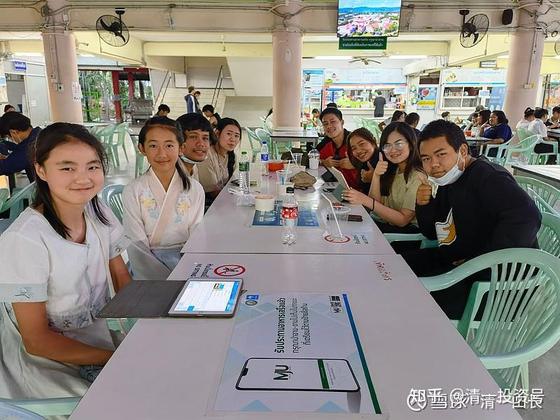
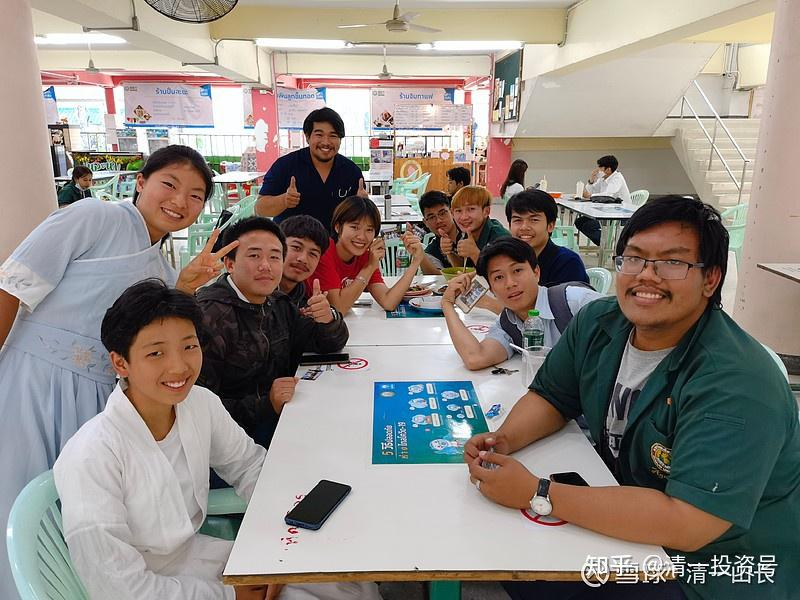
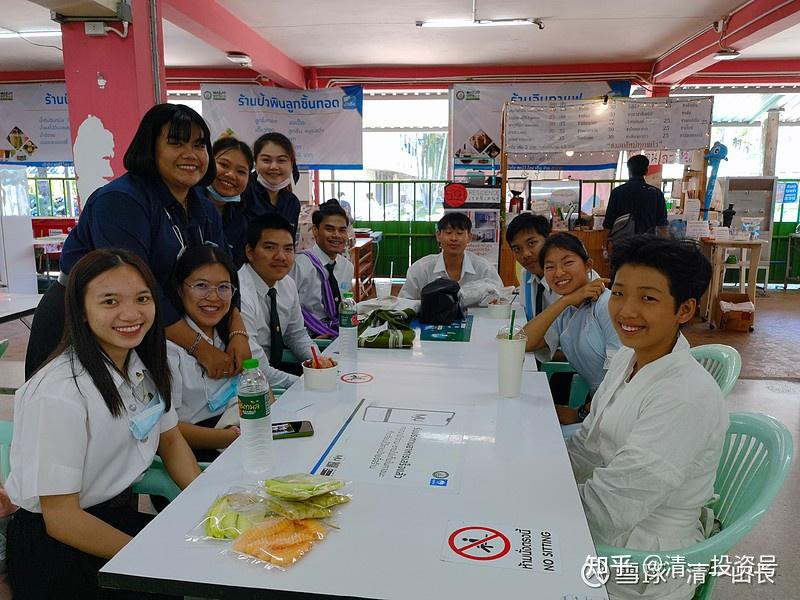
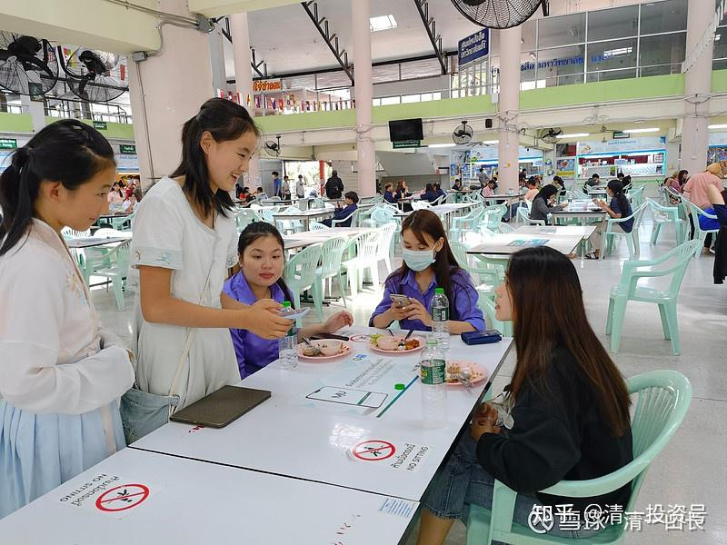
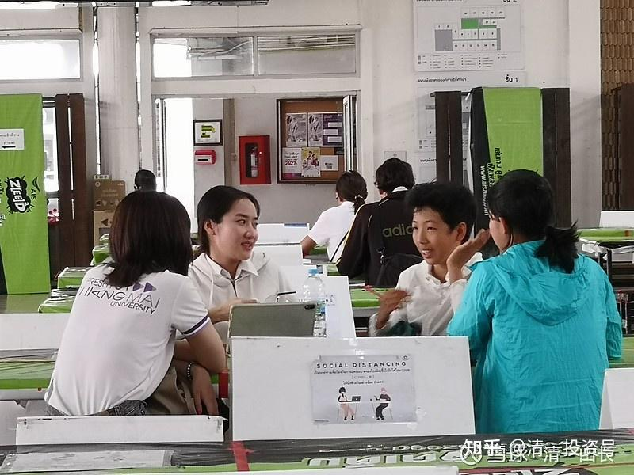
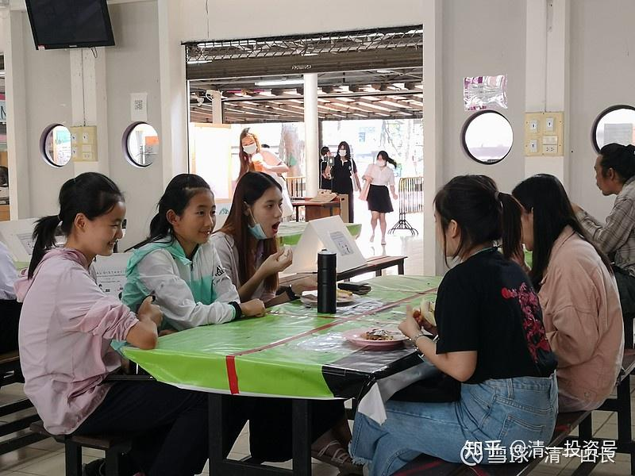
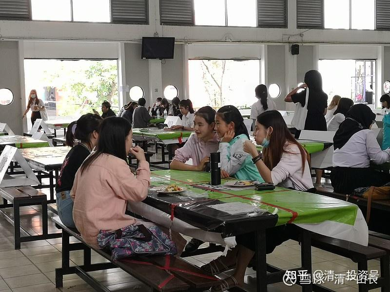

原雪球专栏[104篇.在泰国过春节：请300个大学生吃饭](http://link.zhihu.com/?target=https%3A//xueqiu.com/9310099567/171701695)

清一山长 2021年2月12日

**我们来到这个世界上，不是为了得到什么，而是为了创造什么！**

春节，并不必然是一个消费的日子。它也可以是一个建设的日子，甚至是最好的建设日。借助浓浓的节日气氛，人们友好的情绪，可以让我们的人生，获得更大的收获，而**人生最大的收获，就是被人喜爱、受人尊重！**这就是**“人脉”——不是指你认识的人有多少，而是有多少人喜欢你、尊重你，真心佩服你！真心喜欢你！只有这样的人，才算是你的人脉。仅仅是“认识”，是没有用的。**

你能够通过每年的过节，都不断提升自己的“人气值”吗？如果你能够从小就不断积累你的人脉，等你长大后，会不会成为万人迷？你的人生，会不会比普通人更成功？这就是我教的**“人学”的要义——每一天，都要让自己成为更受欢迎的人。有荣誉、有尊严地行走在这个星球上**。而不是**如同动物一般的随机地生、随机地死，毫无痕迹地来了，又去了。这种庸人的一生，跟动物一样，除了生存和繁殖活动以外，没有留下更多的精彩，实在太没劲了。**

如果我们喜欢过节、喜欢请客、喜欢吃饭，如果我们只顾自己使劲吃，真的就变成猪了。我们来到地球上，并不是为了得到一些食物。我们请客吃饭，是为了传递我们的善意和友好，干嘛不把善意和友好，传递给更多的人？传递给不认识的人，甚至传递给异国人呢？

**当我们送出礼物，我们自己就得到了礼物；**

**当我们送出善意和友好，我们就得到了善意和友好；**

**当我们送给别人智慧和尊严，我们就得到了智慧和尊严。**

多年来，中国人在泰国人心中的形象，就是“有钱的土豪”，贪婪、喜欢购物、好吃、好色。也许很多旅游者，的确就是这样的形象。给泰国人造成这种印象，也不奇怪。

泰国的华人，过春节也喜欢吃。我看一些华人餐厅推出的春节豪华大餐，数万元一席，在泰国，几乎可以让普通人家吃一年了。

我们家在泰国，肯定算是“有钱人”一族了。我们要去跟泰国的富豪们，比一比春节大餐的豪华程度，来彰显自己的档次与不凡吗？我觉得这太low了。我当然可以花上万元来吃饭。但干嘛都要吃到自己的肚子里面才算“赚了”？我完全可以用这笔吃一顿春节大餐的钱，去请300个泰国大学生吃一餐饭，建立他们对中国人的善意和友好的感情。我认为：得到这种善意，比让肚子里装满一些难得的，稀奇古怪的山珍海味、动物的尸体，会更有价值！

所以，昨天一大早，在替一对做企业的夫妻做完咨询服务后，我就带领四个小公主，去给泰国人拜年了——请大学生们吃一餐春节饭，传递中国人的善意和友好热情。表示：中国人的春节，是交朋友的时候，中国人很喜欢请朋友们吃饭。由于我们在泰国生活，也想请泰国朋友吃饭，请大学生们赏光，一起来庆祝中国的春节。孩子们也表示：希望成为大学生们的朋友。我对小女儿说：大学生从来不喜欢跟比自己小的孩子做朋友。12岁的小朋友是很难赢得大学生尊重的。除非你拥有比他们更厉害的本事，他们佩服你，才有可能成为你的朋友。如果你真的拥有了一堆大学生朋友，你就创造了一个新的人生记录。我要她们四个人，创造“一个春节交到300个大学生新朋友”的纪录。为她们在泰国的“明星”生涯，网红身份，开启一个靓丽的起点！结果，孩子们高高兴兴的换上汉服，去交朋友了！昨天大年三十，去她们经常去玩的梅州大学，交了97个朋友。并在脸书上成功增加了67个泰国大学生好友。

这件事情（请客吃饭），看起来简单，其实很不容易。

**在中国，似乎很多人看到有便宜，有免费的东西，就会一拥而上**。但**泰国是佛教国家，相信因果，这里的文化是不占别人便宜，不贪图别人的好处**。特别是大学生自尊心更强，所以，要请大学生白吃一顿，难度颇高。小公主们刚开始颇为艰难，很费劲才勉强被接纳。我就教孩子们“话术”，怎样入手建立朋友关系，友好的关系。让大学生们猜她们是哪国人？为什么她们不能是泰国人？难道泰国人穿上外国服装就变成外国人了吗？难道外国人的泰语可以说得跟她们一样好吗？为什么不听语言的表达，而要看衣服和外表呢？最后，大学生都被她们弄糊涂了，真的觉得她们就是泰国人。还坚持认为她们是“泰国北部人”。因为她们发音是泰国北部口音。的确，她们生活在泰国北部。最后告诉大学生们，她们其实是中国人的时候，学生们真的大吃一惊：怎么泰语这么地道？跟本国人一样。多交流一阵后，发现我们的孩子不仅仅泰语好，英语也很好，秒杀她们的英语学霸。还有很多他们想不到的本事，比如从后面把脚掌放在自己的鼻子上等等“杂技动作”。泰国大学生们看她们做得这么容易，就去模仿她们的动作。这时候却笑话百出，让大家都很喜悦。最后，大家已经是朋友了，再告诉大学生们：今天要请他们吃饭。因为这是爸爸妈妈给他们今天的任务，是要请100个朋友吃饭，希望他们愿意成为自己的朋友，愿意接受她们的邀请，帮她们完成任务。当然，如果是这个理由，泰国大学生们就很愿意帮助人，也很愿意做她们的朋友，也愿意接受吃饭的邀请了。毕竟，她们也很难得有一个“外国朋友”，还精通她们的语言，可以在一起讲笑话玩的很开心。

由于语言障碍，泰国的普通大学生，也无法和外国人建立深入的关系。虽然泰国的外国人很多。但其实大多数外国人并不会认真学泰语。泰国人的外语水平也很糟糕。**泰国大学泰语专业的中国学生，学了四年依然水平很差，无法和泰国人交朋友的，依然是独来独往，真的很可怜**！我培养的学生，将改变这一状态：她们未来进入泰国大学后，将成为大学的明星、中心，而不是边缘人的“国际留学生”。靠的就是她们能够迷惑泰国人的接近母语的泰语能力！

上次去律师行，我的15岁小公主做我的翻译。告别的时候，泰国律师说：“这孩子，是泰国人吧？泰语这么地道。”我说：“其实她的中文，说得才更地道[大笑]。因为她是中国人。”但至少说明了孩子们的泰语能力，已经让泰国的律师分辨不出来与本土人的差别了。

看看这些照片，气氛很和谐吧？

今天是大年初一，一大早，孩子们早早就出发了，今天一天，是去泰国排名第三，北部排名第一的清迈大学交朋友。为了完成交300个好友，请300个大学生吃饭的任务，她们也是拼了。还是我最划算，只是出钱，就办了这些差事，太轻松了。当然，我还要全程指导她们社交技术、话术，以及选择的智慧。比如不能去选两人世界的情侣交朋友，会被视为打扰的。孩子们每一次交往下来，得失成败，都习惯来找到我汇报刚才的交际情况，然后我帮她们矫正交往的语言、沟通方式，结果就越来越好。后来发现孩子们融入越来越好，刚开始的生涩已经变成了熟练和喜悦。她们也把我们学校的泰语表演视频，以及她们唱的泰语歌，拿来请新朋友们点评，每次都让大学生们开心大笑。泰国人特别喜欢清一塾表演的泰语版灰姑娘中的“后妈”角色，觉得特别喜欢她，很酷的样子。

哔哩哔哩网页链接：[公主小剧场#1：泰语版《灰姑娘》by 清一学塾](http://link.zhihu.com/?target=https%3A//www.bilibili.com/video/BV1vZ4y1g78p)

[https://www.bilibili.com/video/BV1vZ4y1g78p](http://link.zhihu.com/?target=https%3A//www.bilibili.com/video/BV1vZ4y1g78p)

这就是**我们过节的方式——把自己作为一份礼物送给世界**。供大家参考。您呢？还是跟酒肉和酒肉朋友混在一起吗？您的春节金钱和时间的投入，让自己得到更多的人脉机会了吗？您是否获得了更多的喜欢和尊重？[笑]

**参考链接：**

[清一投资号：7篇.为何要让孩子在12岁前就深度掌握四国语言？](https://zhuanlan.zhihu.com/p/535444843)

[清一投资号：15篇.九岁才开始学中文，来得及吗？](https://zhuanlan.zhihu.com/p/537104507)

[清一投资号：30篇.四年读完四所大学，四个专业？我女儿的新教育规划](https://zhuanlan.zhihu.com/p/541457282)

[清一投资号：33篇.家长为啥每天都要给孩子吃](https://zhuanlan.zhihu.com/p/543096364)

[清一投资号：35篇.在泰国送口罩和中药给当地人](https://zhuanlan.zhihu.com/p/543135963)

[清一投资号：39篇.值得所有家长看的纪录片：反省吧，家长们！](https://zhuanlan.zhihu.com/p/545526875)

[清一投资号：43篇.祝你生日快乐！这碗世界最毒的鸡汤！](https://zhuanlan.zhihu.com/p/546933251)

[清一投资号：45篇.小女开始赚泰国人钱了：收天价学费！](https://zhuanlan.zhihu.com/p/546934508)
