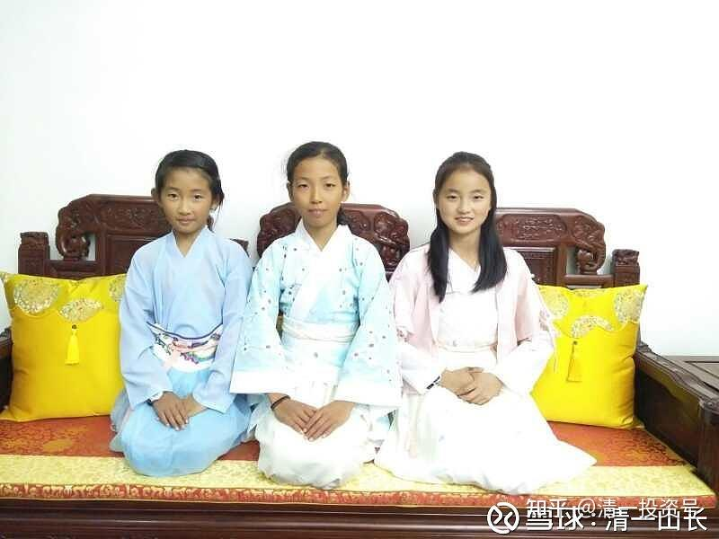

原雪球专栏15篇.为何要让孩子在12岁前就深度掌握四国语言？

清一山长2017年11月12日

（上图就是我孩子与她的同学在一起，两个三语人才，一个双语人才。目前正在学中国武术专修，她们都“很中国”，穿的是中国的汉服喔！不是日本的和服，大家别误会）

在中国，很少听说学生有什么“多国语言人才”，连弄出双语能力，都很不错了。但在外国的精英社会阶层，很多孩子掌握多国语言能力，这似乎是一种很正常的，很必要的技能。

但在中国，如果说某个家长的教育计划，是让自己的孩子12岁就熟练掌握“四国语言”——3+1语言模式，就是“三国母语加一国外语”的语言强势组合，会让很多人认为是幻想的。我就是这样的“幻想家长”。

当然，了解我的人，就知道我的计划并不是幻想，而是很容易实现的“现实”。我的小女儿虽然年仅9岁，但已经掌握了三国语言，都还比较熟练，能够在生活中应用。其中英语和汉语都是“母语水平”，而且她的英语能力比汉语更好。我跟她讲中文课程的时候，一些较学术性的词汇她不知道含义，我用英语词汇来说，她就懂了。所以，有时候我有点像是给外国学生上课。她在泰国国际学校的时候，被美国的孩子质疑：“你真的是中国人吗？真的很不像。”问她不像中国人，像什么国家的人呢？说她应该是美国人才对！因为她说的美语太标准了，而且很熟练，不像是外国人说的英语。也就是说，她的英语基本上实现了“母语水平”，是能够直接用英语思维的。只是她的三国母语还没有实现，因为她学习泰语的时间不长，目前只是“能够用”的水平，很容易被泰国朋友发现是“外国人”——虽然语音也很标准。但由于词汇量和语言表达模式还很“不泰国”，阅读上也有一些障碍,所以三国母语有待实现。

由于我们目前生活在泰国，我专门请了一个泰国人来做“家庭助理”，主要目的就是天天和孩子们生活在一起，帮助她们熟悉和应用泰语。三年后，她12岁了，讲的泰语要达到接近母语的水平完全没问题，应该会比同龄的泰国学生甚至会更好一些（其他人学习基础不一样）。这时候，完成了三国母语的学习，她就该学习“第四国”语言了。我目前计划选择的，是一种欧洲国家的语言——西班牙语。因为这是除了汉语以外，作为母语来使用的人数最多的语言。也是除了英语以外，使用的国家最广泛的语言（全球语言第二名）。南美洲国家基本上都是使用西班牙语的。学完后，她的语言能力，应该就是“三加一”模式，或者三加N模式。不过，她的西班牙语，应该就是“外语”了，不指望她能够达到“母语水平”了，因为年龄到了13岁以后学的外语，都不可能达到母语水平了。一般沟通问题不大。如果愿意，还可以学习更多的语言。不过，12岁以后是思维能力大发展的时候，用来学习外语就太亏了。她还要学习很多重要的课程内容，文史哲，数理化，武术功夫等等。所以，应该不会用来学技术含量不太高的外语了。

这就是我认为未来的精英国际人才需要的“基础教育搭配模式”。我相信，仅仅是掌握了这种熟练的“四国语言能力”，外加15岁开始一年学完9年～12年的数理化等课程，以及拿到中国全国武术比赛的金牌，参与各种公益活动的经历和成绩，就足以让她可以很轻松地进入世界各国的名牌大学了，包括美国的名牌大学在内。恐怕大家也都容易认同：从小就拥有这种语言能力特别训练的人，一定是接受了非常精良的小众教育。想要通过SAT(美国高考），或者达到英国的雅思八分，完全就是轻而易举的。即使是在美国，这种学生也很稀有了。

换句话说：中国的家长都在拼奥数，拼分数，拼学区房。我跟这些家长的孩子拼“多国语言能力”，拼“社交能力”和“生活能力”，拼身体的“强健灵活”。你们估计世界的名牌大学，会更喜欢选谁入学？她们未来的发展谁更通畅？

目前，成批量地教育出我们这种“四国语言小孩”的学校，恐怕全世界都还没有。但这种人才，显然比工程师更为稀缺。当然，也更难通过传统的学校教育出来。这必须是小众精英学校进行特别教育的结果。要实现这个目标也不难——只需5岁入学，12岁就可以像我的女儿一样，实现“四国语言完美沟通”了。只需七年，并不长。12岁以后，强化数理化和其他知识面的学习跟进，事半功倍。

12岁之前学外语，孩子很轻松，效果很突出，顺便还教了很多知识。所以我认为语言的学习（包括语言思维和相关的文化知识学习），是12岁之前的重点学习内容。但是目前国内的很多学校，会花上20年的时间，都教不好一门外语。因为与我们的教学设计不同。我们**用孩子12岁以前的“黄金语言学习期”，好好地学了四门语言，再用逻辑理性的思维黄金期（12岁以后）轻松突破数理化，以及其他课程**。这就是帮助我们的孩子，驾驶汽车去跟只会用脚跑步的人比赛，最终的比赛结果自然毫无悬念！

当然，现在人工智能时代，您会认为“翻译机”可以去代替翻译人才，不需要去学外语了。其实，这就不明白我们的外语教学目的了：**我们的孩子学外语，是为了“深度沟通”，不是为了“简单翻译”。人工智能时代，人与人之间的“深度沟通”才是最稀缺的本事。**仅仅是翻译，简单的信息转换，已经没有什么技术含量了。这就是我要求孩子，**现在学一门语言，都必须达到“母语沟通交流水平”，才有意义的原因。**所以在第三国母语没有实现之前，不会开始安排学习“第四外语”的。我们的孩子将来面临的国际精英社会，**在人际沟通协调中，只有面对面的语言沟通，才是最佳的沟通方式。**如果拿上个**机器，可以翻译语言，没有办法翻译“文化”和潜意识。**这种沟通是不够有效的。想一下，如果您的孩子将来参加国际会议，甚至受邀请去某国际俱乐部的私人宴会，你拿着一个翻译机来和宾客交流，来和比尔·盖茨、巴菲特谈话，您有没有“精英感”？还会被当做“世界精英”吗？就算是，也有点“土”吧？

翻译机的出现，正好说明了目前国内学外语的模式是基本上没用的。国内不讲“语言沟通”，只关心翻译和语法以及考试——国内学多年的外语，也不能实现流畅沟通。所以，国内的学生学习的外语，才是最容易被翻译机代替的无用技能。**外语，要么不学，要么好好学，深度掌握。**

我认为，我设计的这一条精英教育的路线，将成为未来教育的典型范例。当然，普及的难度也很高。普通的学生一生连学会一门英语，都很不容易了，更别谈什么掌握多国语言了。将来，普通学校的学生，面对这些“国际化生存”的学生，在竞争中不可能拥有什么优势。这就是我们作为父母的，给孩子最好的礼物——给予孩子成长的机会。

转发部分内容：[@伍治坚](http://link.zhihu.com/?target=http%3A//xueqiu.com/n/%25E4%25BC%258D%25E6%25B2%25BB%25E5%259D%259A)

那天和一个英国朋友谈到新加坡的小学分流制度。我告诉他，新加坡小学从二年级开始就进行分流，成绩好的进快班，成绩差的进慢班。

他说，英国的私立学校也是这么做的，二年级左右开始分快慢班。但是公立学校不这么做，所有的孩子混在一起吃大锅饭。因此有些家长去学校抱怨，说班上成绩差的孩子拖了教学进度的后腿。然后又被其他家长怒怼：“有本事送孩子去私立学校呀！”

博比是我的一位非常要好的英国朋友。那天我们俩聊天，谈到英国的小学教育。他的两个孩子都在私立学校，每个孩子每年的学费大约3万多英镑。我问博比：“你孩子学校里那些家长都是些什么人？他们都很有钱么？”博比说，有一次我儿子被他同学邀请去参加生日派对。他同学的老爸在一家叫做高盛的银行工作，大约45岁左右，是合伙人。博比一家刚走进那个高盛的哥们家里，就看到三辆车，奥迪、保时捷和奔驰。房子有三层高，让人感觉像座宫殿。高盛哥们身高2米左右，非常健硕，和他那20多岁的金发娇妻在门口迎接客人。

后来高盛哥们告诉博比，他刚在房子上花了接近100万英镑进行装修，夫妻两人特地飞去意大利选的大理石地板，飞去挪威选的家具。

我问博比，读私立学校真有这么好么？他说：“是啊，我从小就是读私立学校长大的。我周围的朋友，几乎全都考进了剑桥、牛津、伦敦经济学院和美国的一些名校。在我看来这一切似乎都理所当然。”

山长 清一 15:39:17

**我的解读**：这就是阶层分化现象。我在泰国，也发现阶层分化很严重。这种分化，可能是长期平层化的中国人，唯一不熟悉的生活方式“领域”。很多人心理是没有这个概念的。以为机会，对所有人都是一样的，其实不是。以后，看起来很平等的市场竞争条件，也许赢家却总是一些从小就得到了最良好教育的人取得。

但是，在中国，这个阶层分化已经开始了。比如，假如一个小孩10岁就突破了外语，12岁就掌握了三国语言，三国语言基本都接近母语沟通的自然流利的水平，15岁就已经在多个国家生活和学习过，参与过其他学生没有参与过的学习和竞赛项目（比如一年突破9年的数理化等，拿过全国武术比赛的奖牌等）。这样从小就享有的国际化精英生活和教育方式，会让她从小就获得超越同龄人的自信和能力，会很容易地让她在初中和高中成为佼佼者，很容易让她考上名校。这种竞争力，你的孩子如果上普通学校，拼死了也拼不赢的，不是靠不睡觉，死记硬背就有希望，这是一点希望也没有的竞争。

今日学堂目前正在示范这种国际化的精英教育模式。这种模式固然需要拼爹（如果爹妈人脉不够，连申请入学的门都找不到）。不仅拼爹，同时孩子还要自己拼，且缺一不可。中国父母总以为可以代替孩子拼，自己成功孩子就会自然成功。其实这种父母，只会培养败家子。**成功的父母，只是有能力为孩子找到拼的方向和优质平台罢了。**
