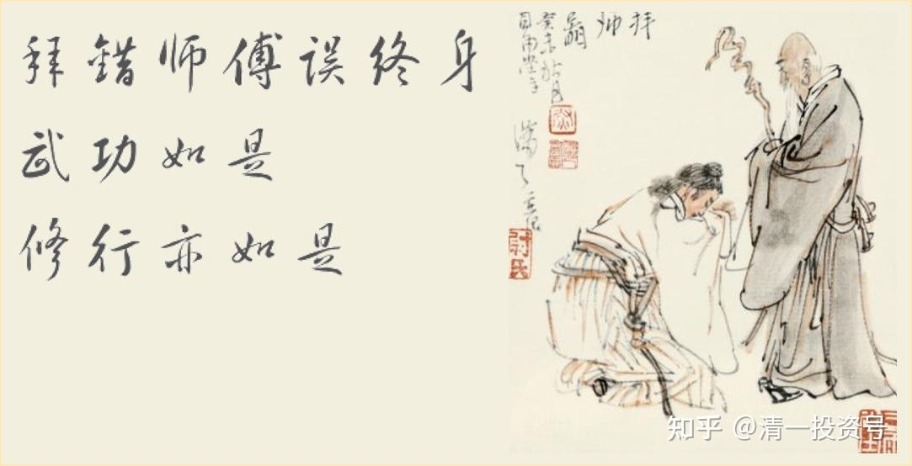

15篇.武道论之三：拜错老师误终身

清一山长 2021年4月7日

清一山长雪球非专栏帖子整理文章，第15篇《武道论之三：拜错老师误终身》

此文整理自山长专栏文章《[实战太极与现代格斗之谜1：发力技术！](http://link.zhihu.com/?target=https%3A//xueqiu.com/9310099567/176335637)》[https://xueqiu.com/9310099567/176335637](http://link.zhihu.com/?target=https%3A//xueqiu.com/9310099567/176335637)的跟帖评论

[Allin的融资之路](http://link.zhihu.com/?target=http%3A//xueqiu.com/n/Allin%25E7%259A%2584%25E8%259E%258D%25E8%25B5%2584%25E4%25B9%258B%25E8%25B7%25AF)回复[清一山长](http://link.zhihu.com/?target=http%3A//xueqiu.com/n/%25E6%25B8%2585%25E4%25B8%2580%25E5%25B1%25B1%25E9%2595%25BF):

只说一句话，用掌打人的话，不存在用肩发力或腰发力，或腿发力了，是无需借助外界支撑的，利用自身骨骼、肌肉产生的二争力发力，这是内力，与运用肌肉的发力是完全不同的，这是功夫，是要练出来的，不是读懂了古拳经就会使用了的。

[20221-4-07 09:46](http://link.zhihu.com/?target=https%3A//xueqiu.com/9310099567/176449154)[清一山长](http://link.zhihu.com/?target=https%3A//xueqiu.com/9310099567)回复[Allin的融资之路](http://link.zhihu.com/?target=http%3A//xueqiu.com/n/Allin%25E7%259A%2584%25E8%259E%258D%25E8%25B5%2584%25E4%25B9%258B%25E8%25B7%25AF):

您理解正确，看样子是懂拳之人。

的确不是传统和习惯的发力方式，是要使用你说的“二争力发力”。也叫“爆炸力”，从内向外同时的发力。“上要发冲冠，下要足入地”。不过这还不是真正的“内力”，依然有力学依据的。只是有的武师会用“内力”来忽悠外人。

**内力，是更高级的力，一般几年之内，是练不出来的。**

多年前，我遇到一个会这样发二争力的内家高手，我一碰他的手，就失去重心。我觉得他简直力大无穷，跟他对敌，根本就下不了手，我只有挨打的份，就像不会练拳一样。他说，他练的就是“内力”。问他如何练内力，支支吾吾，故做高深，一副“怎么可能告诉你”的样子。但我认真观察他的动作，看他跟人对打，过招的表现，特别是发力，发现了他发力的核心奥秘，就说他使用某某部位发力的。他大惊，赶快跟我说：“不许告诉别人。”从此再也不在我面前演练武功了，还让认识我的人不许把他练的武功告诉我。

他在找我，帮他招弟子呢！因为现在没啥人跟他系统的学习，业余教教少儿武术培训玩，赚点小钱。我已经帮他找好了弟子，是现在上明师荟，两个挑战3700万大学生的弟子之一，认他做武老师，做他的弟子。我这学生，很想学真功夫，但看到这师傅对我的这种态度，知道他绝对不会教给她真功夫的，就自己放弃机会，不去了。说去了肯定学不到真功夫，不如在我身边学。好像她的判断是对的。

他的一个弟子，是我的好朋友，体院的教练，一直痴迷传武的。自己的师父去世后，就跟他学武功，已经学了快20来年了吧？对他像父亲一样尊重。这位朋友是一位武痴，今年快50了，为了练武，一直没有结婚。

我经常会跟我的这位朋友过招切磋武功，探讨武道。每次见面就是讨论中国武道，有一次还遇到了香港国际武术大赛的老板，举办人，就是他的老同学。他说中国武术不是现代格斗的对手，只能当艺术品看，我们两人还跟他辩论了一场。

前两年，我去武汉体院，我们依然继续过招。他每年都在长进，勤练功夫。我们双手一碰，他连续变劲。一般人就封不住他的手，我封得好好的，让他抽不出手来。

我对他说：“你身上没有你老师的功夫，我跟你老师对招的感觉，完全不一样，他没真教你。”

他不相信，说每年都跟老师学习，过招的，他很认真地教了很多东西。我说：“肯定教了一些招数，但没教最核心的功力，发力方式。不是真教，是假教。”

他还是辩护：“功力是练出来的，不是师父教出来的。”

我真心佩服他对老师的忠义。老师的儿子，他帮忙弄到了体院，在他身边管着，给出路（武术界的人知道，这个机会难度巨大。武校人最盼望的“光明出路”）。他20年来对老师都很恭敬，但这老师，依然没教他真功夫，只想留给他儿子吧？但儿子不认真练。此人一死的话，他的功夫铁定失传。只留一些招数，以及他打人的传说。

其实，当年我知道这个部位发力，就是看的古拳经说的。只是没看到有人练出来过，在他身上看到了而已。当时看到了他的动静，就想起来拳经说的。原来看拳经，觉得古人是不是乱说，故弄玄虚，这个部位，怎么可能把力量发到手上呢？看到了，就知道古人诚不欺我。我潜心去练，也练出来了。这说明，看拳经，是可以学会的。不过一般人还是需要师傅指点练的方法。没有方法，一般人不得其门而入。少数人可以“翻墙”，我是会“翻墙”的人。

现在，我的弟子们跟我对打，也一样结果：觉得我力大无穷。平时多大的力气，跟我一碰就都用不上了，一接手身子就发软。因为我已经学会了这种发力。外人看会觉得纳闷：怎么就像是弟子在配合老师一样，任人打？手都不还？其实是一碰手，就失去了重心，学生们自然没有还手的余地，像是没练过拳的凡人一样。

这就是“二争力发力”，这就是太极的奥秘。我的弟子们也正在学这种发力方式，我要求他们要学成了，才可以上现代格斗的擂台，不然出去就是丢人的。没功夫，不会发力，再漂亮的动作也是“银样镴枪头”。

**清一武道馆的学生，每天勤奋练习传武武术，不是靠志气、理想，不是希望用幻想来捍卫传武，来赢现代格斗的，他们是看到了真东西，体验了真东西。这种东西，是现代格斗没有的，是拳击无法对付的，所以他们才有信心来练传武，才敢说要去拿世界冠军。**

当然，**要练出来也不容易，一路血汗拼过来的。三年是最起码的底线，也许有人要练十年才能出来，甚至一辈子出不来。**

[ellhll李华丽](http://link.zhihu.com/?target=http%3A//xueqiu.com/n/ellhll%25E6%259D%258E%25E5%258D%258E%25E4%25B8%25BD)回复[清一山长](http://link.zhihu.com/?target=http%3A//xueqiu.com/n/%25E6%25B8%2585%25E4%25B8%2580%25E5%25B1%25B1%25E9%2595%25BF):

太赞叹山长的学习之心了！也赞叹山长朋友对师傅的忠信。即便好朋友告诉他真相，也始终维护自己的老师。这样信师的人，天道会还他的。我愿意这样相信。

[2021-4-07 15:39](http://link.zhihu.com/?target=https%3A//xueqiu.com/9310099567/176493995)[清一山长](http://link.zhihu.com/?target=https%3A//xueqiu.com/9310099567)回复[ellhll李华丽](http://link.zhihu.com/?target=http%3A//xueqiu.com/n/ellhll%25E6%259D%258E%25E5%258D%258E%25E4%25B8%25BD):

佛经故事说：阿难的师父和自己修的功劳算多少比例？佛说，**99:1**。因为没有老师，你再勤奋也学不出来。当然，有老师，你不勤奋也学不出来。

我这朋友，我真心惋惜,他已经学不出真功夫了。

他这一生爱武，但留在体制大学当武术老师，被体制害了，养成了体制武术的思维惯性。又被江湖武师忽悠，偏离了武功的正道，相信奇特的招数才是武功的秘密。他认为武学的核心就是各种套路动作，他每年假期自费到处找民间高手，学了很多东西，以为堆起来就可以大成了。其实已经被耽误了,多年前，我不是他对手。前两年，基本打平手。可我是业余的，他是专业的。他的问题，就是老师没教他真东西,舍不得教。虽然他接触的老师，是有真东西的。

**信师没错，但老师不真心教，你信了也白信的，越信还越麻烦。不如信“读古书”更靠谱。**所以，我认为江湖武师，忽悠了一大批热爱传武的小白。**害传武的人，就是传武人。**

**学佛也一样，很多人问我修习佛法，我说读佛经，照着做就可以了。**但他们就是不信，要到处找老师去拜。

结果，一个很不错的小伙子，原来跟我学不满足，去外面拜师，学佛。最近号称自己已经学成了，自己拿屎来吃。还说“自己已经得道了”，已经修成了“无分别心”。都学疯了。这样学佛学废掉的，还有几个武大我原来的学生。

我一个中学同学的朋友，拜了西藏的密宗大师。现在也神神叨叨的，家里完全乱套了，一家人都完全的不正常。

**现在心邪的“老师”太多了，武功如是，修行也如是！拜错了老师，误终身！**

江湖上的武师，我见过的太多。功夫比我高的人有，但**像个老师的人，恪守师道的人，真没见到几个，我只见到一个**。所以，我一直说：“别乱找老师了，喜欢武术，不如去现代格斗拳馆里面练练。费用也不高，起码不是骗子。”

传武？想学去日本吧！现在中国，我也找不出人来推荐。有功夫也无师傅。未来，恐怕功夫也没有，师傅更没有。

未来，也许清一武道馆可以教教传武。看缘分了，看这批孩子出不出得来。

[ellhll李华丽](http://link.zhihu.com/?target=http%3A//xueqiu.com/n/ellhll%25E6%259D%258E%25E5%258D%258E%25E4%25B8%25BD)回复[清一山长](http://link.zhihu.com/?target=http%3A//xueqiu.com/n/%25E6%25B8%2585%25E4%25B8%2580%25E5%25B1%25B1%25E9%2595%25BF):

谢谢山长。看完只能叹气。好学生找不到真老师，好老师找不到好学生。这是世风日下、人心不古？还是天命？

记得山长好像说过，天命不可违，就像美国不想中国起来，但是天命就是在中国这边。

是不是天命，就看武道馆的少年了。感谢山长，担起中华传武的重任！

[默默不得闲](http://link.zhihu.com/?target=http%3A//xueqiu.com/n/%25E9%25BB%2598%25E9%25BB%2598%25E4%25B8%258D%25E5%25BE%2597%25E9%2597%25B2)回复[清一山长](http://link.zhihu.com/?target=http%3A//xueqiu.com/n/%25E6%25B8%2585%25E4%25B8%2580%25E5%25B1%25B1%25E9%2595%25BF):

高手在民间！太极确实是一门高深的内家功夫，电影里面包括现在很多练的都不是真太极拳，只是体操。而真正的太极拳在民间永远不会断掉传承，因为它正像楼主所言，发力是从地上起来的，用的是整体的劲路，全身筋骨必须练得很柔软，这样发力才能不受伤，所以训练起来的难度可想而知，而现代格斗搏击只是取了一部分东西来学练，练好三板斧打一般人也是跟玩一样了。

[2021-4-07 09:55](http://link.zhihu.com/?target=https%3A//xueqiu.com/9310099567/176451085)[清一山长](http://link.zhihu.com/?target=https%3A//xueqiu.com/9310099567)回复[默默不得闲](http://link.zhihu.com/?target=http%3A//xueqiu.com/n/%25E9%25BB%2598%25E9%25BB%2598%25E4%25B8%258D%25E5%25BE%2597%25E9%2597%25B2):

“真正的太极拳在民间永远不会断掉传承”­——您太乐观了。现在已经断得差不多了。

你看徐冬瓜骂太极骂得多难听，有谁出来捍卫荣誉了？因为根本就没人了。中国的传武，这样下去，最多20年内，就全断了，连一点老根都不留了。

现在都是举国体制，哪里还有啥“民间”的空间？原来是有的。

我知道的老武师们，有点功夫人，身边都没人学这些东西，都去考学校，上体制了，从义务教育开始，就不再有民间特色教育的空间。中国大地，现在全是体制，哪里还有“民间”？

**我的人，如果练不出来，20年后，中国就是“消逝的武林”。中国人，不再有传武**。中华传武，将来就只有日本才有了。

参考链接：

[山长 清一：实战太极与现代格斗之谜1：发力技术！](https://zhuanlan.zhihu.com/p/362455647)（专栏文）

[清一武道馆：传武杀人技？太极不出门？](https://zhuanlan.zhihu.com/p/354643954)（专栏文）

[清一武道馆：真被“武术界，国术界”给恶心到了！](https://zhuanlan.zhihu.com/p/357918131)（专栏文）

[清一武道馆：实战太极与传武高级黑！是实话，可真相是这样吗？](https://zhuanlan.zhihu.com/p/355026610)（专栏文）

[138篇 实战太极与现代格斗之谜1：发力技术!](http://link.zhihu.com/?target=https%3A//www.ximalaya.com/sound/488865125)（音频）

[哔哩哔哩：实战太极与现代格斗之谜1：发力技术!](http://link.zhihu.com/?target=https%3A//www.bilibili.com/audio/au2820089)（音频）
