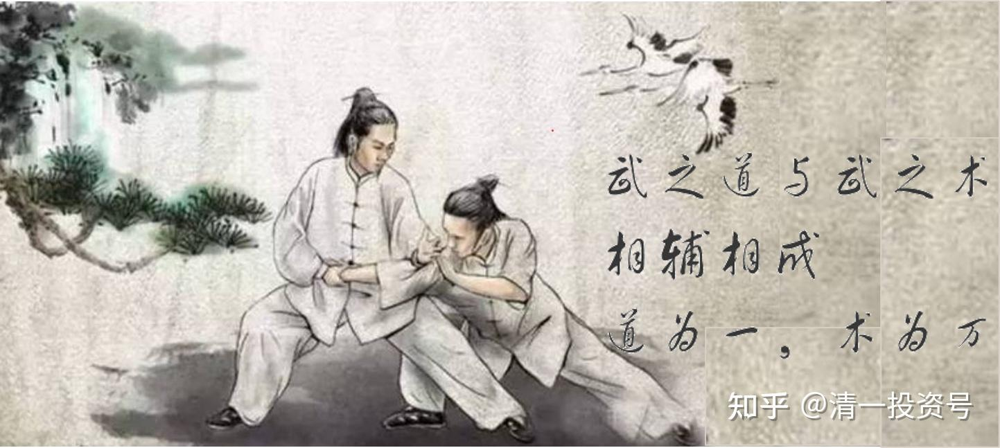

16篇.武道论之四：文武合一，道术合一，不忘初心

清一山长 2021年4月6日

清一山长雪球非专栏帖子整理文章，第16篇《武道论之四：文武合一，道术合一，不忘初心》

此文整理自山长专栏文章《[实战太极与现代格斗之谜1：发力技术！](http://link.zhihu.com/?target=https%3A//xueqiu.com/9310099567/176335637)》[https://xueqiu.com/9310099567/176335637](http://link.zhihu.com/?target=https%3A//xueqiu.com/9310099567/176335637)的跟帖评论

[ellhll李华丽](http://link.zhihu.com/?target=http%3A//xueqiu.com/n/ellhll%25E6%259D%258E%25E5%258D%258E%25E4%25B8%25BD)回复[清一山长](http://link.zhihu.com/?target=http%3A//xueqiu.com/n/%25E6%25B8%2585%25E4%25B8%2580%25E5%25B1%25B1%25E9%2595%25BF):

感谢山长分享。

山长的长文，一般情况下，时间零碎，我先不读，等有一整块的时间了，才好好看。今天的这篇专栏是我学得最久的一篇。内容实在是全面精彩，读起来像是参加一场武林大会，不知道山长要用多长的时间来写这篇文章。这么详细，逻辑分明，即使我不是练武之人，读完之后也基本了解普通人、现代格斗、真太极的不同发力技巧和由此产生的不同力量、速度、结果。

在消化理解的时候，我就想，难怪山长说真正练武的人思维一定不差，这样练真太极，思维不行，脑子转不快，真没法练。

我作为读书人来理解文章，要用两三个小时，非真练武人，能看懂这篇文章吗？有耐心看完吗？如果能，没道理不折服于这份分析。有练武基础的人，更该是如获至宝、寻得高人一样欣喜。所以我想，在帖子底下喷山长的人，应该是没有看完，也没有看懂，就是扫了几句话，觉得和自己知道的不一样，就开始攻击了。**无知而扮全知，损害的不是别人，是自己。**

我习惯边看边划重点，贴出来，没耐心看完全文或是看不懂的，可以看一下这个摘录。

1.**本文是百年来第一次明明白白地分析中华传武和现代格斗实质区别的第一文**。（这篇文章之于中国传武的价值，可以相当于山长《给100年后代子孙的一封信》之于教育的价值）

2.中止武林中争论的传武能不能打的核心问题——能练出超越现代格斗的发力，就能打，练不出，就不能打。

3.练真武，必须弄清楚发力的问题。真太极，更要谈发力技术。

4.没有练过拳的人，力量是以肩膀为基座，用手臂来发力出拳的，力很小，累人。

5.实战能力的传统武术，现代格斗拳派的发力技术，以腰胯部为支架来发力。双腿支撑胯部，然后脚蹬地，转胯，转腰，摆肩，抡手臂，把拳头像流星一样重重地抡出去！这种力量比以肩膀为支架的强十倍左右。

6.双腿支撑发力的技术，是现代格斗的基础。练出了一个稳定的发力支架，就是高手。

7.重拳，是放在后手，后手直拳，或者后手摆拳。

8.善于肩部左右摆动的拳手，就是训练有素的高手了。一力降十会。

9.《叶问》中的咏春快拳为了速度、牺牲了力量。常见的一些拳师的招数没有攻击力，不敢真打实战。

10.站立格斗中，拳击的直勾摆，是最实用的。关键是练出来多少力量和速度，不是练出什么怪招。

11.传武对决现代格斗要满足：发力技术、出击速度、身体的抗击打强度。如果这三项只是跟上现代格斗的水平和能力，传武就没传的价值，传武实际上发力技术、发力速度都超过现代格斗，所以它才值得去捍卫，去学习，去传承。

12.太极是慢练快用，积柔成刚，力量、速度不能超过现代格斗就不是真太极。

13.真太极一拳超过一百公斤的力量，手指骨无法直接承受，所以用掌发力，比如掌根、掌背来发力。其发力技术，与现代格斗术不一样。

14.现代格斗的发力技术，双腿站稳，身子转动，没办法用掌根去打人。

15.普通人的发力点是肩膀，手像绳子般柔软。

16.现代格斗的真正发力点是腰胯，腰部以上像绳子般柔软。

17.真太极的发力点放到了地上，整个人体像绳子，作为“鞭子”来使用。

三个绳子哪个长？现代格斗长于普通人，力量强十倍；那真太极长于现代格斗，力量该是后者的多少倍？

18.因此，真太极相比现代格斗有5个优势：

a)太极拳的前手刺拳可发出普通人的直拳、摆拳的力量。

b)太极拳的后手拳，可以发出更大的力量，实现更加隐蔽的后手攻击，更厉害的是，太极是唯一能双手拳攻击而力度不变的。

c)太极拳可以不收拳就出击。“不招不架，只是一下。犯了招架，就是十下。”

d)太极拳重大优点：速度特别快。

e)现代格斗，是移动，支撑好，然后发力；太极拳可移动中发力，可单脚发力，所以更灵活。

山长和武道馆的所有学生，非常肯定真太极的技术体系是先进的，是一定能够击败现代格斗的，所以愿意付出财力、精力、人力，垫上名誉，去捍卫、去传承真正的太极，真正的传武。

期待武道馆的学生出山的那天，一战扬名，向世界证明中华的真正传武。

[2021-04-06 22:14](http://link.zhihu.com/?target=https%3A//xueqiu.com/9310099567/176424836)[清一山长](http://link.zhihu.com/?target=https%3A//xueqiu.com/9310099567)回复[ellhll李华丽](http://link.zhihu.com/?target=http%3A//xueqiu.com/n/ellhll%25E6%259D%258E%25E5%258D%258E%25E4%25B8%25BD):

作为普通人，你真算有心的了。看文章看得很细，总结很到位。

我此文中讲的这些武学道理，绝大多数武师，一辈子都没悟出来，练了一辈子的傻拳，都不知道练的是什么！绝大多数的武术博导，也不明白这个道理。

这篇文章，是超越武术博士论文的水准。价值超高。主要是——必须是一个能够跨越文武，跨越古今的人，才能解读其中的奥秘。现在纯武之人不懂文，弄不清武学的道理；文人又不懂武，也弄不清武学的道理。特别是古拳经古文写的，很多人无法理解。所以这些技术基本上失传了。但我已经用现代方式解析出来了，懂了我此文中写的武学道理，很多古拳经，你就能读懂了。很多有心人，可以根据此文，大大提高练武的水平。

包括现代格斗也能从我的文章中学习和提高练拳的效率。今天我看拳击世界锦标赛女子冠军赛，水平真差。看起来很不专业，选手经常不护住头部，打击的力量也不大，速度也不快。特别是发力技术不顺畅，很多只用到肩部位置。遇到我的队员，她们会被轻易打倒的。不过我的队员是按照职业拳赛的要求来练习的，与这种世锦赛规则不太一样。似乎世锦赛为了安全，强调点数，不强调击倒技术。所以不重视发力。我看的顶尖拳击界的选手，都非常的善于晃肩，就是善于用腰的表现，今天看的两个场上的队员，都不会这个技术。所以打起来我认为没啥水平，有点乱打。这两拳手，如果看了此文，水平一定会提升的，因为知道要练什么了。

不过，要通过此文练太极，就别想了。除非有真懂太极的师傅指导具体的练法，一般人是不得其门而入的。就像是知道原子弹很厉害，原理也知道，但一般人真没有办法去造的。**这里讲的武功之道，对有技术的人有帮助。但道与术，还需要相通。**我指导学生们，就是依据以上文中之道，教他们武之术。两者结合，就可以成为高手。**武之道与武之术，相辅相成。道为一，术为万。**要练成此功夫，可以有很多的办法，不限制只有一种办法。我也在变化各种练习的方法，用她们最能理解，最有效的方式来练出来这种力量。

目前，三年练出太极劲，应该是一个全新的创造。一些老拳师一辈子都没练出来，虽然他们知道有这种功夫，也见过师父的示范，就是自己练不出来。所以，老师的价值是极高的。

其实，如果我来指导拳击运动员，也一样可以取得更高的胜率。大概率战胜很多专业教练员吧！自吹一下。当然，我就不去抢这个饭碗了。拳击圈内，要弄到个教练职位难度还是很大的，多少人争抢的位置。

我的清一武道馆，也有人专门练拳击，研究拳击、现代格斗技术的。并作为陪练与太极选手对招。并不是全部人员都练太极，只是大多数练太极罢了。我的武馆里面练拳击的人，根本不学我的太极。但练太极的人，必须要研究拳击，设法对抗拳击。所以我们会设对照组来研究。我认为：未来我们太极人，去拿拳击比赛冠军的时候，我们的拳击队员，应该也会获得不错的成绩。因为他们要天天和这些未来的世界冠军们打架，也差不了的。也会让他们的拳击技术更进步的。也许他们将来会去教外国人——怎样才能对付太极拳手？

[ellhll李华丽](http://link.zhihu.com/?target=http%3A//xueqiu.com/n/ellhll%25E6%259D%258E%25E5%258D%258E%25E4%25B8%25BD)回复[清一山长](http://link.zhihu.com/?target=http%3A//xueqiu.com/n/%25E6%25B8%2585%25E4%25B8%2580%25E5%25B1%25B1%25E9%2595%25BF)：

谢谢山长。

山长是这篇超博士武术论文的作者，肯定看到我的摘录1066个字，只有90个字左右是我的，其他都是山长的。所以，山长说我“总结很到位”说明两个问题

1.山长是真正的大师，能把高深的东西解读成门外的人都能理解。

2.山长的文章，不管多长，涉及的主题多专业，只要用心看，抓住主要的字句，就可以看懂。正如山长说的“不能超越现代格斗的太极不是真太极”，我们可以说“看不懂山长文章的用心不是真用心”。

看完这篇专栏，可以理解，很多练武的人，因为学识、修养不到，一般是看不来这样长篇的武学论述的，更别说写出文章来；而能写文章的人，又没有真正的武道实力。也**只有山长做到了文武合一，才能有此高价值的传武论文。**

此等武道，就算有缘看到，还不是都能练出来，因为没有武之术。正如“知道原子弹很厉害，原理也知道，但一般人真没有办法去造”。道为一，术为万，道术相辅相成，结合才能成就真正的高手。山长自己就是道术合一的高手，亲自指导学生，练出武功之术，才有可能做到“**三年练出太极劲**”，实现很多老拳师练一辈子都做不到的事情。所以说修道中的法、财、侣、地，首位是法，法的首位是师，明师。

记得山长在上一篇专栏《[股神之心与贫困之心：财富奥秘研究](https://zhuanlan.zhihu.com/p/464348215)》中说到：**巴菲特更难得的，不仅仅是创富之心，更重要是他“不忘初心”**。

英国哲学家罗素在他的《幸福之路》中也说：**当你获得幸福之后，别忘记让你获得幸福的品质。**

**山长让人敬佩之处不止在于看问题有直达本质的智慧，更在于山长始终“不忘初心”，即便达到了如此高度，始终保持获得智慧的品质：谦虚学习，用心思考，认真研究。**

比如山长说“遇到真武林人，我愿意当跟班，当司机，陪他们吃、玩”比如山长研究英语突破原理，SAT突破原理，现在研究拳击，帮助弟子对抗拳击，培养真太极传承人，连陪练的拳击队员也出类拔萃。

山长的课程价值无限，想上山长的课，有钱不一定有学位，有学位不一定有资格，有资格不一定有时间，有时间、空间距离还不一定允许（比如现在各国的出入境限制）。雪球上山长的帖子，不单免费，更没有学位资格限制、时间空间限制，价值甚至不低于亲授课程，比如这篇《[实战太极与现代格斗之谜1：发力技术](https://zhuanlan.zhihu.com/p/362455647)》。

我非常珍惜这样的学习渠道，山长的“**雪球大学**”是我的主修课程。另一个课程是刘明慧老师的“**慧心成长社区**”。刘老师的弟子是在山长的学生里面优中选优，我们可想刘老师的智慧价值。**山长和刘老师的智慧，一个是乾，一个是坤；一个是阳，一个是阴。学习的同时，再通过“慧心领读人”和建设“喜马拉雅清一新教育资源平台”用出来。这样阴阳结合、学用结合，是我目前能得到的最好的成长方式。**

感谢山长，感谢刘老师。

好学之人要珍惜这样难得的途径，千万不要入宝山而空手归。

参考链接：

[山长 清一：实战太极与现代格斗之谜1：发力技术！](https://zhuanlan.zhihu.com/p/362455647)（专栏文）

[清一武道馆：传武杀人技？太极不出门？](https://zhuanlan.zhihu.com/p/354643954)（专栏文）

[清一武道馆：真被“武术界，国术界”给恶心到了！](https://zhuanlan.zhihu.com/p/357918131)（专栏文）

[清一武道馆：实战太极与传武高级黑！是实话，可真相是这样吗？](https://zhuanlan.zhihu.com/p/355026610)（专栏文）

[138篇 实战太极与现代格斗之谜1：发力技术!](http://link.zhihu.com/?target=https%3A//www.ximalaya.com/sound/488865125)（音频）

[哔哩哔哩：实战太极与现代格斗之谜1：发力技术!](http://link.zhihu.com/?target=https%3A//www.bilibili.com/audio/au2820089)（音频）
