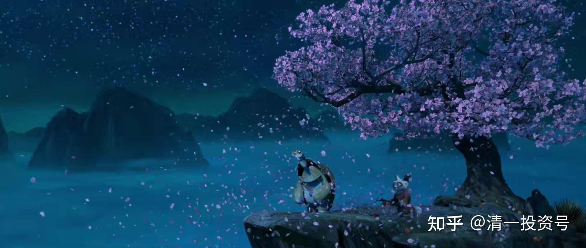

17篇.武道论之五：太极的低级、中级、高级境界

清一山长 2021年4月7日

清一山长雪球非专栏帖子整理文章，第17篇《武道论之五：太极的低级、中级、高级境界》

此文整理自山长专栏文章《[实战太极与现代格斗之谜1：发力技术！](http://link.zhihu.com/?target=https%3A//xueqiu.com/9310099567/176335637)》[https://xueqiu.com/9310099567/176335637](http://link.zhihu.com/?target=https%3A//xueqiu.com/9310099567/176335637)的跟帖评论

[刘杰-](http://link.zhihu.com/?target=http%3A//xueqiu.com/n/%25E5%2588%2598%25E6%259D%25B0-)回复[清一山长](http://link.zhihu.com/?target=http%3A//xueqiu.com/n/%25E6%25B8%2585%25E4%25B8%2580%25E5%25B1%25B1%25E9%2595%25BF):

想请教山长，软软的鞭子打上去之后，突然变成长枪，是不是类似少林寺古树上手指戳的洞。这种腾空起来发力，发力点肯定不在足弓，那这种发力点在哪里？为什么这么大的力量，手指不会骨折？是速度极快之后，类似于流体力学、口香糖可以开椰子？

[2021-4-07 10:03](http://link.zhihu.com/?target=https%3A//xueqiu.com/9310099567/176452746)[清一山长](http://link.zhihu.com/?target=https%3A//xueqiu.com/9310099567)回复[@刘杰-](http://link.zhihu.com/?target=http%3A//xueqiu.com/n/%25E5%2588%2598%25E6%259D%25B0-)：

“少林寺古树上手指戳的洞”古少林的这种功夫，已经超出了我的武学逻辑和理解，这个应该就是真正的内功才能实现的了。我说过，我的功夫，只是初级水平。古少林这种功夫，应该是中级以上了。所以我无法告诉你们，只能说：我文中教的功夫层次，是练不出这种能力的。**我教的武功，依然是力学层次的东西**。这个少林指洞，已经突破了一般的力学原理了。我希望我老的时候，会知道是怎么回事。

[刘杰-](http://link.zhihu.com/?target=http%3A//xueqiu.com/n/%25E5%2588%2598%25E6%259D%25B0-)回复[清一山长](http://link.zhihu.com/?target=http%3A//xueqiu.com/n/%25E6%25B8%2585%25E4%25B8%2580%25E5%25B1%25B1%25E9%2595%25BF):

感谢山长的指导，让我们窥见了太极的高度。腾空手指能在树上戳个洞——如果这都只是中级水平，不敢想象太极高级水平是什么样子，内心唯有恭敬和踏实练习基础发力，能摸到门边边已经是幸运中的幸运了。

[2021-4-07 11:22](http://link.zhihu.com/?target=https%3A//xueqiu.com/9310099567/176465575)[清一山长](http://link.zhihu.com/?target=https%3A//xueqiu.com/9310099567)回复[@刘杰-](http://link.zhihu.com/?target=http%3A//xueqiu.com/n/%25E5%2588%2598%25E6%259D%25B0-)：

我可以告诉你，最高级的太极功夫是什么，这是我的“超级指导老师”告诉我的。这种功夫，已经不去树上弄个洞了，显得太低档。而是人在树下，随手一挥，满树的树叶，就纷纷落下来了。像是秋风扫落叶一样。

我只知道，真达到了这水平，就是传说中的“飞花落叶，皆可伤人”，或者“伤人于无形”了，不战而胜。但我没见过中国现在有这种人存在。我只见到有几个初级功夫的人存在，中级的都没有。大多数所谓的太极大师，连太极的门都没有入。

不过，这些中级的、高级的功夫，我想破脑袋，也不知道是咋练出来的。就像我不知道树上的洞怎么用手去戳出来的。实话实说，你给我一个钢手指，我都戳不出来，只能戳破皮，弄个圆圆的洞？我是没可能的。

**我的老师要我修内功，就可以练出来了。**我哪有时间来修内功？每天有这么多事情要做。所以，只能指望我的弟子们将来去修了，用一生去体验传武，看有无机会实现重新找回祖宗的武功，比如少林的失传武功。我对弟子们说了，我就一杂货铺，都是低档货色。只是周围人都没有，显得还比较高，实际上只是初级水平。他们将来要专精一思，在每个方面都要超过我。全面超过就算了，不用玩这么多的。

[姚淏SZ](http://link.zhihu.com/?target=http%3A//xueqiu.com/n/%25E5%25A7%259A%25E6%25B7%258FSZ)回复[清一山长](http://link.zhihu.com/?target=http%3A//xueqiu.com/n/%25E6%25B8%2585%25E4%25B8%2580%25E5%25B1%25B1%25E9%2595%25BF)：

看完觉得真的叹服！

我琢磨发现其实山长的拳术原理也非常适用于其他运动，比如高尔夫，现代拳手会用腰胯的转动来出拳，力量从腰胯发出来，这点和打高尔夫很像，如果要击到甜蜜点，一定是掌握了胯和腰的转动，而且要足够柔软，比单纯用手和肩的力量要强大太多，所以职业选手能击出300码以上，都是因为腰胯的幅度比普通人扭矩要大太多，柔软度也极度好，我们形容像弹簧一样被拉紧蓄力，然后释放就好了，甩出去的时候自然力量很大。

看完这篇文章，很想学学太极了，说不定会发展出一套高尔夫新打法。如果说发力点从地上到全身迸发出来，力量完全不可想象，前提是像山长说的身体足够柔软，也就是像鞭子一样抽出去的感觉。可能会开辟出一个超远距离击球方法，原理上是可行的。当然，还是更推崇山长的武道，把这个基础学通了相信任何运动都是信手拈来。

每天看山长文章收获太大了，无时不刻在启迪我们！对于所有体育专业尤其球类、对抗类、击打类运动员都应该好好看看这篇文章，中华武道“关于如何发力的一个开创性的方法”。极具价值的诠释，胜过很多武师、教练，悟一辈子也没悟出来的道理，感恩山长大爱分享！

[2021-4-07 10:26](http://link.zhihu.com/?target=https%3A//xueqiu.com/9310099567/176456758)[清一山长](http://link.zhihu.com/?target=https%3A//xueqiu.com/9310099567)回复[@姚淏SZ](http://link.zhihu.com/?target=http%3A//xueqiu.com/n/%25E5%25A7%259A%25E6%25B7%258FSZ)：

您已经看懂了文章。

高尔夫击球的发力要求、原理，的确原理跟现代格斗技术一样：双腿要有稳定的支架，上身腰胯协同转动发力。高手都这样使用身体。只有低手、初学者，是用肩部和手臂发力的，这是没训练过人的惯性发力方式。善于打高尔夫的人，打右手摆拳，力量应该很不错，拿把大刀砍人，会比一般人强。

不过，练真太极功夫，来打高尔夫，应该是很不现实的。第一是不需要。高尔夫是静态的，所以不需要快速的、变化的发力桩。第二是难度太大，完全没乐趣了。

第三就是学了太极的人，是不会去打高尔夫的。因为觉得高尔夫伤身。练好的一定伤身，乱玩的也许还好。

因为你们是单侧运动，而且是**强力发劲的单侧运动**，**最终脊柱一定会偏移的**。我相信老“高手”，腰部有问题的不少。我有朋友打高尔夫，他就有腰病，人还很年轻。我在泰国是ELITE终身会员，国宾客人待遇，所有的高夫夫球场都对我开放的，可以随时出去打高尔夫，比国内便宜得多。但我从来不去。为啥？**花钱买抽的运动。不如做几个云手自己玩。**

xiaostou回复清一山长：

山长，您说的“超级指导老师”是古拳经吗？因为这实在太超过一般的认知了，高级功夫甚至中级功夫，您觉得曾经真实存在的几率有多大？

清一山长[2021-04-07 11:58](http://link.zhihu.com/?target=https%3A//xueqiu.com/9310099567/176469905)回复xiaostou：

少林千年古树上无数的小指洞，不就是曾经存在过的高级武功的证据吗？您还要什么证据？另外。我的“超级老师”不是古拳经，是你们无法理解的老师，所以就不多说了。他会示范一些我无法理解的武功。比如上面提到的。

[南宫潇湘](http://link.zhihu.com/?target=http%3A//xueqiu.com/n/%25E5%258D%2597%25E5%25AE%25AB%25E6%25BD%2587%25E6%25B9%2598)回复[清一山长](http://link.zhihu.com/?target=http%3A//xueqiu.com/n/%25E6%25B8%2585%25E4%25B8%2580%25E5%25B1%25B1%25E9%2595%25BF)：

现在的年轻人缺乏基础，古代士兵是用兵器训练的，打仗征兵集训一般不超过三四个月，现在的年轻人要练传武，需要先去锄一年的地，把基本功练一练。还要节制饮食，改变生活的习惯。否则，再好的功法，也不能把身体练好。

齐齐哈尔有位姓何的老爷子，研究了一辈子的传武，也不限于他的师门传承，九十多岁的人了，他算是我所了解的研修传武的真正高手了，这也要有接触点才能发劲。他说他也还没练出凌空劲来。得到他东西的也没有几个人，我见过一个是部队退休的现在也七十多岁了，他说看现在的年轻人体质太差了，都怕不小心把他们给弄碎了，估计他的传人也没几个像样的。像山长说的真传武就要断绝了。

传说中的飞花落叶，皆可伤人，或者伤人于无形，也许只是障眼法，只是身法、动作奇快，骗过了人的眼睛罢了。相信这些神奇的功法是有的，经过修练内功，可以自动补充自身，进而才能练出来凌空劲，甚至练出凌空飞剑来也不奇怪。只是我真还没见过。

我承认自己孤陋寡闻。我也只是个爱好者、票友，最多就是活动活动身子骨，让这身躯轻灵一点罢了。

不过我相信以清一山长智慧是能训练出来战胜现代格斗的传武弟子来的，虽说这不是一件容易的事。现在格斗也有吸收传武精华的，但真正的精华部分他们还没有完全掌握。那就看谁的训练体系更完善了，更具有优势了。

[2021-4-07 13:29](http://link.zhihu.com/?target=https%3A//xueqiu.com/9310099567/176477555)[清一山长](http://link.zhihu.com/?target=https%3A//xueqiu.com/9310099567)回复[南宫潇湘](http://link.zhihu.com/?target=http%3A//xueqiu.com/n/%25E5%258D%2597%25E5%25AE%25AB%25E6%25BD%2587%25E6%25B9%2598):

这种高级的武功，我没见过，不过南怀瑾老师说他见过。

他的回忆武术上的记录，提到过他年轻的时候，在四川见过一对师徒两人的功夫展示。就是隔着空间（南老师说的是另外一个山头），云南、四川的小山包，距离隔个几十米，上百米的距离吧？具体不清楚多少。这人一挥手发功，就把对面的一颗松树拦腰打断，倒了下来。

这个就相当于我的“超级老师”指点的功夫了，肯定是高级的能量聚焦。但我从来没见过，没体验过。南老师也只是他青年时期见过，后来也再也没见过。从年龄推断，拥有这种功夫的人比南老师年龄更大。早就仙游了吧？我相信南老师肯定不是骗人的。

这只是说明：古书上说的一些东西，并不是假的。只是我们现在已经不存在了。现在谁说有这种功夫，隔空打人，基本上就是骗子，闫芳之流的骗子。但最高层级的人可能达到过。其实历史上记录下来的孙禄堂等人的功夫，也没有达到这种高功夫的水准。所以基本上停留在传说、神话的水准。

我猜测：能够练到这个高功夫水平的人，肯定是修道之人，清心寡欲，无心世事，所以社会上没有啥记录了。**现在连修道的人都没有了，自然更不存在这种人了。修道的土壤，已经在几十年前就被破坏了。**现在去终南山修道的人，天知道是什么人。就像武当山的道士，掌门人，居然练的功夫，是“降龙十八掌”，也是醉了。

next彼岸回复[清一山长](http://link.zhihu.com/?target=https%3A//xueqiu.com/u/9310099567)：

像是台大前校长李嗣涔教授研究的东西？

清一山长[2021-04-07 13:34](http://link.zhihu.com/?target=https%3A//xueqiu.com/9310099567/176470479)回复next彼岸：

有点像。他接触过一起奇怪的高级的东西啊！只是想用现代物理学，找出一个解释来，不知道能否成功。

[JustDoitmh0](http://link.zhihu.com/?target=https%3A//xueqiu.com/u/7907517772)回复[清一山长](http://link.zhihu.com/?target=https%3A//xueqiu.com/u/9310099567)：

请教山长，传武在太极发力没有练成之前，如何发力为好呢？是否有个转换过程，比如随着练习的深入，逐步将发力的支撑点由腰胯发力转向地面发力？

[清一山长](http://link.zhihu.com/?target=https%3A//xueqiu.com/u/9310099567)回复[2021-04-07 15:17](http://link.zhihu.com/?target=https%3A//xueqiu.com/9310099567/176491330)J[ustDoitmh0](http://link.zhihu.com/?target=https%3A//xueqiu.com/u/7907517772)：

不行。专门练了现代格斗的人，练不了我教的太极。我这边一个拿过青少年搏击冠军的小伙子，已经习惯两个支撑点的发力，再练我的东西，很别扭。基本上改不过来了。只能拿来当健身玩玩，高级别的比赛是不成的。

参考链接：

[山长 清一：实战太极与现代格斗之谜1：发力技术！](https://zhuanlan.zhihu.com/p/362455647)（专栏文）

[清一武道馆：传武杀人技？太极不出门？](https://zhuanlan.zhihu.com/p/354643954)（专栏文）

[清一武道馆：真被“武术界，国术界”给恶心到了！](https://zhuanlan.zhihu.com/p/357918131)（专栏文）

[清一武道馆：实战太极与传武高级黑！是实话，可真相是这样吗？](https://zhuanlan.zhihu.com/p/355026610)（专栏文）

[138篇 实战太极与现代格斗之谜1：发力技术!](http://link.zhihu.com/?target=https%3A//www.ximalaya.com/sound/488865125)（音频）

[哔哩哔哩：实战太极与现代格斗之谜1：发力技术!](http://link.zhihu.com/?target=https%3A//www.bilibili.com/audio/au2820089)（音频）
