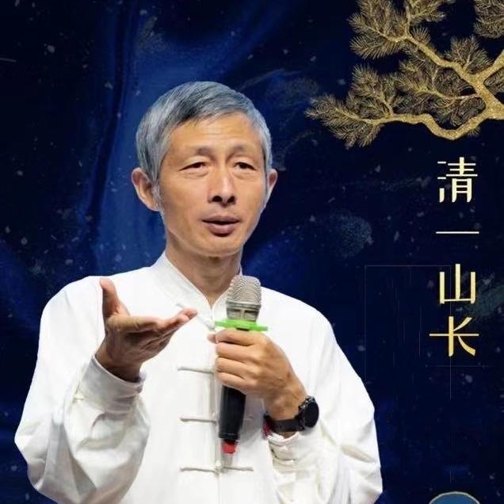

33篇.观真太极，现众生相

清一投资号

清一山长投资思维分享园地

已关注

为你朗读

5 分钟

[17 人赞同了该文章](https://www.zhihu.com/appview/article/529770512/voters?zh_forcehybrid=1&zh_hide_nav_bar=true&zh_hide_tab_bar=true&route_simi_to_full=true)

33篇.观真太极，现众生相

清一山长 2021年9月17日

清一山长雪球非专栏帖子整理文章，第34篇《观真太极，现众生相》

此文整理自山长专栏文章《古传太极【分心十字】与现代格斗实战用法》[https://xueqiu.com/9310099567/198034224](https://link.zhihu.com/?target=https%3A//xueqiu.com/9310099567/198034224)的跟帖评论

**一、是否有真太极？**

//[@君子如玉03z](https://link.zhihu.com/?target=http%3A//xueqiu.com/n/%25E5%2590%259B%25E5%25AD%2590%25E5%25A6%2582%25E7%258E%258903z):回复[@清一山长](https://link.zhihu.com/?target=http%3A//xueqiu.com/n/%25E6%25B8%2585%25E4%25B8%2580%25E5%25B1%25B1%25E9%2595%25BF):

山长您好，请问孩子是15岁考上三语高中后才可以进入武道馆。在这之前只需要跟随班级做好体能训练就可以吗？

[清一山长](https://link.zhihu.com/?target=https%3A//xueqiu.com/9310099567)[2021-09-17 15:44](https://link.zhihu.com/?target=https%3A//xueqiu.com/9310099567/198124635)回复[@君子如玉03z](https://link.zhihu.com/?target=http%3A//xueqiu.com/n/%25E5%2590%259B%25E5%25AD%2590%25E5%25A6%2582%25E7%258E%258903z):

是的。因为没文化的人学不会太极。也因为15岁学太极不晚，只要基本功好就行了（不仅仅是体能，关键是基本功，比如身体协调性，我们学校体育课都教这些的）。

还有：真想当冠军的人，才去申请武道馆。清一武道馆，相当于职业武馆，实行优胜劣汰。一两年无法证明自己的学员就要退训。你们家长千万别把武道馆当学校看，当成职场看才对。除非真有愿心，真想当冠军的，否则就别去了。只是想学一点武术基本功啥的，在三语高中都能学的。

//[@球友甲](https://link.zhihu.com/?target=http%3A//xueqiu.com/n/%25E4%25BD%258E%25E6%258A%259B%25E9%25AB%2598%25E5%2590%25B8%25E8%2582%25A1%25E6%25B8%25A3):回复[@清一山长](https://link.zhihu.com/?target=http%3A//xueqiu.com/n/%25E6%25B8%2585%25E4%25B8%2580%25E5%25B1%25B1%25E9%2595%25BF):

那么问题来了，中国哪里能学到真太极？

[清一山长](https://link.zhihu.com/?target=https%3A//xueqiu.com/9310099567)[2021-09-17 17:18](https://link.zhihu.com/?target=https%3A//xueqiu.com/9310099567/198136685)回复[@球友甲](https://link.zhihu.com/?target=http%3A//xueqiu.com/n/%25E4%25BD%258E%25E6%258A%259B%25E9%25AB%2598%25E5%2590%25B8%25E8%2582%25A1%25E6%25B8%25A3):

说这么多，你居然连这问题都还不知道？不如你去找徐冬瓜问问，据说日本还有，你赚点日元再去吧！

//[@球友乙](https://link.zhihu.com/?target=http%3A//xueqiu.com/n/dysn):回复[@清一山长](https://link.zhihu.com/?target=http%3A//xueqiu.com/n/%25E6%25B8%2585%25E4%25B8%2580%25E5%25B1%25B1%25E9%2595%25BF):

你好，我不知道先生是要赚钱呢，还是想做什么。我想先生应该钱已经赚够了，为什么不通过现在的各种视频平台，向全国传授自己的一些技艺呢？一个人活一辈子，到最后，如果钱已经赚足了，那还有一些技艺的东西，还是希望能够流传下来，有一些影像的记录，其实是很好的。

说一句冒昧的话，我也不喜欢那种神秘兮兮的，故作神秘的言语，看似说了什么，其实什么都没说，吊人的胃口。雪球上曾经有好多的股神就是这样，后来也销声匿迹了。

[清一山长](https://link.zhihu.com/?target=https%3A//xueqiu.com/9310099567)[2021-09-17 20:50](https://link.zhihu.com/?target=https%3A//xueqiu.com/9310099567/198154578)回复[@球友乙](https://link.zhihu.com/?target=http%3A//xueqiu.com/n/dysn):

我去拍视频，传授真太极？您说笑话，居然说得这么真诚，难得！

一样说句冒昧的话：**中国人，如果看能得懂真太极，也不至于百年来，被西洋格斗压着打，一直连头都抬不起来**。**只能传老祖宗的一些神话自我安慰。只能在武侠电影和武侠小说中吹吹牛**，喂饱你们的眼球。

中国武人如果争气一点，也犯不着现在让我一介文人，来苦心费力的，继承和发展、弘扬中国传武了。进入武林世界，培养传武，太极的实战格斗传人，非我所愿，实乃不得不为之。就因为中国吃武术饭的人，都太没眼色了，他们不知好歹，不辨真假，不识货。只知道混日子！骗取名利。跟着洋人的武术理论和屁股转，瞧不上老祖宗的好东西。一群败家子！

你以为你懂怎么看武术视频？我链接里面，有我跟我武道大弟子过招的示范，你看懂了啥？学会了啥？

**中国武术，就是被你们这种自以为懂的人，指点江山，激扬文字，才彻底废掉的。**

//[@国学中医黎天焕](https://link.zhihu.com/?target=http%3A//xueqiu.com/n/%25E5%259B%25BD%25E5%25AD%25A6%25E4%25B8%25AD%25E5%258C%25BB%25E9%25BB%258E%25E5%25A4%25A9%25E7%2584%2595):回复[@清一山长](https://link.zhihu.com/?target=http%3A//xueqiu.com/n/%25E6%25B8%2585%25E4%25B8%2580%25E5%25B1%25B1%25E9%2595%25BF):

如果说当年杨露禅偷学太极拳，穿越到现代偷学一点格斗搏击还有可能，偷学太极拳的传说应该只是个让人感觉高大上的出身而已，因为当年他在京城教一些八旗子弟，出身名堂很重要，历史上如果杨有真功夫的话，他的太极压根就跟那“圣地”没什么关系，后来成名了，“圣地”肯定也乐意接受这个礼物，但就不知为何后来会搞出一大堆套路出来。

我看到视频上女拳手的出手，基本上是内家拳的特点：后发先至和犯者立仆，重点是每次出手都直插中线，直击要害，以入中线来对付进攻。

攻击对手中线以及在最短的时间和空间内爆发出身体连接到地上的力量，而在外形外观基本看不见发力的动作，这应该就是前辈们所说的“内家”，也符合阴阳的理念，这也就是区别于外家拳外观动作发力明显的特点。

其实看男拳手的身法步法也是有经验的，但每次出手都被女拳手瞬间抢到先机直入中线，中线一破任何人都只能挨打。这种打法就是古太极与其它搏击拳种的根本区别，古传太极完全区别于众多玩套路绝招的就是一个“打”字，犯者立仆就是内家拳面对进攻的要义，场上的女拳手都做到了，就是这么两个动作，真太极根本就没有套路，如果想偷学能偷啥？

很多人看这视频还以为是男的约好了在陪打，其实他是没法打，真的是在挨打。

[清一山长](https://link.zhihu.com/?target=https%3A//xueqiu.com/9310099567)[2021-09-18 09:25](https://link.zhihu.com/?target=https%3A//xueqiu.com/9310099567/198181282)回复[@国学中医黎天焕](https://link.zhihu.com/?target=http%3A//xueqiu.com/n/%25E5%259B%25BD%25E5%25AD%25A6%25E4%25B8%25AD%25E5%258C%25BB%25E9%25BB%258E%25E5%25A4%25A9%25E7%2584%2595):

说得对。知道看门道，别人只会看热闹。甚至热闹都看不懂。

男拳手跟女拳手对练，目标就是要学会进攻，学会进攻后的防守。男拳手这样练过后，对付一般的普通拳手，实力也很强。

**二、为什么会混日子？**

//[@郡岚空间](https://link.zhihu.com/?target=http%3A//xueqiu.com/n/%25E9%2583%25A1%25E5%25B2%259A%25E7%25A9%25BA%25E9%2597%25B4):回复[@清一山长](https://link.zhihu.com/?target=http%3A//xueqiu.com/n/%25E6%25B8%2585%25E4%25B8%2580%25E5%25B1%25B1%25E9%2595%25BF):

老师能讲讲为什么现在很多人都是混日子的心态？孩子、年轻人、中年人，连老年人也都觉得反正活的差不多了，就混呗！整个的生活状态都是混一天是一天的，没有任何规划，你过的精进一点，还不被理解，在这样的环境中，我们能做些什么呢？

[清一山长](https://link.zhihu.com/?target=https%3A//xueqiu.com/9310099567)[2021-09-18 09:30](https://link.zhihu.com/?target=https%3A//xueqiu.com/9310099567/198181568)回复[@郡岚空间](https://link.zhihu.com/?target=http%3A//xueqiu.com/n/%25E9%2583%25A1%25E5%25B2%259A%25E7%25A9%25BA%25E9%2597%25B4):

为什么都在混？因为现在的中国人只爱钱。从小孩到大人，各行各业，都把钱作为唯一的追求。自然就不再追求其他了。

我的公主班学生，武道馆学生，选人的核心标准，就是要一个不爱钱的人。这一点很难做到，很少人会不爱钱。连孩子都被毒害了。家长用钱，可以把孩子毒害到连对钱都没兴趣，啥追求都没有——光想享受了。爱钱之人，还会为钱去拼搏一番。

//[@球友丙](https://link.zhihu.com/?target=http%3A//xueqiu.com/n/%25E5%259D%2590%25E7%2581%25AB%25E7%25AE%25AD%25E4%25B8%258A%25E7%258F%25AD):回复[@清一山长](https://link.zhihu.com/?target=http%3A//xueqiu.com/n/%25E6%25B8%2585%25E4%25B8%2580%25E5%25B1%25B1%25E9%2595%25BF):

没钱的话好像进不了山长的课堂吧？没钱的话好像不敢生场大病吧？没钱的话总要想法子填饱肚子吧？好像没钱真的不行，难怪那么多人都爱钱！

[清一山长](https://link.zhihu.com/?target=https%3A//xueqiu.com/9310099567)[2021-09-18 13:45](https://link.zhihu.com/?target=https%3A//xueqiu.com/9310099567/198195961)回复[@球友丙](https://link.zhihu.com/?target=http%3A//xueqiu.com/n/%25E5%259D%2590%25E7%2581%25AB%25E7%25AE%25AD%25E4%25B8%258A%25E7%258F%25AD):

**爱钱就爱钱，没啥不好的。但别找个“不得不爱钱”的理由。这样就虚伪了。**

我也爱钱，我不认为钱不好。但我更知道：**很多最宝贵的东西，是钱买不来的。**这一点，相信更多的“金钱教”教徒不知道。他们唯一知道的社会驱动力就是钱。

我还知道：**如果你真的拥有了钱买不来的一些最宝贵的东西，想要去换点钱，真的很容易。相反，就难如登天。**

参考链接：

[清一投资号：26篇.解答大家对真太极的误解](https://zhuanlan.zhihu.com/p/527851327)（整理文）

[山长 清一：实战太极与现代格斗之谜1：发力技术！](https://zhuanlan.zhihu.com/p/362455647)（专栏文）

[清一武道馆：传武杀人技？太极不出门？](https://zhuanlan.zhihu.com/p/354643954)（专栏文）

[清一武道馆：真被“武术界，国术界”给恶心到了！](https://zhuanlan.zhihu.com/p/357918131)（专栏文）

[清一武道馆：实战太极与传武高级黑！是实话，可真相是这样吗？](https://zhuanlan.zhihu.com/p/355026610)（专栏文）

[清一投资号：第18篇.武道论之六：武功无秘密唯有苦练](https://zhuanlan.zhihu.com/p/522789501)（整理文）

[138篇 实战太极与现代格斗之谜1：发力技术!](https://link.zhihu.com/?target=https%3A//www.ximalaya.com/sound/488865125)（音频）

[哔哩哔哩：实战太极与现代格斗之谜1：发力技术!](https://link.zhihu.com/?target=https%3A//www.bilibili.com/audio/au2820089)（音频）

来自专栏

非投资类整理文章

清一投资号 · 33 篇内容

31篇.选择对的教育投资很重要，但建设自己的平台更重要！

文章 · 27 赞同 · 2 评论

编辑于 2022-06-22 18:45 · 著作权归作者所有

申请转载

​

微信

​

朋友圈

​

QQ

​

图片分享

评论

写下你的评论...
