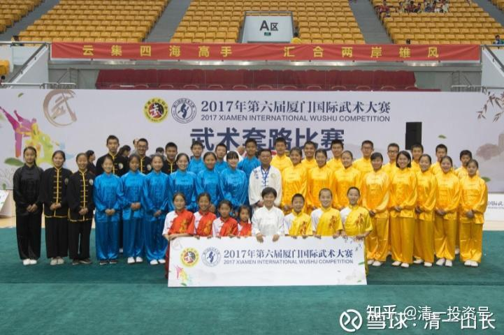
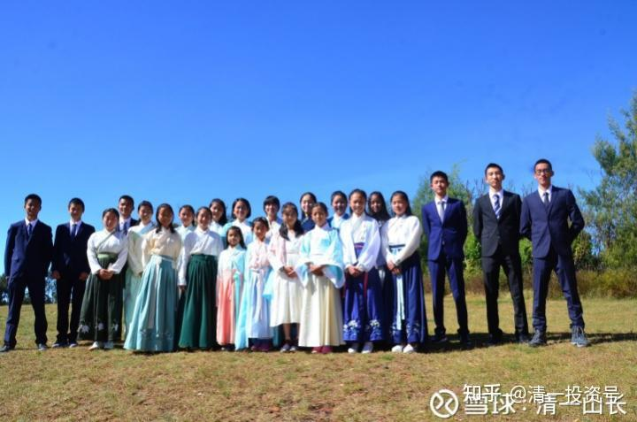
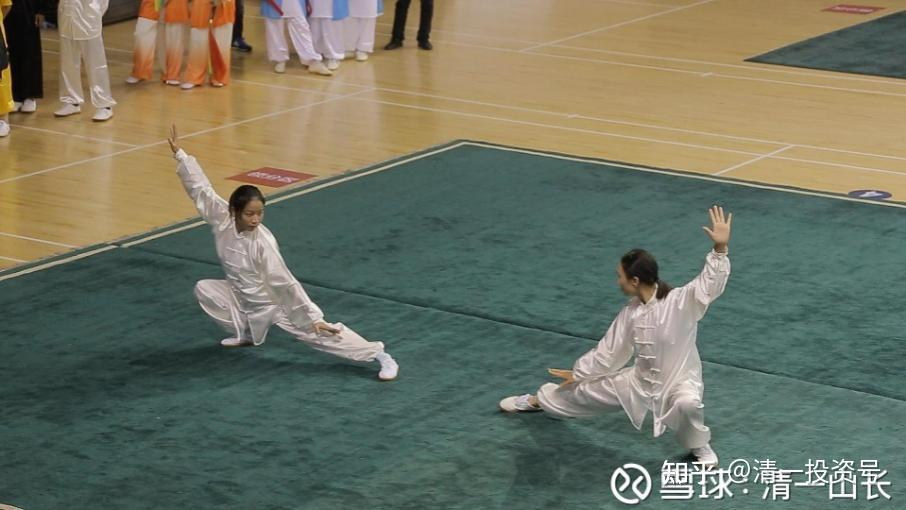
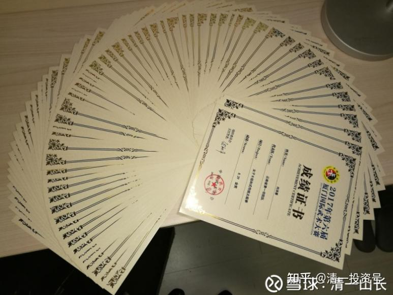
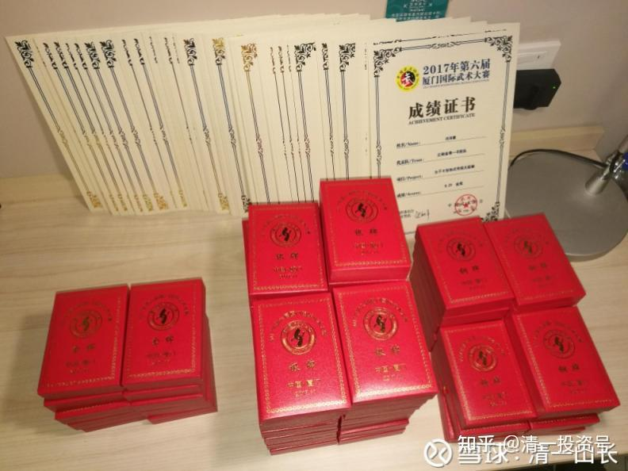
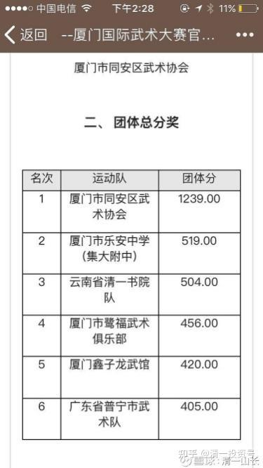
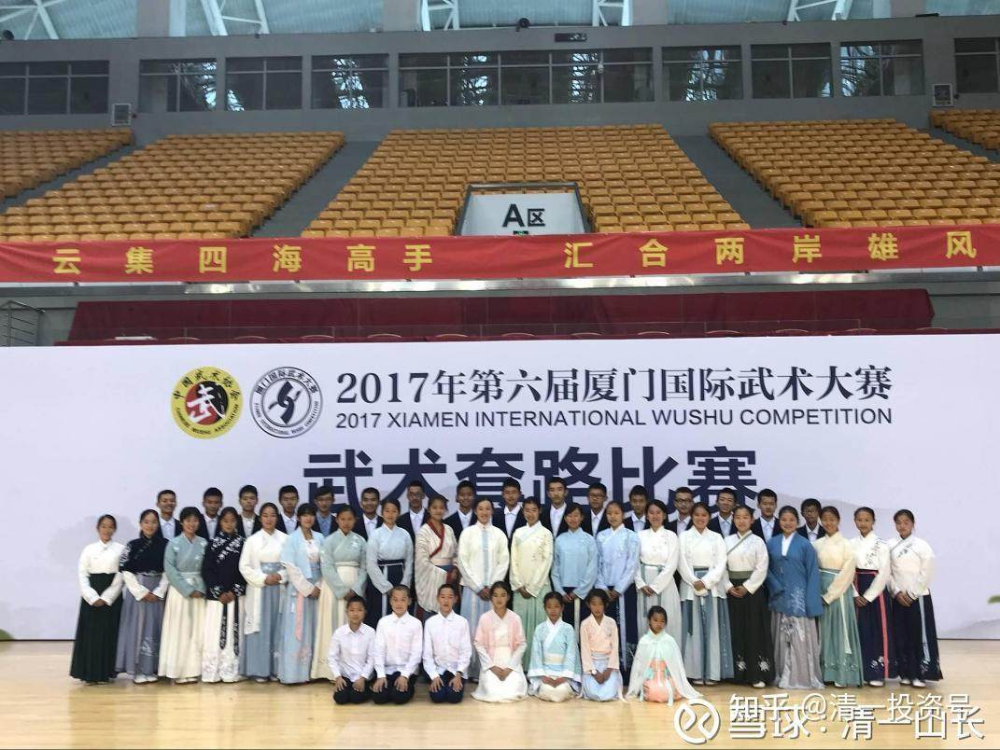
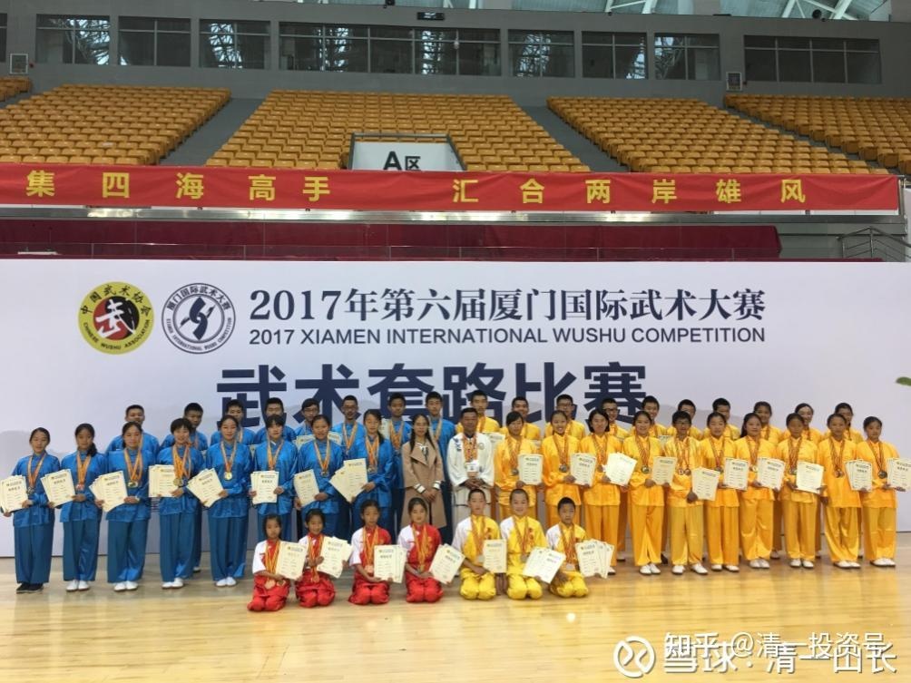
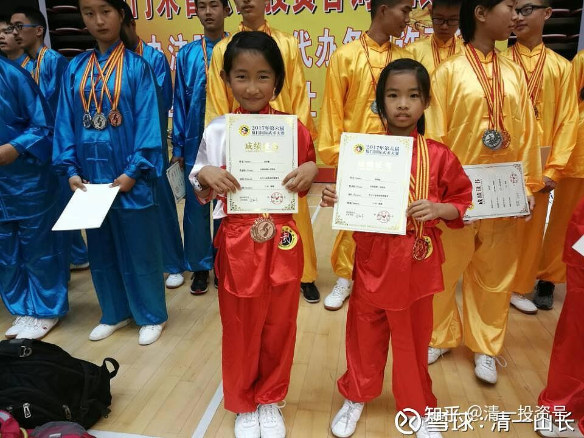

原雪球专栏[17篇.国际武术比赛：清一书院首日参赛夺得金牌12面！](http://link.zhihu.com/?target=https%3A//xueqiu.com/9310099567/95912380)

清一山长 2017年11月20日

昨天开启的国家武术总局举办的厦门国际传统武术比赛，有4千多人参加。我们派出了30余人的队伍参赛。第一天比赛结束后，孩子们拿下了12金、25银、18铜的成绩。

现场有很多家长观战，我远在泰国，没有去实战指导。因为没有什么悬念的，我也没什么好做的，只是等着安排他们比赛完成后要参加的实战训练。

发布：[实力出众，惊艳全场——2017厦门第六届国际武术大赛第一天赛况报道](http://link.zhihu.com/?target=https%3A//mp.weixin.qq.com/s%3F__biz%3DMzIzOTYyNzk0NQ%3D%3D%26mid%3D2247485390%26idx%3D1%26sn%3D41dbbd3a76275396f4bfa21d81d9492e%26chksm%3De9267c08de51f51e53e3d6cdfc7281e746fbb026fe900a838a2b759ba61c304c8e6ee73cdbcf%26mpshare%3D1%26scene%3D23%26srcid%3D1119bDsRyq7ybVTIqPaYI312%23rd)

微信[网页链接](http://link.zhihu.com/?target=https%3A//mp.weixin.qq.com/s/LMTBvt76exnd_ZAqOHVEyQ)：[https://mp.weixin.qq.com/s/LMTBvt76exnd_ZAqOHVEyQ](http://link.zhihu.com/?target=https%3A//mp.weixin.qq.com/s/LMTBvt76exnd_ZAqOHVEyQ)

内部发言：我们一直在突破中国教育界的想象：

2013年，清一书院平均年龄不到15岁的一群小队员们，只用了三个月时间，从零开始学辩论，结果就轻松地赢了多年驰骋大学辩论界的大学生、研究生、博士生组成的“专业辩论选手”，北京大学生联队、浙江大学校队。最后一场，更是轻松地赢了全国的最佳大学辩论队——武汉大学校队。

2016年，我们用四个月时间，突破一门外语。现在我们有三语班的学生了。

2017年，我们派了六个学生，去参加全国太极拳比赛，拿了两个冠军和亚军回来。有人说是碰运气的，今年，我们又派了更多的学生去集体参赛，之前用了两个多月时间在昆明集中培训和学习中国传统武术套路，又拿了很多的奖牌。

2018年，我们将让已经成功地突破了外语的突破班学生，去用四个月的时间尝试突破9年的数学学习，这应该比武术比赛拿奖更容易。这种不断突破的成绩，导致今日的家长也都激动起来，不切实际的，想要快速培养未来的“经济管理大师”了。

其实，上面的这些“速成”，都只是简单的游戏而已，没有多少技术含量的。只是证明了中国教育界一直在穿“皇帝的新衣”罢了。

**一、中国的辩论其实不是真辩论，只是玩嘴皮子，搬弄口舌罢了，缺乏深度的思维和思考。**一旦我们加上了“思维含量”，学会他们的表现方式，他们只有技术，缺乏实在内涵的辩论，就“必定输”，没什么奇怪的。

二、至于外语的突破，也是中国教育因为没有思维教育，完全违背了自然规律去教学的结果，我们只是“返璞归真”罢了。如果把一个孩子丢到国外去生活，不给翻译和说母语的机会，半年后他自己也会说外语了，这有什么稀奇的呢？我们**只是人为地造出了“母语环境”**罢了。

三、武术的“突破”呢？**中国现在的武术比赛，基本上只是表演**。

你没功夫，当然是无法获奖的。有真功夫，别人也未必看得出来，表演能力不行，不符合要求，可能还打个低分。我们的学生拿奖，是因为平时的基本功不错，正常上课的练武时间，未必比真正的武校学生少。他们平时也实战，算是有一点的真功夫。所以外形、气质都不一样，跟专门学套路的学生比，自然有一点优势了。学生们专门练习了武术套路两三个月，去这种玩表演的国际比赛场上，拿几个奖，实在没有什么出奇的地方。离真功夫还差得远。

我来泰国，就见了一个日本高手，他身上就有中国功夫，远超我见过的绝大多数中国武师，修养也不错。但他根本就不认中国的功夫，很瞧不起。因为这是中国古代的东西，现在已经没有了。我们拿奖了，只是由于对手太差，普通的中国人文武分开，以为我们很稀奇罢了。

其实文和武是合一的。**真文好（思维好，学习态度好），学武就是比专业的武人还快速和轻松**。我的武术界的朋友，都很惊讶。他教我的学生学一些武术动作的时候，掌握的速度比他的学生快N倍。“真武”好了，学文也事半功倍，轻松快速。可惜国人不懂这种跨界，都要“专业”，我们就是来玩“跨界”的。

明年学数学也一样，孩子们的思维已经提升后，三四个月学完九年的课程，就一点也不稀奇。思维没提升，学十年也没用。所以，这些东西，只是证明了中国各行教育都走偏了。教武术的乱教，误人子弟；教英语的乱教，误人子弟；教数理化的也乱教，误人子弟。需要有新教育来拨乱反正。

至于**真正的管理**，就像是真正的擂台赛一样，**是要用商场的实战业绩打出来的，不可能速成**。**速成的只有“管理理论”**。所以，家长们千万别以为：“清一书院学生，学所有的东西，都可以速成的。”当然，如果我们的对手太笨，被体制教育教愚蠢了，我们看起来像是“速成”的奇迹，也不奇怪！

一句话：**打好基础后，做什么事情都简单，包括投资；没有打好思维的基础，什么都难！童子功、基本功（不仅仅是武术）是最重要的教育。可惜中国教育不关心从小培养孩子的基本功，只关心“结果”。结果就是——什么都做不好，什么都平庸！**

赛后合影纪念：

