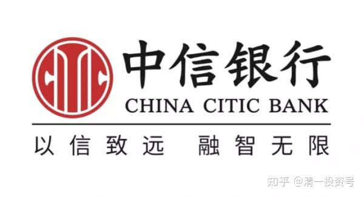

**

**

12篇．中信银行H股的投资逻辑

清一山长2016年1月～2019年11月

**一、买入中信银行H股的理由**

清一山长2016-01-04 18:24

$中国宏桥(01378)$感谢宏桥给予的机会，今天继续加码买进。别人恐惧的时候，就是我贪婪的时候。目前的持仓结构，宏桥是H股第一仓位，中信银行是第二仓位，中国建筑是A股第一仓位，兴业是第二仓位。今天中午以6.04元价格，挂单买入50万股中国建筑，已经成交了。这是上次中建冲涨停（6.94元）卖掉的头寸，今天补回来了。**我看什么东西涨急了就喜欢卖出，跌急了就喜欢买进。**这笔小生意，不算手续费获得差价45万元——中建由于长期给予做短线的机会，成本已经低到不可思议（每股一两元），但总仓位没有减少，动态平衡中。明天我想等待兴业给予的机会。浦发卖出后的头寸还没有补完。

清一山长2016-01-07 12:48

谢谢提醒！有人提醒中信更便宜，看来也可以买点。继续主动买套（左侧特点）。

清一山长2016-01-21 22:00

烟草公司5.55元敢买中信银行00998，我们现价花3.6元买，还有什么好担心的？今天就与大股东共进退好了，假如中信真不行，恐怕没人会出这一百多亿的。学大股东，不看每日价格浮动，只看股数和分红即可。

清一山长2016-11-10 00:25

优先股股息率3.8%,再创优先股股息率新低。中信银行发行优先股,是浦发兴业6%的六折三；这个信息很重要，证明资本收益率快速降低，资金要寻找出路。资产荒（而不是资金荒）将成为未来的主流。现金不再是王。未来具有稳定收益的蓝筹股，注定会成为资金追捧的对象。坚持持有大蓝筹似乎是最佳的应对策略。

这个标的还有几个特别之处：大股东不断增持H股结果H股不涨A股涨，成为了AH内银股中溢价遥遥领先，A股比H股贵了42%。

清一山长2017-06-30 13:03

我准备再买些中信银行。但不准备卖出神华。[大笑]

清一山长2018-01-10 18:16

$中信银行(00998)$今天算是一个真正的突破，量很大。不过2007年2月也来过一次的，一年后再来一次，我相信会让人认为历史重新演绎。中信真是磨人，越磨我的股越多。磨叽的时间越长，潜在的回报也相应越高。只要是好股，就不用担心不涨。比国家队买的成本低，没什么好担忧的。

2019-11-29 16:44

我刚打赏了这篇帖子¥100.00，也推荐给你。中信等银行比茅台赚钱更多，估值却低7.5倍的原因，是人们对银行未来的预期太差。股票不是炒过去的业绩，而是炒未来的业绩预期。人们预期未来的茅台会继续喝，稳定发展，但银行业将面临严重的经济危机，不赚钱还赔钱。中国恐怕要等过了中美冲突的这关，银行业才会开始大涨[滴汗]。

**二、卖出中信银行的原因——板块内轮动，增厚持有头寸**

清一山长2018-01-18 15:32

$中信银行(00998)$今天6.13～6.14元，卖出1M中信银行，持有很久，感谢这一次得到的换仓机会（没有彻底换，更多的中信仓位继续持有待涨）。卖出的资金，立即反手买入了相同仓位的哈尔滨银行（2.54元），民生银行8.34元和重庆银行（6.70元）。金融股换仓行为，因为我不敢放掉银行股的头寸，卖多少，补仓多少，只是增厚了银行股的头寸罢了。

悟道之中:回复@清一山长:

中信这样涨法，是不是该切换其它担保品？

清一山长2018-01-18 15:36回复@悟道之中:

已经切换了［大笑］。今天卖出1M的中信，换了8.34元的民生银行和2.54元的哈尔冰银行，以及6.70元的重庆银行（不好意思，因为卖不到相应的头寸，只好分散买了）。大致上收获了1.5M的其他银行股。

清一山长2018-01-18 19:14

$民生银行(01988)$今天卖掉一部分中信换民生，就是看**民生没有涨**。结果尾盘居然以最高价收盘，买入后“马上就赚”。财富效应也太快了，不太适应［微笑］

清一山长2018-01-22 12:12

$民生银行(01988)$今天6.18元卖出20万股中信银行，8.40元买进10万股民生银行。理由：觉得8.40元的民生比6.18的中信更便宜。**中信继续涨，我就继续卖**，反正我的中信多多的有。几个月前刚用IB的融资大量买入了中信、人保等“国家担保标的”。现在都涨了，就卖掉一点，还融资。留下余地，别太贪心了。

由于不想错过本轮的银行股行情，所以还是想切换操作，买入一些银行持仓。后续无论涨跌，我都会开心。

清一山长2018-01-22 15:35

$中信银行(00998)$继续以6.18元卖出10万股中信，买进了30万股06138，价格是2.61元。**理由，还是比价更便宜**。2014年上市的哈行，数据显示，截至2017年6月30日，哈尔滨银行总资产为5469.27亿元，与2014年末的3436.42亿元相比增长了59.16%。可是，业绩增长了这么多，股价呢！不涨就算了，居然比发行价还跌了15%。基石投资人套牢了四年，马上A股上市，他们能解套，我就能赚钱了！跟随国王散步！

该笔交易最不满的地方是：哈行IB一点融资额度都不给，占用我的“净资本”额度。不过，反正我空余额度尚多，就大度一点，不计较了。［大笑］

yourzdf:回复@清一山长:

问题是，东北可信吗？

清一山长2018-01-22 17:49回复@yourzdf:

（06138）哈行可信与否，我真不知道。不知道甘肃银行您觉得可信吗？要不你就买一点更可靠的甘肃银行？关内的？价格（PE、PB)是哈行的一倍？也许哈行，就是你们觉得他信不过，才买这么低价格的［大笑］

清一山长2018-01-29 11：26

我刚刚调整了雪球组合 $组合ZH117950(ZH1179508)$的仓位。

明达野老:回复@清一山长:

［很赞］［握手］这段时间我也快把$中信银行(00998)$卖光了。另外，光大H也快卖没了，不断换入$民生银行(01988)$和哈尔滨银行，民生快超越重行成我港股银行股第一重仓了。

PS：最早卖出的一批中信换了些没涨的信达$中国信达(01359)$，信达没涨甚至下跌时我一直吃进，快吃吐了（仓位比最早买的AMC最重仓的华融都重了50%），现在涨了，就停手了，只持有。

清一山长2018-01-29 12:26回复@明达野老:

我们连换股的方向都差不多［得意］。真是一对好兄弟。我的哈行也数百万股了。原来数百万股的中信，光大，手上仓位也越来越少了。不过我总会留一点，想看看她们会不会疯狂表演［大笑］

清一山长2018-01-29 23:53

今天的操作：卖出中信银行11.14%，成交价6.73元买入民生银行9.03元。持仓从15.33%～26.47%。银行最重的仓位

清一山长2018-02-05 15:25

$燕京啤酒(SZ000729)$今天以7.79元和7.80元，卖出30万股燕京。再换入了25万股珠江啤酒，入手价9.80元。理由——涨了的再换个没涨的，大概率不会赔本，反正不空仓。其实，更准确的说法，是我下午先买入了珠江啤酒，再等燕京冲高中，卖出了燕京的。现在我在等中信H冲高后，计划卖出一部分，计划买入其他没涨的大金融股票。**我持有的中信太多了，要卖掉一些才安心。**

清一山长2018-02-05 16:05

$中信银行(00998)$今天在6.77元，卖出了20%的中信H持仓。计划明天买入其他低估的金融股。没有全部卖出中信银行的原因是：似乎中信的风来了，今天A股涨停，有龙头之相。等一等，也许有更好的价格。现在20%的仓位，就执行价值投资原则好了，剩下的用来“投机”了。

清一山长2018-02-06 14:39

刚看盘。港股居然跌了1400点？居然来了一个“黑暗星期二”［亏大了］。

我昨天的卖出居然变成了“神操作”，转眼六个点到手，这个操作价值一辆URV［为什么］，不好意思，又从股市上抢到一笔钱了。心里居然还很邪恶的埋怨自己：昨天干嘛不一把梭哈了［卖身］还是得承认美国人牛呀！中国要想夺回金融领导权，任重道远。

一句话：**炒股不要贪心，赚了就要走掉一点，多留点资金在账面上，有急用才有钱。**既然大跌了，我准备等明天再入手。看中了某跌到近几年低位的银行股，我就把高位卖出的中信换进去吧！我不入地狱谁入地狱。我准备好了，要接下跌的飞刀［加油］。

**三、随时留出安全边际，才是长治久安的办法。**

清一山长2018-02-07 15:48

$中信银行(00998)$才三个交易日，每股卖出就赚了0.77元，我真想再度入手买回来了。想想还是忍住吧！再看看晚上的美股行情，大概率昨天晚上只是一个假反弹。

清一山长2018-02-09 17:44

才几天时间，就从6.77元就到了5.55元。三五牌香烟。万万想不到。

结论：随时留出安全边际，才是长治久安的办法。永远不要想“尽量多赚钱”，而是“尽可能少赔钱"。

这笔卖出资金，没有按计划买入新的股票，依然躺在账户上等待机会。看到有几个金融股，居然才几天时间，就创出了几年来的最低价，惊人的港股效率。

井底那只蛙回复@清一山长（为上贴跟帖）:

山长卖出兴业银行之后，看着兴业银行的走势图，俺想起了2015年7月9号早上，俺刚刚下夜班，一打开博客就看到7:27山长发出的博文《今天融资1000万，为国接盘》，立刻转发之后睡觉去了，一觉醒来发现当天无数个股从跌停到涨停……早就耳闻山长太极功夫了得，但却万万没想到，山长的股市太极也是日臻化境——学不来啊［捂脸］［捂脸］［捂脸］！

清一山长2018-02-09 23:12:58回复井底那只蛙:

你真是有心人，信息收集如此准确。

2015年，我在4500点还了融资，然后眼巴巴的看着涨到5000点，然后身边的所有人都在嘲笑我老股民，老经验无效了，胆子太小。然后就——股灾了，当时我的主仓仓位也一样跌停。但我用了融资大量买入银行股（其实实际融资买入超过千万），涨30%后退出融资案，然后又是下跌，再度买入——然后就是结果：股灾后我的账户反而创了新高。

实话是当时措手不及，只是安全第一的思想，让我躲过了股灾。但这一次，应该不一样了。如果我看到国家队出手的信息，我将会以10倍的融资额度来接为国接盘［加油］。标的一样——国家担保标的。

**参考链接：**

[清一投资号：1篇.银行股的投资逻辑](https://zhuanlan.zhihu.com/p/489850963)（整理文）

[清一投资号：2篇.江苏银行的投资逻辑](https://zhuanlan.zhihu.com/p/494495300)（整理文）

[清一投资号：3篇.2015年银行股投资回顾——“价值投机法”之示范（上）](https://zhuanlan.zhihu.com/p/502367347)（整理文）

[清一投资号：4篇.2015年银行股投资回顾——“价值投机法”之示范（下）](https://zhuanlan.zhihu.com/p/506271066)（整理文）

[清一投资号：5篇.价值投机派的投资思路与心态——兴业银行的实操分析](https://zhuanlan.zhihu.com/p/509443218)（整理文）

[清一投资号：6篇.买入农业银行（H股）、中国银行（H股）的投资逻辑](https://zhuanlan.zhihu.com/p/513108169)（整理文）

[清一投资号：8篇.徘徊于历史最低PB估值附近的兴业银行](https://zhuanlan.zhihu.com/p/523235722)（整理文）

[清一投资号：9篇.建仓、持有贵阳银行的投资逻辑](https://zhuanlan.zhihu.com/p/528438150)（整理文）

[清一投资号：11篇.2017年中国银行A、H股换仓套利](https://zhuanlan.zhihu.com/p/546999971)（整理文）

[清一投资号：12篇.买入并持有民生银行H股的投资逻辑](https://zhuanlan.zhihu.com/p/555017232)（整理文）

