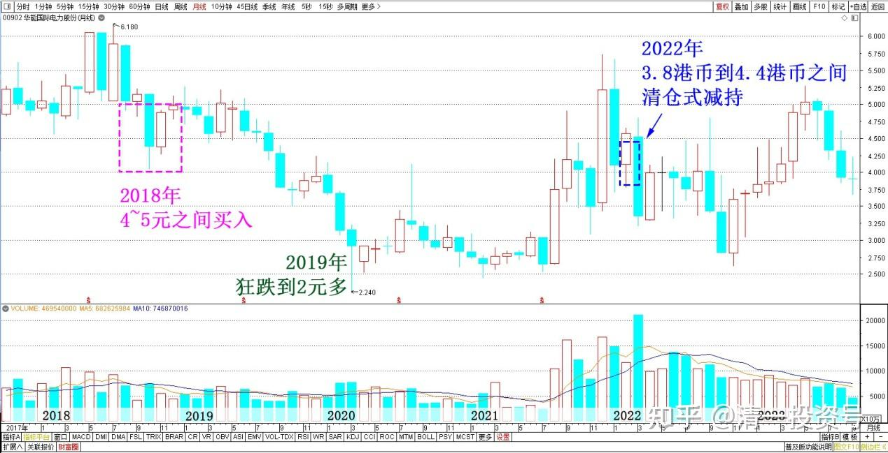
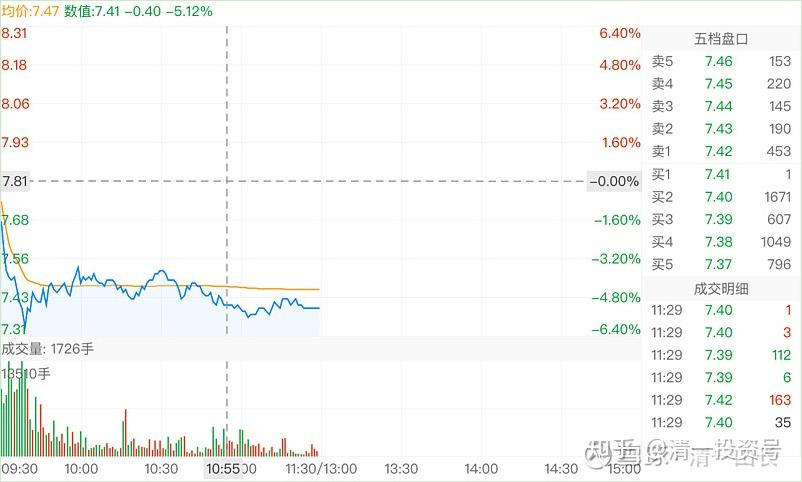
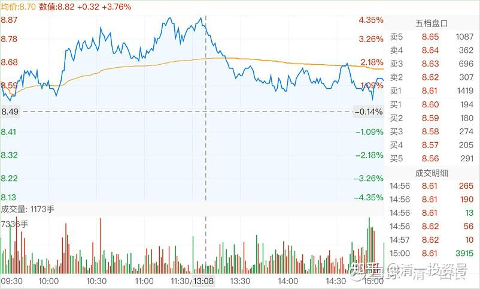
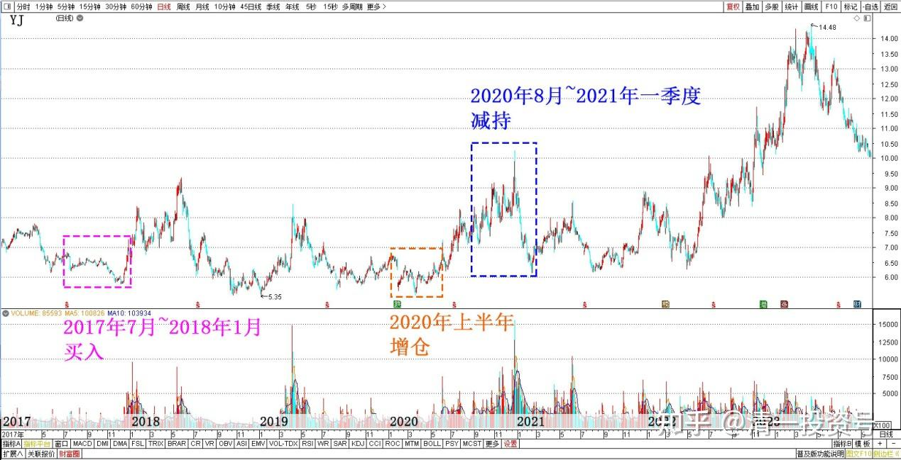

专篇25.裘国根清仓式减持华能国际电力港股

清一山长 2022年3月2日

今年看到一个消息：裘国根夫妇和重阳集团，正在快速减持华能国际电力港股，这两个月就减持了7亿股，大约是收回了30个亿的资金。据说是清仓式减持，减持价格在3.8港币到4.4港币之间。我查了一下重阳是什么时候买入的这些货？一查不得了，他们在2018年就买入了54亿港币，占当时港股总市值的23%的比率，算是一笔很大的投资了。我看他们在2018年买入的时点，价格一直在4～5元之间徘徊。后面2019年，突然狂跌到了2元多。现在股价对他们2018年买入的人来说，只是刚刚回本，还没算上利息。

*华能国际电力股份2018～2023年月线*

裘国根这样就赶快减持了？这伙计，我很难理解他在干什么！现在减持华能电力，看起来也很不对劲。因为未来电力需求旺盛是明盘，新能源车的大量销售，给电力造成的需求缺口，近几年是不可能弥补的，电力企业的未来是可以稳收入的，为啥现在要大量减持，清仓式减持？只能说他根本就不看好电力的前景。当初买入的逻辑是什么？现在逻辑改了吗？联想到重阳在YJ的清仓式减持，现在回过头来看，就是一笔糊涂账，完全没有正常的投资逻辑。我认为：裘国根不至于这个基本的投资思维都没有，自己重仓介入的股票，刚回本就狂卖？倒像是故意打压市场一样。难道是有人授意的吗？毕竟他的钱是有金主的，难道要听从金主的旨意来进退？反正：如果YJ跟着裘国根的节奏来做，肯定亏死[滴汗]。

**附录：**

**清一山长 2018年1月22日**

我终于找到YJ的庄家了，我也知道，去年下半年YJ为何跌，以及YJ五元多破底的价格是谁干的了。我一直在纳闷，去年底是谁这么大方，砸出来这个多年不见的大坑，把所有买YJ的人，账面全都带上了厚厚的绿帽子？原来是——裘国根，对，就是他干的！

晒晒证据：

资料：在公告前的6个月，裘国根曾在**2017年7月4日至2018年1月10日，买入109,911,690股YJ股票，买入均价6.75元**。（7元多他也在大举买入。估计涨停价也是他拉的）。但是，谁在去年底打压YJ价格的？谁制造了5元多破位下跌，卖出的YJ股票？也是他！

看资料：2017年8月24日至2017年12月29日，裘国根又卖出YJ2370万股，卖出均价6.08元。均价都是6.08，可见从7元砸到5元多，平均价格接近6元，可见很多股票就是五元多卖出的。不是他制造的破位是谁在卖的？他坐这个庄，真心不容易呀，要自己高价买，再低价卖。你说他的YJ账面能好看吗？我的成本比他低，账面都很难看，浮亏都达7位数。何况他的账面了，浮亏至少是9位数。因为他高买低卖，账面更绿。现在也没赚几个钱。以老裘的脾气，起码要十元以上，他才愿意卖（不排除他太有钱了会乱撒红包，有可能五元多就派给你们了，原来他就做过，难说以后也会送红包给大家。你们要学我一样，老裘撒红包的时候，要接住红包，别自己躲起来，不敢见人，当然就没红包了）。

买入情况：

日期买卖数量（股）均价（元）2017/7/4-2018/1/10109,911,6906.75

卖出情况：

日期买卖数量（股）均价（元）2017/8/24-2017/12/2923,697,0716.08

裘总：您五元多买的YJ，我接了大几十万，接近百万股了。还不算原来被套牢的底仓。感谢您的大力支持。我以后就跟定你了！以后你拉高出货的时候，别忘了通知我一声。我会把五元多从你手上买的YJ筹码，再恭恭敬敬的还给你，帮助你实现控盘！

（纳闷：高价买，低价卖，难道证监会不会判他“操纵市场”吗？我可不敢干这事，胆子小，也没后台支持，还亏不起）

**清一山长 2021年1月11日**

权益变动报告书显示，**2018年1月11日，裘国根的重阳集团买入1348万股[YJ](http://link.zhihu.com/?target=https%3A//xueqiu.com/S/SZ000729%3Ffrom%3Dstatus_stock_match)股票，买入均价7.285元**。重阳投资及其一致行动人合计持有YJ股票占比达到5%。今天的YJ，最低价7.31元。

真佩服重阳：拿了三年YJ，赚了每股0.12元。我想问裘总：您的资金利息，够不够支付的？

YJ到底在玩什么？我们真不知道。在[YJ](http://link.zhihu.com/?target=https%3A//xueqiu.com/S/SZ000729%3Ffrom%3Dstatus_stock_match)销量和利润，都取得正增长的时候，股价却与3年前YJ根本没有啥好出路，一片茫然的时候相比是一样的。您觉得正常吗？

也许，YJ真的会破五？

我不知道，但我决定坚守！我不亏谁亏？你们走吧！我负责善后，只要你们安全就好[加油][大笑]。

**清一山长 2020年8月28日**

研报的财务数据，我没仔细看。只知道一个关键点：一季度的几亿元的亏损，二季度全部补充回来了。二季度的盈利，基本上相当于去年上半年的盈利总和。说明很简单：YJ的市场经营没问题，盈利能力没问题。一季度的巨亏，是财务洗澡。半年报利润大幅减少，其实并不是真实的公司经营状况。公司经营非常的正常、良好。还有一个重要的看点就是：重阳继续增仓，十大中有四大，都是重阳的基金。这些基金，都是独立管理的。基金经理人都一致看中重阳，都进了十大，意味着重阳对YJ的研究结果，未来前景判断，是得到了内部团队一致认可的。当然，我们看不到这些报告和追踪，但可以从结果来看，是最真实的，而我们知道重阳的各团队都是一致看好，而且是极度看好YJ，才会如此集中地买入YJ。在其他的重阳概念股里面，没发现如此集中的买入现象。**这几家重阳基金，本报告期（上半年）都全部增仓了，总共增仓三千多万股**。我也是，在二季度、三季度都在增仓YJ，共增加了一百多万股。比我当珠江和惠泉十大两个最高的峰值加起来还高。今年是我的啤酒年，现在的啤酒仓位，只增不减！板块内换仓增加利润，我建议各位一个偷懒地看财报的方法：重阳的团队，绝对是最会看财报的，他们一致看好，问题就不大，基本上没有雷。当然，如果半年报出台后，YJ已经大幅上涨，说不定他们现在就已经走了。但是，目前为止，YJ并未大幅上涨。价位还在原地盘桓。2016年9元都没走，后来的两次8元也没走，难道现在会走吗？所以，可以肯定重阳团队都还在，他们对YJ经营状况，以及YJ的前途判断，依然是有效的。你我认为自己的脑子不够用的，财务分析能力，市场分析能力不够的，就借用重阳用多少亿的现金买出来的答案就行了，您还一分钱的咨询费都没费。就等什么时候重阳撤退了，我再跟着撤退好了。由于持仓数量巨大，他不太可能一个季度就撤退光的。实际上，我的判断是：YJ将是重阳长期持有的一个股票。我也跟着长期持有好了，只是一路上做一点T，飞了就下车认输！这叫做“跟随国王散步”。

还有：我的一个怀疑。恐怕就因为重阳几年了，还没有吃够，所以YJ不涨。每次涨，可能都是重阳打下来的。打下来之后，又继续吃进更多的股票。现在他可能基本上吃够了，应该开始涨了。

第二个重要线索：重阳的这些基金，很多是通过信用账户来持有的YJ。也就是说，很可能是通过融资买入的。重阳的基金经理们，愿意用融资每年都要增加5.5%左右的持仓成本，来重仓一个不赚钱的股票吗？除非重阳是傻瓜！两年多前，重阳买入的YJ成本是7元多。现在如果算上资金成本，依然是亏本的。所以，各位可以放心持有，我一股不卖，跟定这个国王了。

财报信息转载：

公司前10名股东中，#重阳集团有限公司通过信用交易担保证券账户持有本公司股票80,950,456股,通过普通证券账户持有本公司股票11,220,172股，合计持有本公司股票92,170,628股，其持股在本报告期增加14,700,204股；#上海重阳战略投资有限公司通过信用交易担保证券账户持有本公司股票39,083,793股,通过普通证券账户持有本公司股票0股，合计持有本公司股票39,083,793股，其持股在本报告期增加7,600,022股；#上海重阳战略投资有限公司——重阳战略聚智基金通过信用交易担保证券账户持有本公司股票27,000,142股，通过普通证券账户持有本公司股票100股，合计持有本公司股票27,000,242股，其持股在本报告期增加6,000,031股；#上海重阳战略投资有限公司－重阳战略汇智基金通过信用交易担保证券账户持有本公司股票26,961,467股，通过普通证券账户持有本公司股票100股，合计持有本公司股票26,961,567股，其持股在本报告期增加10,000,074股。

**清一山长 2020年11月5日**

重阳的减持，是一件非常怪异的事情。刚开始我以为是今天的，**减持了三千多万股**，但今天的盘面成交才四千八百万股。似乎比例太大了。这么大的比例，勉强压住股价不大涨，也够不容易了。后来仔细看，是**从8月24日就开始减持**了。到今天减持超过1%才公告的。而**8月24日，YJ根本就没涨呢。才7.46的收盘价**。这么长时间，三个多月，减持这么一点也不够。而且价格根本就是重阳的持仓价附近。没啥盈利的。更奇怪的是：**9月底公布的股东名单，重阳系是“未变”**，是不是三季度只是减持了100股？几乎忽略不计？

不过，最近一周多，盘面明显是减持出货的迹象走势，特别是今天非常的典型。我也在纳闷：这YJ在玩什么，还没到出货的时候呀？我认为可能：重阳减持最多的一天，可能是今天。但可以肯定，重阳没有到出货点。YJ，绝对不可能低于珠江的市值。因为YJ要比珠江价值高一倍，甚至是两倍。重阳不会这笔账都算不清吧？

另外，重阳战略，重阳集团的持仓量都更高。为啥没有减持？一股未少。反而是重阳持仓最少的重阳投资减持了？是不是重阳故意向外界展示什么态度？（外围不参与YJ的原因，会不会就是重阳态度不明朗？重阳此举表达某种跟外围的配合态度？）

如果我心中想的是正确的的，明天的走势，就是低开，然后震荡，向上走。这才符合重阳减持的目的。如果明天走势是一路向下的，说明我的判断失误。需要重新考虑。但目前这个价格，就算是重阳放弃了，我也不会放弃的。YJ现在是五年来最好的时刻。没理由放弃的。除非YJ给我五年来最好的股价！

哀叹：我对YJ，看好的程度远远超过惠泉。现在看来。真不如买惠泉靠谱，如果把YJ的仓位全部换成惠泉，我都要赚死了！可惜今天我涨停卖出惠泉的钱，都用来加仓了YJ。最低8.56元买入。不过反正是昨天减持YJ换的股，今天换进来我也没吃亏。如果我昨天没有减持YJ的话，我今天也没这么多惠泉可以卖的。这操作没毛病。只是我猜：如果我知道重阳会卖的话，可能今天就啥都不买了。[滴汗]

**清一山长 2020年11月20日**

**重阳再度减持了4000多万股**。重阳真的是决心要把自己的品牌毁到底呀！不可思议！

看重阳减持期间的这十来天就知道：他是低位减持的。我强烈地认为，11月12日的走高，惠泉和珠江涨停，YJ成交量大增，但最终涨幅落后的原因，就是有市场资金进来抢筹，但重阳用“疯狂减持”来试图打压股价。结果是自伤，丢掉了大量的筹码。甚至13日直接跌回原地，应该也有重阳减持的“功劳”。积极打压YJ。今天YJ刚涨了，赶快又出来一个减持的公告，明显就是不想让YJ涨。一家大名鼎鼎的私募公司，就不怕这样公然的跟市场反向做，特别打自己的脸吗？我绝对不相信YJ有啥“巨雷”要爆。这种企业，想要去故意破坏都很难的。而且，就算是YJ的工厂全部被火烧了，他很快就可以东山再起的。这就是品牌企业，快消品的特性，不可能像科技成品一样被代替的。**重阳三年前，7元多进入YJ。现在8元多高调出让YJ**，只有疯子，或者故意要搞事的阴谋家，才会这样做。背后一定有不正常的私下交易！

今天的上涨，也是很奇怪的。涨五个点，并不多。也是因为惠泉，珠江上涨，YJ被动跟涨的。但奇怪的是：YJ上涨似乎特别吃力。成交量特别的大，比YJ涨停还大，今天七个多亿。要么就是抢筹，要么就是换庄。而且很可能重阳今天还减持了。今天的一些单子特别大，一分钟成交中，100万股的大单子很多，下午14:14分，一单拉7分钱，190万股。但也被打下来。典型的多空分歧很严重的样子。重阳真的想要减持，无论在12日的走高中，还是今天的走势中，都可以借做多的力量顺势上攻，再顺势调整。比如惠泉的走势。现在这种走法，就是把市场当弱智儿童看了。明目张胆地耍小股民。吃相太难看了。

留此贴为证：未来YJ跌惨了，算是重阳英明。提前知道内幕，提前走人，高明，我佩服！并为今天对重阳的不敬道歉！

如果未来YJ涨了，重阳现在所做所为，就是小人的行为。是吃相特别难看的操盘行为。是故意影响市场价格的操纵行为。

孰是孰非？看未来的YJ走势来判断吧！

**[陈乃兵](http://link.zhihu.com/?target=http%3A//xueqiu.com/n/%25E9%2599%2588%25E4%25B9%2583%25E5%2585%25B5)回复[清一山长](http://link.zhihu.com/?target=http%3A//xueqiu.com/n/%25E6%25B8%2585%25E4%25B8%2580%25E5%25B1%25B1%25E9%2595%25BF):**

YJ一季报二个[亮点](http://link.zhihu.com/?target=https%3A//xueqiu.com/S/CELL%3Ffrom%3Dstatus_stock_match)，预收款10.16亿，历史同期最高，经营现金流8.42亿，历史同期最高，在等待想买低价的股友，可能要失望了

**清一山长 2021年4月29日回复[陈乃兵](http://link.zhihu.com/?target=http%3A//xueqiu.com/n/%25E9%2599%2588%25E4%25B9%2583%25E5%2585%25B5):**

[献花花][很赞]。相信常识。YJ U8到处缺货，居然交出一个一季报严重不及预期的财报，亏本的财报，让人大跌眼镜。其实，是把业绩藏在“预收款”里面了。经营现金流历史新高，明显说明YJ正处在爆发前夜！半年报，可能业绩爆冷，丑小鸭变天鹅！

**一季报，重阳全部消失了**。唐建华稳稳的一股未少。这个人，看样子比重阳更牛！还新进了一个自然人。半年报，看样子我很有希望进YJ十大。只要惠泉配合一下就行了[大笑]。

*YJ 2017～2023年日线*

文章音频链接：

[378篇.裘国根清仓式减持华能国际电力港股_清一投资号文章同步音频_免费在线阅读收听下载 - 喜马拉雅](http://link.zhihu.com/?target=https%3A//www.ximalaya.com/sound/670436708)

**参考链接：**

专篇1 [306篇.前缘1.雪球的最后一贴--胜利曙光都已经出现](http://link.zhihu.com/?target=https%3A//xueqiu.com/2017773236/247159187)

专篇2 [307篇.被特别关照的股--前缘2](http://link.zhihu.com/?target=https%3A//xueqiu.com/2017773236/247387457)

专篇3 [308篇.立此存照--前缘3](http://link.zhihu.com/?target=https%3A//xueqiu.com/2017773236/247580614)

专篇4 [309篇.见识传说中的拖拉机账户](http://link.zhihu.com/?target=https%3A//xueqiu.com/2017773236/247973779)

专篇5 [310篇. 拉升在即](http://link.zhihu.com/?target=https%3A//xueqiu.com/2017773236/248351982)

专篇6 [311篇. 进入右侧投资时代](http://link.zhihu.com/?target=https%3A//xueqiu.com/2017773236/248658236)

专篇7 [313篇. 小主力进货的阶段](http://link.zhihu.com/?target=https%3A//xueqiu.com/2017773236/249221851)

专篇8 [316篇.两轮回调对比](http://link.zhihu.com/?target=https%3A//xueqiu.com/2017773236/249675370)

[专篇9.主力的水军](https://zhuanlan.zhihu.com/p/619400004)

[专篇10.主力完成筹码收集](https://zhuanlan.zhihu.com/p/629948708)

[专篇11.主力、游资、右侧投机客纷纷进场](https://zhuanlan.zhihu.com/p/631628731)

[专篇12.进入震荡期](https://zhuanlan.zhihu.com/p/633057526)

[专篇13.永远回避风险，不亏损第一](https://zhuanlan.zhihu.com/p/635191087)

[专篇14.高位十字星缩量及主力操作的三个阶段](https://zhuanlan.zhihu.com/p/635191930)

[专篇15.准备起跳](https://zhuanlan.zhihu.com/p/636886203)

[专篇16.大幅回调，老手加高手](https://zhuanlan.zhihu.com/p/638552635)

[专篇17.股东数所传递的信息](https://zhuanlan.zhihu.com/p/639002631)

[专篇18.突](https://zhuanlan.zhihu.com/p/640000051)[破9元是燕京的基本目标](https://zhuanlan.zhihu.com/p/640000051)

[专篇19.YJ、惠泉今天盘面语言对比](https://zhuanlan.zhihu.com/p/640550916)

[专篇20.暗示洗盘快结束](https://zhuanlan.zhihu.com/p/641509884)

[专篇21.现在是新主力的成本区](https://zhuanlan.zhihu.com/p/642330561)

[专篇22.成熟投资者的思考方式](https://zhuanlan.zhihu.com/p/655404597)

[专篇23.主力未走，迟早变盘](https://zhuanlan.zhihu.com/p/656816805)

[专篇24.涨停但不像拉升出货](https://zhuanlan.zhihu.com/p/657944680)

