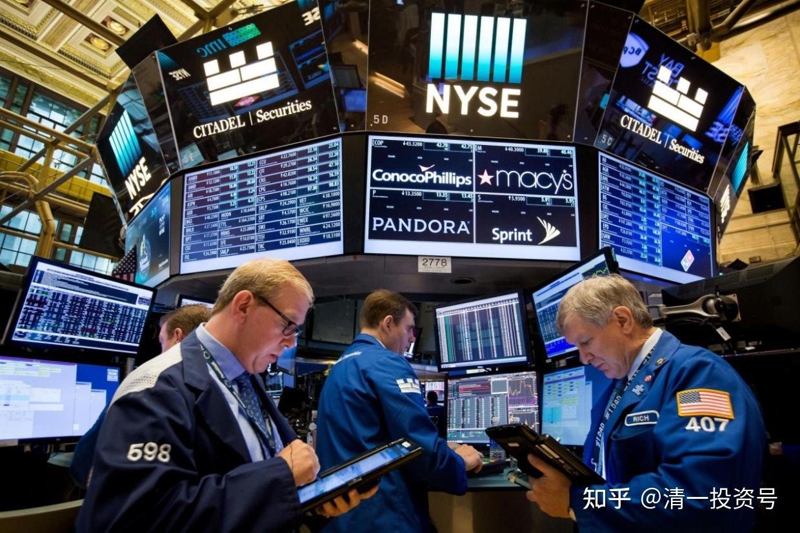

56篇.今日网校课程：华尔街金融专员赚钱之道（6）合法与不合法诈骗的区别

清一山长 2016年9月6日

**第三题：最近六年，她离开华尔街之后，估计是什么样的心理和念头，使得她走上了诈骗的道路？她到底做了什么本质上与前面的十年不同的事情？导致了她最终彻底的改写人生？**

第一条：她离开了华尔街，但是她没有离开华尔街的思维模式；可是她忘记了她现在脱离了团队，她是一个人，所以她个人承担了一切的风险，因此她就变成了一个罪犯。而华尔街可以合法地诈骗人，但是个人不能够合法地诈骗人，对还是不对，这就是基本常识。

华尔街有一条就是“真诚的诈骗”，什么叫“真诚的诈骗”？刚刚我已经说了瑞士银行的例子，是不是？明明你被它诈骗了，你还在那干瞪眼，你还拿它没办法。只要你事先没问清楚，你突然把钱打到它的账户上，你会发现怎么你的钱会越来越少。然后你能不能说它在骗你？不能！因为它有一整套的合同，很厚的一个东西，说得清清楚楚的，它就是这样干的。我怎么算都不划算，每个月收我那么多的账户管理费，一年差不多十来万，然后我说：“天哪！汇丰银行的380元/月，我都嫌贵了，你们嫌不嫌贵呀？”然后你说山长你钱多，是的，我有上千万。这钱存在里面，380元相对1000万来说无所谓，对不对？但是我还是觉得380元也是钱啊！对不对？ 380元还是可以买农业银行，可以买一百多股了，对不对？我会不会这样算账？我就是这样算账的，一个月一百多股，那一年不就一千多股，然后我就送给它了！我怎么算都划不来。所以我还是喜欢中国的银行，中国的银行不收我这笔账户费。

如果收八块钱，我觉得也还可以接受，但这是不是叫合法诈骗？可是你个人就不能合法诈骗了。比如我跟张钟瑞说：“张钟瑞，把你的钱放在我这，每个月收你200块钱账户费。”你说凭什么？那等于不就是明摆着我抢你的钱吗？对不对？我抢你的钱、我帮你保管钱，但是你每年给我那么多钱，每个月都给我。所以作为个人，如果你这样去说就变成了诈骗，对不对？

作为一家企业，特别作为一家知名企业，它这样说那是什么？那是行规，所以我把它叫做合法诈骗。特别是别人的服务费只要万分之几，你居然给我要千分之五——十倍！我万分之五的那个交易费我拿得到，只不过我懒得去交涉了，因为我交易很少，但是我交易再少，我也不愿意多付八倍的交易费，对不对？可是他说这是行规，我们是瑞士银行、我们是高级银行、我们是全世界的知名银行，所以你就应该付那么多。我说我不打钱给你，我不进去了，我知道是你的规矩。刚开始他没告诉我这些东西噢！他还吊我的胃口，吊了我几个月，我申请了几个月之后，他说经过我们严格的审核，我们觉得你是我们合格的客户，所以我们已经给你开了户了。然后，拿来一大沓文件给我看，我一看这一堆文件，看晕了。我说：“天哪！这么贵的费用，我不能接受这个费用。”

他说：“可以理解，如果你不愿意做就算了。”很高傲的样子。你高我也高，反正我的钱不给你赚。所以朴海娜做的事情跟她在华尔街做的事情是一样的，她肯定就是这样做的。但是她忘记了她已经失去了庇护、失去了平台，也失去了约制，所以她就变成了疯狂。她和华尔街本质上是没什么差别，但是由于包装的差别导致了不一样的人生。

**第四题：哈佛大学毕业的大多数学生，都会进入咨询行业和华尔街就职。但名校的专业人员如此下场，说明了什么实质问题？**

说明世界上的傻瓜多，甚至也说明了这些大学经常培养出夸夸其谈而不是务实的人，特别在商业上或金融上最需要务实。但他们进入这些地方却是因为这些地方最容易糊弄人，这也是大家最容易搞不清楚的，他只要拿出某种模型、某种理论，就可以把人弄晕。我一听这个人说话说得我晕，我就不听他的。

我告诉你们一件事情，我去证券公司时，因为我是高级客户，一个副总经理告诉我，他在做一个模型。这个模型如何、如何，说得天花乱坠，可以帮客户理财。他也知道我的资金比较多，也希望他帮我理财，然后说他如何、如何的日内交易，如何、如何的东西，这样可以赚钱。我算来算去，我听晕了，最后我说：“我听不懂你说的东西，所以我的钱不拿给你，但我支持你。”

听懂了吗？就是说你听不懂，不要认为你蠢，可能是你碰到了骗子。有时候可能是你蠢，但是在金融界、商界，有人说的东西说得太天花乱坠了，你要小心，可能是他想忽悠你。他说如何如何好，特别是世道不好的时候，很多人真的有钱，就把钱拿给他了。他也希望我拿一部分钱给他，他跟我说，你的资金那么多，反正都能赚钱的，拿出一部分钱，让他们去做。我才不干，因为我算他那个东西有很多的不对，他每天都在拼命的交易，快速交易、频繁交易。

告诉你们一个例子，这种行业，我认为他在干什么事情，我知道他在干什么。有一个人他拿了100万资金，进入市场，然后拿给经理帮他交易。这100万过了一年之后，正好碰到个大牛市，这100万赚了10万，还不错吧？

山长：**(学生1)，你觉得怎么样？

学生1：100万能赚十万？

山长：也算不错了吧？

学生1：还可以吧！

山长：而且是一个牛市。并且他收的费用也不高，赚了钱他说我只收你2%的管理费。所以，你拿他也没脾气。但是这个账户创造了上亿元的交易额，为这家证券公司创造了上百万的交易费。

山长：听懂了怎么赚钱没有？

学生2：没听懂。

山长：没听懂？张钟瑞，你说吧！听懂了没有？

张钟瑞：因为他每交易一次都要收这部分的管理费，他都要不断地购买，又买又卖，每进行一次操作就要给一笔钱，这样反复的操作，所以上百万给了证券公司。

山长：合法地为证券公司赚到了钱，客户资金也还不错，没有亏损。因为正好碰到了牛市，但是为客户赚的钱是很稀少的。所以他高频交易，不停地倒买、倒卖，赚点小钱。但是他创造了很多交易费。

这种事情也发生在吴*身上，当然他是自己给自己这样干的，它的交易费是万分之一，够低的吧？有一年他说他这一年总共赚了500万元，但是他给券商交了1500万元的交易费。如果这个是万分之三呢？比如这个客户可能给他设置万分之三的交易费，那么他就要出更多的钱。如果他赚的是500万，他要出更多的钱。所以这家券商根本不在乎赚你的账户管理费，那笔钱太少，少得他根本看不起。但是他可以用你这笔钱，用这种技术高频交易，不断地赚你的钱。后来我搞清楚了，那个经理跟我说了半天，他说的就是这种交易模式，让我拿钱给他，他其实要赚我的交易费，把我的钱拿去做高频交易。可能他那个配对的确也可以配对到你不会亏损，但是你也绝对赚不了大钱，最多就赚百分之十吧！

港股我算过账，我买了一些股票，只要涨2分钱，甚至涨1分钱，我都可以赚到钱。因为交易费大概只有0.3厘、0.4厘。所以我可以干一件事情，我在高1分钱那个地方挂个卖单，在低1分钱这个地方挂个买单。到下面在低1分钱买，上面高1分钱卖，而且股价也比较低的情况之下，当然只要一两块钱的股票可以按这样买卖，这样就可以不停地赚这个钱。我看农业银行就是这样，农业银行两块多一股，所以很多人就挂了这种1分钱的单，它会走成那个线，像纺织机织布，人们叫“织布行情”，织布行情就是这样。但是他一开始就给你挂一个大大的买单，同时一开始就给你挂一个大大的卖单，他就利用这1分钱差价赚钱。第二天再涨1分钱，他也用这个赚钱。第三天，再跌1分钱，他也利用这个赚钱。在这个过程当中，大量的钱变成了消耗——交易费、手续费，但是只有很少的一点点利润。

有时候1分钱的交易费当中，可能有6厘钱是交易费、手续费，其它4厘钱留给你，甚至3厘钱留给你。但只有3厘钱留给你，也保证你亏损不了。对还是不对？所以他告你包赚不赔，如果赔了他负责，这钱给你，你就相信他，拿给他赚，结果就是你帮他赚了大钱，但是你得了小钱。所以高频交易，就是干这种事情的。

我认识他20年，他还继续来忽悠我！你们有什么感觉？他没告诉我怎么回事，他把它说得特别复杂，后来我自己把它琢磨清楚了。一句话，你看我现在一句话就能告诉你们：“真传一句话，假传万卷书”。脑子不够用会怎么样？脑子不够用，你的关系、你的客户，平常对你殷切、巴结你的客户经理，都在忽悠你。

我听了半天，我说太复杂了，我理解不了。我就问他到底怎么赚钱的？你可以告诉我赚钱模型啊！但他的模型他不能这样说，他这样说，他知道我马上就不干了，对不对？他就把它说得特别复杂，把我都听晕掉了。很多客户听晕了说，好好好，算了算了拿给你，你们先做做看。我说我听不懂，所以我不做。后来我几乎不跟他讨论这些怎么赚钱，我说我自己赚，但是他们看到我的业绩很好，所以他们也不太找我。他们知道找我忽悠很难忽悠的，因为已经连续找我20年都没有忽悠成功。

文章音频链接：

[377篇.今日网校课程：华尔街金融专员赚钱之道（6）_清一投资号文章同步音频_免费在线阅读收听下载 - 喜马拉雅](http://link.zhihu.com/?target=https%3A//www.ximalaya.com/sound/669816533)

**参考链接：**

[39篇.今日网校课程：查理•芒格的成功秘诀1——逆向思维](https://zhuanlan.zhihu.com/p/641398367)

[41篇.今日网校课程：查理·芒格的成功秘诀2——清一派成功学思维模式](https://zhuanlan.zhihu.com/p/642327054)

[43篇.今日网校课程：查理·芒格的成功秘诀3——理性（1）](https://zhuanlan.zhihu.com/p/642327095)

[45篇.今日网校课程：查理•芒格的成功秘诀4——理性（2）](https://zhuanlan.zhihu.com/p/643847923)

[47篇.今日网校课程：查理•芒格的成功秘诀5——自尊](https://zhuanlan.zhihu.com/p/643859353)

[50篇.今日网校课程：华尔街金融专员赚钱之道——朴海娜课题课前作业](https://zhuanlan.zhihu.com/p/650492818)

[51篇.今日网校课程：华尔街金融专员赚钱之道（1）西方金融业的本质](https://zhuanlan.zhihu.com/p/651194732)

[52篇.今日网校课程：华尔街金融专员赚钱之道（2）西方金融业的游戏规则及应对之策](https://zhuanlan.zhihu.com/p/653593258)

[53篇.今日网校课程：华尔街金融专员赚钱之道（3）中美的投资环境有什么差异？](https://zhuanlan.zhihu.com/p/654959008)

[54篇.今日网校课程：华尔街金融专员赚钱之道（4）中美金融行业未来的趋势发展](https://zhuanlan.zhihu.com/p/656346276)

[55篇.今日网校课程：华尔街金融专员赚钱之道（5）华尔街金融公司及员工到底靠什么本事赚钱？](https://zhuanlan.zhihu.com/p/657078439)

