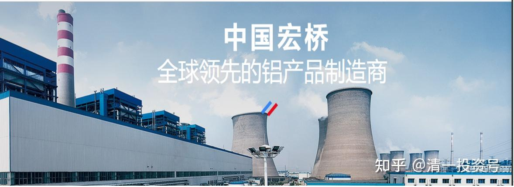

2篇.中国宏桥系列之二：安全边际及基本面分析

清一山长 2016年01月-03月

**导读：**

一、铝炼制业务全球格局的变化

二、中国宏桥通过供股增加持股量

三、中国宏桥的竞争力：五百强排名上升

四、中国宏桥极为牢固的护城河

**正文：**

**一．铝炼制业务全球格局的变化**

清一山长 2016-01-10 18:23

$中国宏桥(01378)$ 资讯：美国铝业被“摧毁”VS魏桥的庆功会

[https://business.sohu.com/20151104/n425238238.shtml](http://link.zhihu.com/?target=https%3A//business.sohu.com/20151104/n425238238.shtml)

127年历史的美国铝产业被中国摧毁在国际铝价接近六年低位之际，美国铝业公司（Alcoa，“美铝”）宣布大减产能，美国全国炼铝将因此减少约三成。彭博新闻社为此亮出了“127年历史的美国铝产业被中国摧毁”的标题。

本周一，美国最大、全球第三大铝材生产商美铝宣布，将削减冶炼铝产能50.3万吨和氧化铝精炼产能120万吨。全球铝业分析与预测机构Harbor Intelligence估算，美铝削减的50.3万吨产能约占全美原铝冶炼产量的31%，但还不到全球总量的1%。**十多年来，铝炼制业务一直在向生产成本较低的俄罗斯、中东和中国转移**，全球供应过剩导致去年铝价大跌27%，使美国铝产业无利可图，加快了这一行业的消亡。

**二、中国宏桥通过供股增加持股量**

清一山长 2016-01-10 18:34

等美铝破产了，才轮到俄铝破产。俄铝破产了，才轮到中铝破产，要等中铝等都破产了，恐怕才轮到宏桥破产吧？这帖子，恐怕搞反了破产次序。宏桥这个配股价格很奇特，似乎就是不想要小散参与配股的。如果宏桥明天开盘下跌，10%以上，本人就继续买入，与大股东共存亡。就不等中铝破产了。

清一山长 2016-01-10 18:41

公告：本次供股的包销商为招银国际及宏桥控股，宏桥控股已同意包销至少99%余下股份，其余则由招银国际包销。包销商将不会就包销商同意认购或促使认购的包销股份收取任何包销佣金。**假设没有小股东参与供股，宏桥控股的持股量将由78.51%增至81.13%**。

[http://static.cninfo.com.cn/finalpage/2016-01-08/1201904317.PDF](http://link.zhihu.com/?target=http%3A//static.cninfo.com.cn/finalpage/2016-01-08/1201904317.PDF)

分析：这份东西，几乎摆明了是想让自己的持股量增加。明天如果再下跌一下，散户就绝对不参与配股了。想要增仓的人，宁可更低价在2级市场买入。周五尾盘突然打下来，应该就是这个目的。宏桥控股将通过这次增发，增加了控制力。（不过，比例已经很大了，再增加下去，就要私有化了）

**三、中国宏桥的竞争力：五百强排名上升**

清一山长 2016-01-22 21:18

$中国宏桥(01378)$ **今年的最新世界五百强排名，山东魏桥集团从原来的279名提升到了今年的234名**。其竞争对手中国铝业，排在240位（从去年227位下降了）。是新“亏损王”，成为今年世界500强中亏损最多的中国公司——2014年营收虽高达454.45亿美元，但，2008年-2014年扣非利润分别为（人民币）：-1.23亿、-50.15亿、1.12亿、-3.29亿、-86.80亿、-78.07亿和-173.42亿。对比之下，可见中国宏桥的超强竞争力。中国铝业累计近四百亿的亏损，敢于持有它的人，才是最应该担心未来的。如果中铝垮了，才轮到魏桥。不过假如中铝真拖垮了，反而宏桥的反转机会就来了……因此，宏桥的安全边际足够高，不怕行业倒闭潮。

@人淡若菊 2016-01-24回复@清一馆长：

没什么可以称赞的。这种优势本身就是不合理的。其他企业要缴纳过网费。仅此优势，成就了一个企业。

清一山长 2016-01-24 15:23 回复人淡若菊：

把宏桥的优势，简单地说成是免掉了过网费的优势，恐怕把张士平和宏桥都看得太简单了。他在行业低谷期间的扩张路径，以及把握行业低谷并购的手段，以及内部管理，执行效率，员工忠诚度，以及把一个平淡的行业研究深，做透的眼光决心等等，都是可圈可点的。其他企业无法比肩。至于铝产品，这个行业比钢铁行业要容易走出低谷。首先就是“中国优势”会迫使其他国家的铝产业破产，让出铝产能的空间来。与钢铁业不同。钢铁过剩由于过于严重，前期投资过多，目前属于我认为不能碰的品种。大宗商品低迷，可能对铝的影响是最少的，因此不怕长期持有。反正我跟随大股东加仓了，它4.31元增发，我放弃增发额度，但在3.86元，3.91元买进二级市场的股票，比配股增股划算。把贵的新股让给大股东多出点钱，也帮助二级市场回收流动性。

不过，BDI的确会影响宏桥的成本。不过----如果这份成本它增加了，其他厂家也一样。因此不用担心宏桥的竞争力因此而下降。甚至汇率对他的影响也很小，因为铝产品是“国际产品”。

清一山长 2016-02-18 15:25

实际上小股东比大股东更有选择权，因为完全可以在低价买入更多的股份让自己不被稀释。供股消息出来后大跌，我就在前期3.89元增仓了不少头寸，超过供股要求数倍，不但没稀释，还低价增厚了股权。而大股东只能按条约4.31元买入，今天看是大股东赚钱了，前几天便宜，你们为何不买呢？

我就看中了张士平踏实的经营作风。既然来当股东，就别指望赚大股东的钱。而是大家共同赚企业发展的钱。否则也没有必要当夹头，买入宏桥的人，肯定跟买创业板的那批人不一样。目前宏桥是我港股第一重仓，且是唯一的冶金行业股，市场低估是最重要的持股理由。

**四、中国宏桥极为牢固的护城河**

清一山长 2016-03-02 21:43 转发

@净空聪 2016-01-07 16:40

《中国宏桥研究结论摘要》链接[https://xueqiu.com/2029742712/63186030](http://link.zhihu.com/?target=https%3A//xueqiu.com/2029742712/63186030)

**铝电网一体化+上下游整合+原料全球化战略，极大的拉开了与中铝、中电投、信发等的经营差距，形成了极为牢固的护城河**，在铝价下跌、行业亏损严重的大环境中，依然依靠成本控制和原材料（铝土矿、氧化铝）的全球化战略（绕开中铝对国内矿源的控制在几内亚、澳洲大量进行原料投资并通过自投临近港口的优势获取竞争力）获取了巨额利润，预计2015年下半年获利仍然不错，2016年因为整体行业情况或许还有些艰难的情况需要面对，另外因其经营者的战略方向极具前瞻性，这主要体现在董事长和CEO对于成本控制和市场布局的深入贯彻，市场布局提现在专做“政府不鼓励”的事儿、专在市场低迷的时候扩大经营（现在就是在干这事），另外还有经营三板斧的坚持，如其中的“快”（快速抢占资源）“高”（只要高品质）“低”（低成本的经营提升经营周转效率，宏桥的每吨电解铝成本较同业低3800元，其中来自电费方面的2800元、原料运输包装的200元、销售液态非锭块电解铝的300元，以及高周转率带来的500元）的理念，从而在生产成本上实现了极大的但总体趋势极为看好，中长期投资，可在3.7-4.2之间进行买入，估值看高到2-5PB。

优势：

第一，成本控制和经营效率核心竞争力之一：主要体现在自建电厂的投入（目前80%自供，其他从魏桥集团内优惠价购入，预计2021年可全部自供），并将生产基地布局在自建电厂周围，节约调度和外购的成本，目前在电解铝行业里头，中铝、信发、东方希望都无法与其媲美。（据测算，中国宏桥自发电成本低于行业平均电力成本约0.20元/度以上。）

第二，成本控制和经营效率核心竞争力之二：节省用电，中国平均电解铝耗电是14000度，而宏桥的电价铝耗电是13500度，但是公司的试验槽的平均耗电是12500度。世界最先进的电解铝试验槽平均耗电是12300度，是挪威的一家公司，宏桥与之已经有意向对彼此开放技术，这是第一家这么干的；

第三，成本控制和经营效率核心竞争力之三：节省自己和下游企业成本实现上下游区域整合，招商铝制品加工企业至生产基地周围，从而向这些下游企业直接出售铝水，省去了宏桥制铝锭的过程和成本，更省去了加工企业融化铝锭的成本，给这些铝制品带来了区别于其他铝生产商的低价和便捷。（滨州市经信委主任王明:1吨冷却下来的铝锭再次融化，需要900元电费；如果融化1万吨，就需要900万元。）

第四，成本控制和经营效率核心竞争力之四：原料把控，收购几内亚一处铝土矿（2017年可满足超过60％的需求，其他在澳洲采购，可保十年无大的波动；几内亚素有“地质奇迹”的美誉，矿产资源丰富，特别是铝矾土，储量达410亿吨，占全球储量的三分之二。而且成本不比自产的贵，比如氧化铝，印尼到山东1600元/吨，低于自产1700元/吨（不含税，市价含税2300元）

第五，成本控制和经营效率核心竞争力之五：产能消耗优势，因为如上的上下游一体化，大多数铝制品生产企业都会被引致这片区域，这将导致供不应求，数据显示：公司2013年產品需求500萬噸(對應公司產量300萬噸)，2014-2015年需求800萬噸(對應公司產能400-500萬噸)，供不應求的。

劣势：煤炭（生产电）和铝土矿、氧化铝自产少，因此会成为公司的掣肘，因为铝土矿、氧化铝可以通过集中议价和进口解决，煤炭影响较大，下面提供一组数据：截至2015年3月末，公司擁有756萬千瓦的裝機容量，年需採購煤炭約1,800萬噸。煤價每變動10元，影響年度成本1.8億以上。

电解铝的核心问题有：

1、成本问题：煤炭、铝土矿/氧化铝（占30%成本）、电力（占成本40%）、经营效率（人力、包装等）、运输和铸造铝锭成本，除煤炭掣肘外，其余均是其他铝企无法匹敌的，因为短期内建立此成本优势并形成上下游产业集群是极为困难的，这就是护城河。

2、销售问题：主要体现在产能消耗上，因为国家调控问题，行业整体产能过剩，而宏桥利用其产业集群和直接供应铝水的方式腾挪了极大的产能消化空间，甚至出现了供不应求的情况，这不仅有利于其销售，还能在行业低迷期通过招商布局大力打击其他竞争对手，抢占市场份额！

清一山长 2016-03-03 12:02 回复@净空聪：

（评论上贴）

很欣赏你这种踏实研究，认真投资的行为，雪球上很多人太浮躁了。我幸运走了23年的投资路，一路我虽然没有感到艰辛，认为投资并不难。只觉得好玩和赚钱。却看到身边的老战友越来越少，几乎都没剩下几个了，感到不可思议。希望以后多联络关注，优势互补。**宏桥我敢重仓，是因为判断他未来十年占尽优势，可以参与全世界的竞争而不落下风**，符合我的国际竞争优势企业的投资要求。加上股价跌到不可思议，在安全边际极大的情况下（3元多）重仓的。该股如果没有赚上8位数，就太不正常了。

参考链接：

[清一投资号：1篇.中国宏桥系列之一：建仓原则](https://zhuanlan.zhihu.com/p/493191191)（整理文）

[清一投资号：3篇.中国宏桥系列之三：上涨过程中的技术分析与心态把握](https://zhuanlan.zhihu.com/p/505157634)（整理文）

[清一投资号：4篇.中国宏桥系列之四：股价走好，不放松对基本面的分析判断](https://zhuanlan.zhihu.com/p/508644489)（整理文）

[清一投资号：5篇.中国宏桥系列之五：遭遇机构做空消息后的理性分析](https://zhuanlan.zhihu.com/p/511924857)（整理文）

[清一投资号：6篇.中国宏桥系列之六：宏桥复牌后的基本面分析及盘面动态](https://zhuanlan.zhihu.com/p/518969047)（整理文）

