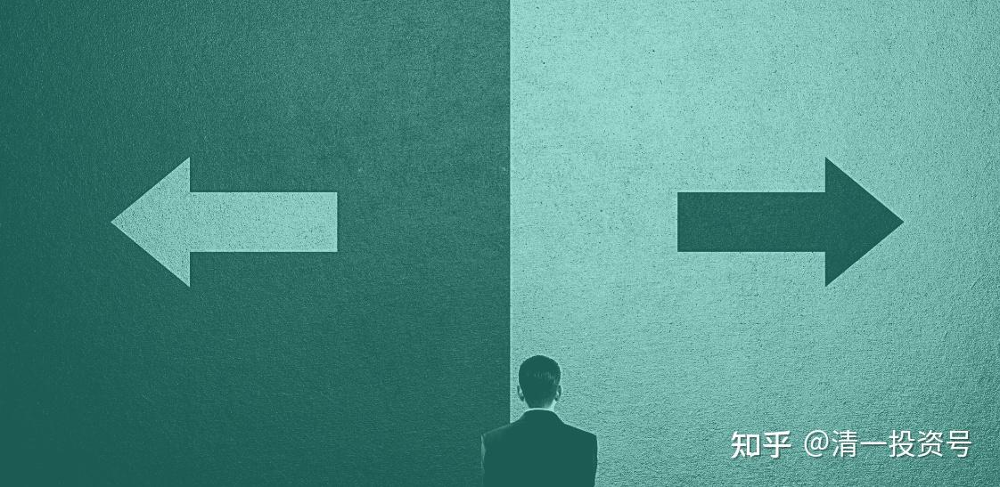

35篇.看起来就是人生选择罢了

清一山长 2016年10月～2021年6月

清一山长雪球非专栏帖子整理文章，第48篇《股市里谈命》

**sml寒韩:回复清一山长:**

老师，能否帮忙分析一下华电港股啊？这票跌的已经快到3元港币了。从投资的角度来说，现在是否值得买入呢？还是您觉得火电股永远没有机会了。望赐教！

**[清一山长](http://link.zhihu.com/?target=http%3A//xueqiu.com/n/%25E6%25B8%2585%25E4%25B8%2580%25E5%25B1%25B1%25E9%2595%25BF)2016-10-31 11:05:25回复sml寒韩:**

您的问题，请找其他大V帮助解决吧！我最多只分享自己对于投资的理解，不会帮人算命，更不敢谈你们自己关心的其他股票涨跌的。怕误导人。祝福！

清一山长2018-06-15 11:08

$珠江啤酒(SZ002461)$40.55元卖出一部分顺鑫农业，现在持股成本已经降到0.22元一股了。今天大量买入珠江啤酒，理由就是：顺鑫很可能涨到80元。但顺鑫涨到80元的难度，估计比珠江涨到12元的难度高，所以用顺鑫换珠江，只留下顺鑫的利润继续奔跑。其中一单是以5.79元挂进去十万股买入珠江，查看已经成交。现在在继续买入中，不知道下午会不会破位下跌，今天豁出去了。珠江本来都快到一千万的利润了，现在跌到只剩200多万，惭愧。应该7.71元出光的，锁定利润。不过，我本来就是买入就套牢，卖掉就上涨的命。还是认命吧！我不入地狱谁入呢？我就在珠江的地狱里慢慢做吧！没钱了就去清迈山里面玩去，有钱就看看盘。

[清一山长](http://link.zhihu.com/?target=http%3A//xueqiu.com/n/%25E6%25B8%2585%25E4%25B8%2580%25E5%25B1%25B1%25E9%2595%25BF)[2020-07-21 10:14:27](http://link.zhihu.com/?target=http%3A//xueqiu.com/9310099567/154556995)评论上面帖子

两年前，珠江5元多，是“恐慌”的对象，我却抛出正在上涨的顺鑫农业，当年这个时点，顺鑫只剩一半的仓位了，后来上涨中也在逐步卖出。资金在大量地买入珠江，半个月后，就成为珠江唯一的自然人十大。除了你们看到的十大账户，我还有其他账户买入的珠江，所以持仓比十大显示的还高。今天的珠江，12元多，已经实现了我的预期，成为了我赚到最多利润的酒类股，也是除了中建以外，赚钱最多的股。

当年我说要大买珠江的时候，心中看到的是12元的价格，是不是像是一个远不可及的梦幻？我这次买入后，后来还跌掉了20%以上，跌倒了4元多，让我的珠江账面都出现了亏损。所以，抄我的底，可以赚得比我更多,也更安全。**不过珠江最安全的时候，却是散户们最恐慌的时候。今天的12元，却是大家认为最安全的、最惹眼的时候。**珠江已经是市场“贪婪”的对象，大量的机构调研，资金介入，每天的成交都很热络。今年的顺鑫农业65元，涨得也不错，真的没有到80元。我这次用大量资金来“算命”的结果，两年后来看，算是——算得很准的了。

**顺势推高股价回复[清一山长](http://link.zhihu.com/?target=http%3A//xueqiu.com/n/%25E6%25B8%2585%25E4%25B8%2580%25E5%25B1%25B1%25E9%2595%25BF)：**

山长，其实我是唯物主义者，不信鬼神不信命，可是活得久了感觉每一个人活在这个世界上多多少少是有些命数，您怎么看？

**[清一山长](http://link.zhihu.com/?target=http%3A//xueqiu.com/n/%25E6%25B8%2585%25E4%25B8%2580%25E5%25B1%25B1%25E9%2595%25BF)[2021-05-15 15:17](http://link.zhihu.com/?target=http%3A//xueqiu.com/9310099567/179924902)回复[顺势推高股价](http://link.zhihu.com/?target=http%3A//xueqiu.com/n/%25E9%25A1%25BA%25E5%258A%25BF%25E6%258E%25A8%25E9%25AB%2598%25E8%2582%25A1%25E4%25BB%25B7)：**

我才不跟唯物主义者谈超过他们理解范围的东西。这叫自重。但我很尊重您的信仰！唯物的教派，是不是可以称为**“拜金教”**？他们都很爱钱，甚至超爱钱！

周倩姣静心回复9点15分:

您这么轻率，估计原本可能有机会也变没机会了。

**[清一山长](http://link.zhihu.com/?target=https%3A//xueqiu.com/9310099567)**[2021-05-15 14:02](http://link.zhihu.com/?target=https%3A//xueqiu.com/9310099567/179922139)回复[周倩姣静心](http://link.zhihu.com/?target=http%3A//xueqiu.com/n/%25E5%2591%25A8%25E5%2580%25A9%25E5%25A7%25A3%25E9%259D%2599%25E5%25BF%2583):

他才不要这种机会呢！他仔细一看，原来我女儿没遗产呀？马上就去叫别人爸爸了。不说“有奶便是娘，有钱就是爹”吗？他是被“富二代”的假像骗了。他可能不知道，这世界上，居然还有没钱的富二代。爹有钱，跟儿女有钱不是一回事（其实，本来就不是一回事）

小女很小时候，刚生没多久。有高人拿了她的生辰八字，给她算了一个命，最后有点为难地告诉我真话，说他不想骗我说啥好听的：说这小女，福气不太好，这辈子发不了大财（没啥大钱，够生活而已）。也当不了啥官（仕途不行）。最多，也就是一个当苦巴巴校长的命！ [燕子学习投资和中医](http://link.zhihu.com/?target=http%3A//xueqiu.com/n/%25E7%2587%2595%25E5%25AD%2590%25E5%25AD%25A6%25E4%25B9%25A0%25E6%258A%2595%25E8%25B5%2584%25E5%2592%258C%25E4%25B8%25AD%25E5%258C%25BB)回复[清一山长](http://link.zhihu.com/?target=http%3A//xueqiu.com/n/%25E6%25B8%2585%25E4%25B8%2580%25E5%25B1%25B1%25E9%2595%25BF)：

山长您好，这种早早地知道自己的命，跟早早地知道自己能做什么，不能做什么是一样的吗？应该是好事吧！我家族里面，我和一位阿姨都属于看上去很能干的样子，感觉自己能得不得了，结果掉进了很多坑。我有幸遇到新教育，同时改变了自己，现在越来越好了。但是我那位阿姨，比我大十岁，我看了，她再过十年只会更差；反观我另外一位阿姨，比我大十二岁，从小读书不行，但是做事很好，也知道自己的能力圈，结果现在中年了，也是越来越好。同时我也回想起来，以前我抑郁的时候也去算过命，大师说我：命里应该有七分是老师，三分是医生，还奇怪我怎么没有报师范或护士专业？当时我还有过疑问的：算命的听听就好了，怎么能又当老师又当医生呢？十几年过去了，绕了一大圈，好像回到了大师所说的命里注定的路了：我教小孩子，将来学中医……感恩山长慈悲，感恩刘老师，感恩新教育。

**[清一山长](http://link.zhihu.com/?target=http%3A//xueqiu.com/n/%25E6%25B8%2585%25E4%25B8%2580%25E5%25B1%25B1%25E9%2595%25BF)[2021-05-15 17:30](http://link.zhihu.com/?target=http%3A//xueqiu.com/9310099567/179929973)回复[燕子学习投资和中医](http://link.zhihu.com/?target=http%3A//xueqiu.com/n/%25E7%2587%2595%25E5%25AD%2590%25E5%25AD%25A6%25E4%25B9%25A0%25E6%258A%2595%25E8%25B5%2584%25E5%2592%258C%25E4%25B8%25AD%25E5%258C%25BB)：**

**有些人，是能看到“命”的，真懂的人，就是一些人的人生选择。**小女的确从小到现在，最喜欢玩的游戏就是教书。幼儿园就模仿老师，教她的姥爷、姥娘，现在一心要做父母这样的老师。对赚钱、当老板，都没兴趣。所以，这种命，看起来就是人生选择罢了。结果，她再聪明，自然也发不了财。而且我一直就不愿意留钱给儿女，所以，算命先生算不出来她有钱。如果我是传统的父母，可能会算她超级有福气，有用不完的钱，就是当不了官。小女找的这个算命人，不是专业的。他不吃这碗饭，不出来赚钱的。是小女出生后，我的老师很关心小女，带我去一起当面算的。有点好玩。他不知道我是啥人，也不知道我有钱，只知道是个大学教师。

**[一点点智慧](http://link.zhihu.com/?target=http%3A//xueqiu.com/n/%25E4%25B8%2580%25E7%2582%25B9%25E7%2582%25B9%25E6%2599%25BA%25E6%2585%25A7)回复[清一山长](http://link.zhihu.com/?target=http%3A//xueqiu.com/n/%25E6%25B8%2585%25E4%25B8%2580%25E5%25B1%25B1%25E9%2595%25BF)：**

他们的孩子如果按照你这种养法，孩子就不是他们的了，孩子就成了你的了。价值观念和你一致，想法和你一样，血亲是他们的孩子，观念和意识里，是你的孩子。这可能是他们不同意的根源。孩子是心头肉，他们也不放心，不能排除将来会发生什么不好的事情。这些孩子是陪读，中国以前的大户人家请先生教书的时候，会给自己家孩子找陪读。人过一辈子，不过是过热乎乎的日子，跟孩子思想各方面都格格不入了，生活便少了意义。

**[清一山长](http://link.zhihu.com/?target=http%3A//xueqiu.com/n/%25E6%25B8%2585%25E4%25B8%2580%25E5%25B1%25B1%25E9%2595%25BF)2021-06-13 20:04回复[一点点智慧](http://link.zhihu.com/?target=http%3A//xueqiu.com/n/%25E4%25B8%2580%25E7%2582%25B9%25E7%2582%25B9%25E6%2599%25BA%25E6%2585%25A7)：**

您说得对。孩子来上学之后，思想会变得和原来的圈子不一样。但,当教授，必须和园丁的思想不一样。也只有教授能教出教授吧？我父母如果是园丁，估计我也差不多就会种花了。我父母当特级教师，所以我就当了特级的教师，有样学样。我女儿也学父亲以当教师为目标，所以当不上商人。如果我想让孩子当商人，我会送到我的商人朋友家去的。所以，园丁想让孩子当教授，就必须让孩子和自己不一样。

[清一山长](http://link.zhihu.com/?target=http%3A//xueqiu.com/n/%25E6%25B8%2585%25E4%25B8%2580%25E5%25B1%25B1%25E9%2595%25BF)[2021-06-2918:16:15](http://link.zhihu.com/?target=http%3A//xueqiu.com/9310099567/187799749)

这文章很有参考价值。的确，**选错行业，决定了一生的成败，不见得就是本事不好**。“毕业后混得不好，不是因为你能力不够，也不是你努力不够，而是因为你混的圈子不行”。这个圈子，理解为一个潜力不断上升的赛道，倒是很逼真。**未来的行业、专业恒久的很少。学会跨界，恐怕是一个人生成就的，有最大潜力的赛道。**

《选择一种专业就是选择一个赛道》[https://xueqiu.com/6451611049/159392477](http://link.zhihu.com/?target=https%3A//xueqiu.com/6451611049/159392477)

本文发布于公众号“汾水之畔”

我父亲是77年高考的第一届中专生，报考志愿的时候，老师给了两个选项：一个是邮电中专，一个是农机中专。父亲在农机站开过拖拉机，所以报考农机中专。父亲跟我不一样，是有真才实学的人，很认真！很努力！干活、写文章、做技术都是一把好手。后来30多岁就成了县农机公司的副经理、书记。再后来农机公司破产，他就下岗了。他有时候回忆说，当时要是报考邮电中专，至少能混个邮政局副局长，或者电信局科长。

人生决定命运的就是那一瞬间，赛道选错了，即便是像我父亲这样有真才实学的人，再怎么努力也改变不了什么。我想我要是没有走上投资之路，就凭我干活不行，写文章也不行，只能做个烂泥扶不上墙的工程师了。

即便是同一个专业，不同细分领域也有截然不同的命运，我在中科院研究生院的时候，编在化学院408班，班里有烟草化学、有机化学、无机化学、分析化学，还有像我这样地球化学的。结果毕业后发现烟草化学毕业的去了烟草专卖局，收入又高又轻松；有机化学去了南方轻化、优吉欧等一些公司，虽然工作环境不怎么样（有机化学经常接触有毒物质），好歹收入不错，工作也好找；分析化学去了应聘检验员工作，岗位虽然很多，但是待遇不怎么样；无机化学最难找工作，收入又低，很多同学一半做了老师，另一半考上博士后做老师；像我学地球化学，赶上矿业景气周期，工作还算好找，可是工作很辛苦，跑了三年西藏，现在到了行业低迷期，只好靠投资了。如果穿越回到了入学的时候，对他们说，你们毕业后的就业命运已经被专业决定了，认命吧！那时候的我们又该如何反应？

我的一位同学高考考砸了，当时本着选不了一个好学校就选一个好专业的想法，报考了计算机专业一个专科学校，后来一路专升本，本科考研究生，研究生毕业后去了中央部委，现在是在一个部委下属的一个协会做秘书长。我家领导也是高考考砸了，去上了计算机专科，后来通过升本，成了上市软件公司的工程师，收入也超过我。如果她要是正常发挥可能会考进福大重点学科，化学系，然后又进了一个不好的赛道，面临改行还是不改行的问题。

学校不好可以通过考研究生、攻取博士来弥补，而专业选错了，常常等到工作数年职场到了瓶颈期，才发现自己专业选错了，这是后天难以弥补的。

学生的信息主要来自于老师，而对老师来说培养出一个名校的毕业生，更有成就感，何况隔行如隔山，很少有高中老师能说出“机械自动化”和“电气自动化”有什么区别。所以在高中教育中普遍存在轻专业选择，重视学校选择的倾向。到了大学，没有一个专业的老师会觉得本专业是不重要的。记得地质系的老师会拿自己举例子：我就是地质专业的，跟计算机系的老师比起来，我的收入不比他们差，每个行业只要做好了，都会有很好的回报。我们当时深信不疑，却忘记前提是，他们虽然不同专业，却是同一个学校的老师。

好大学的强大在于校友会的强大。再好的学校念大学学到什么不重要（教授们自从毕业就没有离开学校，跟社会脱节），跟谁一起读，成为谁的校友很重要。

**毕业后混得不好，不是因为你能力不够，也不是你努力不够，而是因为你混的圈子不行。**这是深山的一位茶农告诉我的，我一度怀疑他是隐居世外的高人，后来打听得知，他们村庄确实有一位隐居的高人，看来跟着高人耳濡目染，也成了一个智者。

随着产业升级和国家科技发展，专业与专业之间的收入差距越来越大。一个北大毕业的地质队员和河北地质大学毕业的地质队员，收入可能没啥差别。但是从事芯片制造或者人工智能专业群体和无机化学群体之间，收入差距肯定很大，而且差距会随着时间的增大而增大。

以前读研的时候，结识一位即将毕业，签了一个大型钢铁集团的硕士。学钢铁学的硕士，那时候钢铁行业很景气，特别羡慕他的行业。后来毕业赶上钢铁行业多年的低迷，跟他失去了联系，想来觉得他命运恐怕也很坎坷。同时低迷的还有航运、有色、石油、水泥、采矿等，从事这些专业的硕士、博士，大多也随着行业景气度起起落落。**我不由得感叹选择一个专业就是选择一种命运。选择一个学校，就是选择一批校友。年龄越大越倾向于相信宿命论，唯有股市和改行才能摆脱专业的宿命。**

有时候看到一些偏执的母亲疯狂地压迫小孩子去努力学习，觉得她们太傻了，最重要的是选好赛道，而不是强调努力。选择比努力重要，而做出正确的选择来自对历史、政治、科技、金融等，宏观因素做出的整体判断。光有勤奋敬业是不够的，要把自己感兴趣的事情当成事业来做，才能有大成就。

参考链接：

[清一投资号：27篇.关于美国SAT和留学](https://zhuanlan.zhihu.com/p/529600749)（整理文）

[清一投资号：28篇.孩子并非只有华山一条路](https://zhuanlan.zhihu.com/p/529616272)（整理文）

[你家孩子，是第几等人？要用几等的教育适配？](http://link.zhihu.com/?target=http%3A//www.360doc.com/content/21/0413/13/55056124_972102215.shtml)

[清一投资号：23篇.那些被定义为多动症、有问题的正常孩子](https://zhuanlan.zhihu.com/p/525864064)（整理文）

[这就是今日学堂：把普通人培养成天才的中国第一学校！（海外版）](http://link.zhihu.com/?target=https%3A//www.bilibili.com/video/BV19K411g7tp)（视频）

[喜马拉雅：清一山长雪球专栏](http://link.zhihu.com/?target=https%3A//www.ximalaya.com/album/52603303)（音频）

[哔哩哔哩：清一山长雪球专栏](http://link.zhihu.com/?target=https%3A//www.bilibili.com/audio/am32848405)（音频）
