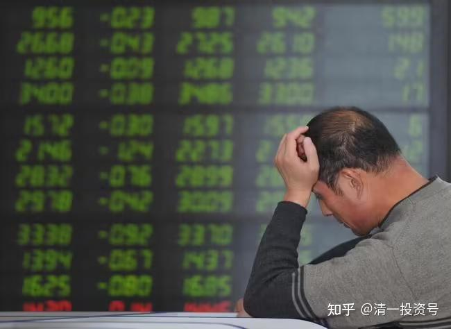
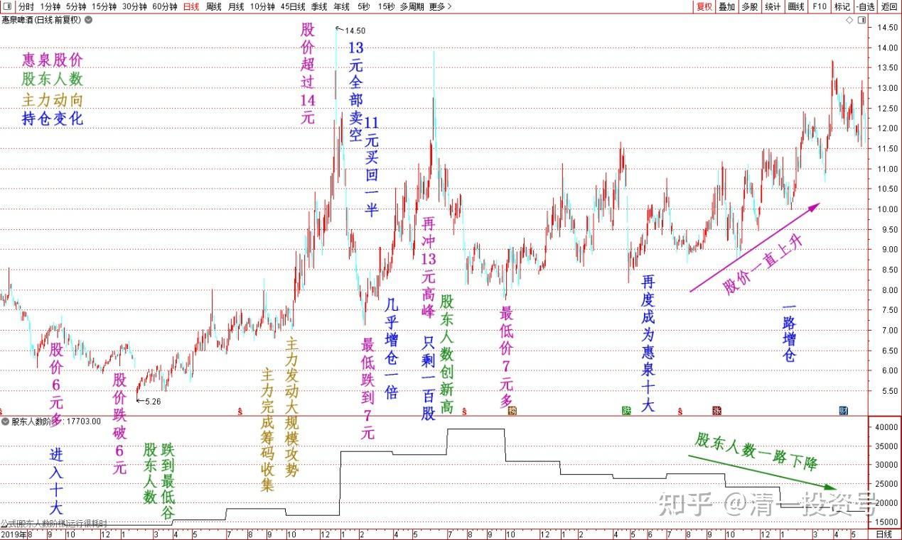
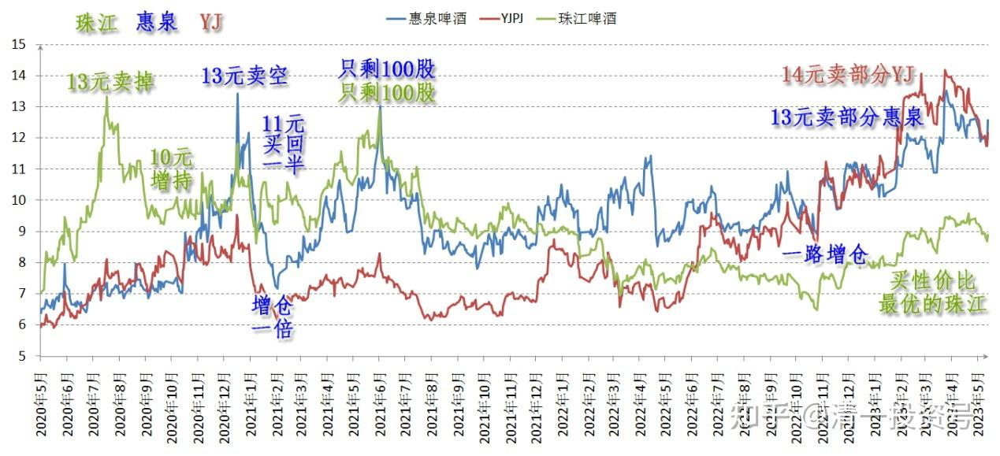

49篇.啤酒行业探秘：散户是永远的输家（配图版）

清一山长 2023年4月17日

惠泉年报刚出台，研究了一些公布出来的基本资料，特别是看了股东人数的变动，感叹万分！——做散户真的太悲惨了，他们总在低谷的时候割肉离场。然后在高位的时候勇敢接盘。

重新回顾了一下我在惠泉上的投资：我做到了与散户大众相反而行。每次我进场当十大，重仓持有的时候，几乎都是散户最少的时候。我离开的时机，正好是散户人数爆棚的时候。连续几次进出，我都踏准了步子，与散户的走向完全背离。见众生，且与众生进退相反而行的的功夫，果然很好用！怪不得今天我可以以负成本持仓。成为惠泉的十大。我持有的这些股票，可以说全部是散户的倾诚贡献！虽然我自己也只是一个小小的自然人散户，甚至是某公司十大中唯一的自然人，与列强在一起位列十大。身边都是一群机构，也让我很不自在——但我必须用超强机构的思维方式去思考，做一个特立独行的散户。绝对不做一个与散户大众共思维、共判断、共进退的小散。这种小散的命运太惨了，我得离远点！

**卓越固然不易，但平庸的代价真的很高！**

感谢广大散户的积极参与，感谢中国教育培养的庞大羊群。这么美好的中国股市，全世界都难得一遇。总是给我意外的惊喜！

啤酒行业探秘：

刚刚公布的惠泉年报，透露了很多啤酒行业的奥秘——我是2019年四季度进入惠泉十大的，这时候的股价才6元多一点。这也是我上一轮持仓的买入成本。我现在新一轮的持仓成本，已经上升到9元多了。

2020年三月，惠泉股东人数达到了最低谷——只有一万四千多人。股价也跌破了6元平台，此时，我的账户是绿的。但我继续买买买。2020年9月30日，股东人数与今年3月的人数一致，上升了一点点，一万七千多人。但这个点很关键——这个数据，是主力已经完成了筹码收集任务的总攻线。果然，刚进入十月，惠泉啤酒主力就发动了一轮大规模的攻势，四季度，股价冲击超过14元。我本来在13元高位，就全部卖空了。不过由于判断主力没有走，我判断10元应该有反弹，所以11元前后期间，我买了一半的股票回来，看起来只是减持了一部分，其实是卖空了全部，又及时买回一小部分做T的。

没想到买入后一路向下，2021年一季度，惠泉最低还跌到7元多，完全回到了启动之前的平台。幸亏我没有被主力吓坏，不但没有在低位跑掉（不然几百万就丢了）。反而可以看到一季报报表上，我几乎是增仓了一倍。后面这些筹码，显然价格就低得多，大大拉低了再次持有的成本。

当时记得我的珠江，也在高位13元卖掉后，回到10元左右同步增持。只是由于嫌他股价高，我没有再次进入十大，只是做T补充了一点点。2021年半年报，我已经彻底从惠泉消失了，因为惠泉再度冲13元高峰。股东人数创新高，达到了三万九千多人。珠江其实我也同步跑了——惠泉、珠江，我都只剩了100股在手上。现在看报表才证明：当时的庄家，的确在高位全部派发给散户了。大量的羊群正在高位抢进来了。

此后惠泉被主力抛弃，这两年，都是长期的，缓慢下跌，成交低迷。2022年创最低价7元多，显然高位买入的散户全给套住了，股价被腰斩。2022年，我已经看到有新资金在极其缓慢的介入惠泉。于是我再度跟仓，在2022年年中，离开惠泉两三年后，我又再度成为惠泉的十大，平均新买入成本在9元多，总持仓成本是负数。但是——最精彩的地方来了：惠泉此后一路走高，重新回到2020年的最高点价位（13元多）。但是，我却没有看到主力派发的迹象，因此我也不急于出走。今天查看——惠泉去年年底一直到今天，虽然股价一直上升，但股东人数一路下降，从接近四万的高峰，现在一路来到3月31日的最低谷——才一万七千多人。

因此，这些资料，充分说明：从8元一直到13元，都是新主力的筹码收集价位带，而且是原来套牢散户的大逃亡过程。现在惠泉散户手上，应该没啥多余的筹码了。全让主力拿走了！

而各位可以看到：我去年底到今年一季报，是一路增仓的。过几天，新出的今年一季报，各位会看到我的增仓行为。唯一减仓的一次，就是上次惠泉冲涨停13元多。本来计划如果封涨停，我就不当十大了，彻底退出换股。由于没封，我就在13.17元，卖了几十万股助兴。后来居然跌了，昨天补了一点惠泉回来，相当于我做了一元钱的T。但更多的仓位，我没有买回惠泉，而是买了性价比最优的珠江啤酒，昨天，我看机会良好，又买了40多万股珠江，是均价9.19元买回的股份，用的都是14元多卖掉YJ留下来的钱。所以你们可以看到今年一季报，我的珠江份额是不断增持的。

报表时间期末持股数量备注2019年报1855700进入十大2020年报10219002021一季报2038900增仓一倍2021半年报——从惠泉消失2022三季报836800再度成为惠泉十大2022年报2423500一路增仓2023一季报2900900

如果我们从股东人数和股价走势来预判未来惠泉的走势和高度，可以得出一个基本的结论：目前的惠泉价格（12元多），只是相当于2020年的7元多价格（散户结构表明的）。因此，如果今年，或者明年，再像2020年一样发动一轮大的行情，惠泉的高点，正常情况下突破20元没啥奇怪的。主力大举入仓后，没有这么大的空间是出不掉货的。不过虽然我这样看，但我不会拿新钱来买惠泉的新仓，我觉得太贵了。我最多只会做一点T，高卖低买。如果错过就放掉，去找还在低位的股。就是不买现价的惠泉，更不买未来的惠泉。我只拿到手里等卖出的机会！【这就是我常说的，看多不做多的金融智慧】。散户见风就是雨，总以为自己是神仙！处处抢先机，反而处处吃亏。

不过从走势来看，是否会复制2020年的走势不好说：现在看应该不会简单复制。因为惠泉已经换了庄，已经不再是20年很容易被人看破的毛头小伙子了。他今天走势一点也不冲动，居然有点像YJ的架势。常常走出让人出乎意外的走势。还慢悠悠的走慢牛，一路把各路神仙都颠下车去，只有主力自己依然稳稳的在车上留守。让我都不知道惠泉今后会咋走了，我只能陪他慢慢熬日子，等待他举办盛大宴会的一天，我就会悄悄消失在“灯火阑珊处”。

还有：YJ现在都在14元前后晃悠很久了，历史高价。但根本没看出主力派发迹象，没有筹码明显松动的势头。只看出一些换庄的痕迹。这实在是超出了我的预计。因此，虽然几个啤酒股的股价，都已经到了高位，但我还是重仓啤酒不放手，总持仓，与最高峰的时候相比，今天并未减仓。但我也没有增仓，只是跨品种做了一点点T，增加我的个人护城河的厚度。总体依然是“持仓”待涨的状态。

昨天是YJ换珠江最好的机会窗口，YJ借用一季报利润大增的理由拉高，盘面上是典型的派发图形。但由于成交量不匹配，因此虽然相对平时的量，放大了一点成交，但我认为没有主力退出的迹象。主力也只是做T罢了。因此——我昨天上午的高位，借机卖了一点YJ。现在能够用差不多每股接近5元的差价，只需要一股YJ，就可以用来换入1.5股的珠江，我认为是一笔非常划算的交易。现在高位我不想减仓，就换仓吧！别忘了当年的YJ股票，我是用一股高位卖出的珠江，换了差不多两股YJ入仓的。现在居然可以反过来换股，有啥不干的？

只是感叹散户的命真的不好，不会去算这些账。都是与我相反的操作。散户的眼光短浅，只盯著每天的涨涨跌跌。连两年前的走势，各种资料的对照，都不会去关注。以为不动脑子就可以吃大肉？真把自己当神了。狮子想要吃大肉，都要认真细致的估算各种风险，各种埋伏和攻击的技术。但傻羊们，总期待来荒原上吃大肉，也像自己吃草一样。大地母亲送到他的嘴边请他吃的，以为吃肉与吃草一样不用费心费力，只要勤奋努力吃就够了。不知道吃大肉与吃草不一样。做金融与打工不一样。要动很多的脑子，要去理解、谋划，并跟随最强者。还要随时防止强者反吃自己。随时准备溜之大吉！这才是吃大肉的标准动作！

羊不改羊性，不成为精英，自己激动滴参加群雄的大肉宴席，想要分一杯羹。但没想到——自己才是被送上桌子的大肉。

在我看来，啤酒行业的大宴会，正在广邀宾朋来吃大席。已经快开席了。狼和羊们，都在高高兴兴地赴宴。但肉呢？现在看样子还没有摆到桌面上。我想吃也吃不到（我大量卖出也没有接盘的）。只能忍住口水等开席的信号了——我猜只有大群的羊都走上桌子了，才会发开席的信号！

以上记录，就是我眼中的“见众生”！见不到众生，你就见不到大肉。如果你假装见到了众生，但你是看错了众生，结果就是“自己挨耳光”。甚至“被吃肉”。如果你的“见众生”是真的，你看准了出手，你就会有吃不完的大肉！

这个人类世界真好玩，我喜欢！

总结：**人类一生，都在为自己的认知买单。**股市上，**你所赚的每一分钱，都是你对世界的认知的变现；你所亏的每一分钱，都是因为你对这个世界认知的缺陷。**

简单一点：**金融和股市，不创造价值，只是分配价值。因此，傻瓜是送钱的人。看透傻瓜的聪明人拿走了钱。**

**真文科的本质，就是教你看透这个世界，看透人性。没教你打工技术，但教你如何做人和思考**。但由于中国没有真正的文科，大学也不教这些内容。因此，**在中国，只有少数自学成才的人，自己勤奋思考，研究人，琢磨人的人，才能真正的看懂人性**。比如徐翔，就是其中的佼佼者，掠夺无数！

所以——中国这样的教育（不教思维，不教心理，不教人性，知识死记硬背各种考试知识的标准答案教育），这样的人群（不喜欢动脑，却特别勤奋努力的民族），这样的股市（坐庄操盘几乎就是公开的秘密，加上如此无脑，如此不成熟的股民，以及以散户为主的金融市场），真的是世界上最好的金融市场（对于看懂了人性的人来说）。中国人，也是缅北等诈骗集团最好的目标对象（国人傻瓜太多，还特别贪婪，特别爱钱。特别喜欢用最轻松的方式拿钱）。

但对于普通人来说，对于庸人，中国这样的国家，也是他们活得最艰难的地方！

各位好好思量——你该不该升级大脑和思维了？！

相关文章：文科和理工科的分野？产业界和金融界的差别？

**[山长 清一：文科和理工科的分野？产业界和金融界的差别？](https://zhuanlan.zhihu.com/p/622145919)**

