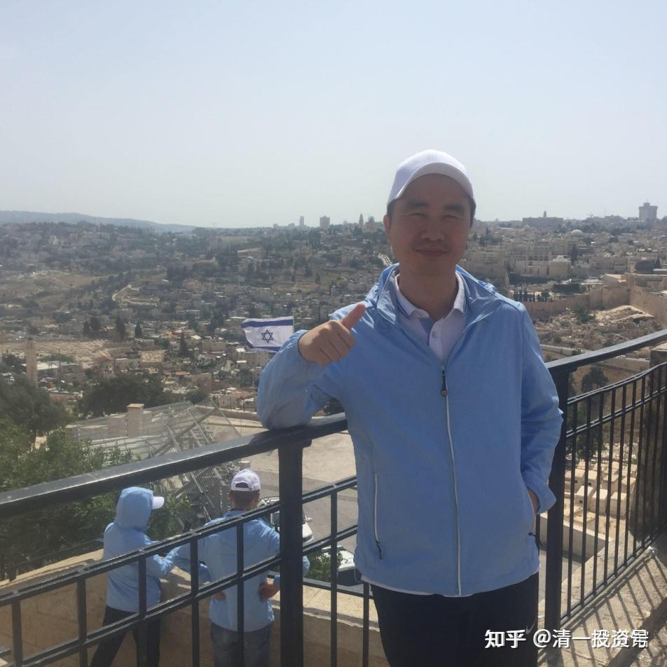
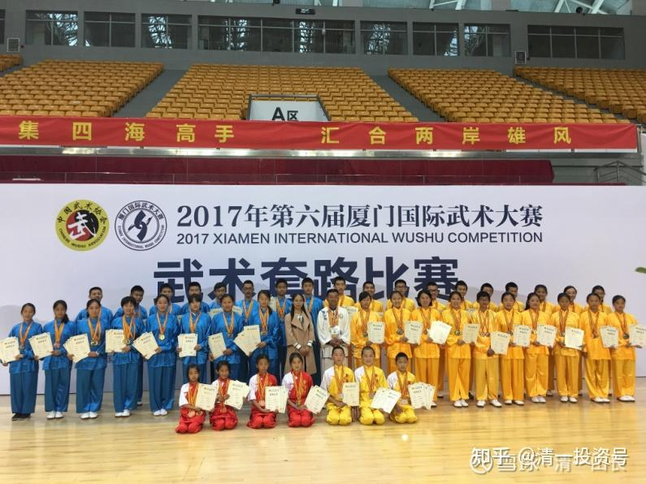

原雪球专栏[111篇.行业排名世界第一的公司老总，为啥要来今日学堂进修？](http://link.zhihu.com/?target=https%3A//xueqiu.com/9310099567/172594414)

清一山长2021年2月24日

以下是我与广东某企业李总的对话录。

广东企业家，学稻盛和夫的人比较多。企业家的压力大，有些高管，也会像稻盛一样，去庙里啥地方清修一段时间，静静心。李总原来就去过一些著名的庙里面，与一些修行团共修学习。但一直觉得提高不大，这一次，他找我申请来学堂进修，还希望夫妻二人一起来。因为我愿意支持中国认真踏实做事业，与世界各国竞争，获得优势的人。所以，就提供了他们来武道馆进修一年的机会。李总夫人的心愿，是想学新教育，帮助身边的人，就给了去公主班体验教学过程的机会。

**这两个班，都是我们未来的“新教育核心重点班”，不是前几天网上公布的“科技精英，技术官僚路线”班。**有一些学堂的家长。看了未来的四合一大学跨界竞争的教育路线，私下还不太满意，抱怨说：“虽然这个方案好是好，但总觉得只是一个高级的稻粱谋。”我回复说：“知足吧！中国人上大学，不都是要稻粱谋的吗？还谋不好。我给个真正的好规划，就很不错了。”当然，今日学堂有不谋稻粱的班级，只追求理想和学问。但**理想是用心来捍卫的，不是用来装点门面的。只有少私寡欲的人，才能学这些高层的东西**，一般人，想要体面，想要光宗耀祖，还是去学“四合一专业选择”更好！这个轻松超越985大学的路线，我认为更符合大多数中国家长的利益，[网页链接](http://link.zhihu.com/?target=https%3A//xueqiu.com/9310099567/172137323)：

[我以为考上了985，就不愁找工作！](http://link.zhihu.com/?target=https%3A//mp.weixin.qq.com/s/T-VqC3P3WETHit3O0ggqNQ)

可是，李总要来学堂潜心进修，肯定不是要学啥今日学堂的“稻粱术”。他要体会的是今日的“道”。**中国一贯强调“以武入道”。目前符合这一学习标准的，我认为恐怕只有清一武道馆了。其他地方，只能学武术，不能学武道。刘老师的清一医学院，将在今年9月份招生。学生入学的第一年，也是要在武道馆集训的。先以武入道，然后以医入道。这个路线，才是培养真正的大医、道医**。如果只是学点医术混饭吃，当个衣食医，倒不用这么麻烦。教一点医术，特别学好一些治疗常见病的医术，就够谋生了。但要学会“起死回生”的道医本领，就必须先学道，再学医。

前两天，一位家长的老人病危，找各种医，都医疗无效。说估计老人支撑不住多久了，找到刘老师，要求插队提前来进行远程的视频咨询辅导。希望老人家起码走得不那么痛苦。结果远远超出了家属的期待：刘老师医治了老人的“死心”，变成了“自在心”，结果原本菜饭不进的老人。治疗后第一天，就沉沉地睡好了。第二天，一直没有食欲的她，就觉得肚子饿，想吃饭了，家属都很惊喜。这是胃气——生命之气、后天之气开始恢复的标志。老人应该是从原来的濒死状态转回来了。家属也反映气色、精神状况改变不少。**一个医生，如何做到一药不施，就能起死回生？这就是中国道医学的厉害。**

有人以为：刘老师肯定最慈悲善良，出手帮忙，就想救这老人的命，所以才有这结果。其实，**道的本质，是无心**。**刘老师先没有救人的心，才会有后来救人的果。**老子教的**“天地无心，圣人恒无心”**，**不能有自己的善恶喜好之心**。**一旦医生动了“一定要救活病人”之心，就违反“道”了**。这一点是最难修的，因为医生受人所托，都是想治好病。一开局，就已经失败了。刘老师不救人，只“活人”，就是只关注病人的心结在何处。濒死之人，一定有濒死的“死结”，打开了，就好了。至于这个死结，最终导致病人是死，是活，刘老师并不关心结果。但打开心上的死结之后，就算病人死了，也会走得更轻松自在。所以上面说是“自在心”，没说“活心”。

这个案例，说明了一个生命最伟大的道理：**人，其实不在乎生命死活的。如果活得没意义，没价值，就会寻思，想死，种种病死，意外死等。只有人，活出真正的人生意义来，人才会自在活，自在死。希望大家据此找到自己的自在心。不然，心就会打死结。**

近期，刘老师开始对外提供咨询服务以来，已经帮助很多人打开死结了。如果没做这件事情，这些人迟早会因为心结已经死了，导致各种死亡事故。她其实救了很多人的命。

几年前我自己一节课治好一个学员的抑郁症，其实原理是一样的：用我的一节课程，打开了患者心中的死结。因为患者没有来直接找我。如果直接找我解决这个问题，会更容易的。**愿心强大，就更好解除了。无心求助，就无法改变。**所以古人云：**医不叩门！**现在很多学生不愿意学习，也一样是“学习之心已经死亡”，只有像治疗病人一样，把学生的“学心”恢复正常，他才会认真学习的。

**新教育，是心教育，这是树立这个“学心”的。**家长不懂配合“学心”，不懂新教育，我们做了白做的。**大医医心，真教育一样：教的是心，不是知识！**不懂道，只能用术来治病。各种各样的方法，都可以治疗病。但**百术不抵一道，道之出口，淡乎其无味**。看起来容易极了，但效果却惊人，比啥技术都有效。

上周还有一个后勤人员，很久了都无法正常的呼吸，甚至晚上无法躺下睡觉，被折磨得很难受。看了很多中西医，都无效。最后抱着一点希望，找到了刘老师，就在海外通过远程视频千里治病，“语言治疗”了一小时，当天晚上就好好睡了一觉，现在恢复好了很多，病人自己都觉得是奇迹！只有道医，才能够达到这种境界。不再依赖药石。**会用药石，只是衣食医的基本条件**。可惜——现在连衣食医都没有了，只有骗子医。如刘老师看到治呼吸的病人，拿到的名医药方，居然是几十味药，就皱眉头：“这哪是啥中医？乱枪打鸟，庸医一个。”的确，病人花了几千元买中药（西医自己都宣布不会治），毫无效果。“道”通术，术不能通“道”。学道，是所有技术到一定境界的人，有追求的人，都想实现突破的一个点。

刘老师也是由医术入门，渐渐走到医道的路上，一路经历了几十位传统医老师，学了很多技术，但都觉得不是“道”。现在才走上了医道之路。**走这一条路很难，甚至修行上要过生死关，彻底证悟生死的本质才行。一般人，就只能学道了，能不能“得道”就看缘分。**

我相信李总也是在企业上已经获得了很大的成就，正在想进一步的突破，想要寻找和学习他心中的“道”。希望他在清一武道馆修学期间，会看到，证悟到一些有价值的“道”。将来带领他的企业，走向更高的领域。

**以下是我们的网上对话实录：**

**李小虎gnn：**

在高速公路上开了两天车，一直没有机会发声，差点憋坏了。到达目的地后，赶紧要写点东西了。其实，我并不是一个爱在网上发言的人，自己经营着一家上千人的公司，我实在没有时间去在网络上跟别人喷，就觉得是清者自清，浊者自浊，做好自己就可以了。但是这个世界就是这样，劣币驱逐良币，作为良币的我们，如果不出来谈谈事实，以正视听，让更多圈外人士能够看清事实真相的话。我觉得也是对社会的一种不负责任吧！

刚才看了很多朋友说到清一新教育佛山元旦分享会，那我也来谈谈这次元旦分享会吧！

我是这次佛山分享会的11人组委会成员之一，虽然在分享会筹备期间，我家里，公司事情一大把，但是为了这次分享会，我自己真的是绞尽脑汁去思考方案策划，为了会议的顺利举办，也打了N个电话去拉资源，还不要说参加那经常开到晚上11点多的N次筹备会了。最终，在大家的齐心协力下，我们终于能够在3号晚上举杯相庆这次会议的圆满成功了，看到那1400多位参会者脸上那不虚此行的满意表情，我们别提有多开心。

各位，**如果按照我们公司的销售额除以我一年的工作时间，我每个小时的时间成本可是几十万。为什么我愿意去花这个时间，没有任何金钱回报地去做这个义工呢？**可没有任何人拿枪逼着我，我这个人性格也是比较烈的，越是强迫我做某事，我就越不会去做。其实说到底，就是两个字“感恩”。对，就**是感恩！**因为**我们一家，都因为清一新教育而改变。**

**首先是我和我妻子的变化。**

两夫妻相处，如果没有大家共同认可的一些价值观和理念，那就是挂在一起的两块腊肉，而且这两块腊肉还要经常争吵，谁比谁更加腊？我和我妻子是大学同学，恋爱到现在21年，感情基础不可谓不好。但是我属鸡，她属狗，相处就是鸡飞狗跳，鸡犬不宁。我们两吵架是步枪对机关枪，我是步枪一枪一枪地打，她机关枪一扫就扫一片过来，让你躲都没有地方躲。但是接触清一新教育后，我们有了共同的价值观和理念，特别是在孩子教育这个夫妻吵架的重灾区，我们达成了高度一致。两口子吵架比之前少了很多，如果真有争吵，也会很理性的对待，孩子在学堂里学到要非暴力沟通，回来也给我们上课，我们都要做个好学生。特别是去年，家庭经受一些重大意外，我们第一时间找到山长、刘老师咨询，山长和刘老师真的是特别特别慈悲，非常耐心，非常智慧，不单告诉我们人生大道理，让我们学会转念，关键还有具体如何去做的方案，实用易行。让我们得以顺利走出人生低谷，重新对未来升起信心。感恩山长和刘老师，大恩不言谢！（借此，我也需要分享一下，**当你的人生碰到难以迈过去的坎，与其自己碰得头破血流，真的还不如请高人指导一下。而且这个高人是如此智慧又慈悲，能够帮你解决实际问题。**）

**其二，就是我家女儿的变化。**

我女儿虽然2017年就进新教育外围学堂合一塾，但是因为她弟弟生病，我们希望两姐弟多点时间相处的原因，孩子在2019年下半年，离开合一，回到了体制。虽然也是一个交费不菲的国际学校，但是毕竟也是一个大染缸，孩子沾染了很多不良习惯，像刷剧、追星、玩游戏，因为你不这么做的话，你就交不到朋友。这些习惯在2020年上半年网课期间更加放大，我经常被气得差点一口鲜血喷涌而出，倒地不起（做企业十多年都没有这么大的折磨）。我看这情况不对，再这样继续下去，这孩子就废掉了。于是我坚决把孩子重新送回合一。那么回到合一以后，我们合一的老师为了调整孩子的心性，把她重新拉回来，真的是费了非常大的力气，做了很多工作。这中间过程跌宕起伏，几起几落，可以写一本书了。由于时间关系，这里省略1万字。后面孩子终于考进国际今日的突破班，这一个多学期下来，孩子的变化非常大。不单以前的坏毛病都消失了，关键是养成了全力以赴拼搏的习惯，这是我最看重的！而且，孩子现在的目标感非常强，以前她是有点佛系的，什么都无所谓，但是现在为了能够PK赢清一，每一周，每一天的目标都很清晰，而且没有达成目标，自己会主动去承担责任。我们父女的关系比以前也好太多了，去年在家里面，是鸡飞狗跳，现在虽然没有在一起，但是感受到父慈女孝。

**其三，就是我的人生成长。**

我做企业不能不说没有成就感，比如说**我们把一个默默无闻的小公司做成了我们这个行业，人造石英石行业中国出口排名第一的企业**；比如说我们的品牌被行业世界排名第一的外国企业看中，希望将我们收购；比如说我们在美国市场，被誉为人造石英石行业的苹果，因为我们能够做出别人做不出的产品，能够把价格卖得比外国品牌还贵。但是对我个人来说，越做心里越惶恐，带领公司也感觉自己后劲乏力，因为我并不比别人聪明，比别人努力，充其量，我觉得比别人强的地方，就是我比别人命好。但是把个人和企业的未来赌在“命好”这个点上，未免风险太大了。

2017年接触新教育，特别是在财富课期间向山长咨询，我才知道，我的思维方式是有问题的。用山长的话说，我是乱元思维。那个时候，我还特别偏激，看这个世界就是非黑即白，非对即错。这几年的清一新教育学习下来，给我提供了一个非常好的学习方向，那就是不断提升自己的思维层次，我现在脑袋里，基本上能够出现两个相互有冲突的观点，但是还能够比较和谐相处，这在以前是不敢想象的，我会认为自己是个分裂症患者。但是**现在，根据我跟核心团队成员，跟客户，包括政府等沟通结果来看，比以前是融洽圆融了很多**，**这要感谢新教育对我思维的提升**。同时山长用他的实际行动也在引领我的人生，让我不单单追求物质上的企业做多大，盈利多少。**山长也让我看到如何将钱这个工具去利益到更加多的人，去更好地提升自己的精神世界，去更好地提升自己家族的文化阶层，去让这个世界因为自己的存在而变得更加美好。**

我在今年春节期间，做了几个比较奇葩的事情：

第一，在正月初一晚上，我邀请了醒明学堂的兰老师通过腾讯会议系统给我们管理层50多个家庭上新教育课程，因为我在年前的管理人员面谈中，发现他们普遍都面临孩子教育的困惑，我不希望他们将来在公司赚了钱，孩子却废掉了。这次学习大家都反应收获非常巨大。

第二，**我组织公司同事在初八之前，一起跑步接力，共同完成2021公里去迎接2021年，最终我们完成了2227.2公里**。当别的企业员工在大吃大喝过新年，我们却用运动健身去过年。这要感谢进入新教育平台后，我自己这个董事长先养成了好的运动习惯。

第三个事，最奇葩，**我们两夫妻在正月初八出发去云南，一个奔赴武道馆，一个奔赴公主预备班，我们准备拿一年时间出来用于成长提升自己，未来可以利益到更加多的人**。如果清一新教育有问题的话，我们浪费时间去做这个事情，去吃这个“苦”，那我脑子是进水了吗？好歹我也走过世界七大洲，去到几十多个国家，多少也算见过点世面的人，而且做生意这么多年，投资回报率我还是知道去算的。这么好的成长机会，我怎么能错过呢？我相信经过学习后，我的家庭会更幸福，我的事业会做得更好，我的人生会更加通透。所以接触新教育后，我对自己人生未来更清晰，更有信心！**新教育是改命的教育，真实不虚！**

一气呵成，一不小心写了这么多，实在是因为一些对清一新教育的不实言论，让我的确太气愤了，严重损害了我的清一新教育的形象。等等，你说什么，你的清一新教育？清一新教育平台不是清一山长创办的吗？什么时候轮到说是你的清一新教育了？其实不是的，在我看来，归属感是因为愿意为平台承担责任，当我主动去承担责任，将自己定义为主人翁的时候，在我心里，清一新教育平台就是我的了。

**我希望未来更加多的人能够加入到捍卫清一新教育荣誉的事业中来，为了中国有真教育，为了父母之邦有佳弟子，为了天下学子有明师指路，为了中国博大精深的优秀传统文化能发扬广大。让我们一起去建设和经营属于自己的清一新教育！**

**清一山长回复李小虎gnn02-21 20:45**

真没想到你能写这么多，比你说话的时候，要有条理多了。看来你还是书面表达能力很强的学者型人才！

您说得对：**清一教育，不是我个人的，是大家的。每一个认同，维护清一新教育的人，都是清一人。“清一”这个名号，是我的老师赐给我的，清净纯一之意**。**我们专一努力的目标，就是专心办成中华人的世界名校。这是每一个喜欢这个目标的人共同的心愿。**

武道馆的明琪，公主班的灿老师，都跟我汇报：你们已经到达了位置。欢迎你们夫妻一起进修。在不同的地点，修习不同的内容。演武，修文。

今天也看了明琪发的在武当山从小练武，学了十几年的一个小伙子与武道馆我的弟子们的实战对抗视频。双方差距不小。武当山这十几年，看样子练的都是花架子，一交手，连站都站不稳，还怎么打人？传统武术，就是桩功要稳，还必须桩子活，才是真传武。现在的传武，都玩假了。**希望你能学到真正的中华武道，起码见到。估计在你的代训期间，孩子们就要出山去与现代格斗手们实战了，您正好见证这段“华山论剑”的历史前台和背景。看我一个文人，怎样训练出未来的格斗世界冠军**[俏皮]。

你来武道馆，我相信会有收获的。明仪也正好在，有问题可以互相交流。有空你可以分享一些企业管理，社会交往的经验，给武馆的学生们学习，开开眼界。

**李小虎gnn2021-02-22 00:23回复清一山长：**

感恩山长的慈悲和大爱，给予我们夫妻俩这么好的学习机会。我在这里也跟山长汇报一下对于武道馆和公主班的一些初步印象。

昨天到了武道馆，见到了传说中的明骐和明洁，两位打百人组手战的明星。相对于在网上视频里他们那坚毅犀利的眼神，矫捷甚至勇猛的身手，昨天给我的却是另外一种印象，如果不是之前已经对他们有所了解的话，我根本就看不出眼前这两位是在擂台上叱咤风云的人物。因为**他们外表真的是温文尔雅，说话也是柔声细语，用文质彬彬来形容真不为过，真有点古代那种文武双全的侠客风范，让我心生欢喜。**

这次我还**特别欣喜见到明仪，她在B站上讲的“[为什么今日师生必须都练武](http://link.zhihu.com/?target=https%3A//www.bilibili.com/video/BV1Dy4y1q7dh)”、“[《花木兰》：通往卓越的七大关键信念](http://link.zhihu.com/?target=https%3A//www.bilibili.com/video/BV17K411A7Kt)”，我和妻子都认真学习过，受益匪浅。**明仪去武道馆练武，还是有点让我比较意外的，一个明明可以靠颜值和才能去成为人生赢家的女孩，却还偏偏要去练武，甚至还要打百人组手战，让我不得不服！

而**整个武道馆的所有孩子们，非常自律，非常沉静，但是又不失热情，每个人都非常主动热情的询问我，是否需要帮忙。**后面我才知道，原来他们完全是自我管理，自己负责做饭吃，自己分配好卫生清扫，自己负责制定训练计划。整个武道馆进来后，能量场非常好，完全看不出是由一群十多岁的孩子在里面独自运作，卫生清理得非常干净，物件摆放得井然有序，学生床上的被子叠得跟部队里差不多，每个人走路做事都很安静，但是训练的时候，却又是虎虎生威，什么叫“静若处子，动若脱兔”？我想这就是吧！

虽然每天要训练6到8小时，特别是周六的极限日，我看了一下墙上的训练表，每个项目对我来说都是一个大挑战。但是这群孩子在提到他们这些训练的时候，就是轻轻带过，就如每天吃饭睡觉一样平常。我想，这是因为他们有着想要成为世界冠军的理想，所以不怕劳累，不怕疼痛，甚至不怕流血。**对于我能够见证他们出山跟现代格斗手们的实战，见证这段“华山论剑”的历史的前台和背景，我深感荣幸，并且非常期待！**

武道馆孩子们落落大方，谈吐清晰，坚定果敢，经营意识，自律精神等等，让我心里羡慕不已，要是我孩子有这么优秀就好了。能够跟这么优秀的同学一起学习，是我的荣幸。当然，我也非常乐意去将我一些工作经验，社会心得分享给我这些小同学们，希望对他们有所帮助！

这次在武道馆的学习，对我来说，机会非常难得。**我会好好把握，迎难而上，我也定了一个小目标，希望通过成长蜕变，未来能够打10人组手战！**

**今天送我妻子去公主班报道的时候，也见到了这群未来的中国公主，她们不是影视作品里矫揉做作，花里胡哨的所谓公主，而是跟武道馆的学生一样，非常自律，非常沉静，见了面非常懂礼貌的孩子**，有些孩子在认真做视频，有些孩子在大方练习着表演，她们讲的泰语，虽然我听不懂，但是我站着旁边观看着，心想这些这么优秀的孩子，要是未来能够进到我们公司工作，那真的是太好了！一方面，我们公司响应国家一带一路号召，在东南亚建厂，建销售公司，三语人才是非常需要的。另外一方面，这些孩子在新教育培养了这么多年，基础素质非常好，吃苦耐劳精神，学习接受能力都很强。而且从小的这些价值观的引导，让我们企业也敢放心大胆的去培养。我们公司现在都不敢招应届的大学生了，因为那种素质，那种精气神，那种做事的能力，足以把你气到怀疑人生。好不容易培养了一两个吧，她们又说世界那么大，要出去闯闯，没有任何交代，一拍屁股就走人了，走了以后没多久又后悔，想要回来，把工作当成是儿戏一样。当然，我也知道，公主班是未来培养新教育老师的摇篮，跟武道馆的学生一样，是整个清一新教育平台里对人要求最高的班级，是核心中的核心。我们企业想请到公主班的孩子去工作，也只能是想想了，不过能够想想都觉得幸福。

这次还**见到了公主班的带班老师刘灿老师，从她身上，我能够感受到一种生命的绽放，她已经把生活、工作、生命三者合一了，所以整个人散发出来的能量让人非常舒服。难怪孩子们那么喜欢她。她一直在跟我说，其实带班很轻松，教育很简单。**

我其实还不能理解到这句话的涵义，为什么我教育孩子事倍功半，她教育孩子四两拨千斤，而且我在她脸上根本看不到一丝一毫体制老师标配的焦虑压力，她整个的状态就是在享受，她非常享受她的工作，非常享受她带孩子的过程，非常享受她的生命。

我目前虽然达不到她这种状态，但是心里面却是非常向往，觉得人要是能够做到这点，这辈子活着也算是值了！不过刘灿老师说，**只要一直跟随着山长学习，而且是真的用心去学，边学边做，知行合一，我也可以做到的。**借刘灿老师吉言了，这比祝福我赚几个亿对我来说吸引力还要更大！

**以上就是我对武道馆和公主班的初步印象了。我相信随着我和妻子学习的深入，后面一定会有更大的惊喜。期待我们未来的人生蜕变！**

**清一山长2021-02-22 10:55回复李小虎gnn：**

**谢谢李总的回复和总结评点！您也是能一眼看到核心本质的人，有眼光。**

**武道馆和公主班，是我们的内部核心班级，是我们专门培养内部未来人才的地方**。您夫妻能来这两个地方，是因为**我们认同您是清一大家族的人了，才给这个特别培训机会。其他人，是花钱也进不来的。想要进入这两个地方修习，靠的是“有心”才能进入。内心有真正的远大理想，有为国争光的志气，才能拿到这两个地方的入门证**。欢迎你们俩的到来。

您看到我最近的发文，提供了**“最佳教育生涯设计路线”**，提供了走跨界人才，复合人才的道路，文理合一，跨专业，轻松超越985，获得世界500强的入门证，走技术精英，技术官僚的道路。

其实，**今日系内部，我们自己的最高等班级，是不走这条道路的**。这是我们对外进行教育服务的需要，是为了满足社会需要提供的教育服务选择。我们的“自己人”，包括我自己的儿女在内，都是不走这条路的。

**公主学堂、武道馆，就是我们内部的顶级教育机构。这里的人，都不走“技术精英”的路线。她们不学理工科，只学真文、真武，学文武合一**。只是重点方面，公主班的重点是习真文，武道馆重点是修真武。**公主班强调世界性，国际通人才。武道馆强调民族性，强调国学修养。**但两个地方，**都一样是强调文武合一的**。

公主班现在，都在练武术基本功。我看她们练的“龙形搜骨”等，练得很不错。等她们15岁以后，我会教她们真武的，真正的太极格斗。只是不以拿格斗冠军作为目标。跟你们夫妻俩一样，跟我一样，作为“业余爱好”，作为中国文武合一的传统去掌握的。虽然不去拿冠军，但出手击败一般男生，达到普通专业武者的水平，是毫无问题的。

您对公主班和武道馆的观察，是准确的。**清一武道馆**，**虽然设定的目标，是培养用中华传统武术，去拿格斗界的世界冠军。但本质上，我们并不是培养打手的地方，而是培养文武合一的传统文化人的地方。**将来，他们**都是要去当新教育教师的人**，未来不是要去吃职业武术、格斗这碗饭的。他们去拿世界冠军的头衔，不是要将来用格斗来谋生、赚钱，走梅威瑟这些人的路。格斗冠军，就是他们的清一大学武术专业的毕业考级要求。当然不会出现你看到的其他武术机构的样子，都是一批“蓬头、突鬓、垂冠，曼胡之缨，短后之衣，瞠目而语难”的粗鲁家伙。而是特别有文气，有修养的人。

庄明骐和庄明洁两个都是我的武道弟子，跟他们一年半以前，打百人组手战的时候，现在的功力，已经完全不是一个级别了。**现在他们都可以更轻松地一天就完成“300人组手战”了。当然，到了这个级别，就不用参加组手战比赛了。因为现在对于他们的对手来说，这种比赛太不公平了。**每个人上场去，就是只能挨揍的，一点“对决”的机会都没有。但**两人攻击力的提升，并未让他们变得凶猛好斗，就是“武术文教”，真正的“内家拳”之功了。**

现在国内，恐怕只有我亲自教的弟子，才有可能是这个样子了——**“视之如好妇，搏之似惧虎”**。**一般人，不内修，学习外家拳的功力越强，霸气越是外显。学习真正的内家拳，功力越强，态度越是谦和！气质越像是文人。**恭喜你看到了真正的内家拳传人，真太极的传人。对于有武侠梦的国人来说，被雷雷们恶心到不行的中华爱武人来说，有这批传人的存在，会是一个非常开心的事情：说明中华真国术，在中国还没有消失。只是已经快消失了。

**清一武道馆，就是以恢复中国的国术为己任，用向现代格斗挑战的正规赛的方式，来捍卫中华武术荣誉的私人机构。**

**我们用自己个人的绵薄之力，为中华国术保留一点点的体面和传统**。不要被西方现代格斗界藐视了，也不要被雷雷、马保国们全给糟蹋了。残害中华武术，侮辱国学、国术的人，并不是徐晓冬。而是这批打着传统武术旗帜来骗吃、骗喝、骗名的“传武人”！

最近来武道馆训练的一个年轻人，在武当山学了十几年的“内家拳”，我一看身手，全是假的，根本就不是内家拳，都是外家的格斗思维模式，加上一些冠以道家名称的武术套路动作。跟真正的内家毫无关系，甚至连外家拳都不是，是个四不像的“怪物术”，不伦不类。真是可惜了。这些打着传承中国武术，这些传武的宗师，就这样瞎耽误这些爱武的年轻人，因为爱武却被骗子耽误终身。我看这年轻人，擂台上还是很勇猛的，身子也很灵活，练得应该还是很用功的。但练错了方向，练成四不像了，劲路全是外家的劲路，费力还不讨好，速度太慢，力量太弱。去武当山修习十几年，还不如在清一武道馆练了一年半的更年少的小学员。这就是中国传武的现状：一群骗子，把中华武术都变成了耍把戏，江湖卖艺的东东！实在是丢祖宗的脸。希望这孩子在武馆能够学到真正的中华武术。

不过，李总跟随训练武术，不要去跟孩子们比体力，训练项目。他们都是“专业人员”了。体能训练，都是特别强化的训练项目，你只能点到为止，别勉强，慢慢上量。你**是学“以武入道”的，不是来拿世界冠军的，让孩子们去拼冠军去吧！**

李总太太去公主班，旁听学习。刘灿对你们说的事情是对的：**真的教育，其实师生都不费劲，也不费心。教师有心，就不费心。无心，就操心，吃力，效果还不好。所以，师生最关键的，是修心。《公主经》七条，刘灿老师自己内心都是做到了的，所以她感觉不费心，带班带得很好。**你太太基本上这七条，都没能“发心”，都没证到身上。所以她一直有很多的烦恼、障碍。你们内心用《公主经》作为目标，以小公主们的状态为标尺，看做到的人，是怎样处事的。这样你们慢慢地观摩修习，就是你们一年修学的目标了。

以上是学堂学生参加国家武术比赛的合影，此次比赛。一个业余的学校，击败了众多的武术专业学校，拿到了最多的团体奖牌。小女也在其中，时年9岁，也拿了一个儿童组的银牌[笑]。这种比赛，就是个游戏，跟武道没关系。

**我们只是证明：玩武术，我们也可以玩得比武术学校还要好。清一武道馆，将来的成绩，也将胜过国内外众多的专业武馆！**

（以下内容为编者附录）

**评论回复：**

**@nowhere2018回复清一山长：**

山长，对于学习之心已死亡的学生，我们能用什么方法救他呢？现在这样的学生太多了，学校里努力学习的大多是家里条件比较困难的，个人比较有动力，其他大部分学生温水煮青蛙油盐不进。[哭泣][哭泣][哭泣][哭泣]

**清一山长2021-02-24 14:05回复nowhere2018：**

问我？当然很简单喔！真传一句话就行：**把他们的歪歪心思，花花肠子，都一个一个地找出来，然后一个一个地整死这些坏心眼，堵死这些歪肠子。最后，网开一面，只留下开放“学习之心”、“成长之心”一条路就行了。**

问题是：**家长们自己的心都不知道在何处，就是一个愚心、痴心、妄想之心，都希望把孩子养得像猪一样舒服、自在悠闲，又能够像野狼一样精干强悍、有本事。这就等于是家长都想造一辆超级轿车，既能够跟法拉利去赛跑，又能够像房车一样舒服。**

**如果孩子的心不正，没学心，没上进心。就是因为家长的心多、欲多。家长自己不修心，**我看**靠孩子自然改变，难！**

不过这也是天理：**孩子，就是老天派来收拾家长的天使。您心坏、心黑、心多、心愚、心痴，欲心重，他们就是恶天使，自然要遭天谴。**只是这天谴的棒子，是您的孩子承担的责任。这些孩子们，也真心不容易，用牺牲自己的方式，来惩罚愚昧无知的家长！宇宙的游戏，就是这么好玩的。这就是所谓的“报应”。不修心，自然得恶报，还是现世报呢！[俏皮]。这就是来破家败财的天使。如“李刚他儿子”，还有李天一他家，来的都是这种恶天使。当然，您心善、心慧、心诚、心智，德行很厚，来您家的孩子，就是善天使，将给你们家带来更多的荣耀和光彩。所谓的光宗耀祖！

难道您以为：新教育家长，都是喜欢自己折腾自己的傻瓜吗？

才不是呢！而是这些家长终于发现了一个真理：**如果自己不折腾，将来孩子就要折腾死他们！所以，家长不如先下手为强，现在先赶快折腾自己，折腾孩子，以免将来被孩子折腾一生！**

**@蛮神琳宝回复清一山长：**

请教山长，怎么能学习一些公主班的课程或者有没有示范课？

**清一山长2021-02-24 15:08回复@蛮神琳宝：**

B站有公主班的一些视频。不过公主班没有示范课，也不准备公开教学。真正的精英教学，是不可能在网络得到的。网上的示范班，教新教育最简单、最容易的外语课程。秒杀北外、北大相关专业，这个很容易跟学。其他课程，都很难网络跟学的。

还有两个理由：

**第一是，一般人，并不需要当公主，能当正常人就不错了。**

**第二是：公主们，不是靠上课上出来的。是日常老师们用各种方式调心，调出来的。**不公布内部教学课程的原因，就是不懂的人，看了也白看！说不定还黑我们一下。比如极限日训练。不懂的人肯定要骂人：怎么能把小女生都当大男生来训练！

所以，公主班，你们就不用学，自己看结果就行了。

想学也行：课程就是**“《公主经》七条”**。您真学会这七条，能做出来，跟公主也差不多了。还一分钱也不花！

**惠逸群2021-02-24 16:16回复清一山长：**

“如果自己不折腾，将来孩子就要折腾死他们。”虽然我本人还是单身状态，但周围亲戚的境遇足以让我看清，如果从我开始不好好修行智慧，不好好选择爱人，将来会和他们炼狱般的人生剧本区别不大。

今年过年见到了几个弟弟妹妹，和他们聊了一下。有一个弟弟父母离异，跟着母亲，家里条件还可以，母亲为了补偿孩子，要啥给啥，只要能用钱解决的都可以，要多纵容有多纵容。初中上完就没有再上高中，一直在家玩游戏，今年已经18岁了，体态臃肿，不苟言语，一身名牌，有严重的心里问题。饭桌上，他用很得意的语气问我：“哥，你有女朋友了没？”我说没有。（我当时正愁呢，学了山长的智慧之后，每天吃素，生活也简单朴素，开始练太极拳，学习新教育，周围的女孩看我跟神经病一样，觉得我哪一天可能就去出家了。而且我接触到的女孩们大都每天捧着手机看剧，刷微博，刷抖音，要么就逛街吃甜食、喝奶茶，连个爱运动的都没有，更别说练拳了，可以预见到的是，她们吃着喝着这些腐肠之药，以后会是什么样子，她们的孩子又如何。看来要想找到另一半，只能去新教育里找了）

他用按耐不住的喜悦表示了惋惜，骄傲的说“我有三个”。我大吃一惊，这价值观问题确实不小。后面继续聊天了解到，他所谓的这三个其实面都没见到，都是在网上认识的，而且没有一个是本地的，都是靠他发红包来维系着所谓的恋爱，他花着父母对他的“愧疚之钱”，被几个不知是男是女的人耍得团团转，不知道还要送出多少钱去。我怕我忍不住好为人师，导致他崩溃，停止了与他的交谈，很难想象，这个孩子以后还会给他的父母带去什么。

现在由于很多家长的无知，不重视家庭教育，不以身作则，以为把孩子扔到学校去就万事大吉，甚至让孩子早早的拿上了手机。一个好习惯的养成，往往需要数月，甚至几年，而学坏只需要一秒钟，互联网更是成为了让孩子学坏的超级温床，越是破坏力强的东西，毒性强的东西，外表往往越是好看的，有诱惑力的。孩子看了这些毒垃圾，学了这些坏习惯，堵塞了智慧，变成废物，反过来折磨家长，成为家长一生的大患。所以越是在互联网时代，家庭的教育，价值观的教育越要从小培养。

最后感恩山长，没想到在雪球学投资，竟然能学到人生智慧，接触到新教育，我也正在努力学习新教育的智慧，希望能加入新教育学堂工作，帮助更多的孩子。

**周河川2021-02-24 16:26回复清一山长：**

是的，山长，自从我知道新教育，上了您的财富课后，才明白一些什么是真正的财富，哪些才是最重要的财富，我们全家的生活学习投资等都跟随新教育理念，获益良多。目前我们家的重中之重就是和在国际今日的孩子一起共同全力备战三个月后与清一塾的捍卫荣誉之战，我们全体家长与孩子共同进退，紧密联系，这种学习氛围，相信也只有我们新教育圈才会有，才会如此激奋人心[大笑]。

**清一山长2021-02-24 16:47回复周河川：**

原来你是国际今日的家长[献花花]，今天灿老师汇报的笑话：公主班的学生，现在转场到了国际今日的校区去生活学习。公主们去给国际今日突破班的学生作辅导示范。清一塾的学生也一样分别去不同的班级做示范。但发现：学生们每天的班级宣言快雷倒她们了：学生们每天意志昂扬的齐声宣言学习目标：打败清一塾，超越美国人。她们现场听了，刚开始觉得很尴尬的，好像进入了敌营一样！老师帮他们辅导：能让国际今日当做大敌对待，就是清一塾的光荣。她们愿意帮助“敌人”，也是一种大气的表现，是真正的强者表现！在更大的层面上，清一和今日，又是互相成就的伙伴，要共同去击败美国人的。这样引导，清一塾的孩子们，总算正常了[大笑]。

**周河川2021-02-24 17:14回复清一山长：**

今年的清一塾更加强大，短短两年时间成果已然和国际今日不分伯仲了，山长您这种两校PK模式，让我们家长真的又爱又有些怕，但这种互动竞争模式的确可以最大程度的激发两校师生家长的进取动力，十分高明，相信国际今日和清一塾必定会在这种良好的竞争合作关系中比肩同飞，我们家长和孩子更能收货更大的教育成果！感恩清一新教育[献花花][献花花][献花花]

**清一山长2021-02-24 21:45回复@周河川：**

只要是我建的学堂，开办一年，与开办18年没啥本质差别。其他人要来跟今日竞争，就难说了，追20年不知道能否追上？

新建不到一年的公主学堂，还集两校之精华为一体呢[笑]！

这是老子的古训：“祸莫大于无敌”。原来没有清一塾的今日，已经太过“无敌”了，潜在的祸患也就不远了。有了清一塾，才可让今日学堂免祸患，将来更健康，更精英！

**我现在，还在培养新的，3.0版的师资呢！不断超越过去，才是真道！天行健**[献花花]。

**宋建广2021-02-24 15:20回复清一山长：**

山长说到了本质！我一个员工服务员这几天经常请假，在着急为宝贝儿子到处找关系去参军，连高中都考不上，天天窝在家里刷手机，复习一年考职高也没考上，去年想当兵200多斤，第一关就直接给毙掉了，给健身房办的卡去减肥，去了玩手机，中午也不回家。我给她出主意，1、不给他零花钱。2、拿着手机（运动路线图）围着小区跑步，从走到跑三五公里起步，时间上也逐渐提升要求。另外不要怕缺啥营养，天天鱼虾排骨准备足足的，谁还出去运动受累？更不会自立去干活（甚至连弟弟放学都没有接过一次，已经颠覆我的认知了[摊手]）。3、送外卖去养活自己。说了一年到现在连电瓶车还不敢骑[滴汗]对于他可能比学飞机还难吧！平时我和员工一起同吃工作餐，（我素食）经常给她们分享教育、健康饮食、财富理念、生死轮回等等，但她们一直都口上很佩服，但就是不行动，作为老板自己不吃肉，出于自尊不能不让员工吃肉。但看得出来底层人的信念就是不能“吃亏”，不吃白不吃，就亏大了（无法自我管理）。闲下来就刷抖音、刷剧、淘宝、拼多多每天买一堆乱七八糟的便宜快递（占点小便宜，其实都没啥用，真是辛辛苦苦赚钱，稀里糊涂花钱，就是不学习）。男孩老二上小学五年级不和哥哥睡，居然还和妈妈睡[滴汗]。“勤劳”的妈妈把俩宝贝都当成“总统”来伺候，哪舍得收拾“宝贝”（穷人富养）。俩宝贝温顺得很，从不“叛逆”。但愿妈妈长寿吧！孩子活一百，妈妈活一百二十岁。否则俩饭“统”谁来养啊？

对于来讨债的孩子，真该好好折腾他。来报恩的，我们更该逼他成长让他自立、自强（我的孩子现在已经突破英语，正在突破西语，运动能力也很强，比原来自信太多了）感恩时代，感恩山长创办的清一新教育和智慧的老师。

**[@清一山长](http://link.zhihu.com/?target=http%3A//xueqiu.com/n/%25E6%25B8%2585%25E4%25B8%2580%25E5%25B1%25B1%25E9%2595%25BF)2021-02-24 15:22回复[@宋建广](http://link.zhihu.com/?target=http%3A//xueqiu.com/n/%25E5%25AE%258B%25E5%25BB%25BA%25E5%25B9%25BF)：**

对付这种孩子，教个更简单的法子：**让孩子完全独立生活，家长不再当老妈子。以后也不再给一分钱，也不给吃住的。一切自己挣去。**为了防止像杨锁一样被饿死，家长善良一点，就留条小后路。让孩子没办法挣钱的情况下，**用跑步来换钱，跑一公里，就给一块钱。拿钱来买米自己做也行，去餐馆吃现成的也行，反正都是一公里一块钱。手机也没有，充值更没有。完全独立生活。这也是新教育，简单有效。做不到这条的，还活着干吗？不如去劳改营。**

其实家长培养的这种人很悲哀，丢去社会上，连做混混都做不了，只能做窝囊废。

**宋建广2021-02-24 15:48回复清一山长：**

元旦佛山分享会现场听了您的演讲[跪了]这些方法也给她做了详细的分析和计划。不过妈妈爱心无限，连体检妈妈都必须陪同。既然小老板都劝不住，人家的私事，我再越界就不自尊了，还是不阻挡她继续当“伟大”的妈妈了。还是管好我自己吧[跪了]

**清一山长2021-02-24 16:36回复宋建广：**

这种“爱心无限，痴心无限”的妈妈，孩子也能混进今日学堂突破班的。每年这么多学生，总有一些人会混进来的。虽然混进来的难度越来越高了。一旦我们发现：家长连最基本的教育常识都不懂，孩子最终一定出问题。今日的做法，是及时止损！早发现，早处理。虽然**我们知道咋做，也不难。但我们真不敢做。**

**原来的今日，是苦口婆心的要求这种家长负起责任来，劳心苦意的用各种方式来调整孩子，沟通协调。教师也累，家长也累，学生也不甘心。**但最终，家长或者孩子，还是要去做“清黑”了。这只能说明：肯定是我们做错了，我们就是一家教育机构而已，何必好心去管家长自己的闲事。**只要是装听不懂，装做不到的人，就是故意来戏弄我们的坏家长**。所以，现在的做法，是发现这种人后，就非常友好的礼遇这种孩子，绝不强迫。谁只要不想学了，说一声，就打电话让家长来接回家。我们不介入家长的游戏。

**我们允许家长不进步，我们自己进步就行了。**所以，现在留下来的家长和学生，都是好家长，好学生了[鼓鼓掌]。

**人是选出来的，朋友圈是建设出来的。就算是我们学堂的家长，我们也别想去指指点点的。只能提提建议。**

希望今日的家长们，看到我这段话，可以内心做好准备：**万一您将来被老师通知：您孩子想回家，请您来接走的时候，您要做好准备。这，并不是教育的终点，只是，该您自己上场了。**

我们不在乎您家出不出精英，学不学新教育。如果您在乎，您孩子不愿意好好学，就请您上场来训练教导您孩子吧！我们就不管了！训练好了，还可以送回来。训练不好，您留家里好好养起来。

似乎这几年，每年都有被退学回家的孩子重新励志考回来的，回来后，完全大变样了，很多成了优等生。说明**真不是智力、能力的问题，而是心力的问题**，回来我们也给机会。但一些没有回来的学生咋样了？还问啥，都是别人家长的事情！我们少管闲事。[大笑]

**无常20192021-02-24 15:23回复清一山长：**

山长先生，希望您在雪球网还是多谈一些股票投资方面的知识吧！教育问题有其他的专业论坛的。

**周河川2021-02-24 15:32回复无常2019：**

山长主业教育家，投资只是附加顺带做做[大笑]。

**清一山长2021-02-24 15:57回复周河川：**

[献花花]。我已经拉黑他了[俏皮]。连一元安慰打赏都没有给！

理由有三个：

第一：有眼无珠。不知道啥是好东西！**不懂教育才是最大的投资！无知才是最大的亏损。**

第二：不懂起码的自尊，尊人。我自己的页面，我爱说啥，怎么说，是我的事情。你看不惯，可以远离，可以不看，更可以拉黑我。可他偏要出来教训人，“主持正义”，要教育我应该怎样侍候他、满足他。似乎他要什么，我就应该给他什么一样！

第三：他眼里只有钱，只看得到钱。这种人，我才不想让他来学我的轻松投资赚钱的方式呢！让他跟带头大哥抱团去！

原来，我对这种人还比较宽容，多给机会。现在，我发现一个，拉黑一个。这是被“清黑”教育出来的结果。我发现，**“清黑”的思维行为模式**，跟这种人一样一样！**他就是大爷，别人就是应该侍候他的，还要用他喜欢的方式来服侍他。他一分钱不给，还要来对你指指点点地提要求。其实，这种人，在现实中往往一事无成，一踏糊涂，啥都不是！**

**心动老沙2021-02-25 08:36回复清一山长：**

山长的办学理念，一开始我是认同的，但感觉现在越吹越玄乎了，有点传销的味道。

**清一山长2021-02-25 10:20回复心动老沙：**

您想的对[献花花]，我说的事情，的确现在很玄乎。还公开出来玩什么**“一个人的大学”。**妄想我**独立单挑世界教育体系，一个人就可以办一所能挑战世界名校的大学**。我都觉得，这肯定是笑话和大话！很像大骗子。

您听说过老子的话吗？**“下士闻道，大笑之。不笑，不足以为道。”**看不懂，我帮您翻译一下：您**办一件事情，一定要被人嘲笑、讥笑、大笑，甚至被人攻击和谩骂。如果都没人笑话您，都信以为真了。这件事情，也就算不上什么“有道”了**。所以，您的嘲笑和怀疑，都是很正常的[很赞]。

还有更玄乎的事情，您知道吗？我现在正在玩**“一个人的武林”**，妄想**以我一个人的能力，恢复中华武术的荣誉，把面临灭绝的中华传统武术，传承下来一把香火。**方式就是：**训练出一批用中华武术的核心格斗原则，去擂台上，与现代格斗实战的队员**。这是**近一百年来的中国武林界，众多武林英豪，都没有完成过的事情。连民国的国术馆，都没有成功的事情**。我一个从小就没受过武术训练的书生，上大学才业余爱好，自己拿书跟着练一点，“自学武术”的人。我还一生都没有上过擂台，没学过，更没参加过现代格斗比赛，天天就是写文章教书，却跳出来要干这事情。您相信吗？其实连我自己都不相信。所以，您的怀疑是很正常的，只是我不正常罢了。

我自己觉得：全国这么多的吃武术饭的专业人士，武英级、武杰级的武林大师们，全都跑哪去混日子了？害得**我一个业余的武术人，自己贴钱来玩专业的中华武术！**

就像我也特别的想不通：全世界这么多的专业外语教师，怎么外语都教得这个惨样？让学生学了很多年都学不好，学不通。只好让我这个学工科的学生，外行的教师，来重新告诉人们该怎样教外语。结果把北外、北大的外语专家，都打到找不着北。我还纳闷呢？学堂的十几岁小孩子都懂的东西，就可以来带班，你们这群外语博士、外语博导，怎么就像白痴一样：完全不懂怎么教外语？我的这个玄乎的成绩，可是经过国际考试机构认证的喔！可不是忽悠！

还有，放下大把赚钱的机会，跑来武馆训练的李总，肯定是脑子有病。没有您的头脑好，没有您善于思维，没您理性。他都被我骗了，被中华武术骗了。是个傻瓜吧？

可是，我还敢让来他跟我的队员住在一起练武，我也不怕穿帮、泄光，暴露我的骗局。所以，我也没有您的头脑好！也是傻瓜！

不过，头脑更好的您，却不明白“传销”是什么？拿传销来比，实在是脑子太缺乏材料的原因。您没见过传销，都是死皮赖脸的找人，要拿好处给人，告诉你应该跟他混，才有“钱途”吗？您发现我们的招生广告了吗？您发现雪球人找我申请入学被接受了吗？还是告诉你们：自己玩，别找我！我看，“清黑”倒是更像传销，总想影响别人，还不断打电话给家长们，让家长把孩子退学带走——因为他们要“拯救”孩子。但新教育没有人打电话给您，让您退学来上新教育吧？只是告诉你有新教育，想上就自己在家上。

您以为我此文，在推销给你们跟李总一样的训练机会吗？武道馆缺您来练武？我就告诉您：全国的任何武术拳馆，谁只要愿意花点钱，都可以去练武的。但全中国，就只有一家清一武道馆，是闲人们怎么花钱，也进不来的地方！

所以，武道馆，有可能是大忽悠！但绝对不可能是玩传销。因为没有人想“销售”什么给你的。爱要不要随意。想要，基本上还不给。只能自己练去。

包括想要新教育的人，没见到我从来只推荐你们上示范班公开课吗？谁传销您了？别自恋到以为自己的个人价值超高，很值得新教育来“传销”你。这段时间，一直有人私信给我问怎么来上学？怎么来报名。我一概不回。因为我不负责招生，我分享的目的，更不是来雪球招生。找我问招生入学，我当然不回复。因为他们都找错人了。

**源头有水汩汩来回复清一山长：**

放心吧！山长。等今日成为世界名校的那天，指不定您在武大上学的毕业照、生活照、奇闻轶事等等都会被晒出来，用以证明您是武大最正宗的毕业生！[斜眼]

**清一山长2021-02-25回复源头有水汩汩来：**

[捂脸]

**参考链接：**

[这就是今日学堂](http://link.zhihu.com/?target=https%3A//space.bilibili.com/487498588/channel/series)（视频）

[2012年的今日学堂](http://link.zhihu.com/?target=https%3A//www.bilibili.com/video/BV193411178W)（视频）

[清一武道馆](https://www.zhihu.com/people/mkaga)

[46篇.新教育送给中国人的礼物——中国公主](https://zhuanlan.zhihu.com/p/553173076)
