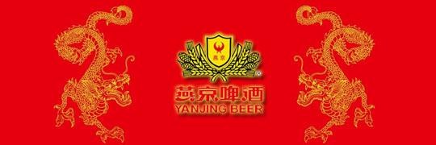
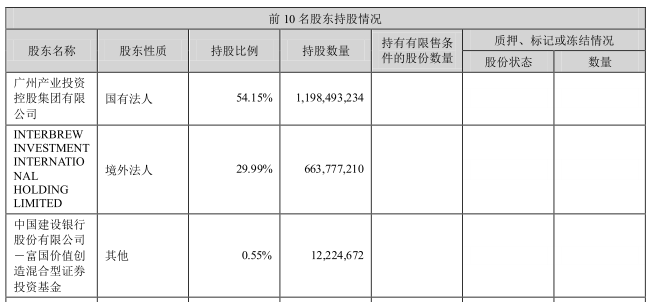
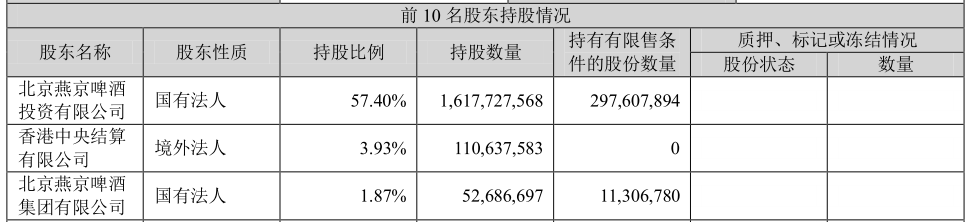
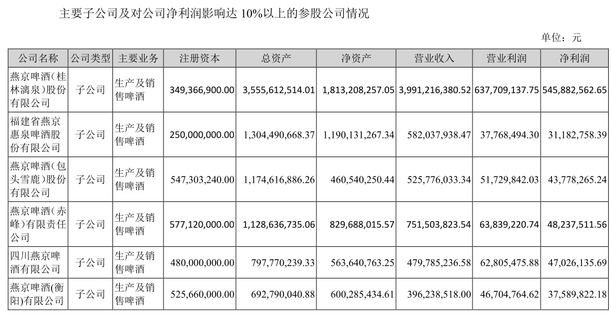
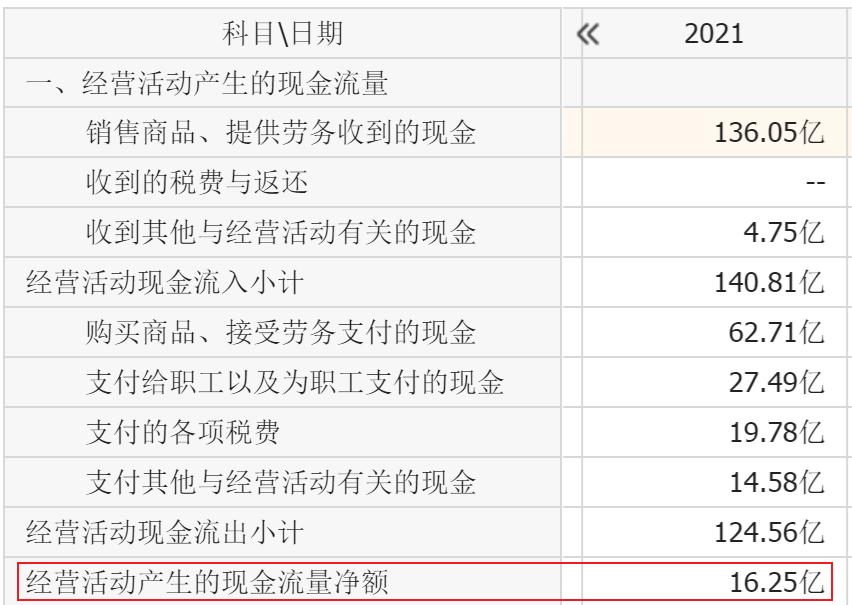
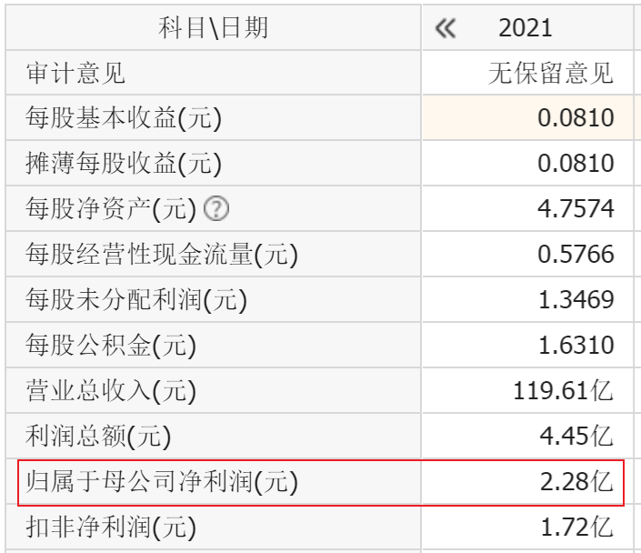
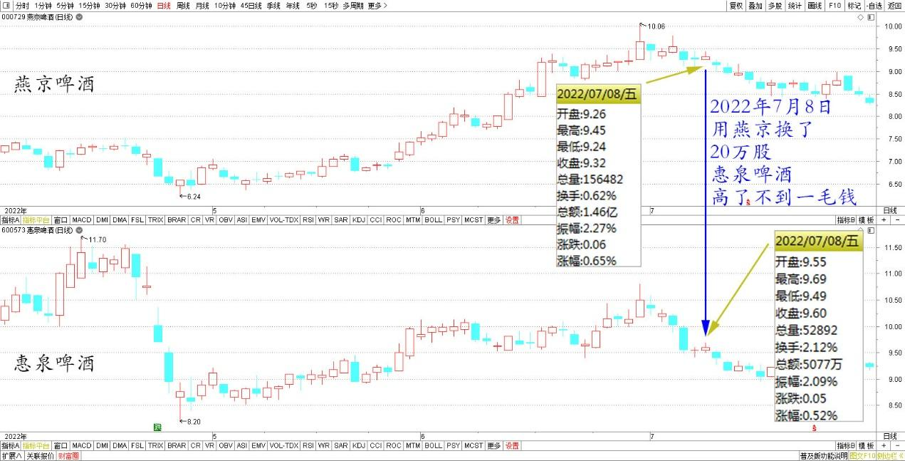
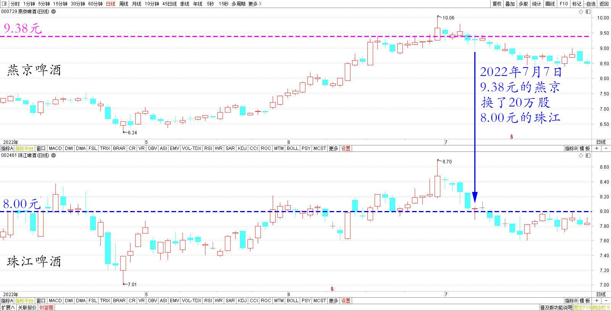

**

**

专篇40.继续守候民族企业

**一、民族企业，燕京利好**

清一山长2022年7月4日

中纪委提出“要坚定文化自信，教材决不能搞动辄欧风美雨、言必称希腊那一套”，窃以为：对国学是利好。对崇尚国学的新教育是利好（可惜读经教育，把国学变成了笑话，就像雷雷等把多好的太极变成了笑话一样），未来我们会慢慢成为“主流文化”的，现在是小众。

另外，我还可以理解为，长期来看，对燕京是利好。目前唯一未被外资控制的纯民族企业。而燕京也在打“国潮”牌。因此，**燕京现在价格高于珠江，是可以理解的。原来是珠江啤酒高于燕京**（珠江外资是第二大股东控股）。不过，珠江的流通股很少，只有10%多一点。如果要炒股的话，珠江筹码更少，容易操控。这也是两年前我主力做珠江的原因。燕京流通股太多了。当然，现在已经被主力拿了很多，已经比较轻了。

珠江啤酒2022年一季度报告前三大股东

燕京啤酒2022年一季度报告前三大股东

**二、隐藏利润，继续守候**

清一山长2022年7月8日

【公开资料显示，2021年，燕京啤酒营收119.61亿元，同比增长9.45%，归母净利润为2.28亿元，同比增长15.82%。这一业绩仍不及十年前。2011年，燕京啤酒的营收为121亿元，和2021年的基本持平；当年归母净利润为8.17亿元，是2021年净利润的3.58倍】。这个数据，说明燕京很差。现在还不如10年前。不过要注意——啤酒市场见顶之后，已经萎缩了十年。燕京基本维持住市场，已经超过很多同行了。另外——现在燕京仅仅漓江啤酒就一年盈利5个多亿。销量只有燕京总额的三分之一。剩下的不仅不赚钱，还亏本。这正常吗？

燕京啤酒2021年年报子公司情况

**再联系到燕京的经营净现金流，比它的利润高得多，显然是藏了利润。但这些利润都爆出来的时候，最风光的时候，就是要卖的时候了。现在：继续守候。**

燕京啤酒2021年年报经营净现金流

燕京啤酒2021年年报净利润

我的操作：以基本相同的价格（高了不到一毛钱），用燕京换了20万股惠泉啤酒。原因是恋旧——惠泉是除了燕京外赚钱最多的啤酒股。一直空仓。现在居然与燕京同价，就换了一点。原来大多数时候，都是比燕京贵的。

燕京、惠泉啤酒2022年4月～7月日线图

另外，昨天还换了20万股珠江啤酒。9.38元的燕京，换了8.00元的珠江啤酒。这个生意，照说不会亏的，亏了也认了。目测燕京正在憋大招。我等等看是否有戏。

燕京、珠江啤酒2022年4月～7月日线图

附引用评论链接：

（链接：

[【职场】燕京啤酒管理层换血：谢广军任总经理，4名副总换人 （快消品讯）7月4日晚间， 燕京啤酒 （000729.SZ）发布关于公司部分高级管理人员变更的公告，原常务副总经理刘翔宇...](http://link.zhihu.com/?target=https%3A//xueqiu.com/8014256486/224743823)）

(标题、图片为编者所加)

**文章音频：**

[533篇. 继续守候民族企业](http://link.zhihu.com/?target=https%3A//www.ximalaya.com/sound/803937888)

**参考链接：**

[专篇34.涨跌无意，笑看云起云落](https://zhuanlan.zhihu.com/p/708781915)

[专篇35.燕京主力已吃饱，唯一办法“屁股功”](https://zhuanlan.zhihu.com/p/6778261298)

[专篇36.燕京逆势大涨，自觉卖出部分](https://zhuanlan.zhihu.com/p/11402979763)

[专篇37.卖洛阳钼业，燕京换中建](https://zhuanlan.zhihu.com/p/15817619966)

[专篇38.燕京过10元，今昔对比](https://zhuanlan.zhihu.com/p/17902318069)

[专篇39.燕京的警戒区](https://zhuanlan.zhihu.com/p/19209641715)

