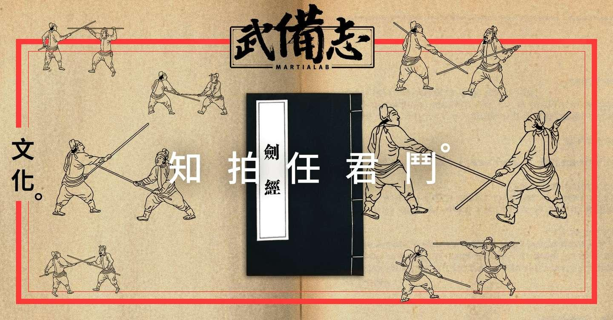
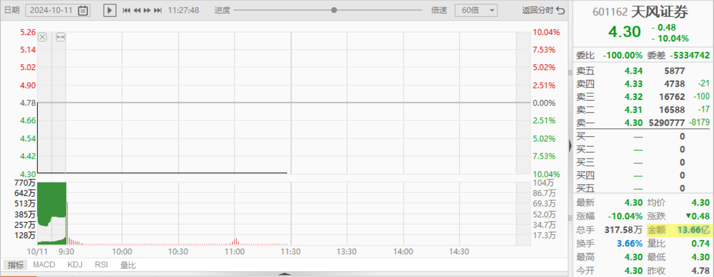
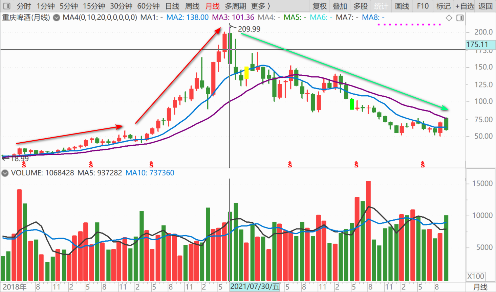
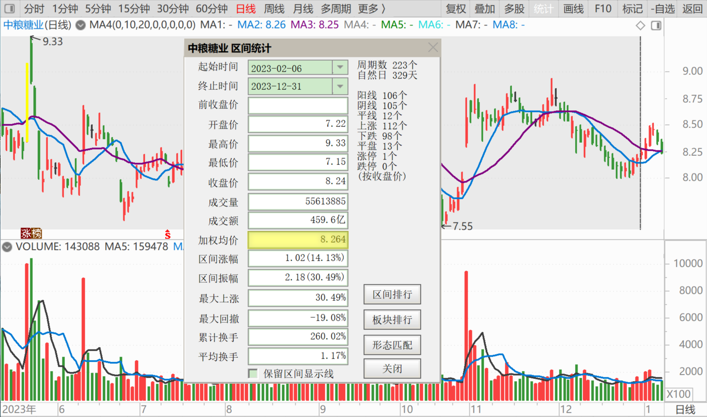
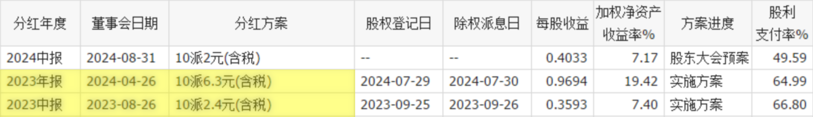

**117篇.**[庄股（天风证券）走势分析再续](https://www.zhihu.com/pin/1828039199569350658)

清一山长 2024年10月11日

果然如我所料：今天天风证券封死跌停，一字板，今天的最高价、最低价、开盘价、上午的收盘价，都是一样的：4.30元。恐怕明天还是跌停。

但我没有料到的地方，就是今天还有很多散户在积极地买进。居然一上午成交了13.66亿。我看都是小单在买进。国人真是有钱呀！只是有钱也不是这样花的。我猜这些积极抢进来的散户，心中想的就是：妖股明天就会涨停，主力肯定要拉升的。不是最高还有11元多吗？还早呢！

难道这些小散户自以为比庄家还聪明吗？你能算清楚庄家明天到底怎么走吗？我承认我不懂明天他到底怎样走，所以我也不做盘。我昨天明明看跌今天，今天也跌停了。但我也不去买空单，也不融券做空。看起来我判断正确，但却没有赚钱。但——[我随时准备承认错误](https://zhuanlan.zhihu.com/p/912328879)**！我看不懂的东西，决对不做！有钱也不要！**

这些散户，估计以为自己是庄家他爹，庄家一定会给他抬轿子，所以今天才敢抢进来。但我认为：昨天的量太大了，主力肯定逃走了。他才不会重新来收拾这烂摊子呢！重庆啤酒当年冲高，花了多少年时间才重新回来？这还是有业绩的股票，没有业绩，没有前途的股，恐怕永远也回不来了。就算只是几元，亏损后退市，你的投资直接归零。

**不过博傻就是比傻**。昨天进去的傻，今天进去的人，比昨天进去的还傻。已经是明牌了，你还进去，就因为今天便宜了10%？当然，也说不定，真有个大傻来接盘呢？比如德隆系，当年做盘厉害，坑杀了多少散户！掠走了多少财富！如果他成功的时候收手，哪里有破产的命运？**就是成功的时候，忘记了风险，以为什么股都可以操纵，结果——反而被散户、市场葬送了**。原来坐庄赚到的钱，全都亏了。我现在买的，就是德隆系当年的庄股。不过这么多年过去了，早就没庄了，连个像样的主力都没有，去年这么好的业绩，分红10%，居然股价都起不来，如果换德隆系控股，这业绩不涨到天上去？

所以，**A股就是——没庄的股真可怜，业绩再好也不涨；有庄的股不用愁，业绩再差也能涨上天！**这种市场，怪庄家没用的。这里**傻子太多，自然骗子不够用！**

如果散户都是像我一样的人，**能够拿利息就开心了，长期持股，不涨就不换**。庄家还能咋办？只能老老实实地投资做业绩了！

（标题、图片为编者所加）

**文章音频**：

[502篇.庄股（天风证券）走势分析再续](http://link.zhihu.com/?target=https%3A//www.ximalaya.com/sound/770471529)

**参考链接：**

[108篇.节后港股分析：昨天抢筹行情、今天日内调整](https://zhuanlan.zhihu.com/p/2594334405)

[109篇.国庆长假后第一天A股是否开盘就是收盘？](https://zhuanlan.zhihu.com/p/2594398022)

[110篇.这样走势是明显的控盘行为](https://zhuanlan.zhihu.com/p/3366754296)

[111篇.燕京走势健康，清洗筹码阶段](https://zhuanlan.zhihu.com/p/2594476768)

[112篇.对今天走势判断错误，本可以让我一天爆仓！](https://zhuanlan.zhihu.com/p/2594508494)

[113篇.国家队出手，中建涨停](https://zhuanlan.zhihu.com/p/2594572589)

[114篇.伊力特跌到“绝望区间”我才买](https://zhuanlan.zhihu.com/p/4113725975)

[115篇.不做空单、不做多单、只换股吃差价](https://zhuanlan.zhihu.com/p/2594605657)

[116篇.庄股走势分析：一天成交194亿的小股票！](https://zhuanlan.zhihu.com/p/4116514275)
