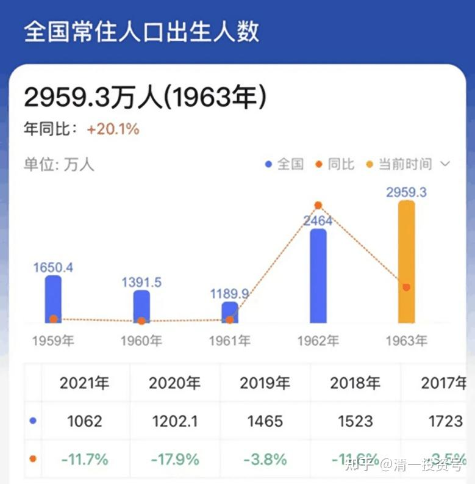
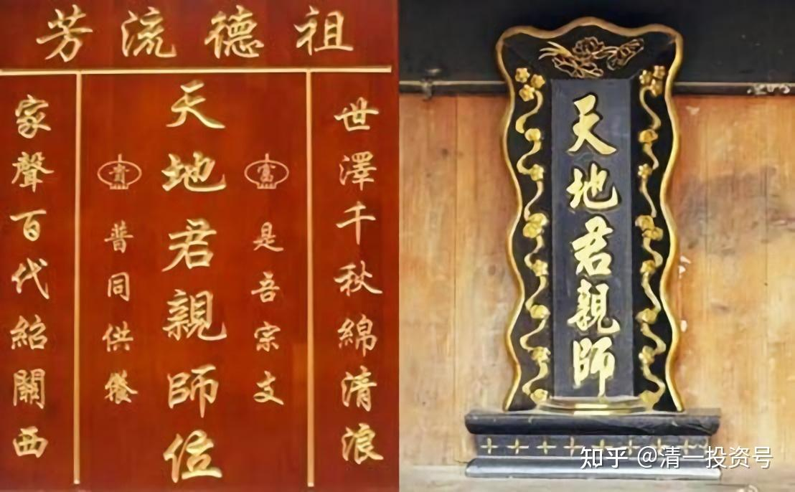
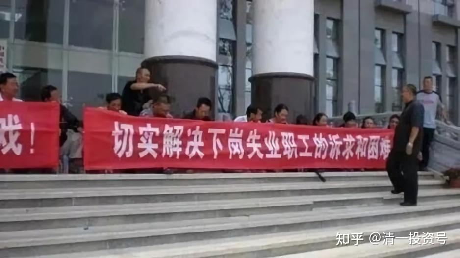
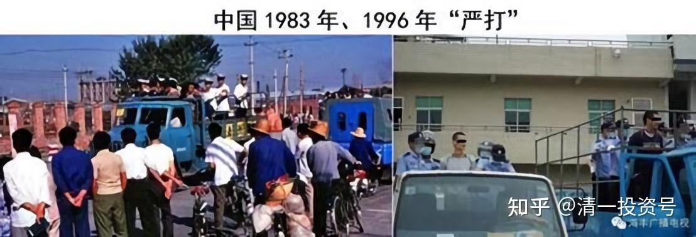

——节选清一山长2021年《中美博弈的趋势和应对》系列三

21篇.预见国家未来布局，个人如何提前做好风险防范——节选清一山长2021年《中美博弈的趋势和应对》系列三

看了这样的局面，你们又在想什么呢？你们是不是在想这些东西都不要出现？中国干嘛要去主动刺破泡沫？不主动刺破还好一些，咱们还可以多过几年好日子。这样主动刺破，那怎么办呢？现在美国、西方各国都找中国大量订购，咱们大量生产就够了嘛！现在还主动限产，主动停产，给订单都不要。现在就是别人给订单，企业主不敢接的，给订单都不要的。好了，现在告诉你吧！这是不可能的，为什么呢？**因为中国人口崩塌，所以中国原有的模式迟早要完。既然迟早要完，不如在完结之前，捞一票再走，这就是中国的逻辑。这个逻辑很正确，我觉得我们现在的政府非常英明。**如果用你们习惯的模式——还是按原来的模式，大量生产，薄利多销，最终的结果就是——最终我们一样会崩塌，但是我们还没赚到钱。所以还不如现在用停工、停产，先捞一票之后，以后穷了之后再说。

为什么呢？我们看看几个人口数字，你就知道很吓人了，最近今年安徽公布了人口报告，别的省还没出来，所以我的数据不全，你看看这个数据吓不吓人。2017年到2021年，人口出生数量从98.4万降到53万，近乎腰斩。请注意哦！2017、2018、2019、2020、2021，5年人口数字掉了一半。然后再看看全国的情况，全国的情况是2017年中国出生了1723万人。我是1963年的，我这一年中国出生人口是多少，你们知道吗？中国出生人口是[2959.3万人](http://link.zhihu.com/?target=https%3A//www.sohu.com/na/591312392_120525326)。所以我们六十年代的人，是一个生育高峰时期，我们这一代的人很多的，所以你可以看到很多六十年代的人。但是2017年出生的人，就已经只有1723万人了，差不多只有我出生的时候的一半了，然后2021年出生的人，今年出生的人，可能降到了1000万左右，甚至有专家还说有可能低于1000万。因为这一年还没过完，但是看今年这个数字，看样子勉强到1000万，甚至有可能不到1000万。那么也就是说今年出生的新人口，只相当于我这个年龄出生的人的三分之一。（[2021](http://link.zhihu.com/?target=http%3A//k.sina.com.cn/article_3860416827_e619493b0190170wy.html)[年中国出生人口1062万人](http://link.zhihu.com/?target=http%3A//news.cctv.com/2022/02/28/ARTI58yTpCGWl7actemarSf4220228.shtml)）

你的感觉是怎么样的？有没有觉得这很恐怖？哪里恐怖？你就知道了，两个恐怖啦！**第一恐怖，未来中国绝对没有那么多劳动人口了。**我们这一代人是竞争最激烈的，考大学最不容易，找工作最不容易，下岗的人也最多，都是我这一代人。很多我这一代人是下岗工人，我是其中幸运的那部分人而已。那么到了你们这一个时代，以后找不到工人的，以后你们老了，想找个护工，我告诉你，你要**请一个护工，他的工资比大学教授还高**，你请不起的。所以在座各位，我建议你现在有一件事情，你上完课之后就该去干了，**你该去跑步，该去锻炼身体了。以后老了，你要学会自己服侍自己，没人服侍得起你。你的退休工资，你拿到的工资绝对不够请一个工人来养你的，这就是未来恐怖的局面。**了解了吧？所以你一定要有准备。而且未来各种服务的价格会非常非常的高，你根本付不起的，这就是这个人口报告告诉你未来的数字。

现在出生的人是0岁，未来等他进入劳动力市场，20岁。所以20年之后这件事情发生，这叫人口崩塌。既然那个时候人工那么贵，你说中国还请得起人来做低端制造品，做那些一件衬衫赚一块钱，这种事情吗？还有人做吗？没人做了。所以中国现在是主动地降产能、降规模，如果中国不主动做这件事情，10年、20年之后就是被动的降。10年、20年之后，中国迟早要完。现在就是在完之前先捞一把，不捞也要完，捞也要完，所以不如捞一把走，这就是现在的模式。这就是我判断中国为什么一定要下这步险棋，提前刺破泡沫，现在痛苦。这叫与其温水煮青蛙，慢慢的被煮死，还不如现在奋力一跳，跳出滚锅。所以**如果我们维持现有的模式，将来中国会成为像苏联一样的失败国家，再也没有希望。如果我们现在没赚到利润，还剩余大量的过剩产能，中国还必须养活大量的失业工人，会导致中国严重的社会动乱**。人口老龄化会让这个国家非常的悲惨，非常的凄惨！所以与其这样中国还不如刺破泡沫，让少部分人活得好一些。大多数人看情况，我也不知道怎么看情况，不过，我想大多数人——像我这个时代的人，二、三十年之后，陷入巨大的负担，我这个时代的人也该死了吧？所以让我们这些六十年代的人去死吧！大概这就是未来。

这个未来有多大的好处？**这个未来可以享受中国制造10年的狂欢——我认为有10年的狂欢，可能不到。我不知道国外要把产业链重新搭建起来，需要多长时间。我认为最长10年吧！最短也不会少于5年，所以5～10年之内，中国制造还有狂欢的时间，大量的利润将涌入企业。**就像现在，我投资了一家企业，中国宏桥，一百多亿的利润。原来几十个亿的利润，现在可能100多亿，甚至可以达到两三百亿的利润，都有可能。为什么？它的产量原来是900多万吨的产量，现在限制到只有600多万吨，但是产量限制之后，各种限制之后，铝价大涨。原来1万左右一吨，现在涨到两万，可能还要往两万五、三万再涨。在这过程当中，这家企业制造的东西比原来少，但是它获取的利润是原来多年的总和，可能一年等于过去的十年。过去十年，这家企业总共也就赚了两三百亿的利润，现在有可能未来一年——2022年一年，这家企业一年就可以赚到10年的利润，这时候怎么办？这时候股票价格会大涨。但是大涨之后，各位千万不要买，我会卖给你。因为这家铝厂既然在中国能赚那么多钱，它在国内会不会建厂？非洲会不会建厂？几内亚会不会建厂？印尼会不会建厂？他们就会像现一样，再拼命地建厂。等他拼命地建厂建出来了之后，开始投产的时候，铝价大跌，这家企业注定就会陷入困境，最后又是薄利，甚至不得不关闭。

由于中国的劳动力价格太高，竞争不赢菲律宾、印尼的，所以多少家厂可能就变成了以前的国营大厂，像美国的厂一样不得不关闭。但这个时间什么时候发生？10年之后不会发生，10年至20年之后就会发生。所以如果这家企业的股票大涨，我会在一个大家都非常兴奋的时点把它全部卖掉，去**买别的靠谱一点的企业。宁可买个低利润的企业，看起来现在很差劲，但是只要它不破产就行。这就是我的思维模式。**

另外一家企业，给大家提供一个数据，中国铝业，过去10年，它的总利润是多少？负两百亿。但是中国铝业明年它可以赚到100～200亿之间，它可以一年赚到，原来是负两百亿元而不是赚了200亿哦！现在它可以一下子从一个困苦破产、拿补贴的这样一家企业，突然变成一家现金流企业。但中国铝业现在的股价已经上涨到跟中国宏桥一样了，那我当然不会去买它，但是如果当年你在两块钱买的它，你赚死了。所以说这就是未来的趋势，十年后就知道谁在狂欢，现在正在狂欢。这些企业会出现好大好大的利润，你会突然发现，而且全世界都会发现这件事情——全世界发现中国的企业其实很赚钱，我认为全世界的资本会追捧中国的企业。因为他们害怕美国的企业赚不到钱了，他们会去追捧中国的企业。所以**中国可以干一件很漂亮的事情，可以把外国的资本在高位把它锁定，就是曾经日本企业干过的事情一样**。这就是现在我们观察到的其中一种指标，这个指标我相信对大家会有帮助的。

不过接下来，这十年好处过完之后，**未来十到二十年，人口崩塌。人口崩塌带来的是会出现严重的就业困难。未来新就业人口的严重不足，导致大量的位置必须空出来，怎样的位置？**咱们来想象一下，中国宏桥，它也是一个劳动密集型企业，很多很多的工人，多少万的工人在那，那么现在你说10年、20年之后，我认为它可能要转型了。它不转型不行，而且中国宏桥正好在深圳，它的研发中心或者总部搬到深圳去了，是一个很标志性的东西。我认为它的领导层已经在开始研究未来怎么转型的问题了，现在还不需要这样，但是他预测到未来招新工人会很困难。比如现在他有10万工人，未来中国的人口如果按照刚才那个比例继续下去的，像我这一代是六十年代的人，六十年代的人是现在的出生人口基数的三倍，现在比我年轻的那一代人，就是再过10年、20年之后，可能就是两倍，再到现在这一代人会变成一倍，其实只剩下三分之一的人了。如果按照正常招工，他只能招到1/3的工人，它的产量能不削减吗？但你知道倒是可以提高自动化程度，有些企业可以提高自动化程度，有些企业无法提高制造自动化程度。比如说养老院，比如说护工，你怎么提高自动化程度？没法提高的，公交车可能可以提高一些自动化程度，我不知道，但是很多企业确实无法提高。

人口的下降就使得企业的招工会很困难，企业招工很困难，就必须增加工资，而增加工资就会带来更加强烈的竞争，更加内卷的局面，还不如大家都躺平不玩了。很多工厂会选择停业，而且会把这些企业搬到国外去，宏桥也肯定会搬过去。所以未来的生产途径，我怀疑有可能宏桥到最后会在非洲几内亚布局，用它那边的矿山在当地生产。但是这个当地生产到现在缺的是什么？缺的是电力，接下来它可能就要建立配套。你看，做一家工厂要建电厂，还要建其他配套工厂，电解铝厂，还有氧化铝厂，各种厂要全部配套配起来，它才能够开始生产电解铝。那么这个配套会在多少年时间完成？会在10年时间完成。所以中国宏桥未必会倒闭，但是它一定会变成国外生产模式，但是宏桥现在假如有十万还是几十万工人，那么这十万、几十万工人在我说的这件事发生之后，这几十万工人会怎么样？就会下岗。老工人会让他们逐步的退休，随着年龄增长而退休，但新工人就绝对不招了，现在就不招了，否则将来这些人的遣散都是一个问题。现在老工人慢慢退休，慢慢的减产，慢慢的降低，提高自动化，最后这批人到国外去在国外开始生产。中国就会像美国，美国的镁铝很多企业是在国外生产的，国内都不生产，所以中国会走美国的老路，所以很多人将会失去岗位。

如果我们现在拼命生产，到时候中国招不到工人，要到处抢工人来，肯定会成本高得受不了，还是得破产。所以不如现在就开始转移产能，它已经开始转移了。

我现在看中一家企业，正在买这家企业，但我不会公开说，公开说不太好。我就发现它在非洲布局制造业。那么它是先行者，现在股价也很低，我就会把这些当做风险投资买一点。这些企业就是我未来的投资布局方向。

接下来给大家看一些将来会出现的局面，只是预测，不一定会出现，只是我的判断。我认为第一波大杀器就是金融危机开启，美国崩盘。特朗普时代好大喜功，为了表示他的政绩，把美股吹吹吹，吹到现在高高在上，3万多点。但是与此同时，大家发现中国政府很精明，把**中国股市一直压压压，压到3000多点不动，然后一些大蓝筹还故意制造压盘，使劲地压，这你就要问为什么？因为中国在等待这个时点，这个时点就是美国崩盘，中国的企业效益突然变得特别好，让全世界的资金来追捧中国。要形成这种局面，就要跟美股反向**。如果中国拉起来了，跟美股同向，中国拉起来了之后，必须跟美股陪跌，但中国一直压在底部，就跟美股不一样，就跟它是反向的。反向就突出了中国的力量，突出了中国的标志。所以现在大家要注意一条，不要去买那些高高在上的股。高高在上的股第一价格比较高，比较危险，第二就是万一美股崩盘，高高在上的股也会跟着崩。但是你买那些几年都不涨的股，它就是不涨，3年、5年，甚至有些10年不涨的股，这些股你会发现它一定是未来绝对不会垮的股，它有很强的实力，所以这种股你就该干什么了？买进来等着。10年都不涨，你美股崩我还能崩到哪去？你就不用担心，但是万一要涨，它会率先上涨，这就是我未来的布局。**一定要反向而行，跟别人就是相反。你不能跟别人一样，跟别人一样，你没饭吃的。**

你去买茅台，我绝对不买，有茅台我都会把它卖掉，我去买那些十年不涨、五年不涨的股票，谁越不涨我越喜欢谁。但不涨不能说这个可能会破产，破产就绝对不能买了。**要买现在经营状况良好、现金流良好、企业状况良好，而且订单很丰盈，并且未来的订单不会萎缩的那种股**。买了之后把它拿在手上干嘛？等着！这些股有好多，但也不是特别多，你们自己去看吧！比如燕京啤酒6块多，你自己算算10年不涨的，但是燕京啤酒十年之后它不会垮啊！现在是不太好，但是当它把价格涨了以后，马上利润就会变好。这东西只是它愿意涨价的问题，而且它的自动化程度还比较高，所以这种东西你不用担心。我敢买燕京啤酒是基于这个理由，**我不考虑现在赚不赚钱，我考虑以后会不会赔本。**我就不相信你告诉我燕京啤酒将来会赔本。你告诉我比亚迪10年之后会赔本、会破产？都有可能，宏桥会破产都有可能。我就不相信燕京啤酒10年之后会破产，你看我就只敢买这种东西，这叫保值的手段，但是不是会赚钱我不知道，我真不知道，**我只是告诉你一种可能性而已。**

好了，美股崩盘全世界股票也要跟随崩盘的。我在泰国的股票，在前段时间涨的时候赚了几千万已经腾出来了，腾出来就等着，只要不跌我就等着，我就是死不进去。那么A股何去何从？风格转换。我认为就是风格转换。而且我认为**很可能是由国家控制资源在手的那些股，会变成未来的，全世界的明星股，但原来风光的都将沉默下去**。所以有些股，我看明显是有大手在打压，**越是有大手在打压的股，你越是要买它。有大手打压的股票就证明它代表了国家意志，而国家意志将来会起作用的**。现在国家是不让它涨，不让它涨也是国家意志。中国股票涨了对中国没好处，所以这让美国人特别讨厌，美国华尔街特别讨厌中国股票跑在低位。所以**低位的股票**，**在未来中国发生萧条之后，你会突然发现中国的企业还能够稳定的盈利，这样的企业会不会成为全球资金未来的避难聚集地呢？**所以**这就是未来的一个机会，找错了机会，你的资金就灰飞烟灭；找对了机会，你未来就很有机会。**

未来二十年会出现一个什么局面？未来二十年我认为两极分化将极其严重。现在，一个摩尔定律，一个马太效应，但是我们要记住，未来会更加严重。**未来会富的更富，穷的更穷，更糟的是中产阶级返贫，中间层不再有太大的生存空间，大量的中间层会返贫。高级智力资源可以获得超高的回报，你要么把孩子培养成高级智力资源，要么把他培养成蓝领工人劳动阶层，不要再想中间层的问题了，中间层很难。**

所以就是第三条——“**符合社会需要的体力劳动者、第三产业人员会获得空前的回报。”**比如说你的养老啊，保姆啊，服务人员啊，甚至给你做饭的那些人，他们的工资会比一个普通的中产、比现在的白领要高得多。这也是大家看到的局面——在西方国家、在欧洲国家已经是这个局面了。

在西方国家我曾经看到一个中国人的账单——个中国人到欧洲去，在欧洲国家生活，买了一栋房子，应该也是中国的富裕阶层，那栋房子有个花园，大概跟我这个差不多。但是他让他的园丁来工作了4天，为他剪草，为他去整理花园，为他搭了个棚子，4天之后给他开出来的工资是多少呢？是21万元人民币。21万，你感觉如何？天呐！贵死了，所以你别以为你有钱。如果出劳动力给你打理花园、给你搭个棚子、给你做个简单的工作，4天就可以挣你21万，你那点钱够用多少，告诉我？所以他突然发现为什么西方人喜欢DIY自己工作了，真请不起！就算我那么有钱，我请得起，但是我也觉得挺心疼的，21万就干几天的活。所以我们在座各位，该怎么做了？就算你是中产，你用这样的劳工半天会把你抢成负资产去了。如果你去请这样的工人，工人收入比你还高，所以中产就不太中了。所以各位——第一**你要自力更生，要学会自己照顾自己**。以后的工人，比如你要请个护工，可能你请不起，你的退休工资加几倍给他，够不够还难说，要学会自己服务自己，要学会锻炼身体，要学会自己照顾自己。没有这一条，我建议那就将来找根绳子把自己吊死算了，如果你在那还需要别人服侍才能活下去。

同样**对我们的儿女有什么要求呢？体力劳动一定要会做。**你是精英，年薪百万、千万那你想怎么地怎么地，反正身体好总是必要的，万一你儿子不成器呢？然后只能去做体力劳动，只能去做第三产业服务人员怎么办呢？所以他的身体得好。你们今天看到了行知学堂的这些学生的表演，你会发现他们体能不错。这些孩子，未来的可能第一做精英，第二做高级智力资源。但是恐怕大多数人做不了这个资源。做不了这个资源，起码他们可以为你服务吧！你养老了，来给我21万，我给你干4天活，这些孩子会很乐意为你服务的，我认为这就是未来。

去看看欧洲国家他们怎么生活的，这可能就是我们生活的路径，只要去观察。你看现在你可以随便在外面吃饭，随便在外面潇洒，然后动不动请客。我告诉你，欧洲国家怎么请客的，一个朋友告诉我这件事情，笑死人了。当地一些人也会请客，结果他们三个人一起去吃饭，去一家中餐馆点了一碗水煮肉片，四川菜，有很多蔬菜，辣辣烫烫的，上面有一些肉片，这样一个水煮肉片。那么这个水煮肉片，只点了一份，三个人点了三碗饭，三个人就吃这一碗菜。他说：“这样请客太寒酸了吧！按照中国人的习惯，起码一个人一个菜啊！”对吗？但是你想一想，他为什么这样点？那个水煮肉片是50欧元一碗，50欧元就是500块钱一碗水煮肉片。你请客吃饭会不会说“算了，咱们三个人省一点吧！点一碗就得了！”像你们现在浪费的，一半都吃不掉。当然，到最后一个菜他们吃得干干净净的。所以你们现在能够潇洒，以后能不能潇洒——以后“海底捞”的工人由于人口奇缺，里面的服务员的工资可能要5万块钱一个月，这钱你都得出啊！所以那时候的你再吃“海底捞”，可能价格要比现在高10倍，不奇怪的，一点都不奇怪。这个时候你还觉不觉得自己很有钱，动不动就在外面潇洒？这就是未来的局面。

**第三条，符合社会需要的社会体力劳动者会获得空前的回报，甚至比白领工资更高，这就是趋势。**所以你们的孩子现在不做卫生、不做服务、什么事情都不做，你们成天自己做老妈子把孩子伺候得——除了读书之外啥都不懂，你这孩子将来活不下去的，跟你明说活不下去。他读书也不会读得好，干活也干不了，他就完蛋了。所以看你还用原来的模式去伺候爷一样的伺候你的儿子和女儿。我都不敢这样做，你敢这样做！那我只能说太佩服你了，你肯定比我更有钱！

好了，你们自己再**思考一下，你做什么才能让你的孩子赢得第三次大转型？**你们用你们现有的思路，你们现在准备好的东西，你们这些家长们，我看你们就是三条路吧！

第一条路——存钱，我有钱。你们到底有多少钱我不清楚。我猜，不管你的钱是什么东西，你的资产，也算是你的资产值——我猜你的资产值大部分是用你的房子来计算的，你手上的可支配现金是很少的，我猜的。你以你的资产来衡量说“啊！我其实不错的，我有几百万、几千万”，你这几百万、几千万大多数是你的房产，你的可支配现金是有限的。你说“我存到银行里去几百万”，你的几百万够你孩子用几年？不好说，如果物价上涨10倍。大多数人说“我买房给孩子，以后租房子出去也可以赚钱”。现在租房子，一套房子租出去好像一个月可以过得舒舒服服的。我买一套房子，比如说一个月我出租两三千块钱，这两三千块钱现在过日子可以过得不错。未来呢？未来可能你根本租不出去，没人要租你的房子，你卖了更没有人要，你知道为啥？未来人口只是现在的1/3，谁要你的房子呀？未来的每一个小孩子都有几套房子，所以未来你的房子可能没人要，怎么办？

当然一些人口流入地区，像深圳这样的地区可能可以维持吧！我认为能够维持的只有少数地区，大多数地区无法维持。就像日本，日本东京附近的房子可以便宜到一两百万就可以有很大的一套房子。为啥？因为除了东京都核心地区，房子还有点价值，租也租得出去外，别的地方的房子出租都没人要的。所以大量的房子空置，日本就是大量房子空置的。当年买房子时，觉得是一笔资产，现在是一笔负担。

接下来你的孩子唯一的使命就是维持……考大学？考大学，拿个文凭。我已经告诉你了没用，等一下我会证明这一点的。所以未来的安排现在你就要好好的开启，你就要好好的去思考未来该怎么做了。

接下来，我给你证明考大学为什么没有用。请为这个人选一个未来的职业。

假如这是你的孩子，你们中国家长不是忙着给孩子移民吗？我有钱，我移民，我给孩子买个国外的学籍，买个国外的籍贯……好了，这个人拥有英国的国籍，请注意，拥有英国的国籍，移民成功。你现在有钱呗！另外你的孩子也很努力很成器，他拿到了牛津大学的IT专业，不错的专业，还拿到了牛津大学电信专业，拿到了两个专业的硕士学位。另外，他还拥有跨国公司工作经历，20多家公司任职过，足迹遍及13个国家，到这13个国家的工作代表处工作过，另外他还有管理经验，在政府做过官员。好了，现在这个人下岗了，他重新工作，你为他找一个工作，好不好？

假定这是你的孩子，你为他安排的这个出路，他能找到什么样的工作？我们想象一下？好了，结果他找到了一个工作，是让我想象不到的一个工作。就是这个人，这个人曾是阿富汗的电信技术部的部长（[赛义德·艾哈迈德·沙阿·萨达特 Sayed Ahmad Shah Sadaat](http://link.zhihu.com/?target=https%3A//view.inews.qq.com/a/20210824A0EDS200)）。但是后来，在阿富汗辞职，当然阿富汗也有问题，再后来就出国了，回到欧洲去了，他有英国国籍，但是他得到的工作是一个送外卖的工作。这就是他，你看他当部长的时候是那个样子，挺神气的。但是，这是他在街头送外卖，穿的是现在送外卖的服装，你感觉如何？好好看一下他的待遇，他是德国在线外卖平台的送餐员，时薪是15欧元，收入刚够维持生活开销，其中包括每月420欧元的房租。萨达特目前每周七天上班，没有休息日的，周一到周五每天工作6小时，早上还要花4个小时去读语言学校。因为他在德国工作，他要说德语。但早上的时候，他其实那时也没东西可以送，早上那4个小时，就算你想工作也没订单给你的。所以周末就从中午工作到晚上10点。

现在我想问一下，大家可能有点好奇怪他的工作，这个人明明有英国国籍，他为什么不在英国工作而在德国工作？你们不觉得他有毛病吗？这就是你要思考的问题了，他有英国国籍，他在英国可以享受国民待遇，他为什么不在英国工作而在德国工作？我推测只有这两种可能性，第一个，欧盟国家的工作证是通用的，所以他在德国；第二个，他不在英国工作的一个主要原因是什么呢？他在德国工作的原因我认为是在英国找不到工作，很可能在英国他做外卖都没机会。因为英国内卷很严重，而且大多数的人——难民——像这些阿富汗难民，他们在英国可能都已经人满为患，竞争很激烈，所以他不得不到德国去，而且他对德语并不熟悉，他不得不每天学4个小时的语言，然后目前在德国生活，虽然德国竞争激烈但好一些。

这个案列对你有什么启示？案列就是说——**学英语没前途了**。我早就给大家说了学英语没前途。全世界人都学英语，特别是作为中国人学英语，中国人如果出现了未来的危机，跟你抢饭碗，包括抢一个外卖饭碗的人，他用英语跟你抢，你都未必是对手，你都会很困难。所以，拜托你，为了让你的孩子以后有竞争力，一定要学第三语言。比如说像这个萨达特一样，萨达特他如果提前学了德语，那他起码现在日子会稍微轻松一些，而且有可能在德国找到一点技术工作。用英语去找工作，未来绝对没有希望的。

**别以为这个案例就是别人的案例，你要想这就是你的案例，你的孩子就有这种可能性。**所以**中国的家长愚蠢到现在依然去读英美国家的学校，依然去拿英美国家的文凭，甚至移民英美国家。我告诉你这叫愚蠢之至。未来到这种国家你没有前途，你拿了国籍都没前途，何况你还没国籍的时候，你更是只能做低等的移民，所以小语种国家可能都还有希望。**

好了，我们来看一看这个图片，我刚刚讲的这个案例就是告诉大家一件事情，就是**我们所有的人，“天、地、君、亲、师”，我们的命运跟国家的命运结合得很密切。**阿富汗这个国家崩溃了，还包括原来的那个叙利亚，一个中东国家，国家崩溃之后，那些中产阶级惨得一塌糊涂，就算逃到国外去，他们也只能做最低等的工作，这些国家不可能把中等职位直接给你，你可以做最低等的服务工作。所以**只要国家失去了平台，我们都很危险。未来中国的国家平台，如果你不能跟上中国的国家平台建设，你便是国家平台不需要的人，你到国外去，你更不被需要，所以你现在就要具备相应的技能。**

看看这个案例吧！这是曾经的苏联英雄，[安东尼娜·费多罗夫娜·胡佳科瓦](http://link.zhihu.com/?target=https%3A//user.guancha.cn/main/content%3Fid%3D186704%26s)，她的塑像，这个老人的塑像，矗立在一个城市里，但是你要看到下面的一个案例，她是为这个国家做出重大贡献的人，她是斯大林接见过的英雄，苏联英雄，她的塑像还塑在这个城市里面，那她的孙女在干什么呢？她的孙女有两个大学的学位，这是她的勋章，苏联英雄称号、金星勋章、红旗勋章等等，然后“幸运的是”她死得早，死晚了之后她自己会很难过的，因为她的孙女，她最宠爱的孙女，她最喜欢的一个孙女，现在在做妓女。就是这个，名字叫娜迦，挺可爱的，据说这是她唯一体面一点的一套衣服，一个人采访她的时候把她拍下来的。她拥有两个大学文凭，打6份工，但是依然无法生存，最后她就只好在街头上去卖她祖母的勋章，去街头当了一个妓女，什么人她都得接待，这就是乌克兰。这是乌克兰在苏联解体之后，一个家庭的故事。

乌克兰现在是一个失败国家，当初它作为苏联一员的时候，这个国家是苏联的重工业制造基地，在黑海旁边。像我们知道的、熟悉的中国的第一艘航母，就是这个国家生产的，但是后来苏联解体之后配套跟不上了。所以当有人找到这个地方说我给你钱，你重新把这个航母造出来，把它做完，只做了一半丢在那，它再也做不完了，因为需要的工业体系极其庞大，一个国家解体之后再也没办法做出来。所以这个曾经的工业重镇立马就变成了贫民窟，很多人活得极其艰难。这就是一个国家失败之后的结果，或者它的经济转型跟不上的结果。所以不要认为你有大学文凭，你就可以找到工作，我要破你们这个思想，**那是过去四十年有效的思想。过去四十年有效的思想，将来不再有效。你有大学文凭，白配的，没有用的。**

好了，再看看这个人。泰国一个普通的卖小吃的摊主，清迈大学毕业生。大量的，不是个别，很多的清迈大学毕业生在做。清迈大学是泰国前三名的大学，清迈大学也是泰国总理他信、他信的妹妹英拉上学的大学。那么这样一个大学的毕业生，大多数人只能做街头的商贩。而这个街头商贩一个普通的中学生，甚至是个小学生，甚至不识字的人，他都能做的，那么他们做这街头的商贩有什么价值呢？也就是大学投资给他们带来了什么回报呢？没有回报。当然可能会带来一些素质的提高，当他跟人打交道的时候，可能会让人舒服一些。你能想象一个中国985大学毕业的大学生将来只能做街头商贩吗？就算偶尔有的话，那是失败者，大多数人不需要。过去的这么多年，我们的大学毕业生就算是个笨蛋，也可以找到一个体面的工作。但未来，我相信——**未来的社会就是很残酷，既要你的文凭，又要你的能力，光有其中一项已经不行了。就算你是名校毕业，你必须有能力才会得到工作。如果你光有文凭，绝对不会有工作；光有能力的人，也不会有工作**。光有能力，当然做摊贩不要文凭的除外。

所以各位，你看了这样的案例，**还有几个人会相信，你的孩子只要考上大学就安枕无忧了？过去时代的老皇历不再有用了，这就是给你的提示。**

那么为什么高学历不能帮助这些人就业呢？很简单，因为**高学历从来就不是就业的保证，从来就不是，世界各国都如此。**你以为啊！泰国是这样的，美国也是这样的，欧洲也是这样的。所以在泰国这样的国家，很多人不见得要上大学，他觉得有个工作是最重要的。高学历从来都不是就业的保证，**只有一个，资源平台才是**。所以你能不能构建资源平台？你不能构建就不行。**什么叫资源平台？**华为就是一个平台。**它构建了这个资源平台，它会给你提供就业，它可以按它的标准来选就业人才。**

新教育也一样，**新教育也是个平台**。**我能以我们的标准来选人才，而这个人才大多数会是我们新教育毕业的学生，他们更容易得到机会，比外面的高学历人有更多的机会**。在今日学堂，你拿个博士学位，甚至你拿到清华、北大的博士学位来，你不见得能够竞争得赢我们自己培养的学生。所以**我们培养的学生，他来（学堂）就业，但他不需要文凭。**虽然你有文凭，你不见得能够得到在我们学校就业的机会，所以**资源平台才是就业机会**。

现在我要告诉你的就是——未来中国的平台正在失去。中国的各种资源平台，由于未来的竞争结果，有**一些核心平台是掌握在国企手上、中央企业手上**。这些平台你要进去，我觉得很难，凭本事都未必能进去。它要你**既要有本事，又要有文凭，还要有后台和关系**，你们认为呢？会变成我们在文革时期一样，为这个事情，你要得到哪怕服务员、营业员这样的工作也都需要关系，因为那个职位是极其稀缺的，有限的。而且那个时代更惨的就是——那个时代还没有自主创业的机会，你摆个小摊都不行。你如今摆个摊去进货，现在的时代允许，你可以去摆个小摊，像泰国人一样摆个小摊，卖点小吃，过点日子。

**未来中国的就业资源平台将快速消失**，所以未来你的孩子毕业之后，大多数将找不到工作的。当你了解到这种趋势之后，你就知道，中国的所谓碳平衡也好，去产能也好，影响的背后的博弈，是**中国的经济思维彻底转向，求利不求量，不再为世界打工**，所以就业资源现在会多余，以后会慢慢的平衡。因为以后的人口少了，但现在我们人口还有点多，现在会不够。但中国必须用现在的不够来制造什么呢？制造稀缺来制造利润。所以我们来看一些故事，看了这些故事，我们就更清楚未来会发生什么了。

（二十世纪）八十年代末期是“国退民进，效率第一”，我们看看结果。比如这张老照片，这些人跑到政府大楼门口去抗议，那些工人老大哥们，“切实解决下岗失业职工的诉求和困难”。那时社会很混乱，那个时代治安状况很差，非常差！现在治安状况特别好，是因为国家对这个社会混乱情况进行了治理，那时候出外非常不安全。比如说（二十世纪）九十年代，九十年代很多货要到广州去进，我也会到广州进货，那个时候银行不行，银行没现在这么方便，都是抱现金过去，但是抱现金过去分分钟被抢。所以说为了防抢有很多措施，你要去直接抵抗外敌，要抵抗很困难。那个时候就是一个小巴士，比如说我记得进货是到番禺进。去番禺进货，那边有很多进口电器，要在那边进货，你就要坐巴士过去，这些巴士开在路上，有时候就是直接到站里接人上车去，然后半路巴士停下来，把所有人的钱都抢光，抢光了之后，把你赶到路边，巴士直接开走。但是会每个人给10块钱——每个人给抢光了，然后回过头来讲“人情”，每人给你10块钱，用这10块钱，你可以回去到某个地方，然后怎么去过渡一下。

我有些朋友告诉我，他们到那边去被抢过很多次。我很幸运，我一次都没被抢。我没被抢，我是用了什么措施来防范被抢？那时飞机很少坐，也很难坐上；坐火车也是卧铺买不到，当然经常站着，站过去，然后背一个土不拉叽的农民包，但是包里其实全是钱，一个背包，看起来土不拉叽的像个打工的。我记得走出广东火车站、流花汽车站，外面都是各种各样的车“啊！上不上车？到哪里？哪里都有的。”我从来不上这些车，然后也不吭气。有人问我：“打不打工啊！”挺好的，那证明我的身份跟打工仔一样，其实包里面装满了钱，是个老板。那我干嘛呢？坐公共汽车。坐公共汽车我跑到市中心去找了一个站点，我记得那时候是南方百货大楼？那附近有一辆巴士，那辆巴士直接开车去番禺。但那个巴士有什么特征呢？都是本地人在那坐，说的是本地话唧唧哇哇的。上车了我一声不吭，找到后座的某个座位坐在那，就像个打工仔的样子，可怜兮兮的，让别人没人理你，而且我不说话，让别人不知道是外地人。所以我用这种方式从来没被抢过，但是那个时代外地人到广州都没被抢过的人极其稀少。如果没有这种生存智慧怎么活？现在，我和大家说这样的故事，大家听起来好像是上个世纪的传说故事，其实那时真的随时准备被抢，随时准备被杀。那时候把你一个外地人杀死了，你一点脾气也没有。很多人就这样，有些老板就这样莫名其妙的死掉了。

所以经历了那些时候，我们现在可以说第一桶金是用命换来的，真是用命换来的。我觉得很幸运，我的儿女他们不再需要再用命去拼，但那时你不拼命没办法呀！真的拼命的！真的是拼命！还有跟黑帮打架，跟流氓打架，他们来抢你生意，你不打你就完蛋。真的，这些都经历过的，现在哪有？所以这就是那个时代。

那么现在这个时代，看一看——所以中央发现社会混乱比较厉害时就采取了“严打”。“严打”一大批人被抓住，像这个被刑车押送的人，显然他就是被抓住要去执行枪决、枪毙的，然后把很多人抓的抓、杀的杀、关的关。那个时候“严打”，严到什么地步……采用很严厉的东西，才把社会风气打下来的。所以现在各个基层，各个民警，各个部门，越抓越紧越抓越紧，对各种事情抓得特别紧，都是为了防止出现社会动乱。我觉得很有必要，**动乱对谁都没有好处，我希望我们都是良民。国家都已经在开始做布局，在动手，在防止未来的各种崩溃局面的出现，**那么你自己呢？**准备到最后一分钟，不撞南墙不回头，或者说不见棺材不流泪呢？还是提前也跟国家同步做好未来的风险防范工作，这由你自己来决定。**

参考链接：

[系列一：18篇.近代中国的三次大转型的本质](https://zhuanlan.zhihu.com/p/597466066)

[系列二：19篇.有危必有机，如何抓住时代的机会?](https://zhuanlan.zhihu.com/p/598629949)

