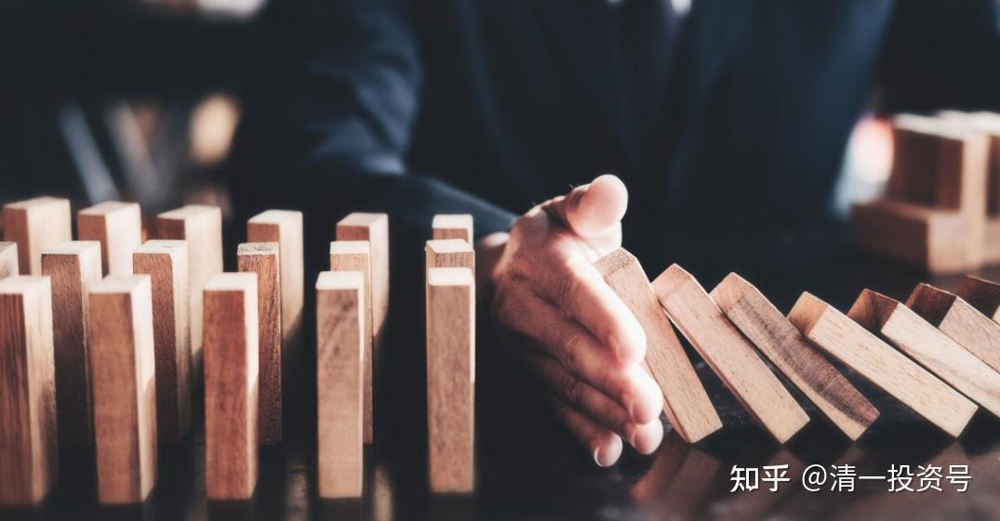
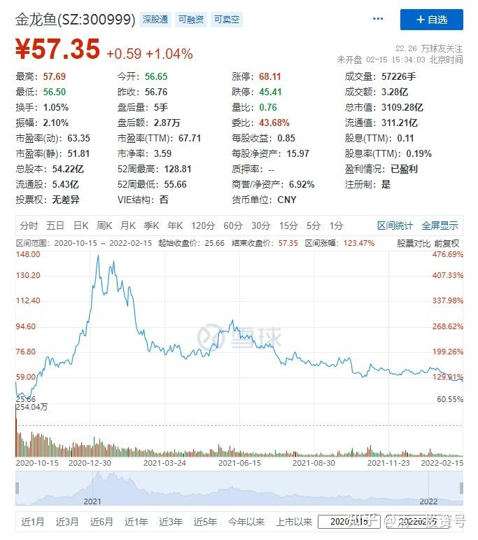
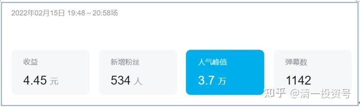

**3篇. 股市最重要的是风险管理**

清一山长 2022年2月15日

认错：我认为本周美股跌的话，中国建筑会涨，结果是美股跌了两天，中国建筑跟跌了两天，中国建筑表示不跟美股唱对台戏，它俩唱双簧[疑惑]。**我认错，但不出局，依然坚守阵地。**

今天看了金龙鱼的走势，一年多前，这个股一个劲的往上走，从开盘价的48元，一直涨到了145元。我记得公开在雪球点评过这股，说毫无投资价值。一个卖油的，有啥技术壁垒？值得这么高的价格？PB10倍以上。值吗？告诫大家不如买燕京靠谱。今天来看，燕京并不是啥好种，没怎么涨。买了燕京的，估计也满腹忧厌，觉得没跑过通胀。但如果你当年买了金龙鱼会咋样？今天，从高位已经跌了三分之二了，现价只有57元。如果当初追涨的，上融资的，今天统统死光光了。

网吧里面很多人骂金龙鱼，骂林园，干嘛不骂自己猪脑子？[大笑]。股市上来，是考验你的人性的，考验你的理性的。我们当然可以犯错误，但不要犯让自己会死的错误。你6元多，甚至7元多买燕京，是不会死的。5元买中国建筑是不会死的。但你100多元买金龙鱼就有可能会死。**股市最重要的是风险管理：你投机，赚100次，每次都赚100%的利润，这没有啥好自豪的。但你只要亏掉一次100%，你就出局了。所以——我们必须敬畏市场，而且——不上杠杆。**不上杠杆会让你富裕得慢一点，但不会死的。上了杠杆，也许你赚大发了，也许你就亏光了[疑惑]。

*金龙鱼过去两年走势图*

**附录——过去一年评论金龙鱼4个贴子**

1. **第一个帖子**

清一山长2020-12-30 15:10 ·来自雪球

$金龙鱼(SZ300999)$ **持有啤酒的我们，看看这个股，我们就更有信心了：中国人要用油炒菜，更要喝啤酒。啤酒的用量，要比食用油高得多，弹性大得多。**今年，明年，这些消费股，都是风口上。迟早吹到啤酒上来。等啤酒开涨了，可能也是这个样子。涨不停！所以，为了防止被“消费热”抛下，我的啤酒一直没有减仓，只是通过做T，不断降低成本。就怕减了仓，就看它变食用油了！我也奇怪：食用油，其制造的门槛，要比啤酒低多了。我见农民都可以拿个机器现场榨油的，我就没见过有农民弄出个“农家啤”的。所有人，都几乎只能买啤酒喝！自己做的就没啥市场。凭啥做啤酒的，就弄不过做食用油的公司？

**我就守株待兔，慢慢等。现在的价格，起码我不用担心会跌下来。估值底，摆在这儿呢。**

**2. 第二个帖子**

清一山长 2020-12-30 17:36

$金龙鱼(SZ300999)$仔细看了一下这个股，挺怪异的。真的很怪异。首先是成交量怪异，每天50多个亿在里面。热火朝天的股。前天涨停，昨天休息了一下，今天创新高，接近涨停。

可是，**最怪异的地方就是：它涨停，还是不涨停，成交量都差不多，都是五十多亿。**你们看看；正常坐庄的股，惠泉之类，涨停的量是多少？平价调整的量是多少？创新高的量是多少？平盘又是多少量？惠泉，是绝对正常的股。而金龙鱼？很不正常！

我就理解不了拉。难道涨停想卖股的人，和不涨停就卖股的人，一样多吗？

涨停买股的人，和不涨停买股的人，一样多吗？追涨的人，和不追涨的人，都一样多？

我不知道是咋回事。这种股，就只能叫“妖股”了。就算我学了鬼谷子，也理解不了为啥这种走势。**只能猜：是不是就一帮人对倒？**不过这不是白送券商钱吗？每天五十个亿，就算是万一的交易费，还有印花税也不老少呢！每天上十万就消耗掉了，这个维护费可不低！

其实，**从涨幅看，这个股也就是从40多元，涨到了100元，涨幅跟惠泉也差不多。不同的是：惠泉是山水画，一路走来，高低跌宕起伏，玩的才精彩。金龙鱼居然就是只涨不跌？**应该是小股民最喜欢的股了！我还是喜欢惠泉，喜欢它玩跌停，当然也喜欢它玩涨停。我已经在惠泉跌停买过好几次了。涨停也卖过好几次了。金龙鱼这种：不喜欢。妖怪，看不懂！不正常！

有懂的人吗？愿意指点我一下不？我真搞不懂了！感谢！

**3. 第三个帖子**

清一山长2020-12-31 15:55回复@晴朗得添:

涨了，什么都是利好。跌了，什么都是利空。别去跟白酒比，没有可以比的逻辑。只能认自己倒霉，拿了不涨。所以，我对付这种无奈的方法，是算股息。中车现在股息率6-7%了，港股利息低，这家公司不会垮，所以肯定是划算的。但高价。我就不敢买了。因为看不清。

**要说价值多少，这就看你的价值观了**。我敢担保：如果让特朗普拿一万亿可以随便买一家中国的公司，他会买华为，不会要茅台。他会拿一千亿来买下中车，绝对不会拿一千亿来买优惠只要2折就送给他的【廉价的金龙鱼】。我也一样。金龙鱼跌掉80%，我都不会买的，除非它的股息率，达到了6%我再考虑。

**4. 第四个帖子**

清一山长 2021-10-17 17:53

$金龙鱼(SZ300999)$这条鱼，居然比中国建筑的市值高一倍？还有人说现在是“至暗时刻”？因为历史上，这条鱼，市值可以买下全部的四大建筑公司，再加上中国宏桥、中国建材六家公司一起，还有多的。现在都“至暗时刻”了，还有两个中建这么多。如果这样比，中国建筑现在不就是地狱时刻了吗？该怎么样理解这种市场给出的估值？

我知道：**中国假如少了一家中国建筑，更别说少了四大，全世界都会震动的。但少了一家金龙鱼，貌似全世界不会有啥反应。**甚至中国自己都没啥反应，其他替代者多得是。中国建筑，不可替代的地方好像还有点多。比如：90%以上的300米以上高楼，是中国建筑承建的。真要没它了，这90%的高楼，谁去弥补空挡呀？

**编者注：**

山长曾经教导【看过往，知未来】。我们不需要有预言家的能力，只需要站在现在看过去，就能验证一个人的眼光，并决定是否信任、跟随、学习。现在我们站在这里，就借着【金龙鱼】看一年多前山长的评论，那时候如果信任跟随，就能避免一年多后的现在亏损，甚至亏光。他们没有如果了，但是我们有教训。

我们愿意在一年后说【如果】，还是说【幸好】；我们愿意在人生的尽头说【如果】，还是说【幸好】？

十五元宵，感恩刘老师带我们祈福。但是福也是在我们自己手上的，我们的选择，才真正决定福薄福厚。比如，正是因为选择了，我们才能跟随刘老师祈福，才有机缘在这一天参与一个高能量群体的共振。

感恩山长和刘老师的引领，感恩所有参与建设平台的人，每一个人的能量成就了这么美好的新教育家园。祝福每一位家人，福厚如大地，所愿皆成。

