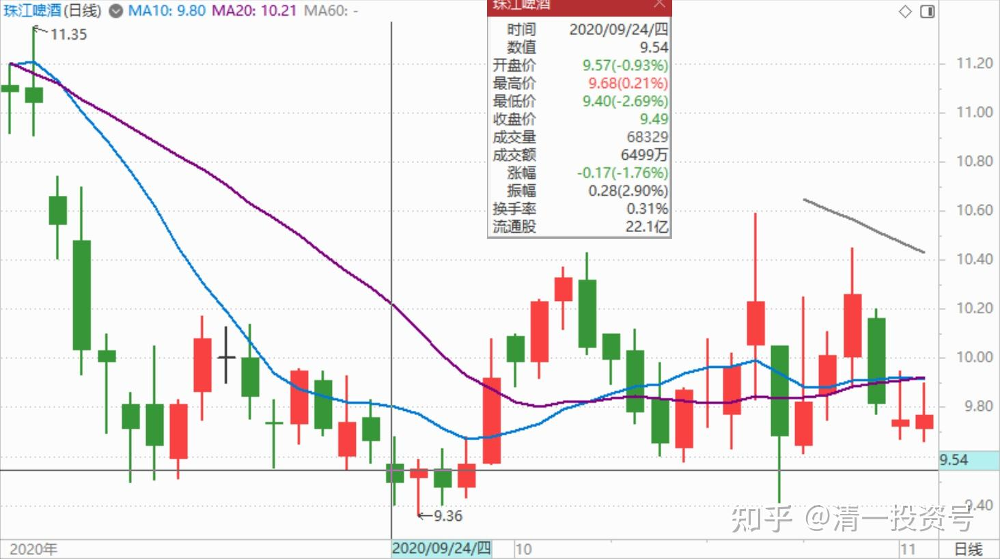
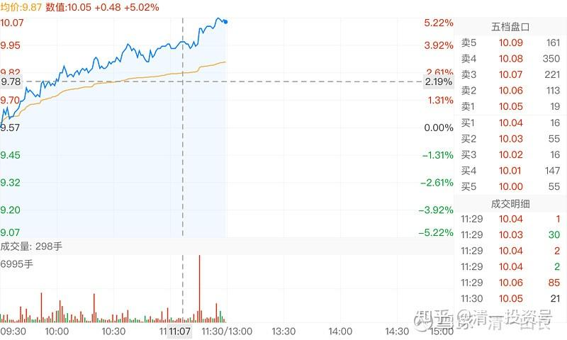
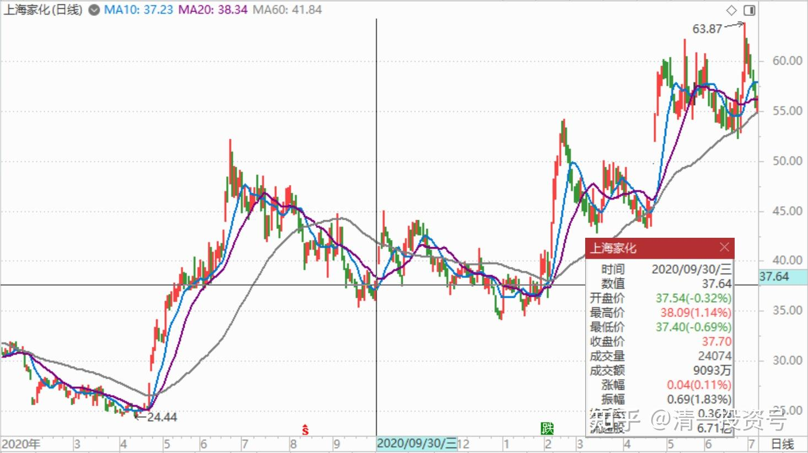
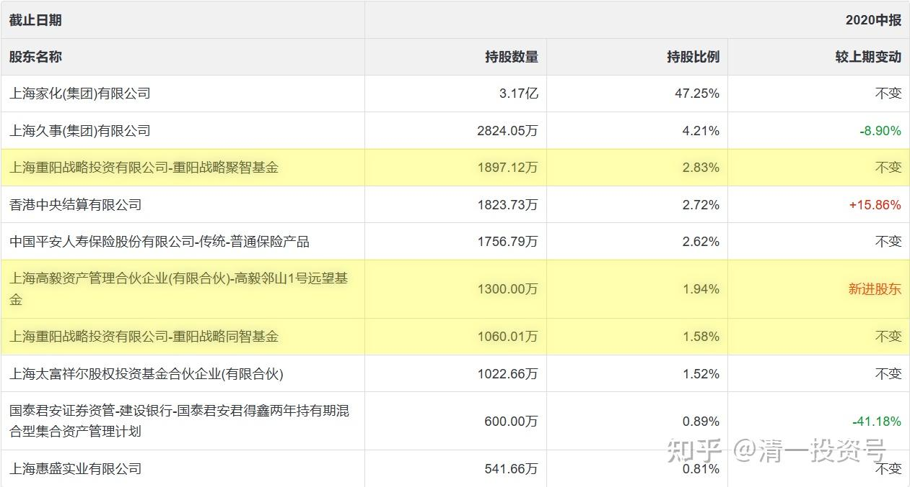
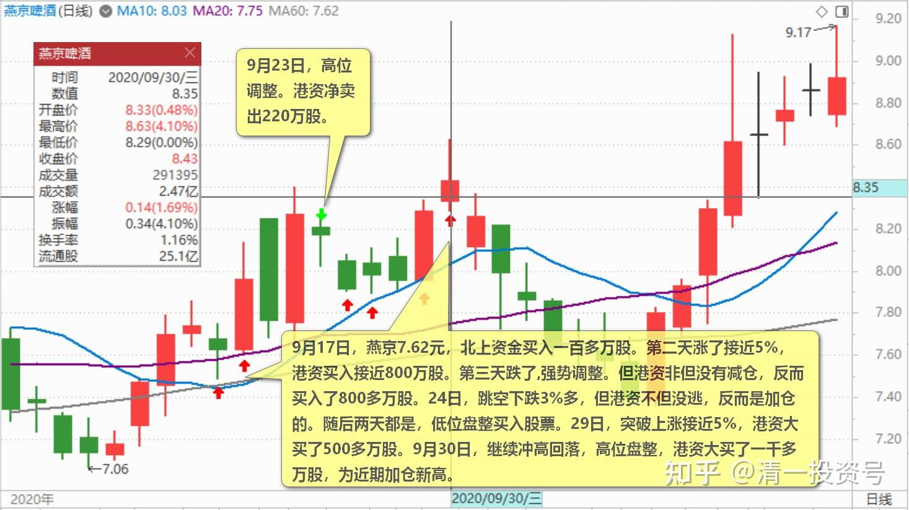
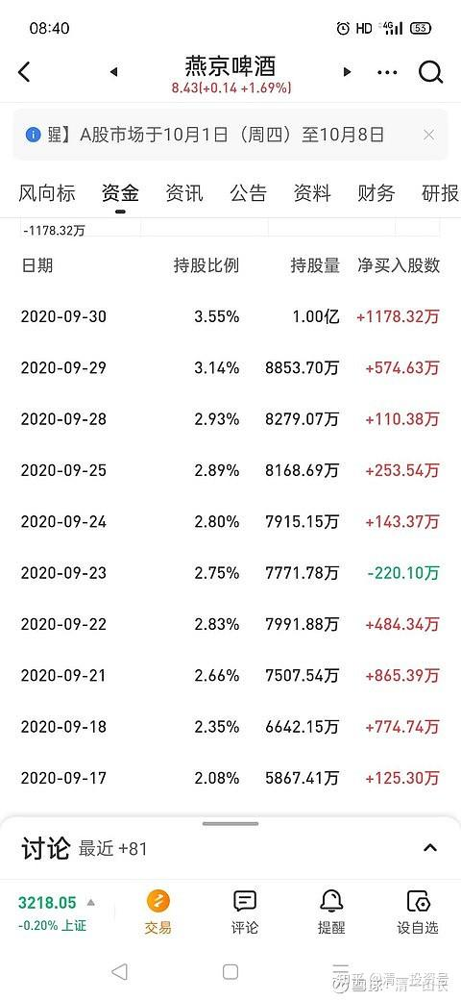

46篇.风险是涨出来的，机会是跌出来的

**一、风险是涨出来的，机会是跌出来的**

清一山长 2020-09-25 10:55:17

$珠江啤酒(SZ002461)$ 忘了报告了：昨天买进了不少珠江。9.43元左右埋单，其中有一单成交了十万股，这个股，我原来首批出掉的价格，也是9元多。现在买进来，并没赚钱。为何还买回一部分呢？按道理应该买燕京才对，燕京明显强势调整。我的理由是：珠江帮我赚了不少钱，现在“落难”了，跌得实在难看，我就出手救救吧！反正账面上都是负成本（百万股级持仓）。从K线上，现在是安全期间。如果真的是主力出货，调整就要破8了。我估计这种可能性不大，当然也不是没有。所以，它的风险是最大的**。风险是涨出来的，机会是跌出来的。跌的时候要买票，涨的时候要卖票。**目前风险最小的是惠泉，其次是燕京（在我持仓的三个啤酒股中比较的话）。

清一山长2020-09-30 11:14:14

$珠江啤酒(SZ002461)$ 自上次（9月25日）公开分享过后，这几天我都在埋头买珠江。本轮买回来1M的货。主要是从技术指标上看，珠江此轮缩量调整，已经到了尾声，说明快涨了。今天本来计划继续卖出燕京，买入珠江的。主要是燕京涨幅有点大，差价一元，换入调整较深的珠江，我觉得是一笔好生意，短线上是划算的。昨天也提了一句换珠江的计划。今天一看：珠江涨得比燕京还猛，就算了。我就停手吧！燕京的好处是销量会带来未来的增长点，属于长持品种。珠江的好处是盈利兑现良好，控盘的程度高，短线做T收益会更好。

在A股，看K线还是蛮有用的，学会看K线图很有必要。目前我是中国四家啤酒公司的股东（加上持有的一些数量不多的青岛啤酒）。**主力是燕京，千万级持仓，助攻是惠泉和珠江，均百万级持仓。**今年说了是啤酒年的，好好喝啤酒。**中建是拿的保险仓。**兴业银行如果破16元的价格，是可以考虑拿货长持。

提醒一下：超过10元的珠江，我是不会买入的。除非做T。您喜欢买，就自己买，欢迎抬轿！[俏皮]。别跟我装是一起坐轿的。

清一山长2020-09-30 11:41:46

$燕京啤酒(SZ000729)$ 今日午评：燕京今天才涨了3个点，耗费了18.24万手。真心不易了。下面的图形是珠江啤酒的。上午涨了五个点，耗费的筹码才7.4万手，连燕京的一半都不到。但这两个公司的市值差不多的，都200亿出头。按道理珠江怎么也该成交超过燕京呀！可惜一直就是**珠江成交少，涨幅大。说明珠江的盘子很轻，弹性好。**熟悉做技术的，玩珠江更有趣。珠江就像猴子，上蹿下跳的，特别起劲。抓好机会，能够获得超额收益。**燕京主要考验你的“屁股功”，特别需要耐心守候，**这两天被下车的人应该不少，就节后再找机会吧！今天是中国啤酒为国庆节献礼咧[大笑]！

今天，看样子，是燕京的突破日。已经是最近几年的新高了，目前这个量，也不算太大，在可以接受的范围内。什么时候继续上涨出现大放量的一天，就是要调整的时候了。你们自己把握时机吧！把握不好，也不急的。因为调整过后，燕京依然是上涨趋势。起码近两年是这样的，可以长持。**聪明人就高抛低吸，傻人就坐等两年，**看重阳进退（重阳绝对不可能一下子就消失的）。

珠江啤酒2020年9月30日分时图

清一山长2020-09-30 17:02:21

$上海家化(SH600315)$ 这是重阳坚持了五年的核心重点股票。我很关心重阳为啥51元都没走，连减持都没看见。现在跌回到了37元了。二季报，看见高毅资产还杀了进来。这至少说明：重阳心中，上海家化价值绝对不止51元。但值多少？不知道，要问裘国根了。但显然可以说明一个基本逻辑：现在买入，似乎不是个坏主意。虽然我根本不知道家化的逻辑，怎么看这种股的价值？比啤酒难懂多了。所以——我还是喝燕京啤酒吧！也许某一天能弄懂家化。

清一山长2020-09-30 17:08:00

$惠泉啤酒(SH600573)$ 要等到10月29日才能看到三季报。我提前剧透三大的持仓情况：244.08万股，持仓价5.976元。跌回2月份，就可以让我亏本了[大笑]

清一山长2020-09-30 21:11:40

$重庆啤酒(SH600132)$ 白酒有茅台，我们啤酒也有重啤！茅台15倍PB，我重啤50PB。谁更牛？我们四川人比贵州人更牛[俏皮]。

**二、港资与主力资金进出的关联度极高**

清一山长2020-10-05 20:39:21

$燕京啤酒(SZ000729)$ 这份北上资金的买入仓单，特别的有意思：**似乎说明了燕京的庄家是港资。**各位结合K线图，看每日成交。可以清晰地看到：9月17日，燕京7.62元，北上资金**买入一百多万股**。第二天涨了接近5%，**港资买入接近800万股**。第三天跌了,强势调整。但港资非但没有减仓，**反而买入了800多万股。**印证了这一天我说是洗盘的结论。实际上主力趁恐慌盘出逃，买入了更多的筹码。9月23日，高位调整。港资净卖出**220万股**。24日，跳空下跌3%多，但港资不但没逃，反而是加仓的。随后两天都是，低位盘整买入股票。29日，突破上涨接近5%，港资**大买了500多万股**。9月30日，继续冲高回落，高位盘整，港资**大买了一千多万股**，为近期加仓新高。步骤与主力完全一致。难道港资就是主力吗？[大笑]。至少可以说港资与主力资金进出的关联度极高，以后可以作为一个重要的，观察主力动向的指标来查看。**如果看到港资大幅流出，我们就是要跟着出货了。如果港资持续买入，我们可以继续留在车上。**

(标题、图片为编者所加)

**文章音频**：

[411篇.风险是涨出来的，机会是跌出来的_清一投资号文章同步音频](http://link.zhihu.com/?target=https%3A//www.ximalaya.com/sound/702981963)

**参考链接：**

[34篇.我的投资不需要别人来打气](https://zhuanlan.zhihu.com/p/661931571)

[35篇.明显是市场的错误定价](https://zhuanlan.zhihu.com/p/663378280)

[36篇.研报的几点信息](https://zhuanlan.zhihu.com/p/664613658)

[37篇.啤酒生意不简单，不是投钱就可以弄](https://zhuanlan.zhihu.com/p/665812265)

[38篇.低位吹票和高位吹票](https://zhuanlan.zhihu.com/p/666484929)

[39篇.我用钱来赌啤酒赢、赌中国建筑会赢](https://zhuanlan.zhihu.com/p/667678766)

[40篇.这种企业，以后一定成为现金牛](https://zhuanlan.zhihu.com/p/668283112)

[41.持有期限最少3年最长15年](https://zhuanlan.zhihu.com/p/670833407)

[42篇.赔钱至少是有缺陷的](https://zhuanlan.zhihu.com/p/672139277)

[43篇.短线T、高级T和反向做T](https://zhuanlan.zhihu.com/p/673874352)

[44篇.没有等来秀场时间，依然要拼耐心](https://zhuanlan.zhihu.com/p/674885494)

[45篇.燕京的“传统”——总是令持仓者失望](https://zhuanlan.zhihu.com/p/677136646)
