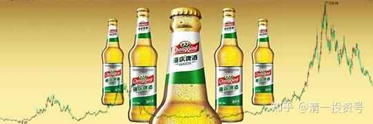
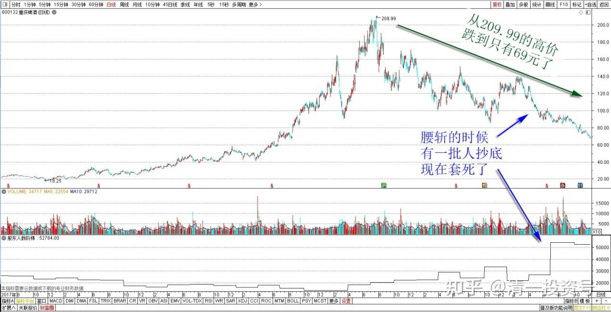
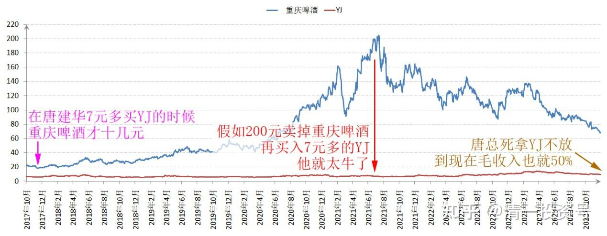
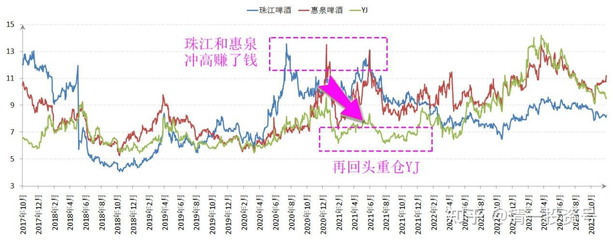
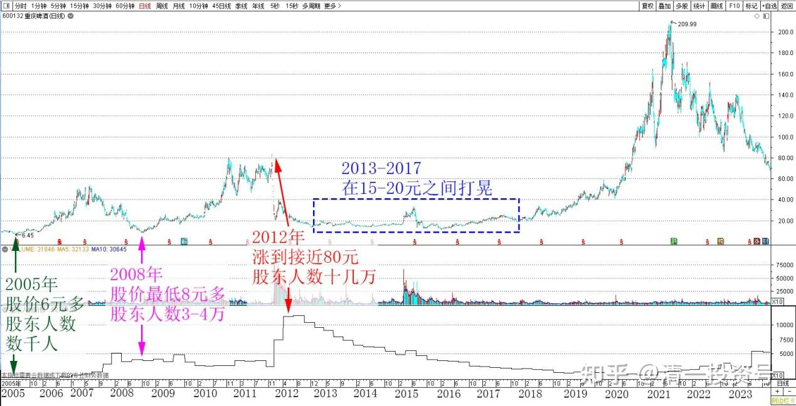
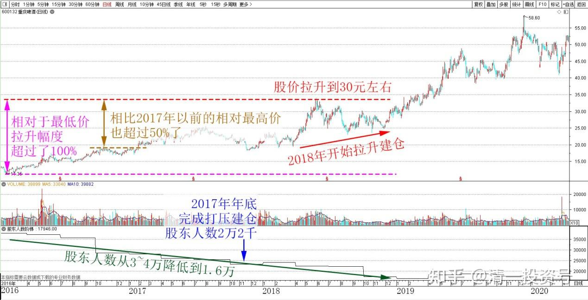
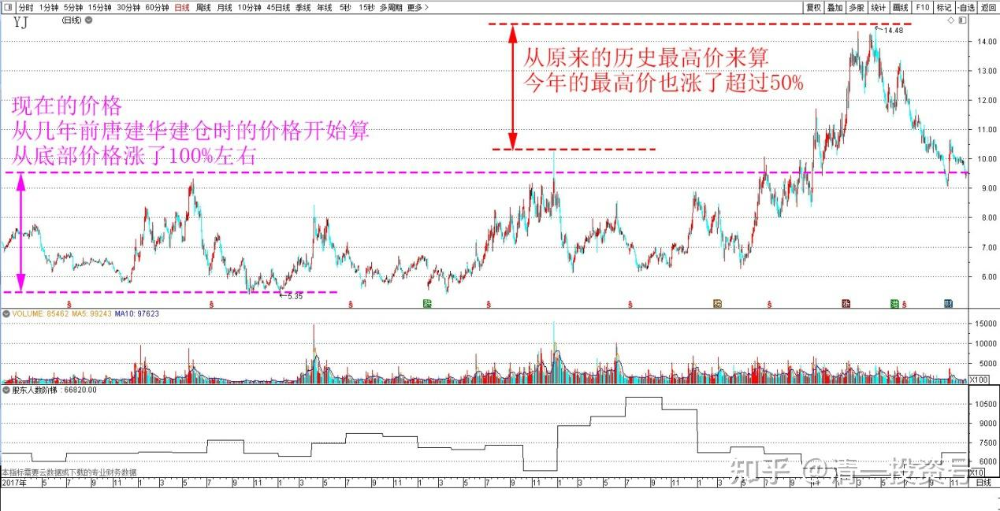
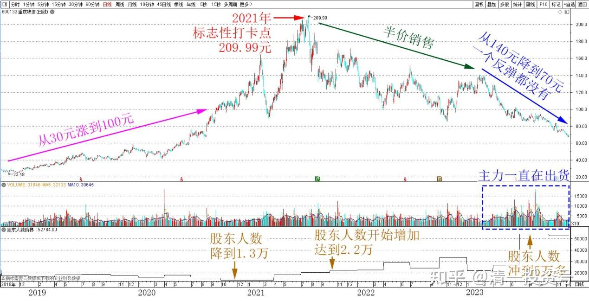

64篇.重庆啤酒的主力拉升分析（事后诸葛解析）（配图版）

清一山长 2023年12月5日

重庆啤酒跌得很惨：从209.99的高价，跌到现在只有69元了，三折的股价。几乎相当于腰斩之后再腰斩了。我看图形，腰斩的时候，有一批人抄底，现在套死了。如果用融资来抄底，现在都面临爆仓的威胁了，绝对压力山大的。现在正在哀叹和哭叫艰难呢！

*重庆啤酒 2017～2023年日线图*

从股东人数来观察这只典型的庄股走势，很有意思。

这只股，在唐建华7元多买燕京的时候，才十几元的股价。如果他当年买的是重庆啤酒，而不是燕京的话，就又成为股神了。很快就能取得十倍的收益，假如200元卖掉后，再买入7元多的燕京，他就太牛了。2017年唐总死拿燕京不放，到现在毛收入也就50%左右。与投资重庆啤酒相比，差距太大了！就算现在跌到三折的价格，唐总也赚了200%呢？高峰时间就更不用说了，超过10倍的收益。所以——同样是股票，甚至同行业，股与股的差别太大了！

*重庆啤酒和YJ 2017～2023年 收盘价*

可惜，他当年就是没有看中重庆啤酒。我也一样眼拙，没看出重庆啤酒的巨大潜力。我比唐建华强一点点的地方，就是先看中了珠江和惠泉。这两只股，冲高赚了钱，再回头重仓燕京的。算起来，在资金使用效率上，比唐总高一点点。但——如果我当时，把珠江、惠泉都换了重庆啤酒——我也成“股神”了！

*珠江、惠泉、YJ 2017～2023年 收盘价*

重庆当年涨到我看不懂。我对这个制造了“关灯吃面”故事的庄股，一直抱有排斥的态度。当年没有买，现在也不会买。将来大概率也不会买（跌到30元，我肯定买，但我相信它不会再腰斩了）。但研究这只典型庄股的发迹记录，对于我理解其他股票，理解庄家的坐庄行为、周期、手法，还是很有好处的！

在2013年到2017年，这只股一直在15～20元之间打晃。股东人数，从2005年最低迷的时候，股价才6元多。股东人数才数千人（不可思议，因为当年的散户都不买股了，筹码全在主力手中）。2008年的股价，最低8元多，股东人数涨到了3～4万人，这一年的牛市，重庆啤酒涨幅不大。到了2012年，该股坐庄，炒作疫苗概念，就涨到接近80元，股东人数也大涨到了十几万。主力成功地拉升，把筹码交给了高位接盘的散户。这是一次非常成功的主力坐庄行动，当年的大热门股。我当年看着它起飞，看着它崩盘，一点都没动心。知道这钱不是我的，只能挂眼科！

重庆啤酒 2005～2023年 日线图

2005～2012年这个牛市周期，我的操盘其实很成功，虽然错过了这种大牛股，但总体来说，我也赚了十倍左右，当年创造了账户市值新高。差不多10年后，又抓住了2014～2015年的牛市，再赚10倍。就快速稳定了现在的财富地位。所以——**10年中，抓住一次机会就可以富裕了，没必要年年都赚20%。每年尽量保证6～8%的收益，等着10年有一次机会爆发一次，拿个1000%，一生来这样玩三五次，你就赚了百倍甚至千倍了！所以——熊市的时候，设法能够稳住阵脚，做到基本上不亏损，小赚一点也不着急。长期来看，肯定就是股市的大赢家。**

再回来说重庆啤酒：它应该是2017年年底，老主力最近一轮的基本仓的建仓工作——打压建仓这个过程完成。此时的股东人数是2万2千多人。

2018年，开始了拉升建仓工作。主力把股价拉升到30元左右。拉升幅度相对于最低价，已经超过了100%，相比2017年以前的相对最高价，也超过50%了。因此，已经多年被套牢的股民，失去耐心的股民，大量被套牢的股民，赶快逃离重庆啤酒。此时股东人数从3～4万人，降低到了1.6万人。

*重庆啤酒 2016～2020年 日线图*

价格升，人数跌，很像现在的YJ。现在的价格，从几年前唐建华建仓时期的价格开始算，也是从底部价格涨了100%左右。从原来的历史最高价来算，今年的最高价也涨了超过50%。股东人数现在一直在不断下降中。显然——此时主力是相当于2018年的重庆，属于拉升建仓阶段。大量死硬派的散户都逃走了！这种坚持多年的散户，基本上是老股民，新股民见利就走，不会坚持到这时候的。这种价格，也吸引不来其他的投机型股民，因此虽然涨了一些，但人气很差！

*燕京啤酒2017～2023年 日线图*

这个市场对重庆啤酒冷漠的过程，一直持续到后面两年，重庆啤酒从30元涨到100元。我认为100元左右就是主力满意的出手价格了。但没想到：现在的散户也学精明了。从重庆啤酒的股东人数拉到100元，也一直没有涨起来，就知道主力派发基本上没用——散户根本不跟！主力手中筹码卖不出去，多少价格也只能自嗨！甚至2020年年底，股东人数还降到了1万3千多人，说明一些死党的筹码都卖给了主力，筹码高度集中到了主力的手中。眼看散户太精明了，高价死也不跟，主力高位套牢了自己，无法变现。换了你该怎么办？认输吗？

错了——重庆的主力怎么可能是一般人——他们就继续拉股票，拉到不可思议的高价——最终在2021年，拉到了标志性的打卡点 209.99元。

这个价格，让所有人都大跌眼镜——怎么可能这么牛？这样一路上涨，重庆啤酒再度成为市场热门股票。这段时间，媒体上到处都是重庆啤酒的软文，这家公司如何牛，外资背景，盈利能力超强，中国啤酒公司没得比等等。这些技巧，也的确吸引了一些散户，终于股东人数开始增加，与2020年年底多了一万人左右，达到了2.2万人。

但高处不胜寒：谁在200元买啤酒？这种傻瓜虽然有，但毕竟也不多。所以。200元依然是主力的自拉自唱——重庆啤酒的主力，后来就开始打折优惠了。把原价209.99元的重庆啤酒，一步一步地降下来。

9折你要不要？不要就8折行不？

再不要？7折行不？

七折还嫌贵？好说，好说，只要半价行不？

2023年3月，真的打了半价。此时，真正的出货才开始。股东人数一下子从2万多，冲到了5万多。说明中国人喜欢的打折促销方式，真的很有用，半价销售，还是很吸引人的，大量搏反弹的精明人就冲进来了。只是——这些傻瓜们也不多想想：就算是半价，也是百元左右。主力的底层进价才20元以下呢？算上后期的主力拉升成本，主力成本均价，也就30～50元的样子。你居然拿100元来买？就是散户在给人买单的！

从成交量来看，2023年3月之后，主力一直都在出货，股价也从140元（七折价格），降到了现在七折的五折，还不到70元了。居然一个反弹都没有。一路抄底抄进来的散户，都在高地上站岗了。我看网上，有人嚷嚷“重庆啤酒超跌，是买入搏反弹的好机会！”。应该是套住的人，到处发声拉伙伴的。网上的东西，你需要有辨别力，这些人可不是为了让你赚钱来拉你的。也许就是为了让你的钱填坑的！

*重庆啤酒 2018～2023年 日线图*

主力出货完成了吗？

我的判断没有，货量还达不到。股东人数也达不到，如果超过十万，就肯定主力彻底跑了。但是，现在主力已经脱困了，大笔资金已经收回来了。现在的主力的底仓价格成本，不超过20元。因此算是这一轮坐庄成功了。而且，主力这一次很危险，差点套住自己。去年到今年用了很多手段、题材，花了很多的宣传费、媒体费，现在才勉强脱困的。因此——未来主力，应该不会继续花钱去拉升重庆啤酒了。主力犯不着去解救这么多的套牢盘，但也犯不着去打压这只股。所以未来重庆啤酒，应该是随便逐流性的，不太可能拥有独立行情。万一未来的啤酒有行情，它也会跟涨的，只是涨幅应该比不过别人。如果啤酒的大趋势好，涨回100元也是有可能的。只是涨上去了主力也会趁机减仓了。所以——目测重庆啤酒，现在的投资价值不是很高。但现价的风险也不大了，毕竟——高位下来差不多三折了。

另外——重庆啤酒的股息率不错，这些都可以维持住它现在的股价（除非经营劣化）。所以——现在基本上是安全区——投资价值不大了，但也没有啥投机价值。

我认为：珠江啤酒的投机投资价值目前是最高的！燕京也不错！蓄势待涨。青岛本来没有啥想法的。居然青岛出了小便的题材——我忍不住想——如果这个小便是有人故意搞的热点，就说明青岛具有投资价值。毕竟一直青岛都没有真正的热起来。

关于股票的坐庄手法，相信各位看懂了重庆啤酒运作的轨迹，就知道我持有的啤酒股，将来大致上会怎么走了，甚至可以估计出大致上冲高的价位。我不会等最高价再走的，差不多主力派发的时候，我就同步撤退了。主力派发的价格，应该会比最高价五折的。我会左侧五折就开始走，不会等右侧的五折。因为我是左侧投资风格，右侧买进或者出货？——我没这么聪明。**左侧投资更简单一些，不贪心就行了！**

(标题、图片为编者所加)

**文章音频：**

[400篇.重庆啤酒的主力拉升分析（事后诸葛解析）（配图版）_清一投资号文章同步音频](http://link.zhihu.com/?target=https%3A//www.ximalaya.com/sound/692125728)

**参考链接：**

[12篇.啤酒系列5：早期珠江啤酒、燕京啤酒的换仓记录](https://zhuanlan.zhihu.com/p/602033762)

[13篇.啤酒系列6：买卖操作后的富足之心](https://zhuanlan.zhihu.com/p/604162057)

[14篇.啤酒系列7：珠江的破位急跌，名曰跌停进货法](https://zhuanlan.zhihu.com/p/606062514)

[22篇.它很可能是下一个重庆啤酒](https://zhuanlan.zhihu.com/p/645392522)

[23篇.危机时刻好公司不用担心](https://zhuanlan.zhihu.com/p/646998882)

[24篇.守住筹码很不易](https://zhuanlan.zhihu.com/p/648860208)

[56篇.啤酒下跌，应机而动](https://zhuanlan.zhihu.com/p/649780980)

[57篇.省心省事，不多做](https://zhuanlan.zhihu.com/p/651191813)

[58篇.买回落难王子](https://zhuanlan.zhihu.com/p/653368631)

[59篇.三季报隐藏的重大信息](https://zhuanlan.zhihu.com/p/664009422)

[60篇.中国建筑安心买入，珠江啤酒价格很香](https://zhuanlan.zhihu.com/p/667041164)

[61篇.投资养老新模式？比退休金更可靠的金融账户养老收益](https://zhuanlan.zhihu.com/p/668298628)

[62篇.YJ前三大股东研究](https://zhuanlan.zhihu.com/p/669500082)

[63篇.负成本——换股的功劳](https://zhuanlan.zhihu.com/p/670185909)

