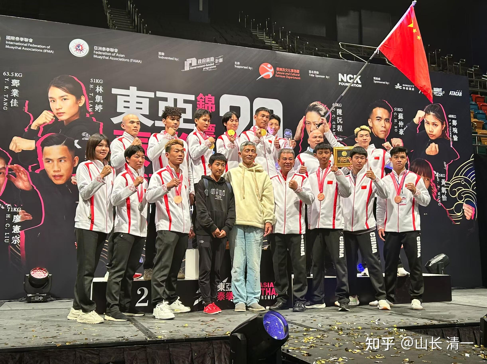
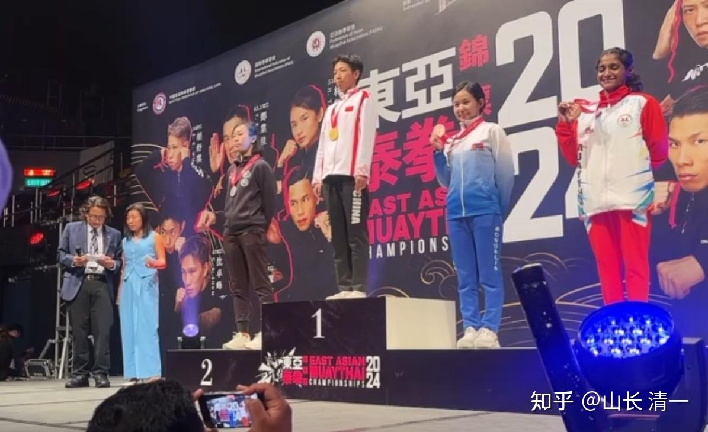
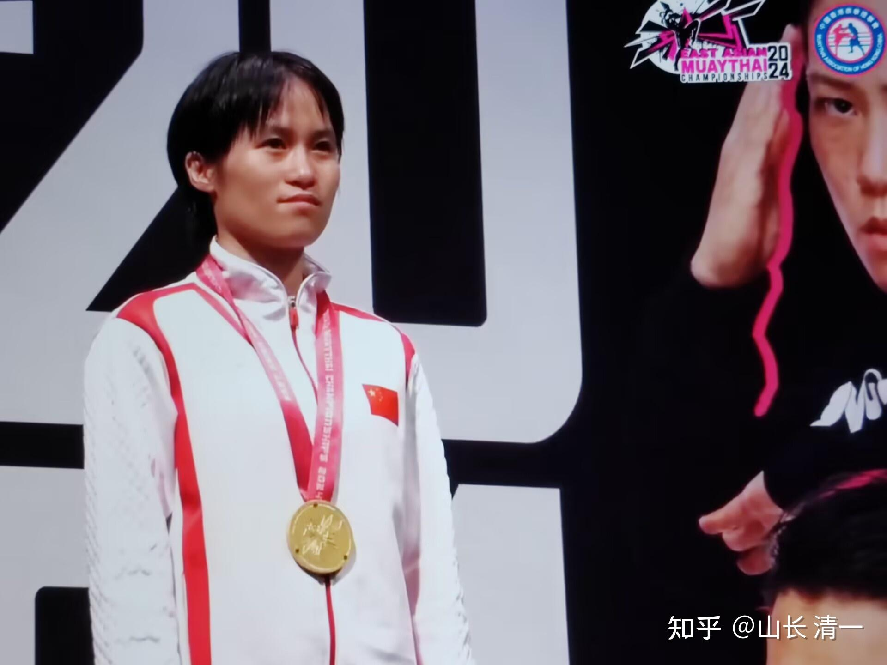
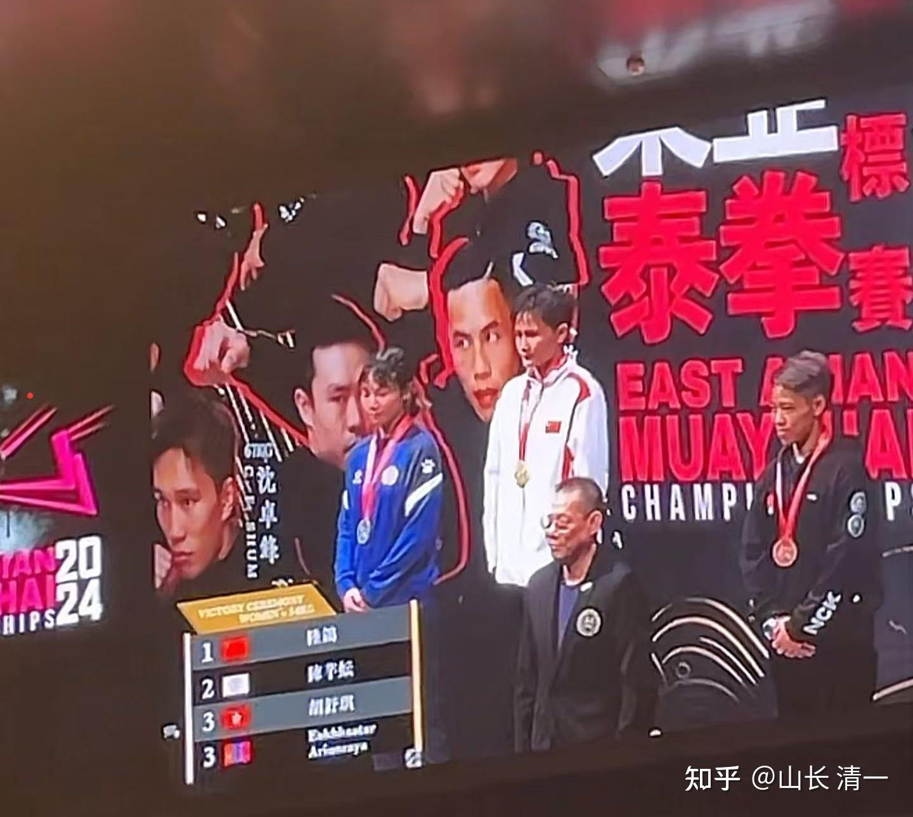
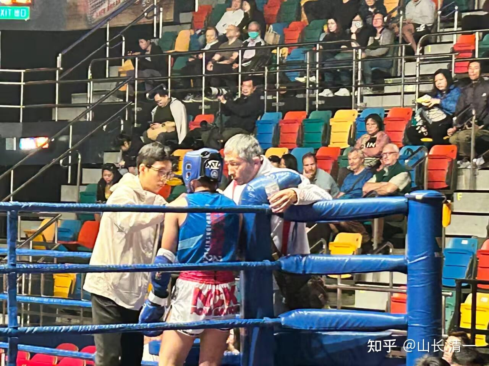
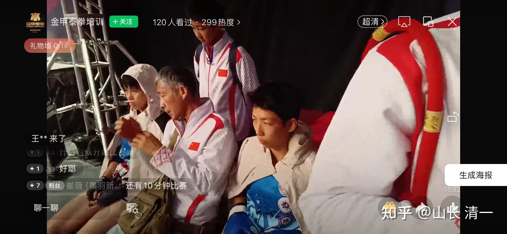

今天(12月1日）总决赛，因为清一拳手的拼搏努力，今天有三次让全场人员起立，庄严肃穆地聆听中国国歌。对孩子们来说，这种体验很神圣！她们自己还是第一次有这种荣耀的经验-----因为自己而让自己的国歌被全场尊重制礼。因为这是孩子们第一次参加正规的国际赛事，国际比赛才有这种国歌的播放安排！

比赛从今天下午两点开始，一直打到晚上9点过，才结束今晚的总决赛，决出了13个金牌。与前几天的比赛不同，因为今天是冠亚军争夺赛，双方的实力都差不多，都很坚持比赛，要KO对手很难，裁判敢于中止比赛的很很少！大多数场次都是打满了比赛。晚上是赛事方请各国代表团全体成员去九龙的高级饭店的庆祝晚宴。刚开始我以为是英式的自助餐，很洋派。也方便各国拳手互相交流。结果我去了才发现就是桌餐，很“中国”。但我也让四个木兰拳手去主动与自己打过的对手交流学习，并表示自己的尊重。虽然是赢家，但一定要有谦虚的风度，表示我们长期研究泰拳，发展了一套不一样的攻防方式来应对。她们是因为不适应才落败的，她们如果熟悉了我们的打法，适应过来就不一样了。因为她们的心理素质都很好，技术也很正宗，我们还需要向这些姐姐好好学习。孩子们后来告诉我--这些姐姐们的年龄普遍较大，都是在香港打职业赛的拳手，也回去泰国仑披尼打比赛。他们都想在全场长期征战，开玩笑说她们穷，所以只能练拳为生了。陆鸽的决赛对手30多岁了，之前也在泰国训练过。比赛前以为自己的决赛对手是香港拳手，之前就研究对手看了几十遍。在知道对手是陆鸽后，认为陆鸽一定是难以对付的大敌，认为一定不能像前几场的香港拳手一样往前冲，这样死得快。所以采取了用她的长手优势来保持距离然后打反击。她的右手拳很重。但最后发现这样也没有用，自己也累垮了。后来在酒宴上她喝醉了。可能心情真的很不好！

差不多12点的时候结束晚宴，酒店打烊了。我以为是要回宾馆休息了。没想到赛事方还安排了活动，还请拳手们继续去酒吧玩PARTY，不想去就就回宾馆。我就让木兰们自己去这些她们从来不去的地方长长见识，我和刘老师就乘坐接人回宾馆的大巴回来休息了。在外面吃饭应酬，实在太累了！不早早休息。但我也知道-----大多数拳手出身寒门。在香港这些高消费的地方自己平时是去不起的！在这时候放松一下很正常！总之，我看到的年轻拳手今晚都非常的兴奋！很HI的样子！

本次清一战队，一共派出5人代表国家队为国争光，一共拿到了3金1银1铜，人人手不空！但其他的中国队队员总共七人参赛，除了一个拳手取胜外，其他六名拳手一场比赛都没有赢下！但即使如此，本次赛事中国队一共拿到了4个金牌，是中国队泰拳参赛历史的大突破，仅仅比东道主香港队少了两枚金牌！（如果香港队不是东道主的便利，难说还能不能保住今年的第一名地位）

*明晓拿下第一枚金牌，45公斤级！获本届最佳女拳手奖*

领奖台明晓旁边的第二名香港队员，其实并不是她比赛中的对手。因为她志在金牌，却被对手在家门口抢走了，气得连领奖都不肯来了，是她的队友来替她领走银牌的。怪不得当时我看颁奖仪式，还纳闷赛场上不是这个人呀？怎么打完后这么快就变脸形了！

明晓还意外获得了本次赛事的【最佳女拳手】奖。另外，本次赛事的所有金牌拳手，还很意外地获得了主办方给予的600美金的奖金。香港的赛事活动安排相当的认真和仔细，周到。今天下午，还请国际顶级泰拳手来打了三场金腰带职业五回合赛事给大家观摩，水平确实高。这些活动，主办方都是要额外花钱的。因为这几场职业金腰带的赛事，对抗水平真的比清迈泰拳手打给外国人看的职业赛事好得多！我认为相当于仑披尼级别的高级比赛！我对今晚一个菲律宾职业女拳手的印象很深刻，她打比自己高不少了，还大一圈，明显不是一个级别的香港金腰带职业拳手，最终却靠自己超级灵活的身法，步法和技术，战胜了同样也很优秀的香港女拳手！刘老师说：跟这些职业赛的金腰带拳手相比，这次比赛的冠亚军都明显逊色一个等级。我说这些职业拳手都是老手了，早就有各类赛事的冠军头衔，根本不屑于来参加东亚锦标赛。只有没有拿到头衔的新手，才来参与这种锦标赛积累比赛的资历！

我也没有想到：赛事主办方晚上还特别邀请全体拳手去九龙吃海鲜大餐。大龙虾，鲍鱼，燕窝，烤乳猪等高等菜。在一盒盒饭的价格都都要四五十元的香港，去知名的大饭店吃这等高档大餐，显然花费不少，大概两百名拳手，需要花费几十万。好像并不是协会花钱来请客的。而是香港爱拳的老板请客吃饭做好事。看样子，香港的赛事举办活动不差钱。拳手报名的时候，要交2000元的报名费。但来香港后赛事方安排的酒店， 是一千多两千元一晚的高档酒店！连续住五天，怎么打折都不可能低到2000元五天。赛事方肯定对拳手参赛是有补贴的！国内的锦标赛，举办者还指望从拳手参赛费中赚点钱的。当然就不太可能办得香港如此大方的赛事！怪不得香港的泰拳水平要比大陆高不少，今年他们有10个拳手进入决赛，大概最终拿了6个金牌，也就比我们多了两块。我认为至少有两块金牌是有点嫌疑的！至少我看不懂裁判们决定输赢的道理！从技术上，我认为的赢家最终输了，而我认为应该输掉的香港队却赢了！

当然，佳慧这场有点问题，但问题不是很大。如果这场比赛是在中国打的，肯定会判佳慧赢。但香港作为地主，拳手能够逆转第一局被判负的比赛心理素质超好。不能不说佳慧这方面还是个新生，连控制比赛节奏都做不到，一昧的猛攻，导致最终自己累垮了。导致在关键的第三局体能撑不住，导致被判输掉比赛。我认为按照职业赛的标准，最后一局才是关键点，恰好佳慧这一局打得有点软。当然被判负了！她是把本来稳住就可以赢的比赛，打成了积极努力去输掉的比赛！第二局休息时我特别上去交代她稳住，冷静，不要急。但她就是做不到！

两场我认为无法理解的比赛，其中一局就是蒙古对香港，我看比赛认为香港输了。但香港队最终却赢得了比赛。实在想不通！所以---我的观点不是维护木兰，而是看不懂比赛。我猜----仅仅木兰们就拿走三枚金牌，蒙古队也抢走了香港的金牌，这就让香港队有点措手不及！担心总金牌数可能保不住第一名了！

*谭木兰从香港队手里，拿下第二块金牌*

佳慧拿的银牌，对手是去年的冠军！据说原来的日常体重是60公斤，居然为了打比赛，降重到了51公斤！这拳手的确厉害！心理素质超好。值得木兰们好好学习！亚军---实在没啥自豪的，反正都是输家，我这里就不放她的获奖照片了！虽然也拿到了银牌。我猜她不会因为这块银牌而自豪的！真没打出该有的水平！就第一局像是我教的功夫！其他两局是她自学的功夫！

*陆鸽从台北队手中，拿到了第三枚金牌！之前半决赛已经提前干掉了香港拳手！*

*第二局结束休息时，交代陆鸽不要急于猛冲。稳一点，打防守反击，锁住胜果！*

*开赛前交代谭木兰比赛注意事项，战略！*

在泰国的比赛，我基本上不去现场。就算偶尔去了，也很少去现场辅导拳手，都是她们自己去弄。赛后回来我看视频帮她们总结教训。因为---泰国就是练兵，胜负无所谓的。但这次木兰们是代表中国队出战，不能开玩笑，所以我跟随来香港一直在现场指导。因为一个细节不到位，就可能莫名其妙的输掉比赛。

比如这几天住在每天上千元的酒店，完全密封的房间。开空调很冷，不开很闷。人很不舒服。缺氧。不小心就感冒。我这几天的身体就很不舒服，类感冒症状。咳嗽和嗓子哑。我看其他国外队员也有这个问题，泰国的师傅也完全哑了（香港队似乎没受影响）。所以，我要求木兰们上午就出去，在体育馆旁边的小花园里面休息，运动，打座，不要回宾馆休息，以保持身体的细胞活力（其他队的拳手就不会这样做了，往往休息到1:00以上才去赛场热身）。后来木兰们的反馈，就是这样做的确身体很舒服，状态保持不错！如果我不来现场，就有可能不会发现这些细节。还有上场前木兰们不注意保暖，长期暴露在冷气里面！

香港特别注意给拳手荣誉。上面背景图的香港队集体照片，赛事方制作了很多大海报。放在现场让人随便拿走做纪念。赛前木兰们毫不在意这些明星一样的海报。赛后我让她们每个人都拿一张大海报，让她们拿回家几年。因为四个木兰都跟香港拳手交手了。这是东亚拳赛拿冠军必过的一关。如果赢了，是一份自己荣耀的纪念。也要记住去发现对手身上有自己没有的优点。如果输了，海报上的对手照片，就是自己学习的对象。也是未来超越的对象！