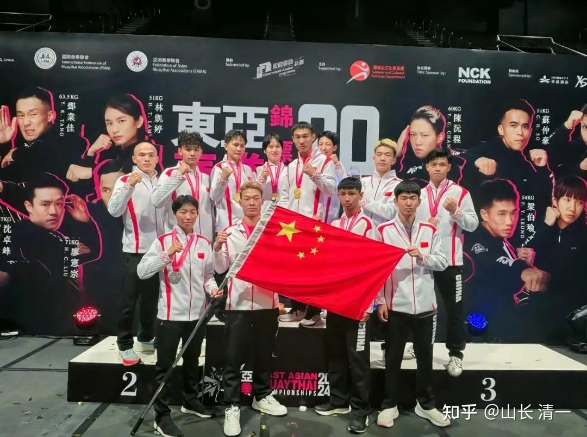

东亚泰拳锦标赛去年的中国队还毫无建树，每场必败。今年新人前来比赛，却大爆冷门，居然获取了4块金牌，仅次于拿到五块金牌的香港队，创造了泰拳中国队出战国际锦标赛的最佳历史纪录！不过香港队牌多，还拿了5个银牌。我们就只有一块银牌---人太少了！香港队实力雄厚，每个量级都有人参赛，进入决赛的人多！10月份专门为东亚锦标赛开打了香港锦标赛，选出来的冠军才有资格参加东亚锦标赛！

虽然中国队“只拿”了四块金牌，但已经是创造了历史记录了。这么多年来累计下来，中国队总共只拿到两块金牌。今年一下子就“翻身”了！长期以来霸榜的香港队2019年也只是拿到四块金牌而已。中国队今年爆发，应该让所有熟悉原来中国队水平的国家和地区泰拳队，包括我们国家体育总局武术中心的领导都大吃一惊。香港显然也没有想到：今年会遇到这么强悍的中国队。中国队因此也得到了主办方更大的尊重。赛事完毕后，把最佳女拳手以及最佳裁判员的奖励发给了中国队！香港队的教练，也表示有机会一定要来清迈看看---这些抢走了他女队员金牌的木兰们，是怎样训练出来的！

去年获取10块金牌的香港队，今年也获得了10个决赛权。正常情况下，拿到8块以上金牌不是问题！但今年内在占据“主场优势”的情况下，才勉强以五块金牌总数，继续维持了该赛事“金牌第一”的称号！说明香港队目前受到了强有力的挑战。我认为香港队的压力，主要来自于两个对手，一个是蒙古队，拿走了本来属于香港男队的金牌，蒙古也获得了四块金牌，比香港男队还多了一块金牌。如果没有蒙古队，香港男队应该能够拿到7块金牌。这三个队。就包揽了本赛事的全部13块金牌。给其他队连一块金牌都没有剩下。包括韩国队，这次也只拿到了一块银牌而已。可见拿金牌的难度有多高！

香港队的另外一个压力点，就是女队被中国木兰拿走了香港队势在必得的女子金牌。如果今年首次参赛的清一木兰没有参赛，我认为香港女队包揽本次赛会女队的五个金牌基本上是稳的。香港女队被木兰夺走一个决赛权，男队被蒙古夺走另外一个决赛权。正常情况，香港队有可能获得12个决赛权的！本质上，香港女队的实力不凡，她们本次赛事有四个人进入了决赛。唯一没有进入决赛的香港拳手，是被陆鸽在半决赛相遇，提前击败了，才让台湾拳手进入了决赛！但台湾拳手的实力，应该不如香港女队。刘轩宁也是在半决赛遇到了香港拳手，可惜他的优势并不像陆鸽一样能够明显压制对手，最终还被踢裆导致落败，止步半决赛。如果他当时抽签抽到别的国家的队员，应该有机会进决赛的！

就我在现场观察的结果，佳慧的这一场决赛，以及香港与蒙古队的两场比赛（男女各一场）的决赛结果，都是有一定的争议。如果是换在其他国家比赛，比如中国来主办赛事。这三场的结果，反过来判也是很有可能的。因此，可以说香港泰拳队的东亚第一的优势，现在已经面临其他地区和国家的强烈挑战。明年能否继续维持第一称号，我看有点难说了。我们的队员这次也遇到了强悍的蒙古队员，虽然我们队员战胜了她们，但蒙古队的场上表现不俗，特别是男队拿了四块金牌，明年蒙古队应该还会卷土重来的！

香港队是东亚的泰拳强队！从这次比赛的安排，香港媒体的重视程度，以及到场人员，赛后的安排，以及冠军拳手在晚宴的时候，还意外收到600美金的奖励，各种安排上看得出是当做一件大事来做的。还有人在宴席中，给每个人发纪念品（两百多个泰拳熊娃），据说往届也有发拳手奖金的。我们一直不知道冠军会发奖金-----应该是中国队这么多年都没有进过决赛！中国的领队都不知道这种没有公开的消息。但是谁发的钱，还是没有公布！大赛后200多人参加的豪华晚宴，是谁在出钱的？也不知道。赛事中间，主办方请了其他国家的顶尖拳手来打金腰带职业拳赛，这也是需要钱的。谁给的钱？这些都不知道。我认为是有一群默默支持香港泰拳发展的幕后金主。正因为香港有这些人，在不断推动支持香港的拳手训练和比赛，因此香港的泰拳发展比其他国家都强。相比之下，中国的泰拳发展得到的社会支持就很少。根本没有香港这些有利条件。如果不是我在清迈设立了木兰拳馆，一心支持拳手们的训练和比赛，这一次中国队是不可能取得如此亮眼成绩的。千里马常有，而伯乐不常有。我看香港是“常有伯乐”的，中国的泰拳，自由搏击，过去多年都没有伯乐来发掘新晋拳手。所以就算年轻人想要为国效力，但也很难找到地方安心练武，发展技术，提高技术的机会自然也没有，毕竟---人还是要生存的。中国格斗拳手的生存环境太差了，基本上是自生自灭，极少数天才才有可能冒出来。生活上，也完全无法靠打职业比赛来生存。也许我们国家的官方资源，都放到散打项目上了。但民间资源，没有人来持续的支持格斗拳手，因此自然生长艰难。这么多年，甚至中国泰拳队都无法走入世界锦标赛的获奖台！去比赛往往第一轮就被干掉，只能帮对手刷战绩了！

下面复盘一下，我方五个队员和香港拳手交手的视频：

半决赛1：陆鸽TKO香港拳手，进入总决赛视频

[https://www.zhihu.com/zvideo/1845939185036431360](https://www.zhihu.com/zvideo/1845939185036431360)

这场比赛的压制性太强。所以裁判判了优势获胜。TKO结束战斗！

半决赛2：刘轩宁VS香港拳手苏仲豪，被裁判判负！

[https://www.zhihu.com/zvideo/1846226196699942912](https://www.zhihu.com/zvideo/1846226196699942912)

其实----从技术上说，刘是可以击败香港拳手的。但他的心理素质太差了，不敢压上去打，否则就赢了。当然---裁判也帮助香港。第一局香港拳手被刘击倒，还有多次拳击中。刘只是一次被击中，就被裁判抓住马上就读秒，制造“不行”的迹象，判刘输掉了第一局，明显是偏心。而我们女队打香港拳手，明显对手都打得都快不行了，裁判也不肯读秒，制造场面上“平衡”的假象，说明裁判的双标明显。 刘后面还遭遇了香港队员的绝招，看场上怕打不过，就用了踢裆绝招最终赢了比赛。刘在前面两局被判输掉，刘第三局无法KO香港拳手，自然就输了比赛。

半决赛视频3：谭木兰KO击败台湾女拳手获胜！

[https://www.zhihu.com/zvideo/1845937065746907136](https://www.zhihu.com/zvideo/1845937065746907136)

这个台湾拳手太倒霉了。她去年来参加东亚锦标赛，是51公斤级。去年还闯入了决赛，但最终被香港拳手夺走了冠军！她很不服气，于是备战一年，还降重去打48公斤级！以为可以降维打击，轻取冠军。结果却遇到谭木兰，第一局就被KO了。而且----是被她擅长的拳击技术KO的。她后来告别人说她是腹部被踢中，导致她无法呼吸倒地不起的。谭木兰自己也不清楚当时到底是怎么打的，木兰们也说的确最后加了一脚。我第二天仔细看了好几遍视频（太快了，一秒钟三次攻击，不重播放慢速度还真看不清）。发现是谭左右手连击得手，对手后退，出后手重拳主动攻击谭头部。谭用左手防住后用右手同时重击对方头部，对手马上昏晕倒地。在倒地过程中谭补了一腿攻击腹部，这腿应该也很重。对方倒地后，几秒钟恢复一些意识，大概感到腹部的剧痛，就用手去护住腹部。所以我判断右手重拳才是她被KO的核心原因！此时台湾拳手犯了一个错误，就是她本能地以为谭木兰会攻击腹部，所以她的注意力是提膝，护住腹部。但还没完全提起来，因为头部中拳就倒下了。接下来又被踢腹成功。所以，她算对了踢腹这一招，没算到是先打拳击头，再踢腹的！结果有点悲剧。虽然台湾拳手第一局就被KO。但从反应上看，她的格斗素质很高，反应很灵活。被攻击的同时，还会很厉害的反击，在谭木兰出腿的过程中，还用拳击中了谭木兰几拳。所以，的确是高手。只是---外家格斗拳手，都不太会应付太极如水的连续攻击技术！最终是手忙脚乱的败下阵来！

**半决赛4视频：明晓击败蒙古拳手进军决赛！**

[https://www.zhihu.com/zvideo/1845935687481819136](https://www.zhihu.com/zvideo/1845935687481819136)

如果只看结果的话，本场比赛是蒙古拳手全场被动挨打，似乎功夫不咋的。但蒙古队这次是集体前三名，从香港队手上夺走了三块金牌，能来比赛的都是全国冠军，哪有差的。所以不是蒙古队不行，而是她从来没有遇到过这种木兰拳手的打法，完全被打蒙了。就像香港队的女队员，半决赛首次遇到陆鸽，也被打蒙了TKO结束。当然，后来决赛的香港女队员，应该与教练在一起认真研究了木兰的战术，决赛中也更拼，死战不退。所以反而决赛还没有能KO香港女拳手。说明香港拳手的学习和适应力还是很强的！**也许下次再遇到，香港拳手就会找到应付我们的方法了！**另外---这个蒙古拳手是按照规则：被读秒三次，被判优势负。对方优势获胜。裁判为保护拳手，见双方实力差距太大，就会用这种规则提前结束比赛！对手我看硬接了很多腿。明晓的腿其实很重的，内围战的膝击也很凶，蒙古拳手不擅长内围，但她居然都挺下来了，真的很厉害！她就是运气不好罢了！

四场决赛的视频链接在这里！其中三场是和香港拳手对战的。第四场提前对战完了！与擅长拳击的台湾拳手对战获胜！

[https://www.zhihu.com/zvideo/1846884401478258689](https://www.zhihu.com/zvideo/1846884401478258689)[https://www.zhihu.com/zvideo/1846884328409284608](https://www.zhihu.com/zvideo/1846884328409284608)[https://www.zhihu.com/zvideo/1846730765179707392](https://www.zhihu.com/zvideo/1846730765179707392)[https://www.zhihu.com/zvideo/1847010649537900544](https://www.zhihu.com/zvideo/1847010649537900544)

佳慧这场比赛有点意思。首先佳慧没有打好，第一局乱拼拳，打得很急躁。虽然赢了这一局。但体能影响太大，导致后续发软，最终输掉也不奇怪。因为犯了拳手不应该有的低级错误。另外--对方拳手是上届冠军。经验肯定更老道。就算在劣势下也能控制住心理和节奏，没被打乱。因此她赢了比赛也应该。另外一个特点，是赛后才知道的。她正常体重原来是60公斤，为了参赛，提前几个月减重成功降到51公斤来打的比赛。这种毅力，的确有冠军品质。不过，我不支持我的队员学减重。我认为这种方法对身体的伤害较大。这样我们就要学会与比自己更重的对手比赛，必须具有更强的实力才行。把功夫花在减重上，不如花在提高技术实力上面更有价值！