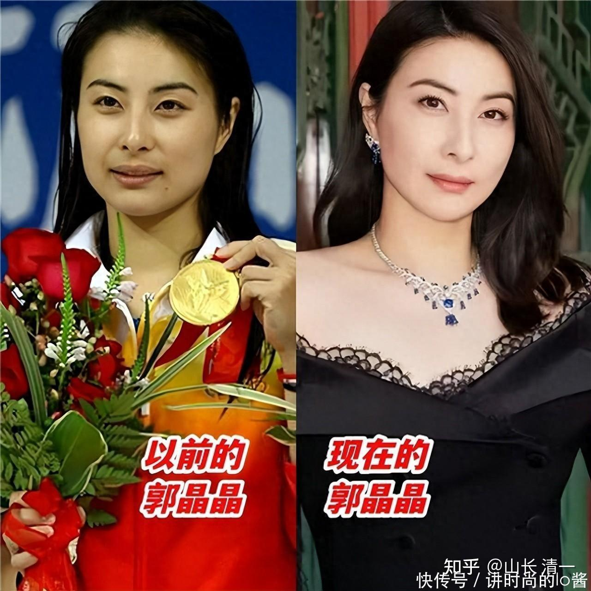
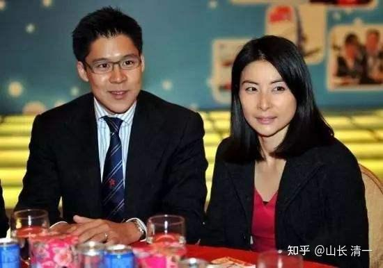

清一教育基金会已经在香港正式注册登记成立了。今年，该基金首次支持参与的活动，就是出资支持中国2024全国泰拳锦标赛，给获奖的拳手发奖金。明年还将捐资给东亚泰拳锦标赛，给冠亚军拳手发奖！因为我们希望拳手们，更加积极主动的参与体育赛事，成为最有活力的中国人！弘扬中华武术！

清壹基金一直在支持新教育事业，目前在清迈的公主班，冠军班的60多个学生，都是清一基金在全奖支持学生学习生活训练的方方面面。为期三年的资助，就是帮助他们去拿全国冠军。

但清一教育基金更想做的事情。就是去投资和制造我们国家最珍贵，最顶尖的“国礼”，把我们培养出来的国礼，将来赠送给全世界！

大家知道：中国目前的国礼是大熊猫。中国送出去其他国家不少大熊猫，给很多国家的孩子带来了快乐。

我们想送出的国礼，应该比大熊猫更贵重。我们不是给外国的小孩子送快乐。我们要给世界各国的贵宾送荣誉，送尊重，送体面。让这个国家的上层，中层和下层民众，甚至是互相对立的各种党派，都能够一致接受，喜欢赞叹的国礼。

现在，世界上只有一种礼物，是每个国家上下都很珍惜的高价值“国礼”：就是------世界冠军！

*郭晶晶---从世界冠军到千亿媳妇！*

郭晶晶嫁给香港千亿豪门，是“上位豪门，傍大款”吗？但郭晶晶却被掌门人霍震霆亲自说是郭晶晶是“下嫁霍家”。承认是亿万豪门的家庭沾了她的冠军之光，“占了便宜”。因为就算是千亿豪门的商人，其社会地位和影响力，也比不上尊贵的世界冠军！郭晶晶自己以世界冠军身份代言做广告，每年收入都是千万，并不缺钱。她的丈夫郭启刚（长孙，霍家未来继承人），在参与国内一些重要活动的时候，桌上的身份介绍居然是“郭晶晶家属”。因此可以看出，郭晶晶就是我们国家送给香港的“公主国礼”！她的气质，性格，也的确有公主范！她就是我们国家的文化国礼代表！代表我国的软实力。

*跳水皇后与豪门长孙*

可惜的是：大多数的中国运动员，虽然可以拿奖牌。但往往气质，个性，修养，以及做人，做事，学业上都存在严重的缺陷。发展非常的不平衡，这些运动员，除了比赛之外就没啥特长了。所以就算是冠军，退役之后也基本上就没啥人生亮点了！能够像郭晶晶一样，退役后成为“国礼”的世界冠军，中国还是太少，太稀有了。甚至连郭晶晶本人，虽然气质优雅，学问上也存在天然的障碍，她也无法考入世界名校。虽然她个性品德良好，但学业上我们也只能说她“略输文采”，非常遗憾！设想一下：如果郭晶晶能够熟练掌握多国语言，文采演讲，仪态都很出众，她退役后的每次亮相会不会更加的令人瞩目？

可以看出来，要培养出德才兼备的世界冠军很难的，但也是很珍贵的！中国举国体制，目前已经会批量培养世界冠军，但还不会培养冠军国礼！大家目前熟悉的，符合文武全才的世界冠军国礼，还有一个是谷爱凌。她就是【文能考顶尖世界名校，武能拿世界冠军】的国礼，形象气质个性，语言谈吐都很不错，真的适合做国家形象代言人。可惜的是：这个国礼，似乎是美国培养出来，用数百万美金堆出来的世界冠军。某种意义上，算是美国送给中国的“国礼”！不是我们土生土长的，“中国制造”的国礼。说起来---总有点遗憾！但是，不管是谁制造的国礼，我们的民众都很喜欢她。无论她在何处，只要她愿意代表中国，我们都为她自豪！这就是“国礼”的价值！

我一直在想：我们中国人，一定要培养出真正德才兼备，文武双全的下一代。不能指望美国会帮我们培养！不能像现在一样，搞体育的就是四肢发达，头脑简单。学文化的就是文弱书生，弱不禁风！我们应该系统地培养一批强悍有力，外加头脑机敏的世界冠军！来作为我们送给全世界国家的礼物！

当然，能够培养出国礼，让中国能够送给世界各国的特别教育机构，自然也是“国之宝”，一定会受到国家和政府，以及各种社会力量的追捧和保护。我们就自然成为了文化上层！这就是清一新教育未来的身份和地位！

那么，为了培养国礼，我们需要具备什么样的条件呢？

**1：有没有一种办法，可以让一个人的运动生命可以延期？有没有60岁还能去拿世界冠军的运动项目？这样就可以维持数十年的荣誉生涯。**比拼青春饭的一些运动项目如体操等，人都没长大就退役了，非常的遗憾！无法在冠军的巅峰维持很长时间。现在的大量运动项目，本质上对身体健康不利！如果为了夺取冠军而牺牲身体，影响长期的健康，是绝对不符合体育精神的。我认为不能作为国礼。

答案是有：太极拳就是。练好了真太极，60岁依然可以比年轻的冠军更快，更强！可以击败冠军。运动寿命可以贯穿一生！不像其他竞技运动，对身体的损害很大（美国游泳运动员我看都快成"紫薯"了，这种运动显然不是啥“国家礼物”）

**2：有没有一种办法，可以帮助更多像是郭晶晶这样的学生，可以在去拿到世界冠军的同时，还能考上世界名校？思想知识面还很宽广，成为卓越的人才？**

答案也是有：新教育可以用三年学完12年课程，剩下的9年时间，就可以用来培养世界冠军。是全世界唯一可以做到文化体育训练两不误的全新教育模式！

3：如果要成为送给外国的国礼，不可能像熊猫一样只是供人观赏。能否让我们的世界冠军国礼，可以掌握多国语言和文化，思维方式？德才兼备，成为中国与其他国家沟通交流的文化教育大使？

**答案是有：新教育创新外语教学法，可以让学生轻松学会全世界任何国家的语言和文化！**

**4：有没有一种方法，能够像普通学校批量地培养优秀学生一样，批量的生产冠军出来？**

全世界除了中国这的国家，会拨款支持体操队等奥运项目。其他国家似乎都没有这种学校和计划。但中国的这些官办体育学校，有机会在全国从很小就层层筛选人才。但最终的冠军成功率并不是太高。目前只有清迈的清一大学武医学院，才能做到高效率，高比例地培养出冠军。!

目前：上述的四个问题，都已经有了准确的答案。 设在清迈的【清一大学武医学院】，就可以同时完成上面的四个任务，我们可以批量的培养文武双全的冠军。

想要培养全国冠军很容易，15岁来我这里三年之后就可以去拿全国冠军了！但要培养世界冠军，3年肯定是不够的！就需要从小找到具有运动天赋的小孩子来从小培养了，培养周期将长达8年，而不是3年。目前来清迈训练的学生，都是15岁考过了SAT才来的！目标只是18岁拿到全国冠军就去读大学，上世界名校去。他们很少人具有真正的运动天赋，因此也没有计划留下来拿世界冠军！因此还不是国礼计划的最佳人选！

能不能给更小的学生，从10岁就开始获得这种清迈的教育和训练呢？从中选出我们未来的国礼？

我和刘老师都非常愿意出资支持10岁就想当世界冠军的孩子，把他们从小培养成“国礼”。我们希望从全国选一批像是“小郭晶晶”一样的孩子，组建一个小冠军班。但与国内的体育院校不一样，我们同样非常的重视文化课程的教育，目标是能够考上常春藤大学。每天5-6小时的训练完，其他时间都用于学习文化课程！这样，从小就受到良好的素质教育和知识教育，文化教育，同时学习中华武道，8年之后，就可以成为德才兼备，文武双全的中国人。这种综合性的人才，才是我们国家，以及其他国家和地区最期待的“国礼”！

12月28日，目前按照我的“国礼计划”来培养和打造的一个学生，五语学霸ELLA，将在惠州新教育分享会演讲，并在其他时间与家长们互动交流，她今年刚满18岁。在她还未满18的时候，就参加成人赛，击败了香港泰拳冠军，获得了全国亚军。目前她是泰拳和自由搏击的全国锦标赛双亚军。23日她将参加2024全国泰拳锦标赛，不出意外的话，她应该是能够获得全国冠军的！

下面是她前几天与马来西亚资深拳手的现场比武，一个身体结实，重拳KO了不少对手的职业拳手，在五个回合的决战之后，败在她的拳下面。这场比赛，我认为比出战香港的东亚泰拳锦标赛决赛的木兰拳手打得更流畅，更符合太极格斗的精神，ELLA今年其实有资格参加东亚锦标赛。因为她去年就击败了香港冠军。但因为要让位给师姐，明年才去参加世锦赛。去年与她同级别的第三名谭木兰今年去比赛就击败了香港冠军获得东亚锦标赛冠军。ELLA将在2025年在国际擂台上，与世界各国的拳手【以武会友】，成长为真正的“国礼公主”。

[https://www.zhihu.com/zvideo/1846875129654697984](https://www.zhihu.com/zvideo/1846875129654697984)

欢迎您来惠州现场近距离来接触了解ELLA公主。如果您喜欢她，欣赏她，希望自己的孩子将来也像ELLA小公主一样。正好您的孩子不超过10岁，您就可以申请我们的国礼培养计划。我负责全资供养你的孩子，8年时间让她成为未来的ELLA公主或者王子。ELLA是11岁来到新教育，13岁才来到清迈开始接受我的训练！你的孩子甚至可以10岁就申请进入，参与我们的【国礼冠军班】。将来水平很可能会比现在的ELLA更高！

当然，国礼计划肯定是双向选择的----我们要求你的孩子，也必须像ELLA一样，从小就有志气，有理想。从小就具有成为国礼的潜质！她不仅仅尊师，而且聪明，有礼貌，个性要强，学习认真努力，理解力强，悟性高，不怕苦也不怕累。志向远大。这样的孩子，才是我们选择的未来国礼！ELLA公主，将是这批未来国礼的带班指导之一！

国礼计划，光考核孩子还不够。因为孩子只是复印件，家长才是原件。作为家长，你也必须像ELLA公主的父母一样，才是我们的国礼合作对象。作为家长，也必须有基本的理性和思考。家长可以没有钱，但不能没有脑子。不能没有理想和志气。因此，想要申请加入我和刘老师送出的全奖入读【冠军国礼计划】的家长， 必须先通过以下家长基本教育理念考核。然后才获得进入国礼计划的申请群，才可以正式开始对孩子的个人考察工作，才有资格替自己的孩子申请进入清迈的“国礼冠军学院”的机会，获取我们的全额资助。获得从10岁到18岁的顶尖优质教育！

如果你的孩子已经过了11岁，还有一个替补机会进入【国礼计划】。就是15岁考入冠军班，我也全额供养你的孩子学习和训练，去拿全国冠军。只是我供养的时间只有三年，没有8年了。2025年想要申请孩子进入冠军班的家长，也需要提前在6月份之前通过下面的考试。否则就失去申请资格！

[山长 清一：2025新教育家长基本教育理念考核题目](https://zhuanlan.zhihu.com/p/7574536096)

想要申请国礼计划的家长，请自行国礼计划的家长考核联系人：微信13968370317 俊杰