28日，29日我分别有两场演讲！下面我提前把12月28日的演讲内容，分享一小部分给大家：让大家知道本次分享会我们到底在讲什么？相关的重要内容，先提前分享给参与者！相当于试吃，万一不对胃口，大家就别来点餐了！

如果你认为下面的内容，是万金难买的核心教育理念，对家长和学生都非常的重要。但你却没有来参与分享会，错过了去理解这些最新的教育咨询和思想，你会不会很遗憾？

当然：如果你认为下面的内容就是垃圾，或者就是骗子来哄你玩的，你当然就不应该来了。请马上找你的联系人申请退票！**【特别强调说明：今日学堂是不缺学生的，不是想来就来的。更不公开面对社会招生。必须有内部的推荐人才能申请，而且必须通过考试入学。作为精英学校，不仅仅考学生，还要考家长。入学考试的门槛还很高（比如家长没有通过基本教育理念，就不能递交入学申请，孩子就连考试的机会都没有。另外--学生15岁就要求达到SAT1400分以上，才有入学申请资格。还不一定录取）。因此，凡是没有提前准备好的家庭，根本是不可能考取的。所以各位别误会，以为我出来做分享会是为了吸引学生入学。我们没有这个需要。我们出来参与分享会的目的，就是应国内家长的邀请回国友情参与，不独享最先进的教育方式，把最好的礼物送给大家罢了。爱要不要的，由各位自己决定】**

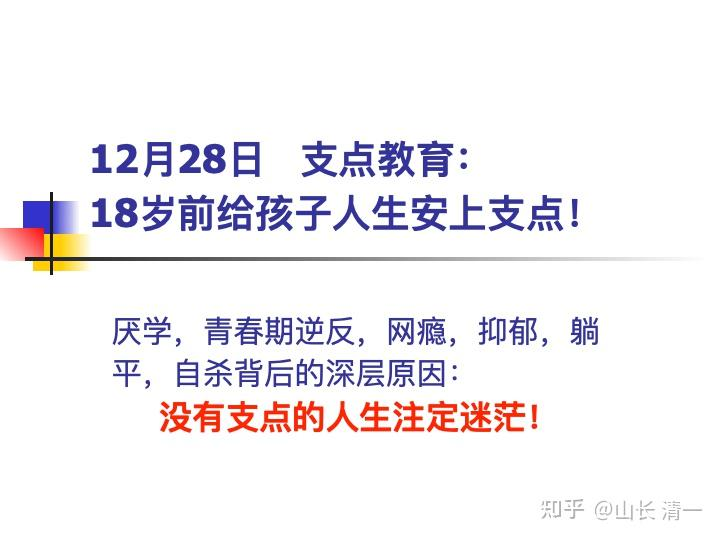

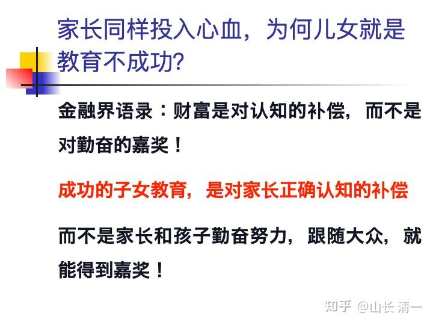

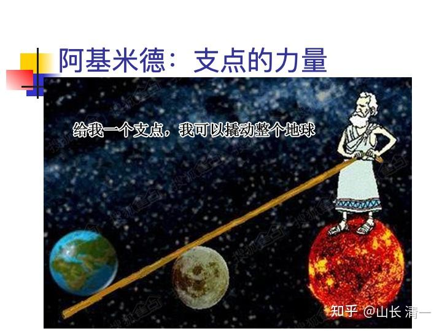

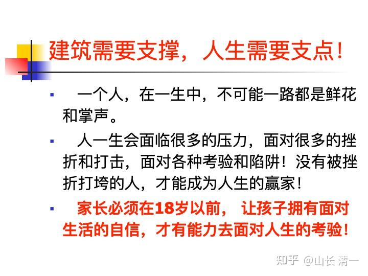

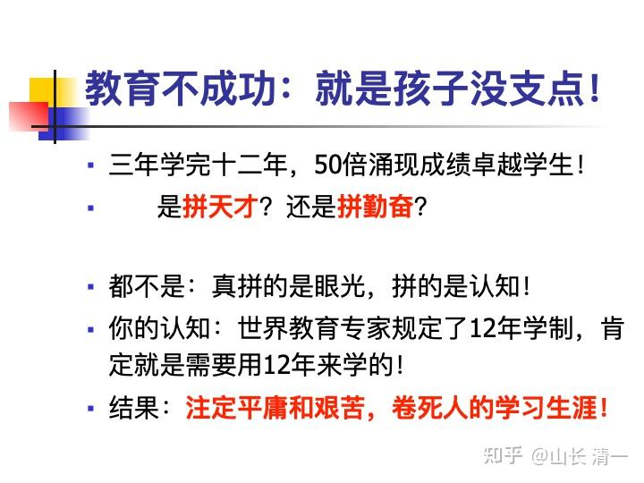

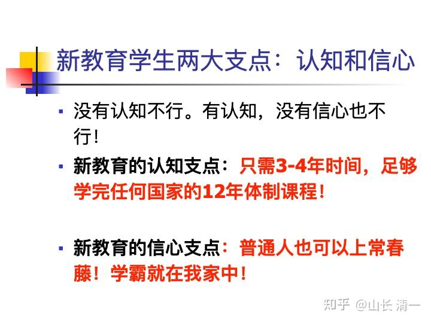

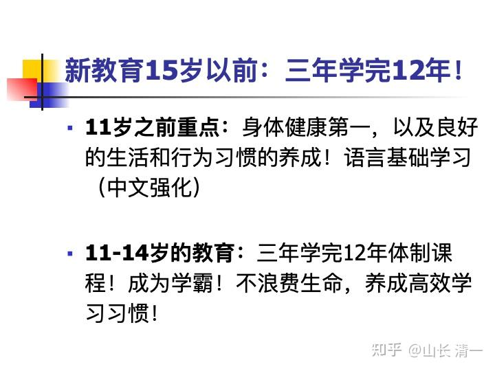

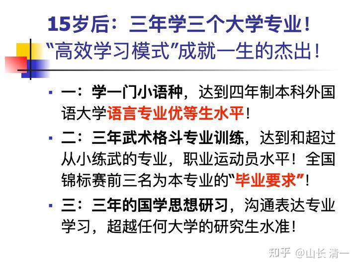

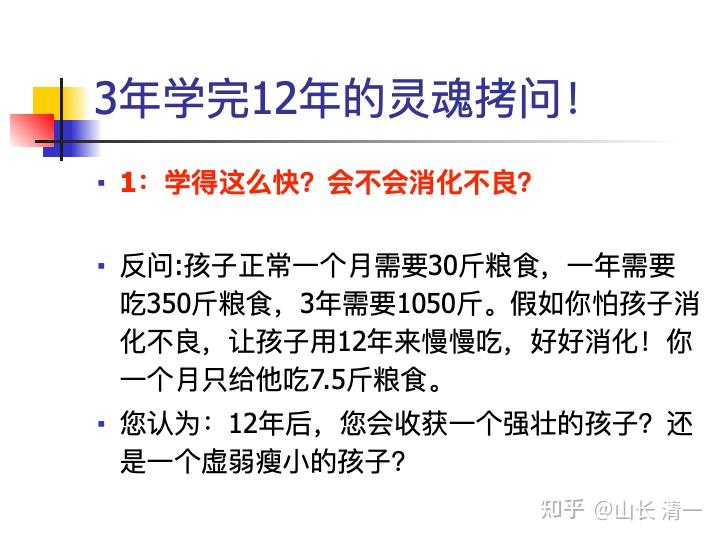

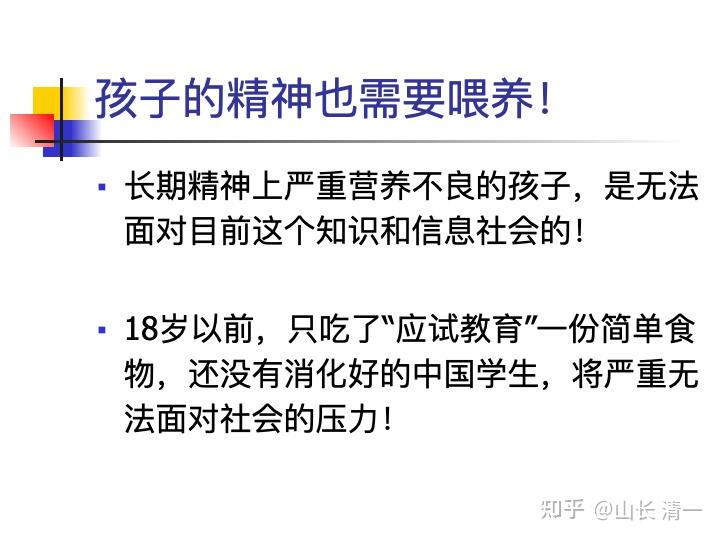

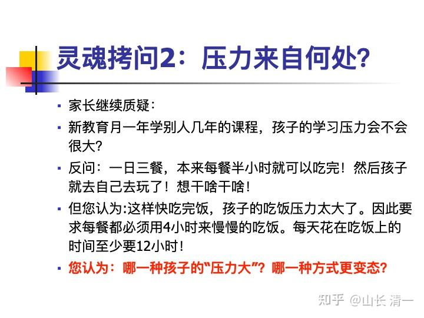