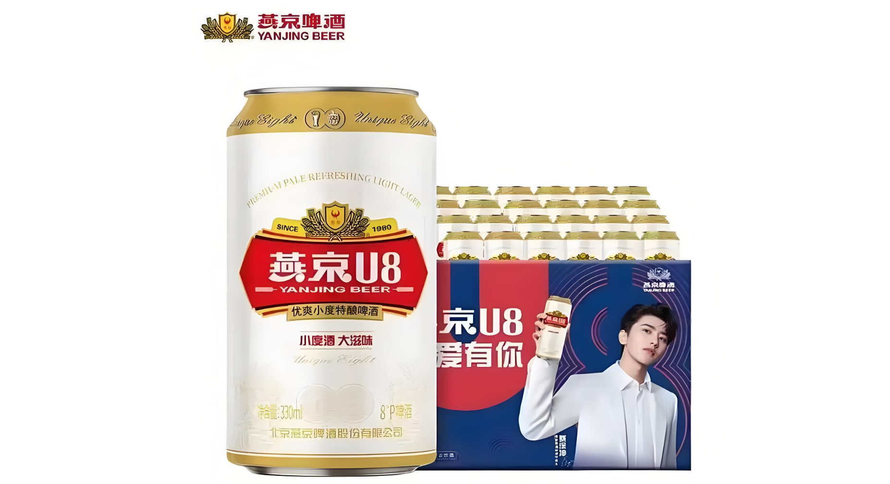
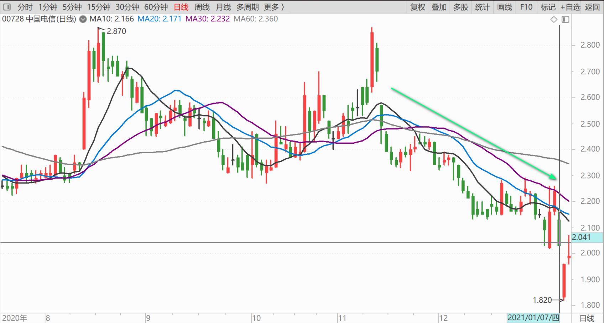
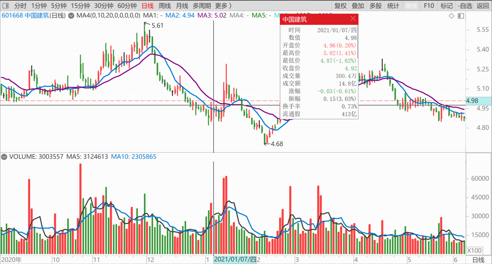
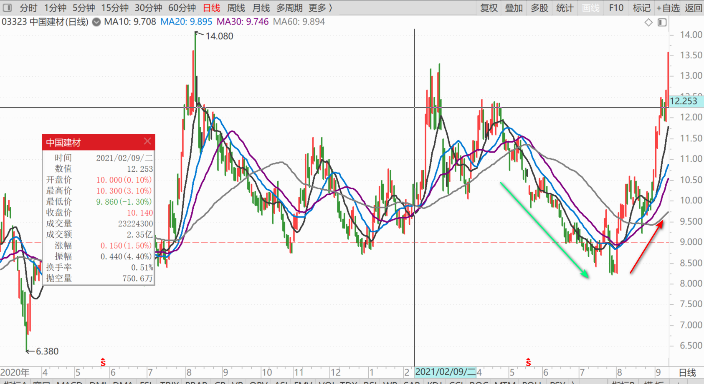
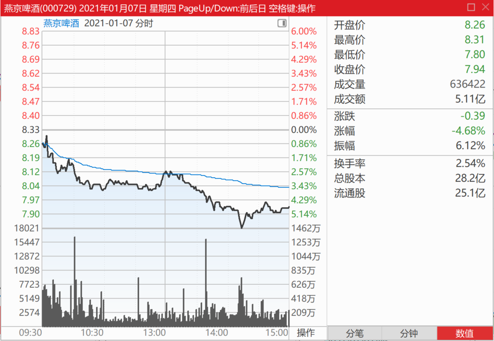
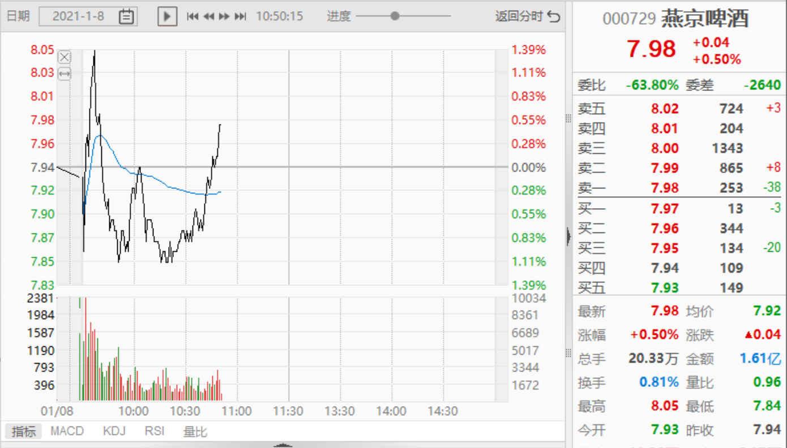
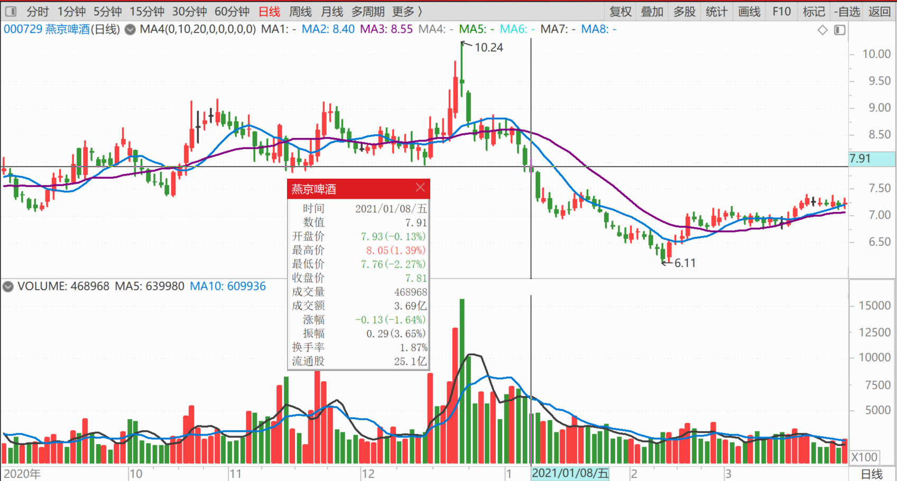

89篇.燕京我只关心两件事

清一山长 2021年1月7日～8日

一、反向操作 2021-01-07

[$燕京啤酒(SZ000729)$](http://link.zhihu.com/?target=http%3A//xueqiu.com/S/SZ000729) **今天一直在买啤酒，以及其他我认为便宜的股**，比如2.04元的中国电信，为国接盘！在中国，只能过“醉生梦死”的日子，还要配上个手机上网用。

啤酒股持仓，跟高点相比，我已经“严重套牢"，市值损失超过千万。大家千万别学我，千万别追高。安全线是燕京五元区，最好等燕京破五再买，这样子基本不会套牢了。喝酒怕醉的人，怕燕京破产的人，建议买破五的中国建筑，以及破9的中国建材，买了就可以睡觉去了。中国电信也一样，买了睡觉去。估计这几家公司都不会破产。

**今天的图形：资金流出！我反向做，拯救主力。主力今天打压出货，我帮他忙。**因为我是主力的吹鼓手[大笑]

[感知感恩](http://link.zhihu.com/?target=http%3A//xueqiu.com/n/%25E6%2584%259F%25E7%259F%25A5%25E6%2584%259F%25E6%2581%25A9)回复[清一山长](http://link.zhihu.com/?target=http%3A//xueqiu.com/n/%25E6%25B8%2585%25E4%25B8%2580%25E5%25B1%25B1%25E9%2595%25BF)：

感恩山长分享，惠泉今天买了么？

清一山长回复[感知感恩](http://link.zhihu.com/?target=http%3A//xueqiu.com/n/%25E6%2584%259F%25E7%259F%25A5%25E6%2584%259F%25E6%2581%25A9)：

惠泉啤酒、珠江啤酒，不早说过了？10元以上我就不分享进出，没跌破10元喔！所以别问我。我自己悄悄赚钱，悄悄赔钱。你们每个季度看公司的公开报表，就知道我增仓了，还是减仓了。赚了，还是赔了。惠泉我应该还是十大。只是三大的位置可能不保[大笑]。争取多留一段时间吧！

谁让人老要黑我呢！总是小人之心，认为我吹票拿奖金的，所以，高一点俺就不说了，自己套自己去！我吹空，你们想卖就卖吧[俏皮]

[渣男本男](http://link.zhihu.com/?target=http%3A//xueqiu.com/n/%25E6%25B8%25A3%25E7%2594%25B7%25E6%259C%25AC%25E7%2594%25B7)回复[清一山长](http://link.zhihu.com/?target=http%3A//xueqiu.com/n/%25E6%25B8%2585%25E4%25B8%2580%25E5%25B1%25B1%25E9%2595%25BF)：

请教一下山长，注册制等影响下，散户比例会减少，但是为什么很多文章会夸大这种现象呢？甚至说出美股散户占比个位数的言论，结合很多大V都在说买大市值龙头或者买基金，我不知道下一步会发生什么，您见的多给说说，谢谢山长[很赞]

清一山长回复[渣男本男](http://link.zhihu.com/?target=http%3A//xueqiu.com/n/%25E6%25B8%25A3%25E7%2594%25B7%25E6%259C%25AC%25E7%2594%25B7)：

你问我还真问对了，因为我不做私募，不做代理，将来也没有这个计划和想法。如果我做基金，做私募，我会花钱写文章，发表出来，说：你们散户自己做蛮好的，别拿钱给机构做，白白帮机构送钱。机构的这群家伙，工资奖金，全都靠你们了。

还是会说：你们这些粉丝们，自己做多辛苦，还不赚钱。不如拿给发一个私募，我来帮你们赚钱。这样才专业。专业人做专业事嘛！你们瞧我赚钱，不比你们强多了？给我钱，赚了大头是分给你的，给我一点点管理费就够了！

您认为他们会咋说？

我虽然是散户，我瞧不起任何机构的投资能力，甚至巴菲特我都瞧不上，他的伯克希尔我要瞧得上，早就买了。目前我没有看到有啥机构，长期赚钱增值的能力超过我的。我还在想：机构干嘛不拿钱给我这个散户来做呢？要把钱拿给我做，我先把燕京拉到20元去！不，200元去[加油]。让大家都开心。[大笑][大笑]

就是我没找到啥有档次的理由，能够让机构给钱，让我来“专业理财”做庄。你们帮我想想理由？如果真成了，咱们一起分成[俏皮]

[谨慎的虎哥](http://link.zhihu.com/?target=http%3A//xueqiu.com/n/%25E8%25B0%25A8%25E6%2585%258E%25E7%259A%2584%25E8%2599%258E%25E5%2593%25A5)回复[清一山长](http://link.zhihu.com/?target=http%3A//xueqiu.com/n/%25E6%25B8%2585%25E4%25B8%2580%25E5%25B1%25B1%25E9%2595%25BF)：

山长老师好，一直看您的文章，受益匪浅，有一因素是我一直不敢入手啤酒股的原因，特向您请教。就是国家是否会因粮食安全的问题，出台控制酿酒规模，从而导致啤酒行业的下行。

清一山长回复[谨慎的虎哥](http://link.zhihu.com/?target=http%3A//xueqiu.com/n/%25E8%25B0%25A8%25E6%2585%258E%25E7%259A%2584%25E8%2599%258E%25E5%2593%25A5)：

很有可能。要跟美国大战的话，肯定粮食储备不够用的，全都得存起来，不准浪费了。趁现在还有酒，你们快喝一点！

[农夫985](http://link.zhihu.com/?target=http%3A//xueqiu.com/n/%25E5%2586%259C%25E5%25A4%25AB985)回复[清一山长](http://link.zhihu.com/?target=http%3A//xueqiu.com/n/%25E6%25B8%2585%25E4%25B8%2580%25E5%25B1%25B1%25E9%2595%25BF)：

沉寂十六年啦！清一老师看哪一点进去的？是5g入口？

清一山长回复[农夫985](http://link.zhihu.com/?target=http%3A//xueqiu.com/n/%25E5%2586%259C%25E5%25A4%25AB985)：

是我脑子生锈了。我以为，啤酒如果放上16年都不动的话，就会变白酒，继续多放10年的话，就会变陈酒、老酒，会更值钱[捂脸]。都怪我不喝酒，没常识。不知道啤酒放久了，原来是变坏酒了。

**二、燕京必须破五？2021-01-07**

[$燕京啤酒(SZ000729)$](http://link.zhihu.com/?target=http%3A//xueqiu.com/S/SZ000729) 我今天认真研究比较了中国建筑和燕京啤酒，根据中国市场给企业的股票估值，得出结论：燕京必须破五。

理由一：中国建筑是行业第一名。燕京只是中国第三名，第四名。中建可以破五，燕京也必须破五！

理由二：中国建筑是盖房子的。房子是刚需，不能不住。燕京是卖啤酒的，不是刚需，可以不喝。所以，中建破五，燕京破三都是应该的！

理由三：中建每股收益，差不多一元。燕京的每股收益，才只有几分钱。所以，燕京必须破五，才对得起这个市场的正常估值。

理由四：中国建筑的市净率是0.74，燕京的居然高达1.65，按照这个比率，燕京必须腰斩才行，破三都太客气了。何况燕京的收益利润远远赶不上中建。所以，燕京必须破五。

伙计们：明天跑路吧！

**明天你们先跑，我押后**！等你们全都跑完了，我再跑。我负责掩护你们！牺牲我一个，幸福全中国！**我不入地狱，谁入地狱**？[加油]。我们一起来跟重阳玩跑得快游戏吧！

支持我的就举手[大笑]

**三、只关心两件事情：会不会垮、会不会破五 2021-01-08**

[$燕京啤酒(SZ000729)$](http://link.zhihu.com/?target=http%3A//xueqiu.com/S/SZ000729) 我今天一直在眼巴巴地等你们把燕京啤酒砸个跌停呢！你们怎么都不出手？**开盘你们居然还跑来抢筹？**啥意思？昨天不都说了吗？燕京这破企业，卖五元都贵了，要破五！还不快砸。顺便把珠江啤酒、惠泉啤酒全带崩了才好。

看样子，我说话的确不太管用！[捂脸]。市场上，谁都不听我的[俏皮]。

听我的就快砸盘呀？砸到跌停就最好了。燕京从来不冲涨停，只冲跌停！这个概念一建立起来，就可以顺利跌破五元了[大笑]。

我对自己重仓的啤酒股看多，就有人出来骂我做托。拉人入坑（奇了怪了。肯定我觉得好，我才会重仓的呀？）。你们看不顺眼，我就都只叫空算了。我预测：燕京的目标价是4.57元！因为2012年它就这价。这一回，你们总算没有意见了吧？

不过，我的预测一向不准。2006年燕京的价格才两元多。根据历史推算的话，所以跌破3元也有可能的。[俏皮]

[Cliff-Ou](http://link.zhihu.com/?target=http%3A//xueqiu.com/n/Cliff-Ou)回复[清一山长](http://link.zhihu.com/?target=http%3A//xueqiu.com/n/%25E6%25B8%2585%25E4%25B8%2580%25E5%25B1%25B1%25E9%2595%25BF)：

山长老师，1月31日前燕京有没有业绩预告的习惯呢[为什么]如果第四季度真的业绩不错，那这增长率按要求应该要提前披露吧！[俏皮]

清一山长回复[Cliff-Ou](http://link.zhihu.com/?target=http%3A//xueqiu.com/n/Cliff-Ou)：

我才不关心它四季度业绩好不好呢！**我只关心两件事情：第一、十年后燕京会不会垮？第二、它的股价会不会破五**？[大笑]

(标题、图片为编者所加)

**文章音频**：

[517篇.燕京我只关心两件事](http://link.zhihu.com/?target=https%3A//www.ximalaya.com/sound/784349360)

**参考链接：**

[84篇.我的啤酒股票，绝对不会“出清”](https://zhuanlan.zhihu.com/p/6035500140)

[85篇.这一轮珠江的底部和惠泉的底部](https://zhuanlan.zhihu.com/p/7361102270)

[86篇.吓人的目的是让你卖掉快逃](https://zhuanlan.zhihu.com/p/8712468814)

[87篇.早盘急拉代表什么？](https://zhuanlan.zhihu.com/p/10710257712)

[88篇.燕京还要趴多久？](https://zhuanlan.zhihu.com/p/11401524818)