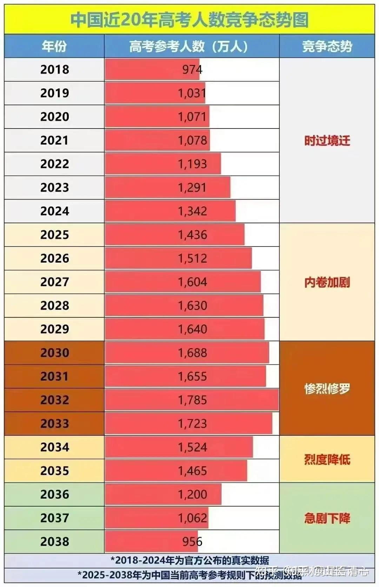

**现年8岁的儿童，未来十年的教育和职场之路是极度不乐观的**！家长如果不替孩子想办法，孩子就注定活得很可怜！

**首先，就是面临“毕业就业出路崩塌的十年”。**由于中美脱钩，产业外流很明显。大量的工作机会都流失到了海外！现在的国内就业情况就很差。不仅仅大学毕业的新人就业状况很差，甚至职场老人也不断被离职，失去现有的工作！再找工作发现根本就找不到！以至于很多人只能去跑外卖，做这种根本没有技术含量的工作。弄到现在的外卖行业都卷得不行，外卖员一天只能挣150元，勉强够活。还有外卖员在送单过程中崩溃，直接丢了手机，从天桥上跳下去！这都是“就业”问题很严重的表现！

第二：在未来十年就业注定竞争白热化的局面下，参与职场竞争的人数，在未来15年居然一直在上升。叠加到高考上，一定是少量的名校入读名额，会吸引来比原来多两倍，三倍的学生参与竞争！“高考地狱”未来10年会成为这个社会上的一个常态。甚至我敢肯定----很多年轻的生命，会毁在这种超级激烈的竞争中！未来局面恐怕比韩国的高考地狱更加的严酷！绝对是恢复高考40多年来最卷的高考时代，因为卷的不是要上大学，而是要上一线名校！普通大学和普通学生将完全没有存在感。教育分层，两极分化会非常的强烈。中间人完全没有活路了！

我们用数据来说话好了，你看看下表，预估一下你孩子什么时候参加高考？她将面临多少人的竞争？请看看这个榜单，你有大多的信心认为你的孩子注定成为1%的名校学生吗？

现在是最坏的时代！

但---也是最好的时代。

一旦家长转变思路，不走寻常路。你就会发现：现在的孩子，也正在拥有一个前所未有的大好机遇！

解决的方式其实很简单：就是避开红海，驰入蓝海！

在中国大陆卷得昏天黑地的同时，海外的第三世界国家，东南亚和南美地区，反而迎来了一个利用中美脱钩机会获得大发展的机会！各种工作机会大量涌现。小语种人才到处都抢手。

目前的世界，很明显就是“冰火两重天”。往日“日子不错”的美西国家，现在面临高技术市场被中国抢占的严峻考验，就业和生活都日渐艰难！

但原来被人忽略的第三世界小国家，却迎来一个大发展的机会。各位家长，不去拥抱现在上升的事情，反而抱残守缺。要么是死抓越来越艰难的“中国高考”华山一条路，死也不放手。要么一些自以为眼界开放的家长，死心眼非要去英语国家拼运气。不是没事找抽吗？

懂一点点政治，就懂得一定要跟随我们国家的一带一路方案，去配合我们国策的需求，进行相应的子女教育配套，这就是目前最好的出路！

现在聪明的人，该学会抽身退步，去学小语种，掌握三语能力，去第三世界国家发展。不要守着老黄历不放了！

现在最好的教育，最有价值的教育，最务实的教育，不再是传统延续百年的西方英文留学教育，也不是中国大陆残酷的应试教育，而是能让你快速掌握多国语言能力教育，三语教育。外语的实际应用的教育，一向是传统教育的短板和弱项。但现在，新教育已经解码了外语教育的真相，解码了【三年学完12年】的秘诀，你干嘛还守住老黄历不改呢？家长今天死心眼，死脑子不改变，10年后就只能看着孩子面对残酷竞争苦苦挣扎，却毫无办法！

很多机会，是只有一次的。三语教育，也必须在孩子15岁之前完成。晚了基本就补不上。因此，你的孩子，目前面临的机会和危险，都是非常大的！就看家长怎么决策取向了！

2024年12月28日，欢迎你参加目前唯一能够为现在中国家长提供的全套解决方案，一套全新的教育模式----清一新教育家长学生的盛会！示范班，公主班学生现身惠州。是骡子是马，家长们自己来看看！

公主班的20多个孩子，已经订好了回国的机票。她们在参加完2024全国泰拳锦标赛之后，将出现在交流会的现场。并与本次来参与交流会的家长们场下互动交流。各位可以近距离的了解这些清迈“不走寻常路”的公主们，生存质量到底怎样！是不是活出了人生的精彩？还是活得像她们国内的同龄人一样辛苦劳累？耳听为虚，眼见为实！大家可以现场验证事实---不再是单独的个案。而是批量涌现的事实！

[您希望把孩子培养成为“文武双料冠军”吗？](http://link.zhihu.com/?target=https%3A//mp.weixin.qq.com/s%3F__biz%3DMzAxNzk5NjIzOA%3D%3D%26mid%3D2247505893%26idx%3D1%26sn%3D874728b5217d0e4648c2061decef6eea%26chksm%3D9ae0de0fb42a75c7ee2f3c196df74af15ca59ad3a2701f6dbf6aaee9fc6b1a7c17bf8dae4aad%26mpshare%3D1%26scene%3D23%26srcid%3D1205su4ziCL2drPA5Itq0R7g%26sharer_shareinfo%3D883894138fe5f16be42f6335f71e89f3%26sharer_shareinfo_first%3D883894138fe5f16be42f6335f71e89f3%26poc_token%3DHIWnY2ejcbgYznd_nr66g9PcshTWbu9SxUXp3hlG)