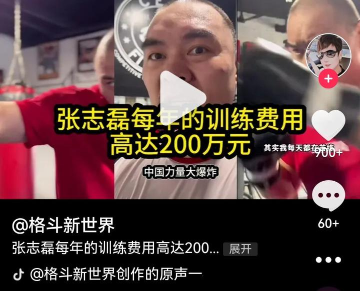
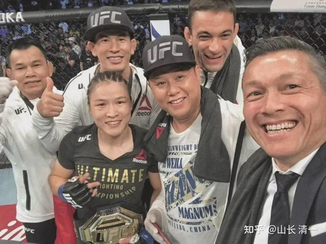
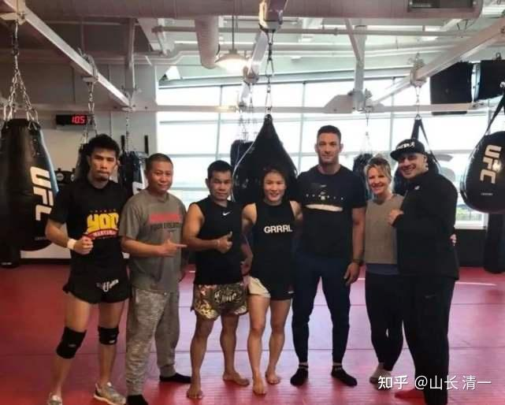
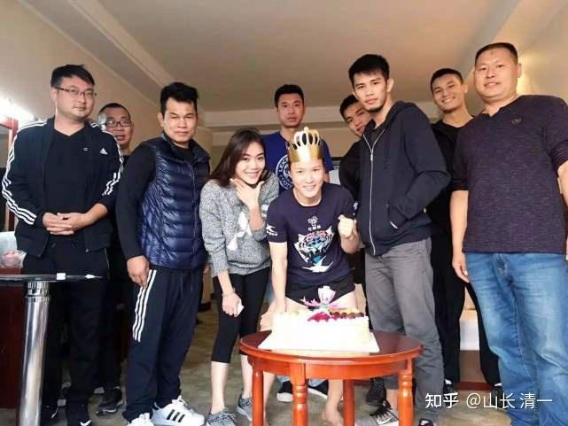
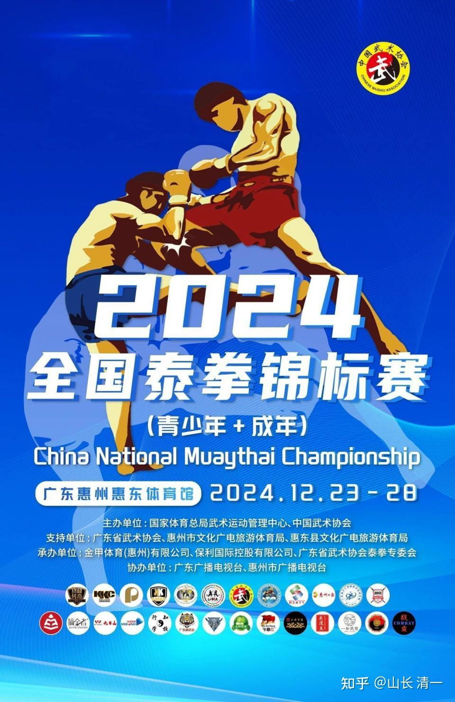

2019年，我跟几个武术圈的朋友，说我拿钱出来培养热爱传武的年轻人去打现代格斗，去拿冠军！主要是我不服气徐某东诋毁传武，我想请几个真正的传武格斗高手来当教师，他们出力，我来出钱，还出人（找学生和供养学生），想把中华传武传承下去！尝试用传武的技术来打现代格斗。

但我开局就不利，根本就没有人支持我。引来的是批量的嘲笑和怀疑！一些不懂武术的朋友，提醒我年纪大了要“小心”，说“年轻人不讲武德”。武术圈的行家，也笑话我自不量力！根本就不懂格斗，更不懂格斗的行情！

首先是武术资深，专业人士嘲笑我不懂武术界的基本常识。说格斗冠军，根本就不是花钱能培养出来的，要天赋，要选人，还要运气超好。培养的概率超低！比如能够从千万个练武人中，选出最有格斗天赋的人来培养，中国每年这么多人练武，中国武校每年多少万人。真能打出来的有几个？还告诉我一些队员的秘诀---比如选女拳手，一定要选雄性荷尔蒙高的人（男性化女子），才有希望培养。想一下，似乎国内练格斗的女子，个性的确都有点不太像女子！说我居然想就从自己学校的学生中，选几个愿意来练武的人，就以为可以教她们打格斗冠军？简直是做春秋大梦！

第二个：就是笑话我“装大腕”，以为自己有几个小钱，就想来玩格斗拿冠军的高端游戏！说每年几千万都未必砸得出来一个冠军！还要配顶尖的教练和国际营养师等等，还有世界级的经纪人来安排比赛，刷名次！这些都需要一个大团队，才能培养出冠军来。不是仅仅找几个队员来培养就够了！我这点小钱，根本就养不起这批世界级高人！还讲了国内的某些大佬，多少亿的投资砸下去玩格斗，结果是泡都不冒的。说我太自以为是了---中国真有钱的老板多了，马云不比你有钱？他原来也想出来玩武术，什么【功守道】，多少武林人支持，投资也不少，他还想冲奥运项目呢？最终啥结果？我这点能耐，本事，还想学马云比钱多？想拿武术来玩文化格调！

所以，当年，根本就没有人理我！我出钱出力还被人嘲笑。当然，我的功夫更是被人嘲笑的不行，就是个纯业余爱好者，“外行”。我从小学文，当学霸倒是真的，练武就是玩了。从来就没有正经练过，也没有打过比赛！但是当业余爱好玩玩而已。而且，我也打不赢真正的传武高手，他们真的很厉害。因此，在他们眼里，我就是一个挣了一点小钱的土豪，就想来玩文化，装样子的！甚至---他们会恶意的猜测。我就是想用钱来把传武的名头买走。功夫不行，用金钱来凑数。我们弟子在泰国打的几百场比赛。拿的金腰带，偏要说是我花钱买的比赛。说他们知道，在泰国，一场比赛花上几千元就可以买到。因此就就是沽名钓誉。

我真是生气：传武被徐某东已经骂成狗屎了。传武在中国都变成烂大街的骗子把戏了。我想出来为传武正名。居然被这些老传武说成是要花钱来沽名钓誉。实在是瞎了眼！但我还真的打不赢这种人，他们的自负也是有实力支撑的。

但----这件事，总得有人来做吧？高手不出马。不愿意担当，只顾自己玩乐。我这低手也不能看传武就此衰落吧？我们这代人，20年多后就死了，这些人都没有传人。年轻人没有人学会他们功夫的。最多知道他们功夫好！但下面还有啥人练真传武？很多人，连见都没见过真传武！我们这代人起码见过真传武，知道真传武的厉害。现在得让年轻人也来跟着学一点，也许有人真能打出来呢！

于是，既然都没人支持，我就自己玩自己的了！自己当投资人，自己当教练，自己摸索着研究技术，针对现代格斗的特点。把传武的一些能够打现代格斗的技术拿出来，边琢磨边练。找了几个愿意相信我的家长和学生，搞了清一武道馆，弄了五年，现在才总算有了一点样子！我们的中国冠军拿了五个，亚洲冠军已经拿到手三个。泰国拿的泰拳金腰带，应该超过十条了！2025年，我们拳手肯定能够参加世界锦标赛，给机会，我们肯定就能抓住的。特别是现在的梯队已经出来了，一批更比一批强！木兰们在清迈，已经打过世界冠军了。与IFMA的世界冠军都交过手了，没觉得有多难打的，肯定比一般拳手强，也就是强一点了。还没强到我们对付不了的地步。

再过五年，如果我所料不差的话，估计代表中国对外作战的国际格斗赛事的中国国家队主力成员，肯定就是清一战队了！我们将成为世界格斗场上一股非常重要的中国力量。张志磊其实不是真正的中国力量，是“美国格斗力量”帮助下打出来的有志气的中国人！而且这种中国人都还很少。我们这些采用传武格斗技术去打世界赛事的队员，才是真正的中国力量。而且未来五年，会一批一批的出来代表中国获取世界荣誉！

现在来看，拿冠军对我们就是一个很普通的事情！清迈的各国冠军多了，没见人有啥张牙舞爪的，就都很正常，也会去打2000B一场的清迈职业赛事，就当玩一样！当然--张伟丽---张志磊这样的冠军，难度还是很大的。但几年后，我们的木兰也就会上到这个级别的！毕竟---现在积累的时间还太少了。两人练多少年了？比如张伟丽，她从小就去武校练武，经过20年的积累才到今天的样子。我们的孩子，现在最多的也才5年而已。新出山的才两年半。时间肯定对我们更有利！

所以，我想我们中国人是不是就想多了？把拿冠军看得太不容易了？在清迈见多了冠军，没觉得打个比赛有多难的，难度在于自己能不能突破！所以---不信邪的我，一路走上了“书生练武”的道路！

下面是转载的网上的资料。供大家参考。看了就知道-------原来在清一武道馆之外，拿冠军还真心不容易！

[2024全国泰拳锦标赛将在惠州惠东体育馆举办_腾讯新闻](http://link.zhihu.com/?target=https%3A//news.qq.com/rain/a/20241217A068OD00)

**张伟丽：高支出的自费训练，一个冠军的背后需要七个顶级教练全身心的投入**

**“培养一个UFC冠军需要多少钱？需要多少人为之奋斗？”**

在张伟丽成为UFC世界冠军之后，这一直是我最想写的选题。但遗憾的是，张伟丽所在的黑虎搏击俱乐部的老板蔡学军只是跟我说起，他没算过，只是知道，这么多年，我们这群人基本全都搭在这儿了。”

不如，我们替张伟丽团队算算这一笔账：她的备战团队中，有7个顶级教练，其中，2 个站立教练（教授泰拳和拳击）、1 个巴西柔术教练、1 个 MMA 实战教练、1 个中国跤教练、1 个体能教练和 1 个战术总教练兼俱乐部老板，还有长期合作的康复师团队和其他工作人员。

不同于体制内的备战训练，拳馆所有的支出都是自掏腰包、“自负盈亏”的。

张伟丽的泰拳老教练已经来到中国多年，从刚开始教她，就说过要让张伟丽成为UFC的冠军。他曾经是雅桑克莱小时候的教练，带出多位泰拳冠军和三位WBC拳击冠军。据张伟丽回忆，她曾在一次训练打靶时，不小心用肘把老教练的眼皮给撞开了，流出鲜血，她想赶紧停下来让他处理伤口，但是教练没有停而是继续让张伟丽继续训练、上课。

泰拳小教练是老教练的“徒弟”，年纪和张伟丽一般大，每次比赛，都是由他来模拟对手的打法陪着张伟丽实战。

MMA教练吴昊天曾经是张伟丽的偶像，2010年，张伟丽在当健身房前台时，正巧碰见来拳馆训练的吴昊天，也是从那一刻开始张伟丽才认识到综合格斗的魅力。

还有教中国跤的王教练，家不在北京的，他每周都从河北开车三个小时来俱乐部给张伟丽上课。张伟丽说，“只要我说，我今天想训练，他一定会出现在黑虎。”

俱乐部的“大家长”蔡学军是培养张伟丽走上综合格斗的幕后军师，从备战的饮食、休息到训练所有的环节，甚至拳馆的经纪、宣传，都要他一人打点。

张伟丽说，团队中每一个成员都像他的家人一样。成为冠军后的她，还是住在京郊和同事合租的房子里，她自己也说，“我的教练团队很庞大，我们的花销非常大，（奖金看起来挺多），我还不知道能拿多少呢！”

[张伟丽：自费训练，签证被拒 工资不及一龙。张伟丽独闯UFC的辛酸史_腾讯新闻](http://link.zhihu.com/?target=https%3A//news.qq.com/rain/a/20200316A0OOCJ00)

12月23日-12月28日，2024全国泰拳锦标赛在惠州举办！清一武道馆派出20多个队员参赛。今天已经出发回国比赛了，基本上就是上次全国自由搏击锦标赛的队伍。我的目标也不变-----还是想拿到五—--六个金牌！上次没有拿到的金牌。这次争取拿回来。当然，最终还是看结果吧，也许又是吹牛！吹不吹，28日就知道了！

目前得知：今年有400多人参赛。参赛的规模，实力都超过去年很多。去年我们首次参赛，就拿了三块金牌！今年会是怎样的结果呢？会增加还是减少呢？

东亚强队香港队，今年也派了队员来参赛！澳门就不知道了！