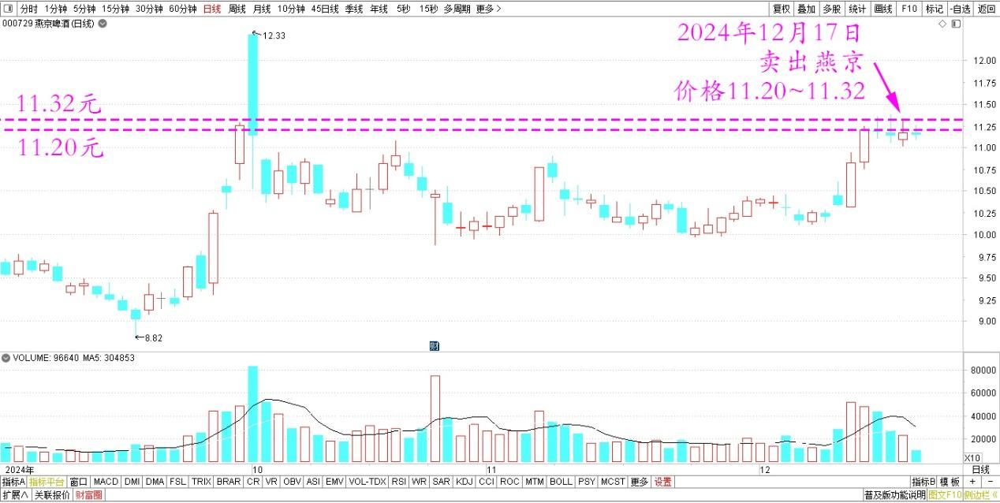
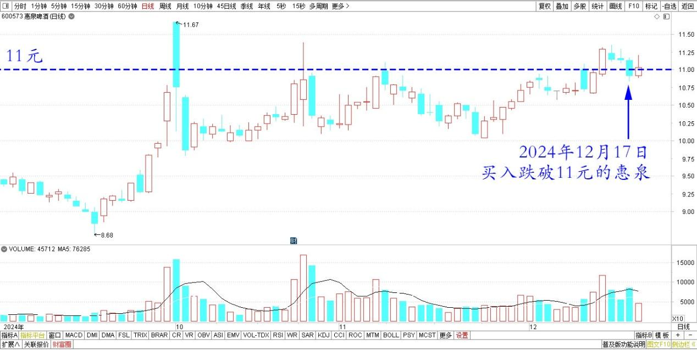
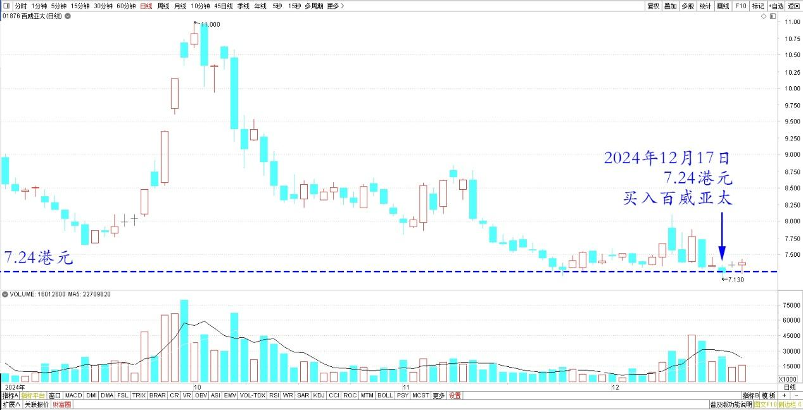
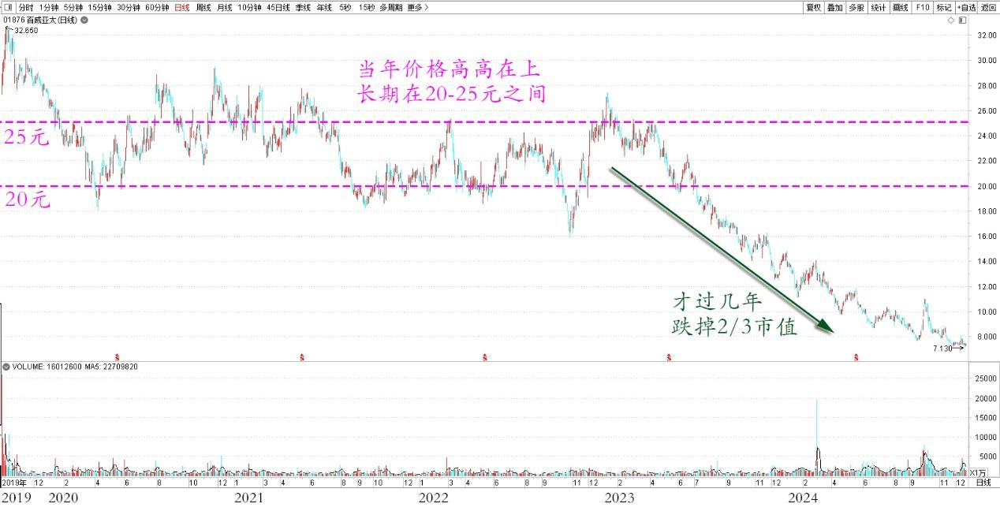

126篇.卖出快涨的燕京，买入惠泉和百威

清一山长 2024年12月17日

燕京啤酒感觉快涨了。不过，我还是不贪心，把养老账户的一百多万股燕京都卖掉了，账上只剩了一万股。今天卖出的价格是11.20～11.32元。这个股的账面上，留下了1215万的盈利，已经成为几家啤酒股中盈利最多的股票了。原来是惠泉的利润最多，现在已经被燕京超越！

燕京啤酒 2024年9月～12月日线图

但目前也不想空仓，所以今天卖出的这些股票，都全部换成了跌破11元的惠泉，以及今天7.24港元买入了百威亚太。（如果今天没有找到可以买入的标的，我宁肯等待，啥都不做）。

惠泉啤酒2024年9月～12月日线图

百威亚太2024年9月～12月日线图

买入百威亚太的逻辑，是因为这个股跌惨了。几年前，我5～6元大量买入燕京的时候，百威亚太上市，新股发行。当年的价格高高在上，长期在20～25元之间。没想到才过几年，跌掉了三分之二的市值。说明巴菲特为啥不肯打新的道理，其实非常的聪明。因为打新的结果往往很惨（跟中国市场不一样，中国打新似乎是无脑赚，但我放弃了这个无脑策略）。现在用涨了一倍的燕京，来换跌了70%的百威，怎么算都不能亏吧？六倍的差价，我想还是值得拥有的！

百威亚太2019～2024日线图

不知道大学金融专业里面信奉“有效市场理论”的专家们，怎样解释这六倍的差价谁才是合理的？——几年前为何市场会认为：百威的价值就应该比燕京的价值多六倍（如果把现在的价格看成是标准价的话，是“市场合理选择的正常结果”）。我相信这些专家们，总会找出一些似是而非的涨跌理由来的。但我一个字都不想相信！我宁肯相信市场先生就是疯子，我认为它的脑子就是不管用的，它的情绪是任性胡闹的。所以我才不用费心去思考它给出来的定价到底有何合理之处。我只管利用它的疯狂就行了！等它疯狂乐观的时候，高价来市场要货，我就卖给它。等它沮丧低迷，胡乱抛售的时候，我就买入它。比如现在的百威，各种数据上的不乐观，各种坏消息。这时候，我就买入——五年前五元多的燕京，不就是各种坏消息满天飞吗？都觉得燕京要垮台了一样！但我相信人类沉迷酒精的坏毛病不会改的！

（标题、图片为编者所加）

**文章音频**：

[519篇.卖出快涨的燕京，买入惠泉和百威](http://link.zhihu.com/?target=https%3A//www.ximalaya.com/sound/786622398)

**参考链接：**

[121篇.差价0.58元，买回燕京](https://zhuanlan.zhihu.com/p/7362533088)

[122篇.差价0.65元，补仓燕京](https://zhuanlan.zhihu.com/p/8710118230)

[123篇.养老账户半仓惠泉换珠江](https://zhuanlan.zhihu.com/p/9240529106) [124篇.差价1.7元，燕京换珠江](https://zhuanlan.zhihu.com/p/12627844392)

[124篇.差价1.7元，燕京换珠江](https://zhuanlan.zhihu.com/p/12627844392)

[125篇.卖出燕京、珠江，买入百威亚太](https://zhuanlan.zhihu.com/p/13640234438)

