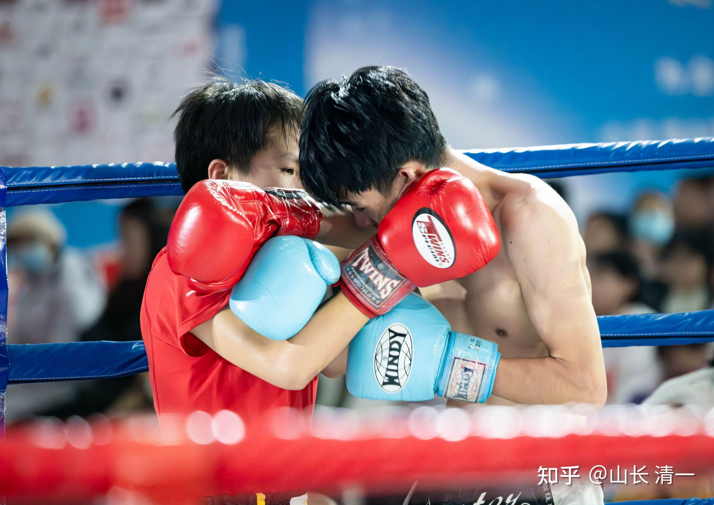
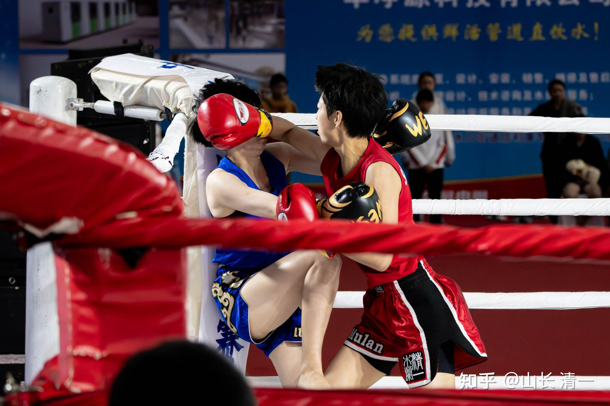
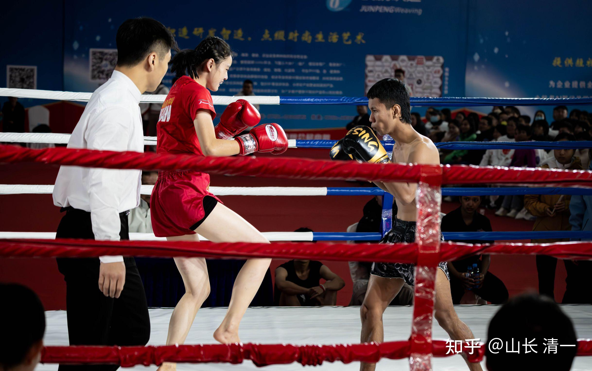
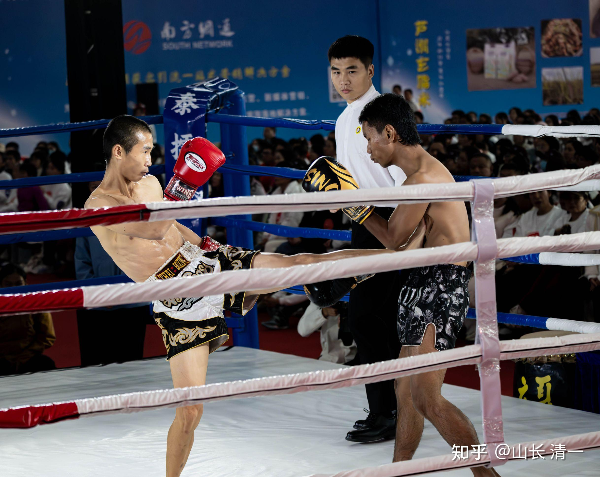
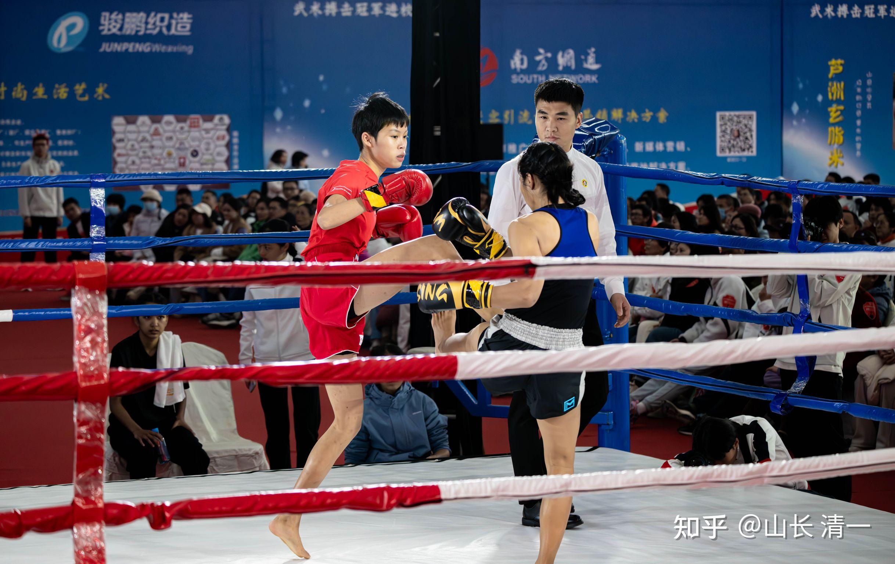

这几天都太忙了，没有来得及更新，报道本次分享会的情况！因为我多年没有回国， 这次回来，交流会排的满满的，会后还有很多人约好了咨询，每天忙到连饭都吃不上，29日一天，就只是早上出发前吃了早餐，后来中餐晚餐都没时间吃。就用几个水果度过了，人的需求，其实真不多！昨晚我就跑到外地躲起来了，今天才有一点时间，悠闲地在宾馆里面看看信息，处理一下个人的事务！

现在就向大家汇报一下本次【中泰冠军擂台赛】的情况！

12月29日。清一战队的业余拳手们，与泰国的职业泰拳手们，进行了七场用泰拳职业规则举行的中泰大决战。由于赛事涉及两个国家的荣誉，因此两国拳手们打得都很拼，赛事的激烈程度远远超过了本次全国泰拳锦标赛的程度！

中泰对抗赛起始于20年前，当年中国的散打教父李建平，首次在中国举办了中泰对抗赛！激发了中国武术界的活力。也通过向泰国拳界学习，培养出了中国第一批泰拳高手，并在泰拳世界锦标赛上培养出了中国的泰拳世界冠军！也培养了中国一批深得人心的格斗天王。比如柳海龙等！这是中国格斗历史上的高光时刻！

但最近十几年，中国的泰拳战绩乏善可陈！中国队派出参加世界泰拳锦标赛的队员，常常第一轮就被淘汰，已经有很多年没有出现过新的世界冠军了！

武术中心搏击部的领导，在去年，今年的全国锦标赛开幕之前给参赛领队开会的时候就说：泰拳世界理事会，一直非常希望在中国举办一次泰拳世界锦标赛。但领导却不敢举办。因为---如果中国来承办这个赛事，但中国队却一块金牌都拿不到，甚至第一轮就全部被淘汰，不是太丢人了吗？而且---世界锦标赛有精英赛（就是不带护具的，更接近职业的资深拳手的比赛）。中国队一直选不出来拳手参加。如果举办世界锦标赛，我们却只能参加U23以下的初级比赛，就要闹笑话了，反而彰显了中国泰拳实力不足的样子，因此领导也很无奈。所以武术中心这两年来举办泰拳全国锦标赛，特别是今年举办青少年赛事，就是希望中国的格斗拳手们能够积极参加武术中心举办的全国泰拳锦标赛活动，也能让领导能够从中培养和发现泰拳格斗人才，为国争光！特别希望通过各种赛事，能够选出优秀的中国拳手，参加2025年在我们家门口举办的小奥运---世界运动会（成都）。

也许：我们中国并不是没有优秀的，能够与国外拳手对抗的拳手，只是我们缺乏发现的机制。没有让优秀的人才出国打比赛，表现的机会。因此，我们决定为国分忧，个人出资来举办高水平的中泰冠军擂台对抗赛，每年举办一次，设法提高中国拳手的赛事水平，为国家培养出优秀的人才！

赛前，泰方知道本次来对抗的拳手，都全部来自一个三语国际学校自己培养出来的拳手，因此心理上是有点轻视的。但因为知道我方也有几个长期在泰国打比赛的优秀拳手，所以还是派出了两三个泰拳的顶尖拳手，比如泰国自由搏击和泰拳的双全国冠军（第四场上场的女拳手）。也有比赛经验极其丰富的老拳手（第五位上场的拳手）。但是，前面三个女拳手就不是泰国的顶尖拳手了。本次的男拳手，特别是第六位上场的拳手，肯定也不是泰国的顶尖拳手。最后一个上场的男拳手，是KO了很多泰拳职业拳手的清迈地区冠军。两年前，他和明晓佳慧一起开打比赛，他第一次上阵就KO了对手。因此，他有实力KO我们的女拳手也不奇怪！
赛前，泰方领队还给他的弟子（双冠军）说：中方的拳手都很年轻，都是你的小妹妹，还是邀请你们去中国旅游的伙伴。由此让她上场不要真打，收着一点。因为老拳手知道优秀泰拳手的实力，真怕我们的拳手被她打坏了。而且---明晓佳慧也拜了他为老师，负责安排泰国的拳赛！所以有点维护小师妹的意思！

但我知道：我方队员知道这是一场双方都必须竭尽全力的比赛，绝对不会随便打的。因此，赛前专门给泰方的队员开会，说明了一件事情：由于赛事在中国的举办，我方队员一定会全力投入的，不会收手。中方队员一定会竭尽全力的想要赢得胜利！另外，我方派出的人员，都是中国的全国冠军（反正我们学校冠军多，目前已经有15位全国冠军了）。所以要求他们不要轻敌，一定要全力以赴。而且---还许诺如果他们能够KO我们的拳手，我会发高额的奖金给泰方。但中方KO泰国拳手是不给她们奖金的。（但我也说了，如果泰方男拳手KO了我们的女拳手，是不会额外给奖的，只发给男男对抗和女女对抗的KO拳手）。这一方面是荣誉，一方面也是要堵住泰方的嘴巴！以免赛事后，把自己失败的理由，归结为是他们比赛就没有出全力，是故意让赛的！

事实上，我特别担心的，就是我们这次全面击垮泰方拳手，取得一边倒的胜利，这就太像“假拳”了！但看情况，很可能会出现这种情况（对方轻视我们，而我们真实战力，远远超过我们的名气）。我认为：正常情况下，我方只出五个女拳手，就可以打完全部泰方的男女拳手了。如果这样，就算是真，也会让国人认为我们的比赛太假了！所以必须防止所有可能的借口和漏洞！

一方面，我们安排了我们最强女战士，四冠王明晓来“开擂”。她是一个打起来就六亲不认的女拳手，日常练习的时候，都会把队友打伤。因此我们的女队员都怕跟她练习对抗，她平时更喜欢找男队友过招。这一次，我们本来可以安排她与泰国男拳手打比赛， 肯定会比ELLA更靠谱。但我的安排，是让她打先锋，赛前就说好她的目标，是一个人要干掉对方的三个女拳手，为我方的后续安排开路。当然，我也教她上场后，刚开始不要太拼体能，而要稳准很的出击，打起来就出全力，尽可能KO对手，不要三场比赛都拖完五个回合，以节省体力。不然她一个人连续15个回合，是扛不住的！结果她完美地完成了任务！把三个泰国女队员全部轻松KO了！可想而知---就算是职业拳手，如果实力上有较大差距，真很容易KO。如果算上前一天，她在全国锦标赛中，就算带着厚厚的护具，依然l在决赛中KO掉跆拳道出身的体育专业大学生，获得明晓的第四个全国冠军。28，29两天内，明晓就KO了四个对手，她真的具有相当可怕的攻击力！如果对于职业拳手，她都具有如此可怕的杀伤力。如果普通人对上她，不就是“秒杀”的结果吗？所以，各位要知道明晓就是清一木兰中的女杀手，绝对不可轻视！不要轻易去惹她！上次我练习中踢了她一脚，她挡了一下，结果我的小腿就紫了。但我其实硬度也不差的，小明慧和别人拼腿很得意，说别人打痛了她不痛，我要跟她试试她就跑了。因为她跟我碰手，碰脚都老吃亏。但我发现：跟明晓拼腿是我吃亏。只好跟她拼手，当然就是她吃亏了！以后我出来让明晓做贴身保镖，肯定没人惹我。

第四个泰方上场的队员，是泰方本次最强女拳手，泰国的全国双冠军。她见到泰方三个女拳手都被我们一个拳手就KO，她肯定来为泰国小姐妹报仇的。我们派谁去对付她呢？如果派其他三个已经获得东亚冠军的老木兰上，她肯定是讨不到啥好的。甚至因为求胜心切，难说会被我们ko掉！但我真心不希望泰方全部败北，总要给泰方留一点面子。因此我方派出了未成年的青年组拳手，公主班的陆韵如。让她与泰国的顶尖高手过过招，以后她就不会再害怕遇到高手了！她在这次全国锦标赛中，没有得到金牌，只拿到银牌，她觉得很丢人，自己说：都没资格代表公主班上场了。但我派她上场的目的，并不是取胜，而是计划让她拖住对手，就算是失败了也没关系！总不能让泰方全部都败战吧？一点面子也不给，下次就没得玩了！所以就是让她去体验失败，锻炼心态的！

陆公主上场打高手，情况如何呢？其实前面两回合打得很危险：因为泰方决意复仇，队友们也都在期望她KO中国拳手，陆韵如毕竟技术，经验，实力都不如对方，加上对方想要KO中方拳手复仇的心很强，打起来干脆利落，非常快速和流畅。导致陆韵如在场上开始很拘束，心态有点崩，前两局我看有点顶不住！这样下去，她会被KO的。所以我中间休息时，就上场去特别提醒她：不要想赢，也不要怕输。享受比赛就好！她只要比赛中往前冲，尽量缠住对方，打满五局就行了！果然，她之后打的就好很多，虽然无法取胜，但也让对方无法压制她，最终打满五局，判泰方此场获胜！

接下来，我方问打赢了陆公主的泰方拳手，是否决定要接着打我们的下一个木兰拳手？继续守擂？她非常聪明的说---她希望把更多的比赛机会让给队友，因此她打完陆公主就退赛了！她的决定是很明智的，因为我方下一个上场的是谭木兰。她在东亚锦标赛中，初赛和半决赛都KO了对手，很有实力。如果这个泰国双冠军，在被公主们拖垮体能的情况下，与她决战的结果，肯定就是被KO。谭木兰还可以继续打下一场，继续用我们的继续拖垮对手，给下一个我方拳手制造KO对手的机会！

不过---这个规划最终没有完成，因为泰方胜利后退赛（预料之中），之后就直接派出了女子的擂主---年龄最大，经验最丰富，而且体重最重的女拳手。这个泰方擂主的确很厉害，打得特别油滑。距离感，力量速度都很强。刚开始的两局比赛，东亚冠军谭木兰居然处于下风，这两局是丢了的。我知道谭木兰跟这个老资格泰拳手打对抗，打阵地战，肯定是不如她有经验的，肯定会吃亏。因此前两局场面上居然让对方占优了，可见对方实力不凡。我一看这样下去不行，就在第二局结束后，上台要求谭木兰不能继续跟她打阵地战了，必须积极进取的打攻坚战，要连续出击，狂打对方，打累了就抱住对方休息！然后继续狂轰，把自己的体力全部用完。后面三局谭木兰敢冲敢打，顺利拿下第五场比赛的胜利。赛后，刘老师好奇---你上去说了什么？怎么这么有效，几句话就让谭木兰扭转战局，反败为胜了？很简单--我就是教她发挥自己的优势，不让对方发挥优势罢了！

此时，我们上了三个女拳手，就打完了泰方的全部五个女拳手，取得了三个KO，判一胜一负的压倒性优势成绩！此时我方场上还有三个女拳手。只是谭木兰因为全力出击，对方体重还大于自己。当时已经无力和泰方男拳手继续周旋了。假如勉强支撑，再打一场比赛，很可能就会被泰国男拳手KO。

因此，下一场就换上了我方的木兰陆鸽，来出战泰方的男拳手。对方无论身高，体型和肌肉，都比陆鸽大一圈。其实我们都很担心陆鸽能否顶住，也做好了陆鸽被KO的准备。主办方说：场外都已经叫好了两台救护车，随时要抢救人的！因为男女对抗，而且是职业规则，无护具，很容易出现严重的伤害事故！特别泰方在自己女队员全面失败的情况下，更容易全力出击，造成我方难以意料的伤害！大家都对接下来上演的中泰大战选着一条心。

果然第一局陆鸽打得很艰难，她后来说以为自己这次要被对手KO了。泰国男拳手为了替女拳手报仇，打我们女生一点也不含糊，打的力量很大，一点都没有收手！第一局比赛打完后，我上场提醒陆鸽：你可以输，但不能被Ko。因此你必须缠住对方，死缠烂打。敢打敢拼，至少让对方体能耗尽。你打满五局，就算判你输了也是赢了！（对方身高，体重，男性速度力量攻击力几个方面，都是明显的优势）。如果陆鸽勇于近战，比赛双方纠缠在一起，只要最终的双方差别不大，就算是泰拳手略有优势，我们裁判也会判定双方平局，大家这样也都没啥意见。这就是我计划的最佳场面！这也是泰国比赛的时候，泰拳手发现在我方格斗技术处于优势情况下，无法战胜我们，就常常用这一招来对付我们木兰，让木兰无计可施的局面。最终靠裁判帮忙取胜。现在中国，我们的木兰可以依赖我们裁判来保护一下了，只要不被KO就行了！

但人算不如天算：居然第二局刚开局没多久，泰方拳手就被陆鸽意外KO了。陆鸽当时满脸的震惊---泰国男拳手是在干啥？怎么不打了，躺下不起来了？我居然KO了比自己更壮，更重的男拳手吗？陆鸽很久都没有反应过来，一直迷迷糊糊的不敢相信这个结果！我看到对方躺了很久，一直不起来，还开始干呕。我认为这次被ko应该是真的。估计是胃迷走神经被陆鸽的膝击中，造成胃部痉挛，导致失去战斗力！当然，这种打击恢复也很快，多躺几分钟就没事了！赛后，泰方老拳师对这个拳手的表现非常不满，一直很生气，认为他居然被中国女拳手KO，实在是泰拳的耻辱。而且，老拳师甚至不相信他是真被陆鸽KO了，认为他肯定是觉得和比自己更小，更瘦的女拳手打比赛丢人，所以消极比赛，甚至是故意不打的！他辩护说：是因为与陆鸽打的时候，他被陆鸽冲倒在地上一次，他的后脑碰到了拳台，因此有点晕，比赛的时候就没有反应过来，才被陆鸽KO的，他真的不是故意输掉比赛的。但老拳师听了解释，似乎依然不相信他尽了全力来比赛（明慧后来陪同泰国队，她懂泰语，所以才了解这种情况）。

此时我们场上已经赢麻了！最后上场的是泰方的最后一名男拳手。陆鸽由于刚打了不到两个回合，体能贮备肯定是够用的，如果先让作战经验更丰富的陆鸽（相比ELLA)，先来与这个泰国体重与他差不多的男拳手打一场消耗赛，无论胜负结果都是可以预料的！如果陆鸽采用保守打法，尽量只是打防守反击，或者抱住对方打内围战，尽量消耗对方的体能和意志，这个男拳手是无法KO陆鸽的。最终在打满五局后，就算陆鸽劣势判决输了，此时泰方力不从心，就算继续坚持打下一位---就算对手是柔弱的ELLA小公主，几乎他肯定会被ELLA公主KO。 这个结果， 泰国就太丢人了。如果两个泰国男职业拳手都被中国女子KO，传出去多没面子呀。

如果泰方聪明，就此放弃的话，我们就用5个女拳手，打赢了对方七个男女拳手。

不管怎样，我方本次获得了大胜利！准备的男拳手都不用上场，就击败了泰国职业拳手战队！

但陆鸽决定我们还是低调一点：让ELLA上！她一方面自己还在梦中，不敢相信KO了男拳手，心情还不够稳定，当时已经没有战意了！另外一方面，也知道我们作为主场，也不要赶尽杀绝。因为ELLA和这个泰方的男拳手，本来就是熟悉的朋友，赛前他一直表示---他不想打女生，我们说你可以不全力去打，就打轻松一点也行的。我们的想法，ELLA与男拳手最后的这一场比赛，基本上就是表演赛。应该双方打满五局，握手言和就行了。我们这种安排，把ELLA公主放在最后，其实就是想要保护她，让她能够无风险地安全降落，无论胜负，大家都高兴！

但我们用尽心思来保护ELLA。但结局就被陆鸽意外KO泰方男拳手的情况完全破坏了。本来最后上场的泰方男拳手，看到女拳手被连续KO，已经心情很不好了。他是个非常有荣誉感的泰国拳手。看到泰方个子更高，更壮的男拳手，居然也被我方女拳手KO，已经气愤到要爆发了。所以，他上场后，愤怒和恐惧（估计他也非常害怕自己被ELLA公主KO），让他毫不留情的全力攻击ELLA。ELLL发现对方一反常态，翻脸无情，也有点意外。因此也变得反应迟钝。结果就打不出自己的有效节奏！在第二局，ELLA的眼角和鼻子中了对方的肘击，造成鼻子流血不止，我们发现后，就及时终止了比赛。还好，赛后检查没有骨折和骨裂，就是软组织挫伤。ELLA的腿部由于连续被击打，也有点淤伤，走起路来有点拉扯。不过泰拳就是这样残酷，这种伤是常事。资深泰拳手，比如播求比赛完后，就算是取得了胜利，但也难免赛后要坐轮椅，因为大腿对战了淤伤，已经走不动了！所以，清一武士们在正式上场比赛之前，最重要的基本功，就是要练出抗击打力来，没练出根本不敢去打职业赛，只能去打带护具的锦标赛。 这就是来打锦标赛的公主们，大多数都没有去打过泰国的职业拳赛，就来打中国的全国锦标赛，还拿到金牌的原因！【今天我问ELLA的安排。她表示这次春节就不回家，她想早一点回到清迈去跟其他伙伴一起练拳，她一定要记住这次教训，要重新打回自己的荣誉】

接下来，最后一场比赛（第七场）就开启了。我方第六个拳手，对战泰国的第七个拳手。拿到男子首金的新武士黄亦儒上场，负责打泰国TKO了ELLA的男拳手。泰方男拳手说：为了捍卫泰国的荣誉，他要连续上场，一人打三个，守住泰国的最后阵线。的确开局泰国拳手打的很凶猛，黄武士开始也有点抵不住，开局不利。但我马上告诉黄武士：必须压上去打，不能退让。结果黄武士越战越勇，最终虽然没有KO泰拳手，但拥有场上毫无疑问的优势，最终顺利拿下了第七场比赛的胜利。

最终，本轮中泰冠军擂台赛，我方六人，拼掉了泰方的七人。以我方五胜两负（三KO胜，两判胜，一判负，一TKO负）的成绩，结束了本次激动人心的中泰擂台赛！现场的3500多名观众，非常投入的观看了全程。一起见证了中华木兰的绝代风华。看样子，中华武术的重新崛起之日，终于在千人注视的情况下开始实现了！

*明晓连续KO了三个泰国女拳手*

*ELLA公主与泰北部男子冠军比赛， 因鼻流血终止比赛，TKO负*

*新晋冠军黄武士击败泰国最后一个守擂拳手！*

*陆韵如与泰国全国冠军决胜负！打满五局判负*

今天已经进入了2025年。在沉寂10多年后，中国格斗军团再次崛起，再次举办中泰冠军擂台赛。清一拳手们愿意以一己之力，来为维护中华武术的威风。我们也将在今年年底的时候，继续举办2025中泰擂台冠军赛。当然， 非常遗憾的是：由于属于“涉外赛事”，有关部门有点忌讳。我们这种民间团队，举办这种赛事有点犯忌讳，官方可能有些人会不满我们“越俎代庖”，抢了某些人的风光。因此----恐怕2025年的中泰擂台赛，就只能在境外举办了。境外我们就不太可能组织3000多人的会场来参加活动了（仑披尼赛场也只有800多人的座位）。想要亲临现场观看比赛的各位，在2025年肯定会一票难求。但原来只要报团参与本次活动的家长们，继续抱团。跟踪我们的赛事消息。您就能如愿亲临现场，参加我们的2025中泰冠军擂台赛！

我相信大家不仅仅期待未来的中泰擂台大战，更期待未来的中日擂台大战吧？

在不久的将来，2025年，我们的木兰拳手，就将在一些朋友的支持下，安排与日本拳手大战了，走上为国争光的道！也许2026年，我们可以像中泰大战一样，举办一次中日擂台大战。我们的中华武士，正在快速的成长，未来：代表中国力量，成批地击败洋人的拳手，一定有很多出自今日，出自清一战队。敬请期待！