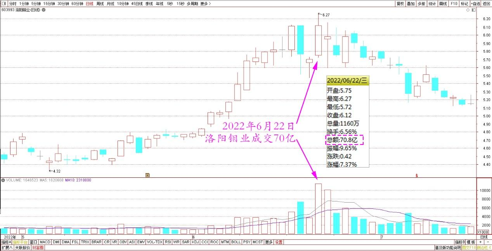
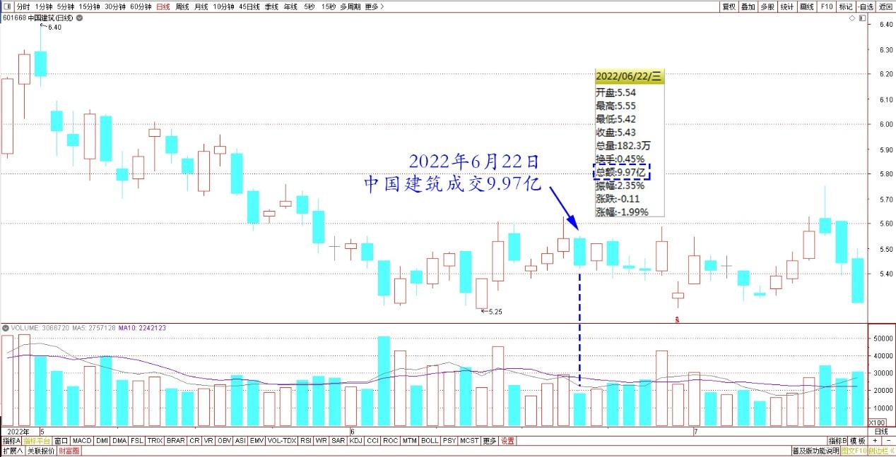
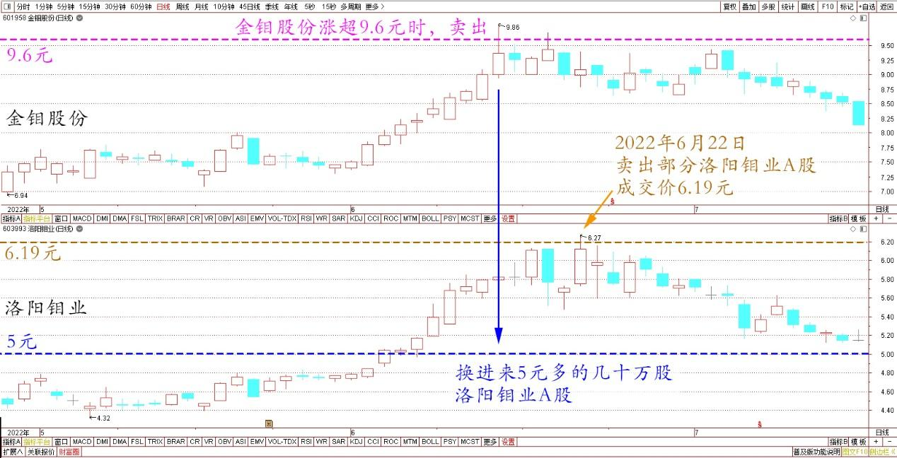
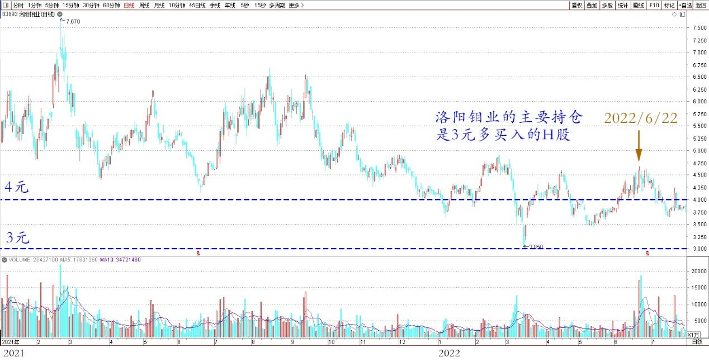
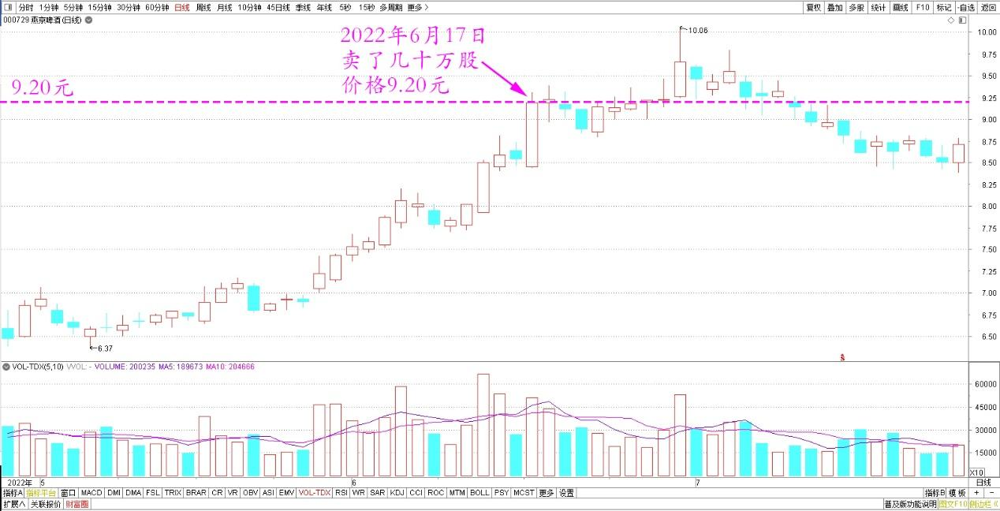
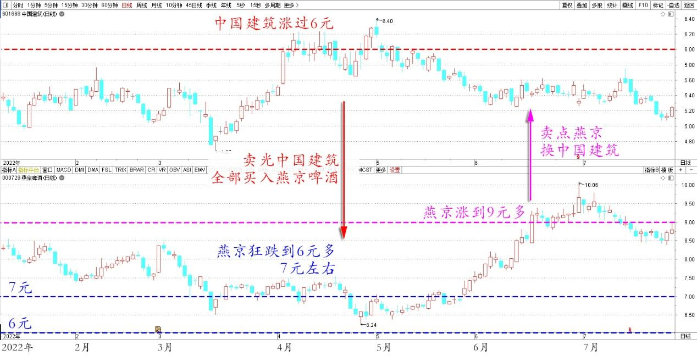
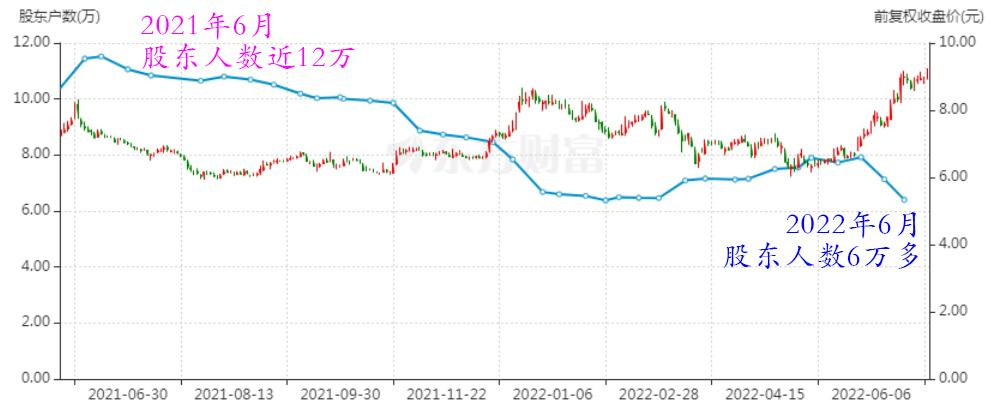
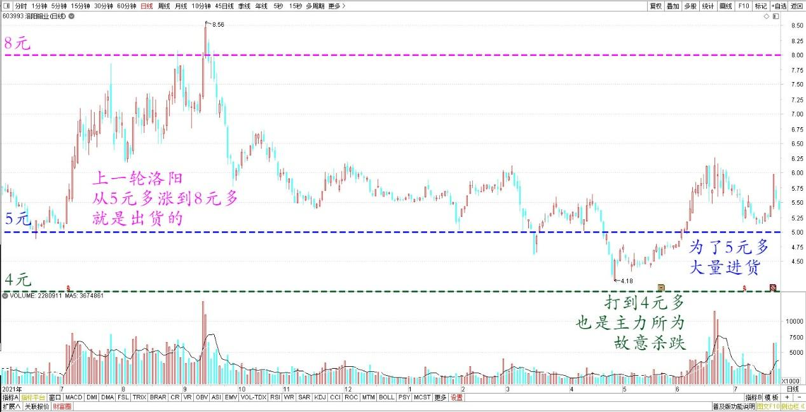
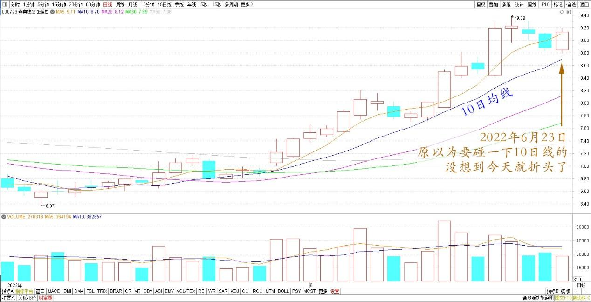

专篇37.卖洛阳钼业，燕京换中建

清一山长2022年6月22日～23日

**一、巨额成交，卖洛阳钼业**

清一山长2022年6月22日

洛阳钼业今天70个亿的成交，惊着我了。相比之下，中国建筑才9个多亿的成交额。不知道何方神圣，太有钱了。前几天砸盘几个亿。

洛阳钼业2022年5月～7月日线图

中国建筑2022年5月～7月日线图

今天就把金钼股份涨超过9.6元的时候，卖出去换进来的5元多的几十万股洛阳钼业A股，部分头寸卖出去了，成交价6.19元。

金钼股份、洛阳钼业2022年5月～7月日线图

因为我的主要持仓，是3元多买入的H股。我总觉得A股长持不合算。就是投机玩玩的。这样乱涨起来，当然卖掉。

洛阳钼业H2021～2022年日线图

要不这两天，再考虑重新买回跌破9元的金钼？算是做T成功。成本不断降低，股份不断增加，这就是我努力的目标。从洛阳钼业，各位看到了资本的力量——利用手上的资金优势，大幅拉涨，大幅杀跌，让散户完全失去方向。因此，身为信息不灵的小散户，各位的做法，绝对不是追涨杀跌，比聪明。**我们只能跟主力比耐心，只在低位的时候买入，然后继续跌，就坚守不动。如果大涨，可以考虑暂时离开。跌了继续买回来。卖飞了就找别的股票去**。**你这样不执着的话，主力根本就杀不了你。我靠这一招“认输”策略，在股市上坚守了30年不败**。相信这个经验对你们有帮助。不过我的成交单说明：吃掉我仓位的单子都是小散户，很多人积极买入，我一单卖出，回报是分了一百多个小单子成交的。

**二、养老账户，燕京换中建**

清一山长2022年6月22日

燕京啤酒方面，上一周我卖了一小部分出去（几十万股），价格9.20元。这个是我的小账户，老人的养老账号，主账号的燕京没有动。

燕京啤酒2022年5月～7月日线图

养老账户，原来主要是中国建筑的持仓。但上次燕京啤酒狂跌到6元多7元左右。中国建筑正好涨过了6元，于是我就卖光了中国建筑，全部用来买入了燕京啤酒。居然买了2M之多。现在看涨到9元多了，就卖了一点出去，换了中国建筑。

中国建筑、燕京啤酒2022年1月～7月日线图

今天看了一下账户，中国建筑新买入的部分没赚钱（因为这两天跌了），但燕京跌了一点，因此也算是切换交易成功。但目前的价位，不想买回燕京，也不想卖燕京。**虽然价格还算满意，但没有放量，卖出去就怕接不回来了。等有一天，燕京大放量，我就会走掉一些的**。目前看，主力没有出货的动静，更像是缩量调整。这几天的走势，主力不想出货，成交并不积极。应该是消化市场的筹码，让投机客下车。**现在进入了燕京的【中级阶段】——主力不要货，也不要钱。**而是要维护上升通道，尽可能不用花钱来走出一条向上的通道，这就需要资金的不断进进出出了。高价筹码，因此未来应该就是拉拉、涨涨、跌跌。一路上吸引新资金进入。拉高新股东的进货成本，为进一步的涨升提供机会。**放量意味着变盘**。如果我判断不错的话，最近大幅降低股东户数之后，今后相当长一段时间，股东户数不会明显下降了。应该就在6万左右徘徊，不太可能降到5万以下。虽然**原来从12万多降到现在6万，股东走了一半。这就是主力拿走货的标记。**剩下的不会走，会“换人”，因为主力也需要同盟军，示范赚钱效应，不然拉不来高位的接盘侠。但要实现这一切，需要大放量，新老股东换位置。

燕京啤酒2021年6月～2022年6月股东人数

**今天洛阳钼业大成交背后，就是新老股东大换位**。未来一定有大动静。未来难说成为牛股，我今天出掉的筹码，可能是被洗了（只有一半）。但主仓位H股，我会坚守不动的，持有好几百万股洛阳钼业H，不会轻易被他洗掉的。这个股，未来长期持有没毛病。而燕京，将来会出现洛阳一样的情况的。洛阳钼业有可能是主力急于要货，才会这样拉升。**这个价格，要说拉升是为了出货，我看是没啥利润空间的**。前段时间打到4元多，也是主力所为。故意杀跌，就为了5元多大量进货的。**就像目前燕京，出货是没有利润的**。一打就跌掉7元多了（主力的成本区），因此，未来只有一条路——上涨。但**上涨放量，就要小心了。超过主力成本区50%幅度的上涨，就提供了主力获利的空间**。上一轮洛阳从5元多涨到8元多就是出货的。因此当时我跑掉了。10元以上，燕京如果是游资，是有可能出货的。但运作好几年的燕京，不会只看重这点利润的。这就是唐建华10元都不走的原因。期间涨涨跌跌，机会会比较多。做T党，现在是最快乐的时候。

洛阳钼业2021～2022年日线图

**三、强势调整，继续观望**

清一山长2022年6月23日

燕京啤酒的走势很稳健，原以为要碰一下10日线的，没想到今天就折头了。典型的强势调整。继续观望。

燕京啤酒2022年5月～6月日线图

(标题、图片为编者所加)

**文章音频：**

[522篇.卖洛阳钼业，燕京换中建](http://link.zhihu.com/?target=https%3A//www.ximalaya.com/youshengshu/77991214/789589695)

**参考链接：**

[专篇30.谁是真强势？谁是真弱势？](https://zhuanlan.zhihu.com/p/676527421)

[专篇31.中建换啤酒和资源股](https://zhuanlan.zhihu.com/p/677138763)

[专篇32.三种涨停的原因](https://zhuanlan.zhihu.com/p/688788024)

[专篇33.多赚了几十万股](https://zhuanlan.zhihu.com/p/693300690)

[专篇34.涨跌无意，笑看云起云落](https://zhuanlan.zhihu.com/p/708781915)

[专篇35.燕京主力已吃饱，唯一办法“屁股功”](https://zhuanlan.zhihu.com/p/6778261298)

[专篇36.燕京逆势大涨，自觉卖出部分](https://zhuanlan.zhihu.com/p/11402979763)

