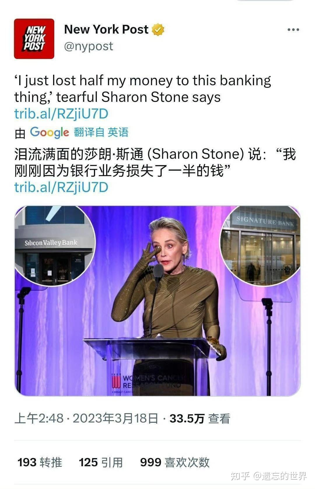
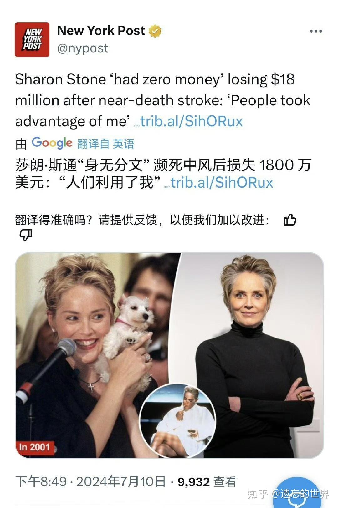
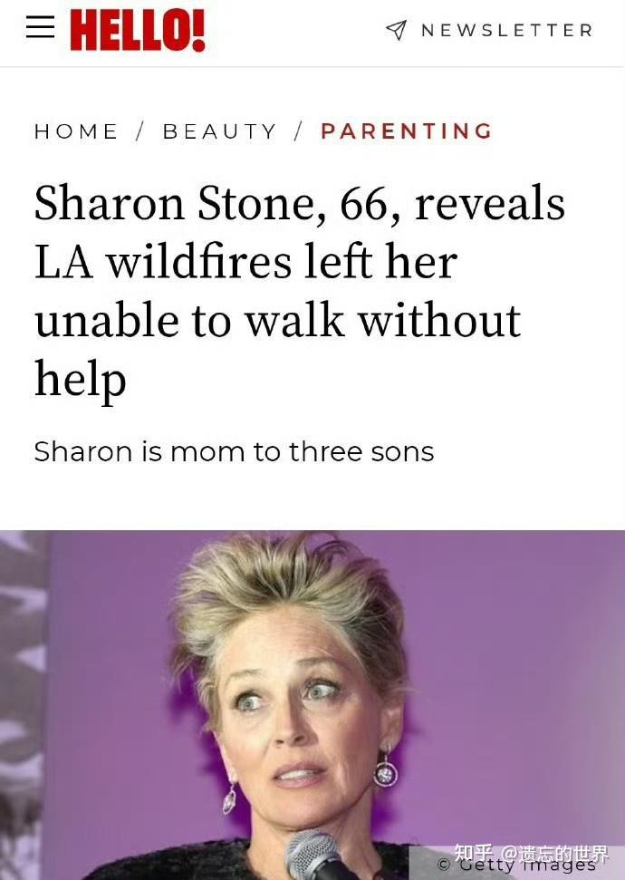

前几天打滴滴，与司机聊了一下： 问他生意如何？

回答是现在一天他要连续跑十几个小时，每天能够做到收入300元就不错了（坐标昆明）。抛掉租车，用车充电的成本，以及每天的饭钱，一天能够落到手不到一百元，一个月大概会有三千元左右的收入！

说他已经跑滴滴半年了。他辞职跑滴滴之前，他是一个建筑工程师，在云南建投工作。

我好奇：为啥辞职？跑滴滴3000元，总不如有人稳定发工资好吧？

叹息：他是没办法活了才辞职的，因为辞职前，公司已经有一年半没有发工资了。连基本的生活费都没有。所以才辞职出来跑滴滴！几年前房地产火红的时候，充满了发财的梦想。今天想的只是苟且活下去。有收入就不错了。他很期待假日的到来。说到了暑假旺季，每天都不停地接单，一天能够有1000元的收入。说起来眼里放光吗，很期待的样子！

我都不敢跟他说：以后恐怕他连跑滴滴的钱都挣不到了。因为现在的自动驾驶正在成形。几年之后，大批滴滴司机又要失业了！不知道这些人将来去做什么！日子肯定越来越难过了！

生活在底层，没有一技之长，被时代抛弃的生活真的很艰难！老百姓没有脑子，只是跟风追潮流的话，只能每天艰难的，被动的接受岁月的摧残。这几天，我回国在国内生活，看到了很多的普通百姓的勤奋和努力以及艰难，他们都在非常积极的努力工作，但算起来---忙活一天也赚不到几文钱！但---为了活下去，大家都是拼了！或者说---他们根本不知道除了每天忙碌，还有什么更有价值的东西可以做！

我们在昆明的市区中心，会去一些饭店，吃做得很好的自助餐，营养味道都很好。有十几个品种，也才13元。比自己做饭还划算，常常看到一些老人来吃饭，就把这些地方当食堂了！显然自己家庭做饭已经没意思了。每家老板做得很认真，很努力，菜品味道都努力做好。因为旁边还有同样竞争经营的四五家餐馆，都在一起做一样的东西！拼完全一样的餐饮营业方式---大食堂模式。每家都是12-13元的自助餐，这种竞争真的太激烈了。基本上大家都只是挣一点生活费！谁都没法做大做强！两个小公主去吃，还发现打包回宾馆吃更划算，一盒饭，一盒菜，一份饭就足够两个人吃了。所以---等于13元两人餐。真心比自己做更划算！

原以为---就是穷人的日子难过，日日难过日日过。但刚刚看到一个消息，才明白----一些大明星，大富豪的生活，看起来光鲜亮丽，其实本质上与升斗小民也差不多，甚至可能会比我们小民更凄惨！

莎朗斯通---国际大明星，身家亿万。现在据说已经完全破产，而且连家都毁了！正在凄凉地等死。

2020年，她的五个直系亲属因为疫情而死亡。他们虽然有钱， 破财但消不了灾！人该死的就会死！但我们一家在泰国，根本不打疫苗， 不戴口罩，不去医院，谁都活得好好的！不知道她的这五个亲人，是死于无知，还是死于过度医疗的谋害！我偷偷地想：也许这五个人，得了新冠，不去医院在家坚持喝稀饭，挺过去就好了。【我在国外也得了新冠，就是坚持不去医院。在家躺了两天就慢慢好了！我是有钱不去医院，但很多泰国人不去医院是没钱。但结果我们都一样----感觉没事，一个大感冒而已，过了就好了。但莎朗斯通的亲人肯定都是有钱人，就只能去医院被治疗死了！不然怎么可能有这么高的死亡率！

但她的厄运并没有过去。2023年，她委托理财的银行，让她损失了一半的资产！显然----作为一个演员，她钱再多，也不懂如何规避金融风险。居然把钱都放在一个地方！居然交给这些银行职员帮她理财，不亏才怪了！

这几天，我带女儿去见几家国内的银行行长，要办一些融资业务。每家银行，都是行长亲自出来接待，热情异常。但我告诉小女：银行家都是天晴的时候上门借伞给你，下雨的时候要求你把伞还回来的。因此你不要轻易答应银行管理人员笑脸给你提供的种种“好事”。别以为她们这么热心，是要“帮你赚钱，帮你省钱”。实际上，你只能依赖自己的判断，绝对不能依赖银行家给你出的主意来“帮你赚钱”。他们只会设法赚到你的钱，至于让你的钱冒的风险。你的本金是否会消失，她们根本不会在乎的！你没钱了，她们的笑脸就会给下一个有钱的人送去，你到时候这些行长们，经理们，你连见都见不到的！

所以---我对银行和证劵的从业人员，各种金融专家，都是不信任的。我基本上不听他们的各种“专业理财推荐和介绍”。我只专注于自己打理自己的财产，去买这些银行家肯定不会去买的古老的资产。比如啤酒，糖和番茄这种土到家的东西。什么高科技，芯片，新能源，固体电池，我只对此表达我的赞叹，但我绝对不会投钱去买这些“高级资产，优质产品”！

朋友说：如果你几年前投了新能源车，投了比亚迪，现在就赚10到20倍，难道能够带来高回报的高科技，不是一个赚钱的最好标的吗？瞧你投的啤酒，也没赚多少呢！

我说：如果我知道比亚迪会赢，我当然就投了。可惜---我五六年前，只知道新能源会赢。只知道当时绝对不能买低价，低市盈率，高派息的各大汽车公司的股（油车集团）。但我根本不知道新能源车谁会赢。所以只好买肯定不会输的啤酒了！现在你知道比亚迪赢了。但其他一堆的新能源车企，现在还有多少剩下来？就算勉强更下来的，有几个活得好的？甚至当年根本就不存在的汽车---如华为的“界”车，小米的SU7，现在比当年最红的蔚小理都好。当年投资新能源车的大把人，现在都哭晕在厕所里。你凭啥认为你的新能源的车钱，都买了比亚迪一直不放手？

当年的中东大富豪，一单就投了蔚来电车260亿，现在还剩下多少？我看过几年，这些公司破产清盘都难说。万一我当年买新能源，买到的不是比亚迪，而是蔚小理。今天我对谁哭去？难道我要像莎朗斯通一样哭着说：当年我听了银行证劵的行长，专家的建议，买了蔚小理。今天让我的资产损失了70%。真这样---我比她还惨呢！

不过，不懂金融，但选择相信金融专家的莎朗斯通，虽然损失惨重，但她剩下的一半钱也比普通人一辈子的钱多得多，她还有总数为1800万美金的余款。一个多亿人民币呢。其实，好好用的话，也足够她此生，甚至她的子孙后代，都活得很滋润的！

但她却因为一场病，失去了这些全部财产！生病了，她当然无条件的“相信医疗专家”，结果---这笔钱全部被医疗利益集团用各种帮助她的名义，给骗走了！现在她已经身无分文！

其实---她想想---她作为演员，观众谁居然相信她电影上的角色的生活是真的，谁才是傻子呢。她干嘛要相信金融人真懂金融，以及医生真懂治病呢？难道医生就不能装帮她治病，其实是用这个身份赚钱呢？就像她用演电影冒充心理学家（本能），本质上只是为了赚钱是一回事！

这年，莎朗斯通才65岁，她已经坐上了轮椅，失去了行动能力！当年看电影【赌城风云】，【本能】，里面的女主角多有魅力呀？现在的她----却已经失能。她花了1800万美金巨资，把自己交给医疗利益集团。其实这根本治不好她的病。给多少钱都没用。我说过---西方医疗系统，对于慢性病，他们最擅长的专长并不是治疗，而是“假装治疗”！但你必须为他们提供的“医疗演出节目”，支付昂贵的“演出费”。同时还要牺牲自己的身体，来配合他们的这种演出工作。你不治疗，无非是等死。你去治疗，就是找死，你只会死得更快。

所以，我跟儿女说：我生重病的话，千万别把我送去医院去ICU抢救。我宁肯在家等死！我已经有20年不去医院了。现在活得好好的。等过几年，到65岁，我最操心的事情，是还能不能打赢这批年轻的清一武士木兰们，这些全国格斗冠军。而不是担心地坐在椅子里面，无助的看着周围的世界等死！

但莎朗斯通的厄运，似乎并未结束，她的豪宅，最近据说被大火烧掉了。她现在已经“无家可归”！她曾经是富豪，但现在失去了金钱，一文不名。她曾经美貌和健康，但现在已经失去了身体和健康。甚至，更惨的是---她现在连一个穷人都不如，她还失去了最后的家！从亿万富豪，以及居住的豪宅，一步就沦落为“无家可归”者！

*失神和无助的女神？*

我只比她小四岁半。感谢祖宗保佑，我的生活质量比莎朗斯通高得多！依靠老祖宗的养生智慧，我不太可能像她一样才60多岁就“失能”。西方的生活方式，根本就不健康。

但我也总有垂老的一天。也许有一天，我的住宅也会被火烧毁。我的财产也会被毁灭。甚至我的女儿也一样面临莎朗斯通的命运----只要我们把人生和保证都交给利益集团去打理，难说莎朗斯通晚年的一生，就不是我和我的小公主的一生。别以为我们就不一样！

因此，我希望能够建设一个真正的“家园”。让我飞累了能够安心回家的地方。我们的小公主，将来可以在全世界到处飞，去创造奇迹。但我希望这些小公主，如果像莎朗斯通一样幸运，能够赚到大钱的话，可以把钱用来建设世界范围的“公主家园”，而不是送给骗子，更不是送给金融利益集团或者医疗利益集团去打理。我们更不要把钱送给各种奢侈品集团，各种消费品利益集团（我相信莎朗斯通的消费数字，一定也很惊人）。但可以我们年轻时候创造和所得，用来建设分布在世界各地的“公主家园”。就像现在我正在建设的清迈“冠军木兰庄园”一样。我相信公主们年老之后，就可以回家，轻松拥有一个有尊严的，体面的老年生活。而不是像莎朗斯通一样，被社会操纵，才60多岁就被囚禁在椅子上。说不定---公主们60岁的时候，想要安排的生日庆典，是邀请当年20岁的年轻的世界冠军，来和她们“老公主木兰”比武。然后以“不老太婆”的身份，把这些年轻的世界冠军击倒KO，用来作为自己独特的“60岁生日礼物”呢！这难道不是很酷的生日庆典吗？难道不是比堆积N多的奢侈品的生日庆典更加奢侈的庆典吗？

最可悲的是：莎朗斯通一生也有很多的创造，也吸引了很多的眼球和关注。她拍的电影也影响全世界，但与茱莉亚罗伯茨不一样。后者还拍了一些有深刻意义的电影。而莎朗斯通留下来的电影，主要以艳星为核心，与欲望为本体，如【本能】等。她老年失能衰弱的样子，只能让人对照起来更加的嫌弃！感到了色欲的欺骗。而另外一些演员，他们努力给我们留下了非常光彩和积极形象的电影。比如李连杰的【英雄】等中华英雄的电影，就会给我们留下不一样的感叹。虽然李连杰与我同年，但他看起来60多岁的衰老之相，只会让人更加惋惜和怀念他当年的英雄风采，更愿意去亲近和照顾他。

**所以----年轻的时候，你创造了什么？你给世界留下了什么？这才是最重要的！而不是你得到了什么！**

我希望留下来的遗产，是让中华武术焕然一新，打造出名震世界的创举。我希望我培养出来的小公主，能够创造用中华太极，击败西方格斗男子世界冠军的当代木兰奇迹！让中国人扬眉吐气，让全世界都敬仰中华武术！追随和学习中华武术，中华文化。

我还希望留下一些世界范围内分布的【公主家园】，让我们这些完成了世界级创造的小公主们，可以在她们完成了人生的使命之后，光荣和体面地回到自己的公主家园，在我们自己缔造的温馨家园里面，度过有尊严的老年，以及有尊严的离开这个世界！

为了实现这些目的，我现在会把我能赚到的所有金钱，都交给我们的“公主木兰事业”来使用。而不是拿给各种利益集团去自欺欺人，也不会留给子孙后代去享用。我不需要豪车，不需要豪宅，不需要各种金珠宝物。我只需要公主们可以在不受外界干扰情况下，专心去创造一些世界奇迹的公主家园！我希望后代的公主们，都不需要考虑去赚钱，去谋生。只需要专注于自己的人生目标！如果我从股市获取的（抢来的）金钱，可以帮她们体面的生活！不需要牺牲自己的人生去获取工资。这种生活模式，不比上面的两个故事（一贫一富）都更精彩吗？

**题图介绍：木兰陆鸽首次与泰国男职业拳手对战，第二局KO泰国男拳手。创造了当代的中华武术奇迹！2024年的中泰擂台大战，泰方派出的七人职业拳手，只有一个人拥有了胜利战绩（泰国全国双冠军击败了17岁的小公主）。其他6人统统战败！**