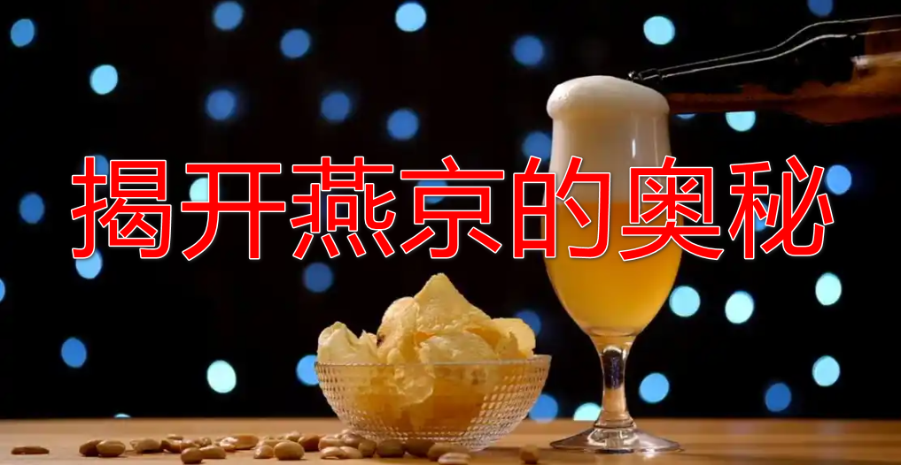
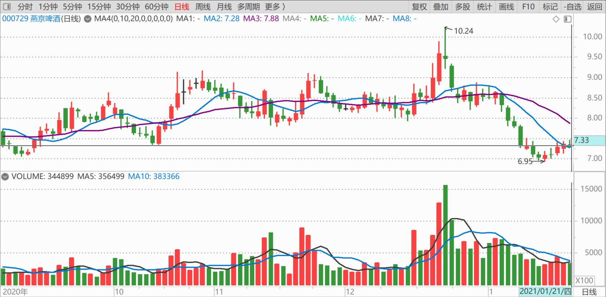
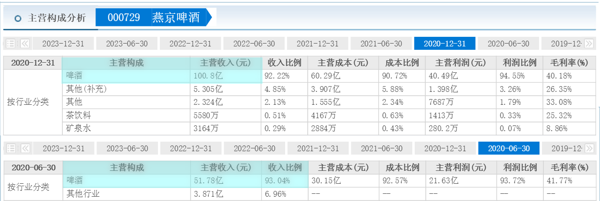

93篇.揭开燕京的奥秘

[清一山长](http://link.zhihu.com/?target=https%3A//xueqiu.com/9310099567)2021年1月21日

[$燕京啤酒(SZ000729)$](http://link.zhihu.com/?target=http%3A//xueqiu.com/S/SZ000729) 揭开燕京的奥秘，我们能！团结就是力量！

看到燕京主力这样来做盘，真的做得太恶心了，用力太过头了。现在燕京官方，已经高度地配合主力需要，每周都主动出来公布持股人数了，证明现在是大量散户增加，真情真意地告诉你：快看真实的持股数据，我们用数据来证明，主力真的走了。你们就别指望了，燕京要完了、燕京要跌破五元的。趁现在赔得不多，快走吧！燕京的消息面配合得真好，真关心我们这些小散。感恩不尽！

燕京利空现在是很明显的：

1、董事长、总经理被捕，新任总经理迟迟未到任。

2、重阳突然宣布退出。疑问重重！

3、股价不断破位下跌，散户数量急剧增加！

未来还有什么坏消息？燕京真的会垮吗？

如果你心理也不踏实，我们就来一次散户VS主力的调查吧：看燕京到底是该走，还是该留！请全国的燕京股友们，大家合作一次，做一次绝无仅有的全国燕京啤酒销量调查，我们只定性，不定量！我们只关心一年来，燕京的销量是增加了，还是下掉了；价格是涨了，还是跌了；有人买，还是没人买！

请你去熟悉的、有燕京啤酒卖的超市：表示想买点啤酒喝，问店家的小二，什么啤酒好销？燕京现在好卖不好卖？跟一年前相比，燕京卖得更多，还是更少？调查完了，买几瓶啤酒回家，我来出酒钱。调查结果点赞前十名的，我都发悬赏。

如果全国的市场调查结果，都是燕京销量跟去年比下降严重。没啥好说的，伙计们，跑吧！就算现在亏了，也得跑路！

如果不是？怎么办？——你们看着办。

现在是网络时代，主力想要控制信息，误导股民，是做不到的。主力想用半真半假的信息来蒙我们，骗我们交出筹码，我们就用真调查来看：到底是谁在说假话！

[珠海农民](http://link.zhihu.com/?target=http%3A//xueqiu.com/n/%25E7%258F%25A0%25E6%25B5%25B7%25E5%2586%259C%25E6%25B0%2591)回复[清一山长](http://link.zhihu.com/?target=http%3A//xueqiu.com/n/%25E6%25B8%2585%25E4%25B8%2580%25E5%25B1%25B1%25E9%2595%25BF)：

山长大哥，这么多回复你也没法判断销售怎么样啊！说好的可能原来就是燕京的市场，说不好的可能一直都不是燕京的市场。之前[51nxp](http://link.zhihu.com/?target=http%3A//xueqiu.com/n/51nxp)调研白酒是直接和大经销商沟通，大姐这个方法应该是比较稳妥的。

[清一山长](http://link.zhihu.com/?target=https%3A//xueqiu.com/9310099567)2021-[01-22 15:40](http://link.zhihu.com/?target=https%3A//xueqiu.com/9310099567/169590907)回复[珠海农民](http://link.zhihu.com/?target=http%3A//xueqiu.com/n/%25E7%258F%25A0%25E6%25B5%25B7%25E5%2586%259C%25E6%25B0%2591)：

我根本不关心不卖燕京的地方到底卖什么。我关心的仅仅是：

一、原来不卖燕京的，是不是现在开始卖了？（如果有，就是燕京开拓了新市场，好消息）

二、原来卖燕京的，是不是现在不卖了？（如果有，就要小心，燕京在萎缩）

三、原来和现在，一直在卖燕京的地方，一年来的销量是增了，还是减少了？

四、至于卖其他啤酒，从来没卖过燕京的地方，根本就没汇报价值，属于无效信息！没必要发帖说明的。我家里一瓶燕京啤酒都没有，我从来没喝过U8，难道说燕京就不能买了吗？

**我这种调查，叫做：定性。**

定量的难度，要大得多。找大经销商，也未必准确。

投资的好处就是：我们不需要这种精细的数据，我们只需要大致上的方向。燕京的价格，还是几年前重阳入股的价格，7元多。如果市场变化了**，销量提高了，就是燕京比几年前低估了；如果销量减少了，现在的价格，就是高估了。**

就这么简单！各位别把投资整得太复杂。我看一些人，写投资报告，就像写公司企业情况汇报，也希望啥都装进去。除了让自己脑子忙起来以外，这种所谓的详细企业报告一钱不值！特别是对消费品来说——销量就说明一切！市场占有率，就是价值。跟PB、PE的关系反而不大。

(标题、图片为编者所加)

**文章音频**：

[526篇.揭开燕京的奥秘](http://link.zhihu.com/?target=https%3A//www.ximalaya.com/sound/796659782)

**参考链接：**

[86篇.吓人的目的是让你卖掉快逃](https://zhuanlan.zhihu.com/p/8712468814)

[87篇.早盘急拉代表什么？](https://zhuanlan.zhihu.com/p/10710257712)

[88篇.燕京还要趴多久？](https://zhuanlan.zhihu.com/p/11401524818)

[89篇.燕京我只关心两件事](https://zhuanlan.zhihu.com/p/13349235291)

[90篇.谁会是市场斩杀的对象](https://zhuanlan.zhihu.com/p/14718449608)

[91篇.如何看进出时机？](https://zhuanlan.zhihu.com/p/16488305045)

[92篇.珠江投资的反省总结](https://zhuanlan.zhihu.com/p/17164493123)