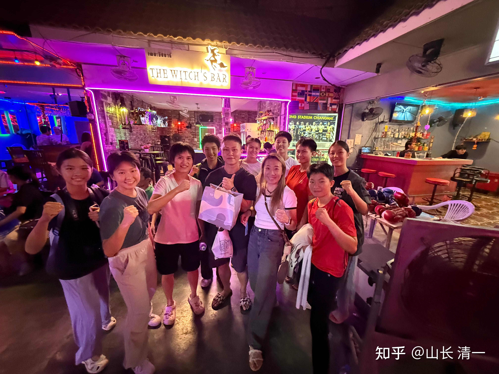

少年冠军班计划已经正式启动了！请关注公众号！

[冠军姐姐教你当冠军](http://link.zhihu.com/?target=http%3A//%25E2%2580%258Bmp.weixin.qq.com/s%3Ft%3Dpages/video_detail_new%26scene%3D23%26vid%3Dwxv_3914411352004968448%26__biz%3DMzkzMDg5OTY2Nw%3D%3D%26mid%3D2247483663%26idx%3D1%26sn%3Dbd79aa5909ed4cbd1a3a84f840d9e39c%26vidsn%3D%26sharer_shareinfo_first%3Dcdae542077efefca4ea8c399532cce57%26sharer_shareinfo%3D43e6eb7e28fd7c3ab4c6a628a9eb5ebb%23wechat_redirect)

由清一太极木兰组建的公众号已经开启：目前是给真正想要当一代宗师的传武迷少年们一个成就梦想的机会---不知道现在还有没有这种小孩！【少年冠军班】由清一教育基金会资助运行的项目。培养周期长达17年。凡是年满10-11岁，有志于传武。想成为类似电影中【叶问】这样文武兼备的一代宗师的有志少年，就可以申请参与学习中华武术，成为未来中华传武的重要代表人物，国际级的格斗大师。

这是新教育在【今日三语学校】开启【国际接轨教育路线】后，唯一对外开放的，以专门培养中华国学人才的一个新教育机构。虽然也学外语，但不以留学海外名校为目标，而是以从小就严格训练，以优越成绩超越冠军班，考上【清一大学】研修为目标。而不以考大学，求职谋生为目标，而以捍卫中华文化传统，为往圣继绝学，成为 中华武术各门各派的一代宗师为目标。凡是有这种理想和志向的少年英雄们，无论男女，就可以成为我们的少年冠军班人选！

如果你今年年满10岁，不超过12岁，你就可以申请加入少年冠军班！入选后，你就可以享受从11岁到28岁。清一系列国际学校从小学到高中的课程，最高是清一大学武道专业本硕博连读，一共17年文武合一的培养。此期间完全由清一教育基金会负责提供经济资助，家长不需要支付国际学校的学费，甚至不需要支付生活费，只要你胸怀大志，这些费用我们全包了！

加入的方式很简单：你注册一个个人的微信号，同时关注我们的冠军姐姐公众号。然后跟随我们的冠军姐姐的示范视频练习基本功，每天坚持下来就行。要求每个星期都要录一次视频，每周都要更新一次，放在你的个人主页上。每个月，冠军姐姐们会发布一个新的练习视频，要求申请者跟帖汇报学习情况、冠军姐姐们会随机抽查你们的学习情况。凡是没有跟上每周进度的人，以及每周训练没有提高和进步的人。我们认为你就并不想真的成为冠军，你只是一时兴起来蹭热点的。你能够坚持练习一年后，符合集训的要求，经过考核过关之后，我们就会邀请你来清迈，正式参与我们的冠军公主的亲自面授训练了！

所以---请用你的真实行动来证明你的心意，而不是用你的嘴巴和口头的保证！

首个基本功：

[太极基本功第一关：里合外摆腿](http://link.zhihu.com/?target=https%3A//mp.weixin.qq.com/s%3Ft%3Dpages/video_detail_new%26scene%3D23%26vid%3Dwxv_3918411144838479884%26__biz%3DMzkzMDg5OTY2Nw%3D%3D%26mid%3D2247483698%26idx%3D1%26sn%3Daef0ea956f812f4d26f1839fd3f97e0f%26vidsn%3D%26sharer_shareinfo_first%3Db598d4c31aa6bad0d2a4e078ec98041a%26sharer_shareinfo%3Db598d4c31aa6bad0d2a4e078ec98041a%23wechat_redirect)

今天晚上刚刚收到的特别消息：今晚明晓在清迈拳场，对战2024东亚泰拳锦标赛的60公斤级冠军，实力很强大，她在决赛中用重拳KO了蒙古拳手获得东亚冠军。明晓这一次，是跨越了五个级别的打的比赛。对手的真实体重应该是65公斤左右。因为这些拳手正式参加锦标赛，全都要减重的。清迈这里就不太严格，所以一般就不减重参赛，选手往往随便报体重。而明晓的真实体重就是45公斤。因此本次比赛的真实体重差距，其实不是15公斤，而是接近20公斤。场面上看起来。对手很雄壮，手臂和大腿都比明晓粗一倍的样子。但场面上丝毫不占优势，明晓和体重比自己大得多的对手作战，正常是不太可能的（最轻量级打重量级）。而且还是在是在内围上依然能够取得优势，也防住了对方的重拳。最终第四局在内围战中KO了对手。的确表现很棒！[表情]。香港队作为东亚强队，过去多年是傲视东亚国家群雄的。现在遇到木兰就不行了，我相信今后可能香港拳手也会像被KO太多之后的泰国拳手一样，会有恐惧症的。

*赛后两队友好交流，可见明晓对手的确很壮实且高大。*

赛后木兰的交流汇报

【明晓的对手完全不知道自己是第一场，甚至在上场前的最后一刻才一脸震惊地知道自己的对手是明晓，赛前她们还不知道要打的是明晓，看到我们还挺惊讶的，并且跟同伴说要拍照发给黄凯怡（就是明晓东亚决赛打掉的那个香港人）看，遇到了把她打住院的人。我就问她当时住院了？她说是啊，当时比赛被膝击到了可能有点受伤。】

----上场前的最后一刻才一脸震惊地知道自己的对手是明晓----这个震惊，应该是对重量级的震惊。因为怎么都想不到打60公斤级别的她，会遇到一个最轻的，锦标赛才45公斤的”老对手“。倒未必是认为比赛有压力。只是她从来没有遇到这种安排罢了。我们也不知道泰方为何不安排泰国拳手与她们对抗，原定该香港拳手是要打一个白人的，白人不打，就问我们是否愿意上。我们当然愿意了----任何强手我们对愿意学习交流。无所谓胜负。明晓赛前也没有想过一定要赢，只是想去挑战一下自己。能否面对比自己重量级打这么多的对手。

【原来黄凯怡住院了】-----我们当初才猜想，以为她是生气而不参加颁奖典礼和晚宴的，因为自己是冠亚军争夺赛中第一个输掉比赛的女拳手而生气。她可能认为自己不可能输给中国队，自己夺冠是正常的。没想到遇到的事技术改进后的木兰武士。但在场上，我们都没看出来她受伤了，香港职业拳手真的很强悍，不服气也正常。如果她知道现在连60公斤的东亚冠军赛的大伙伴，都被小明晓KO了，她也会释然----自己当然就更打不赢了！[表情]。虽然这次明晓KO对手我们也很意外，泰国的重量大的拳手我们KO了不少，她们不少人已经不愿意和我们打了，有可能以后香港拳手传开这个消息后，将来比赛场上再遇到木兰们，肯定都会心理压力过大，应该会像泰国拳手一样尽量躲着打了！不知道香港拳手能否发展出应对的方法来！