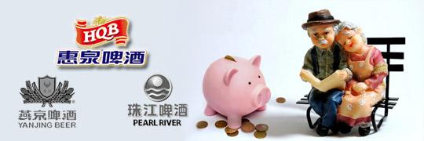
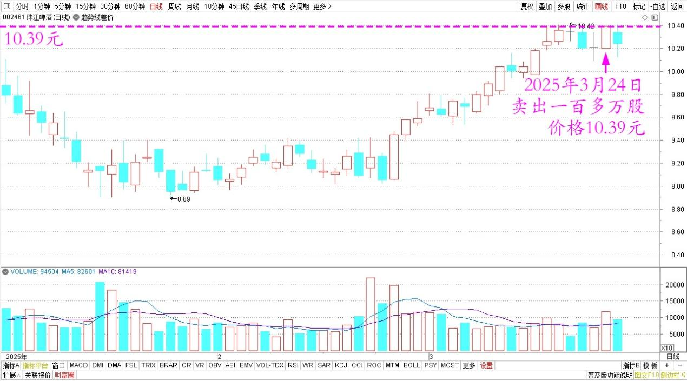
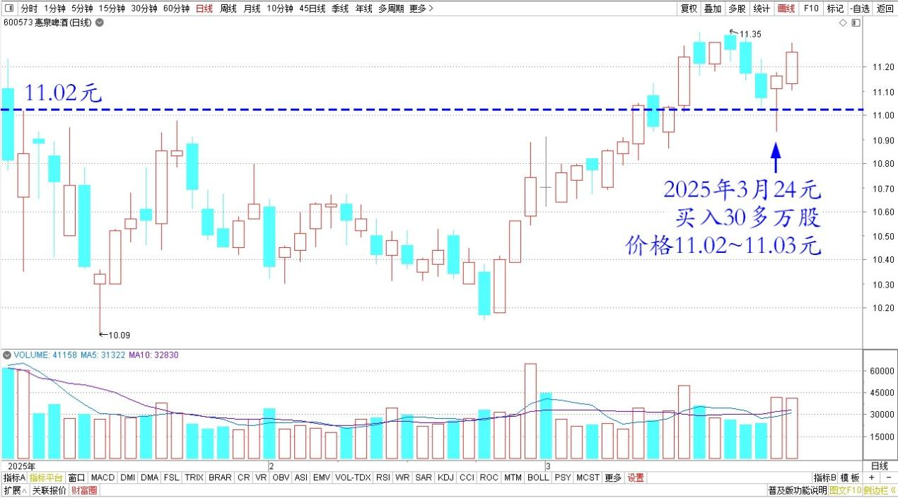
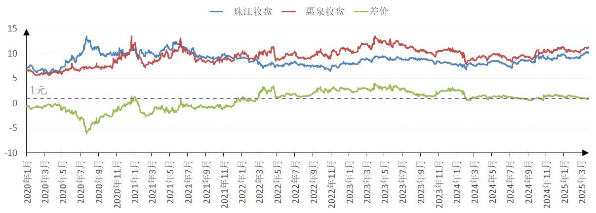
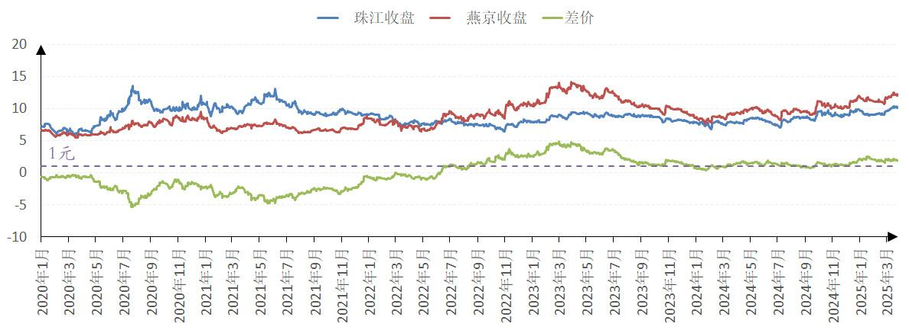

139篇.养老账户啤酒股只有惠泉了

清一山长[2024年3月24日15:26](https://www.zhihu.com/pin/1887525630582686852)

今日操作：卖出珠江啤酒一百多万股，刚开始卖的价格10.33元，大多数仓位的卖出成交价是10.39元！不知道谁一直在10.39元收货，我一挂出来很快就被买走了，我就再挂，每单10万，连续挂了八单。

珠江啤酒2025年日线图

最终把我养老账上的珠江都全部卖空了，与燕京一样，养老账上就只剩了100股纪念仓位了！原来账上的珠江头寸，本来就是用燕京和惠泉换的。现在珠江涨了，当然就重新换回去了！

今日的换入情况：新买入了30多万股惠泉补上珠江的啤酒空仓，分小笔买入的，买入的价格11.02～11.03元。好像惠泉也一直有人在11.02元抛货一样，我就一万一万的一直买！

惠泉啤酒2025年日线图

**我认为这个价差蛮划算的，两股的差价只有7毛钱不到。因为完全符合只要珠江和燕京的差价小于1元就无脑换的概念。**所以不计较就换了。后来惠泉就突然拉起来了，我也就停手了。**但其他卖股的资金也没浪费，我就换入了某底部盘桓的高息股，计划长期持有10年吃股息！**

珠江、惠泉啤酒2020～2025年收盘价

珠江、燕京啤酒2020～2025年收盘价

**目前养老账户上啤酒股就只有惠泉了（其他账上依然持有燕京、珠江），换算起来，这个账户我是以零成本（其实是负成本）持有惠泉，还是十大股东。**这种感觉挺不错的，心理最没有压力。等于现在账上啤酒股的持仓，完全没有使用自有资金，全都是啤酒上赚来的利润，还多出来一些用于买其他股票，分散持仓了！

（标题、图片为编者所加）

**文章音频**：

[547篇.养老账户啤酒股只有惠泉了](http://link.zhihu.com/?target=https%3A//www.ximalaya.com/sound/828809106)

**参考链接：**

[132篇.盈亏数百万都是假的，啤酒切换才是真的](https://zhuanlan.zhihu.com/p/26380209616)

[133篇.燕京跌了又涨，我没买也没卖](https://zhuanlan.zhihu.com/p/27431147176)

[134篇.重仓华菱钢铁的原因](https://zhuanlan.zhihu.com/p/28286645670)

[135篇.主升浪快来了，但我不贪心](https://zhuanlan.zhihu.com/p/30186294319)

[136篇.港股投资重点考虑国企红筹股](https://zhuanlan.zhihu.com/p/30187716852)

[137篇.中国建筑价格进入“关注”区间](https://zhuanlan.zhihu.com/p/32238604025)

[138篇.目前燕京、珠江、惠泉啤酒持仓处于历史高位](https://zhuanlan.zhihu.com/p/32731653546)

