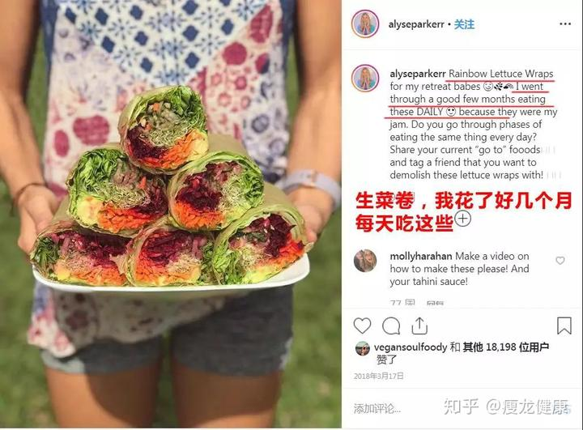

最近两场比赛，可以看到木兰们的技术和体能提升都很强。纯素食的拳手，打满五局还一直充沛体能，很难得。佳慧这一场尤其彰显体能的充沛程度。泰拳手现在都选择避战我方拳手，或者用级别更高，体重更大的拳手来打。这个拳手就是这样的，特别老练和冷静。而且专门采取了对付我们的方式---退让式打法。打过拳的人就知道，场上的泰国对手肯定经验非常丰富，在身高体重都明显高于木兰（标称是55公斤，肯定不止的），场上却不主动进攻，而是采取最不费体能的防守反击方式，这样其实不费力。泰国打五局的拳手，往往第一二局双方都消极一些，因为第一二局只要不被Ko，裁判根本不管的，这两局的胜负根本就不影响最终的结果！因此往往第三局双方才开始积极进攻！因为如果一开始就采取攻势的一方，往往会在第三局开始的时候就体能衰退。被对手利用而造成失败。所以更聪明的拳手会利用这种差距来但这场比赛，所以泰国职业拳赛，像木兰们一样第一局就积极进攻的人不多，佳慧直到第五局，都保持了攻击的力度和速度，证明体能优势的确远远超过相信西方运动饮食理论的拳手！

[https://www.zhihu.com/zvideo/1890082991650361463](https://www.zhihu.com/zvideo/1890082991650361463)

第二场比赛。是一场体重级差异巨大的比赛：真实体重45公斤级别的明晓，与比赛体重60公斤级的香港三冠王拳手对战！而且对手是从小练武，是擅长散打和摔法的东亚锦标赛冠军拳手。由于拳手参加锦标赛基本上都要降重，基本上这个香港拳手真实超过60公斤是肯定的！但明晓跨越五个体重级别来打的这场比赛，对方并没有占啥优势！体能上也完全不输给这种大体重对手。

[https://www.zhihu.com/zvideo/1890128489392357774](https://www.zhihu.com/zvideo/1890128489392357774)

[https://www.zhihu.com/zvideo/1887188519992140023](https://www.zhihu.com/zvideo/1887188519992140023)

后面这个对手帕卡体重与明晓的差不多，17岁拿过世界青年赛冠军。但跟明晓比就完全还不上手，只能挨打了！。除了木兰们格斗和技战术的原因， 我方拳手这种体能上充沛的表现，已经改写了格斗的历史-----素食拳手击败肉食拳手！泰拳手们甚至传说：我们的拳手就不会累，可能吃了啥神药！也许只是我们的身体更干净罢了！

下面这个农村兵天生不吃肉食的体能表现，我相信从另外一个角度，展现了纯素食者可能拥有的体能优势。也许是天赋？也许这天赋就是素食带来的结果呢？

转发网络文章 作者：大周

有个同年兵，跟许三多差不多，一看就是怂人，沉默寡言，无精打彩。5公里跑不动，400米跑不动，单双杠也玩不了，反正就是各种不行。
要不怎么说还是得老兵呢，带他的新兵班长一看就知道这货是装的，当时也没发作，就跟他谈心，一了解才知道，他们家是菜农，他来当兵没什么保家卫国的理想，就是来部队学习种菜，怎么搞温室大棚（他们家在西南，平时见不到这些东西）
新兵班长一听就知道这事好办，当即拍胸脯跟他说，这简单，我们连队的菜地你也看到了，温室也看到了，冬天就修大棚，但是你也知道，我们连队种菜的都是平时不需要训练，关键时刻还不能掉链子的人，你好好训练，只要你训练成绩提高了，我就跟连长说，让你去种菜。
那个新兵一听种菜有希望，瞬间就跟打了鸡血似的，当然不能跟老兵比，但是在新兵里，5公里，400米没人能跑过他，打靶也是优秀，跟许三多一样，单杠2练习卷腹上也是随随便便搞4,50个，如果有人逼他，上百个不是问题。关键是啥，当时已经开春了，不热，但是不冷，他是穿着棉袄和大头皮鞋跑5公里啊，一趟下来大气都不喘，感觉他他妈的就是在玩儿，根本没尽全力。更神奇的是他不吃肉，什么肉都不吃，训练需要热量他是从鸡蛋和巧克力里头摄取
最后还是如愿去了后勤种菜，菜地被他收拾得整整齐齐，黄瓜，西红柿，茄子，青椒什么的根本吃不完，也是全团唯一一个菜吃不完，拉出去卖的连队。
这家伙也是没遇到袁朗那种伯乐，如果把他思想扭转过来，体内的狠劲逼出来，留在部队应该是个人才。

不过，特别强调：上面这个素食者身体会很瘦弱。我们其实是“非肉谷食”。上面这种是“食草动物”----但你必须吃巨量的草才够，最好要有四个胃（牛羊）。既然我们只有一个胃，吃草是不行的。只有精华种子才是我们的目标。因此我们是【谷食动物】。如果你们以为素食就是去吃草，就像你以为吃肉就是要吃激素肉一样，我看都是愚蠢的人！你们两种人，全都是被利益集团洗脑的大笨蛋，只是一个是【生态食品利益链】。另外一个是【肉食品集团利益链】。