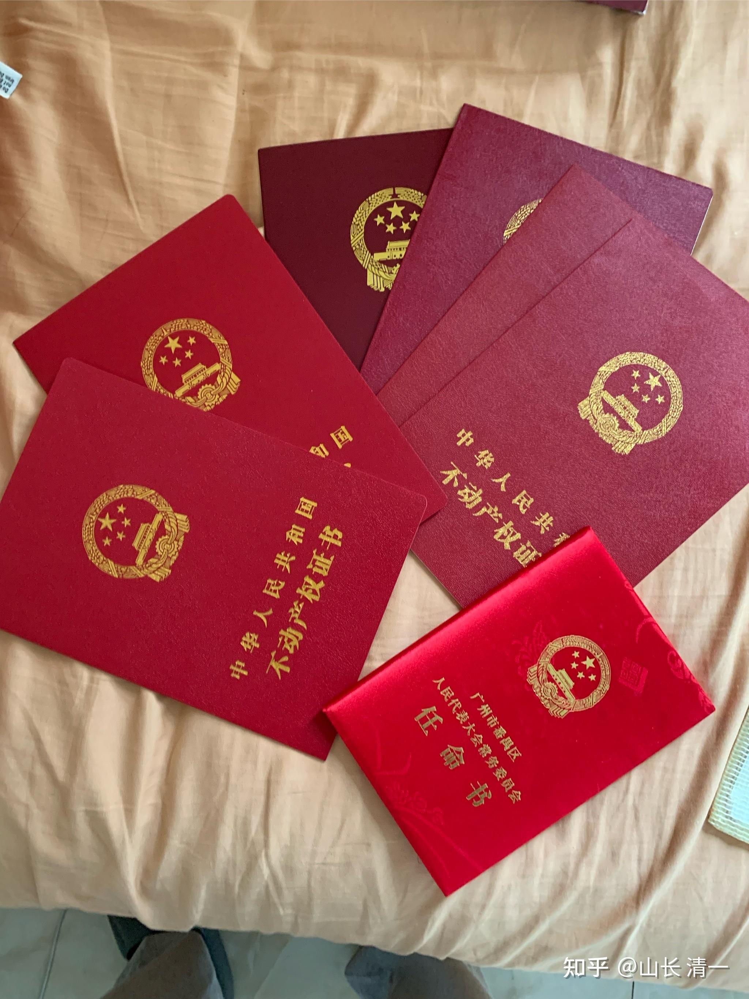

人这一生，该怎样度过？

基本上，大概就是下面这张照片的样子吧？下面就是过去40年的成功者!

算起来，过去40年，我们身边的成功者，到了退休的时候，就是给孩子留下了几张房产证！

我遇到一个深圳的家长，说他们家，给自己的孩子留下了三套深圳的房子。每套原来高一点的价值是1400万元！说他不卖房子，家里正好有三个孩子，一个人一套！

对于很多深圳的年轻打工人来说，奋斗一辈子的梦想，就是挣到一套深圳的房子！

海底捞的员工，每个月6000元的工资，全部积攒起来买房，要100多年才能买下一套这样的房子。用一生来换一套房子！

而这家长的孩子，十几岁就拥有了别人的“一生”，那么---她会用家长帮她赚到的这一生来做什么呢？

大多数家长不会想这个问题，只会这样安排：送她去苦苦的上学，读书，考大学，然后大学毕业，找份工作。继续去赚更多的房子！大家都继续苦呵呵的“奋斗”。

我给家长说：不如你们把这房子卖了。然后投资买靠谱的股票，银行或者中国建筑，中远海运这样的高息股，拿着死不放。1400万元的话，每年会分红70---100万元！

然后去昆明这样的地方，租下一个小房子，租金一年大约一两万元就够了。生活费，如果按照我们的标准，一年一两万元也够用了！根本用不完，甚至还可以拿来做点好事！积德行善，都够用了。放在深圳自己住？还要额外交物业费，管理费等等，等于还要自己干活来养房产。实在划不来！

有钱在手，不用操心生活和职业的压力，然后后顾无忧地去发展自己的爱好和追求。

如果有理想，有志气，想当文化大师，武术大师，或者某个光宗耀祖的事情，比如去做饺子，蔡志忠这样的人，用心去研究一个自己喜欢的技能，说不定14年后，自己弄出了一部世界级别的杰作出来！

没理想，没志气的话，也可以当“寓公”，靠这些分红过一辈子。优哉游哉的。哪里需要去打工呢？

再去打工，挣房子？挣来了将来当房奴吗？中国未来只有一半人口的时候，你的房子只会是一个负担！

可惜---清福难享！老天给以过去的幸运机会，可以让这些家庭升级换代的机会，就这样白白浪费掉，因为国人只知道苦巴巴的过日子！穷人富人，都拥挤在一条道路上继续----读书，考学，毕业，找工作！要不就躺平！吃喝玩乐败家子！

反正---就没几个正常人！懂得步步高升的！