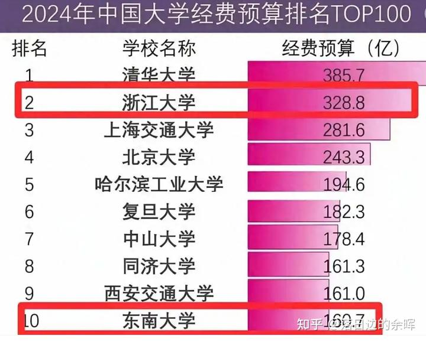

我看网上，到处有人在嘲笑曹德旺想要花100亿办世界顶尖大学的“梦想”。说他这点小钱，根本就是啥都不成！不可能办成啥像样的大学！

的确：与国家队相比，这点钱真的太少了！一百亿看起来很多，但中国的其他“非世界顶尖大学”，都是每年数百亿投入的！关键词是“每年”！不是投入的总额！

我看了这个表格，也惊讶了：

办大学居然要这么多钱？生均成本每年甚至要50万？真吓人！前十名大学每年就花掉近3000亿了。中国仅仅985/211就有一百多所大学，中国前20名大学每所年预算都在100亿元以上，仅仅这20所大学每年花费就超过了三千多亿！ 而中国一共有3349所大学，要花费多少钱呀？每年数万亿的投资，到底培养出来了多少杰出人才？

很多大学我看就是摆设！严重浪费国家的投资！毕业出来的学生连中学生都竞争不赢！花钱丢水里了！

怪不得某美国投资大师罗杰斯说：他发现现代大学是一个严重虚高的标的，泡沫很高。可惜他不知道怎样做空！

还有美国人说：美国50%的大学几年后就要倒闭！我看基本上是真的！特朗普应该看到了美国大学的严重浪费投资，不在愿意给经费。我看倒闭潮快来了！

我也不知道怎么做空大学，但我知道怎么做多！

**所谓的世界级顶尖大学，就是能够吸引世界最顶尖的人才来学习的大学！不是花费最多钱的大学。比如你只接受top1%的全世界的优秀学生申请入学，你才是世界顶尖大学。**如果用这个标准来看的话，中国目前还没有世界级顶尖大学。因为中国的大学，只能吸引中国的顶尖学生来上大学的。世界1%的顶尖优秀学生，根本就不来中国上大学！即使中国给学生直接发钱都吸引不来优等生！

如果能够用每年经费不到一千万，就办出一个清一大学。

清一大学的正式生入学要求，是SAT1500分，这是世界top1%的学生成绩标准，也是世界TOP20大学的入学要求。

清一大学的旁听生入学标准，是SAT1400分。这是世界TOP7%学生的成绩。也是世界TOP50大学的入学标准。从入学标准来看，我们在生源已经是世界顶尖大学的水平了！

清一大学本科阶段的大学毕业标准，是全国格斗锦标赛的前三名！这个标准，是全球唯一，也是世界第一！因为中国的十几所体育大学都有武术专业，中国有数十万人专业学习武术专业，仅登封一地就有十几万人！ 但没有一所学校的毕业要求是全国锦标赛前三名！因为只有当地最优秀的学生才敢于或者有机会去参加全国锦标赛！

考虑到入学标准和毕业标准，清一已经是事实上的“文武双全的世界第一大学”。但要获得世界的广泛认同，还需要批量击败世界各国的冠军们。但从今年开始，这个目标就可以开始实现了！世界锦标赛的冠军金牌就会被我们收入手中！

最多五年内，清一培养出来的学霸女拳手，就可以击败男子世界格斗冠军！这绝对是绝无仅有的超级世界纪录（现在已经有击败和KO男子职业拳手的记录）。在全市界面观众面前公开击败男子世界冠军的这一天，就是清一大学武术专业获得世界认知，也是中国武术震惊全球的一天。并注定获得全球武术界敬仰和优秀运动员争相前来清一大学进修学习的时间！也是清一大学真正成为世界名校的一天！

就算不考虑我们的文科教育的水平和成绩，最起码世界会承认我们是能够批量培养世界顶尖格斗人才的顶尖体育学院。未来代表中国去夺取世界格斗冠军的拳手，大多数应该就是清一大学培养出来的（今年已经有4名清一木兰获得参加世界锦标赛国家队预选赛资格）。国内的体院，武术系至少数千学生没有做到的事情，如果让我们做到了。这样坚持下去，五年之内，就应该能够吸引世界范围内的年轻人来清一大学学习太极格斗技术了。因为这些世界各国的冠军们，都是我们培养出来学生的手下败将（参加世界锦标赛的拳手，都是每个国家的冠军才有资格），而且我们这样的学生还越来越多。他们不来，就没办法跟我们的学生打了，就只能谦虚的来学习顶尖格斗技术！因此，我们肯定就成为了世界顶尖的武术体育大学！

但---清一系的武术学习，是中国的内家拳。不学中华文化，是学不会内家拳的。因此---外国人要学我们的中华武术，就必须学习中华太极文化，中华道家思想！因此，清一大学一开始就是文武合一的综合大学！

将来有一天，SAT1400分以上的国际学生，都纷纷来申请上清一大学，去学习中华文化。这一天，我们就是世界顶尖的“文理大学”了！这一天应该也不远了！