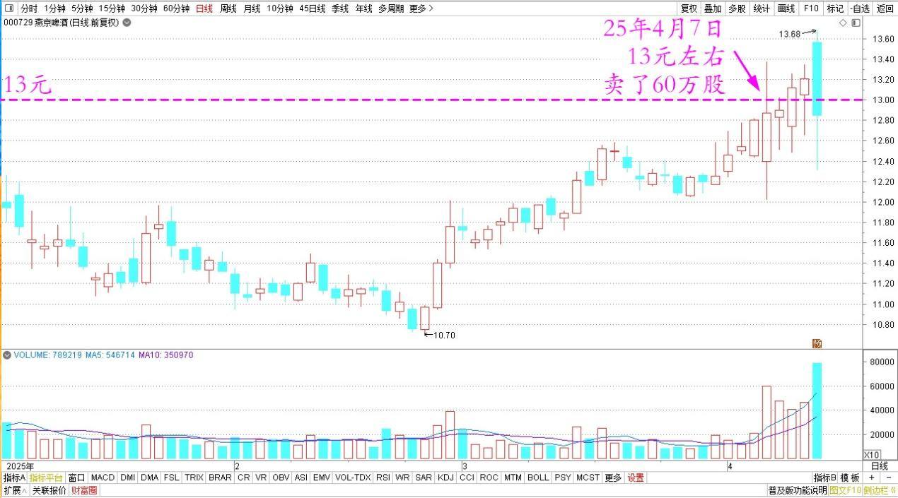
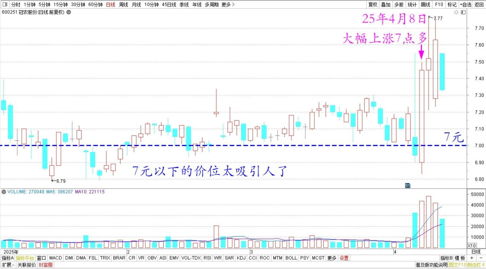
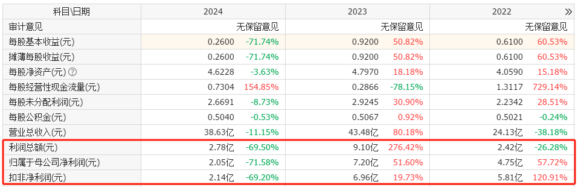
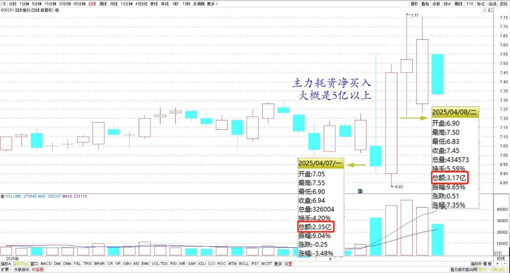

142篇.燕京换“其他”，新持仓冠农

清一山长 [2025年4月8日15:33](https://www.zhihu.com/pin/1892963145154269573)

今天上完课回来看看股票，我昨天损失的金钱，今天“自动回家”大概三分之一了。剩下的，总有一天会“回家”的。

昨天13元左右卖了60万股燕京。

燕京啤酒2025年日线图

今天我换股买入了60万股“其他”——昨天该股跌停，今天跌了9%我买入的。它的市值是燕京的0.8倍，但它去年的利润总额，是燕京的4倍还多！因为是周期股，被人嫌弃，所以估值比消费股低得多。但分红比燕京大气多了。所以——便宜我就买！燕京再涨的话，可能我就真的走了。虽然很遗憾！我总觉得燕京快拉升了！我一点一点地走吧！

其实原来我是持有该股的，只是前段时间涨了，比现价高35%-40%的时候，我就卖光了。我已经进出了好几次了。这次看它狂跌，不忍心就又买进来了。继续跌我也不怕，就长持好了！

另外公布一下新的持仓。我前面一段时间，一直在悄悄大买特买的股票是冠农股份！一季度我已经买成了十大股东，4月29日就要公布一季报了，反正也瞒不住了。其实今天我还想继续买入的，因为7元以下的价位太吸引人了，但今天居然大幅上涨7点多，显然是不想让我买了。

冠农股份2025年日线图

我看昨天今天的走势，主力已经完成建仓了，现在是利用昨天的坏消息，快速地下探震荡，今天就拉升脱离底部，主力也不再掩藏吸货做东的手法，所以我就自己说出来了。如果我原来在自己悄悄买的时候，就公布今天的这些资讯，会坏了主力的洗盘规划，暴露主力意图，我就太不地道，属于吃里扒外的行为。毕竟我也是跟庄主力老大的动向，靠主力赏饭吃的，主力在捕猎的时候，我怎么能够出来打扰猎物呢？所以我就一直没吭气，只是悄悄地买入！目前我的持仓成本，吸货的区域时间，大概上与主力的持仓差不多。所以我没啥好担心的！快速脱离成本区，该主力的手法，比燕京的主力更清晰有力，应该不会像燕京这样难以跟随，磨死人，好多年都没动静。也许可以赚一点快钱？一两年就起来了？

这个股票吸引我敢于重仓杀入当十大，是因为前面一段时间，该公司特别公布了利空消息，大幅计提损失，造成去年四季度的利润大幅下降。似乎这家公司快不行了似的！

冠农股份利润数据

我总觉得这事太不同寻常了。特别观察到该股并未明显下跌，7元左右显然有支撑，**基本面其实没啥危险，营销等等都非常正常**。所以我认为这是主力的一次震仓吸筹的宣传配合的操作。因此我就特别地留心研究了很久，并悄悄地同步在7元左右不断地买入该股，现在终于买成了十大股东！再也瞒不住各位了！新疆的股票，好像都有一点“妖”，背后的主力实力都特别强，不知道是不是“兵团”效应。但我认为**跟随国家的布局走，肯定没错**。**该股是“消费”加“有色”加“水电”的组合，题材多多**，也许会比啤酒带来的机会更多！试试看吧！

昨天盘中逆势冲高后下跌，把恐慌盘全都接走了！今天拉高吸筹，把昨天跟着抄底的投机筹码全拿走，手法干净利落。仅仅用两天的时间，就把市场上的流通盘吸走了20%，主力耗资净买入大概是5亿以上！

冠农股份 2025年3~4月 日线图

这两天的成交量，基本上把市场上的浮动筹码全部清理干净了！所以我判断已经到了拉升期。后续会在主力成本区以上整理和拉高，不再可能跌到7元的主力成本区域了。原来主力多次打压到7元左右吸筹，还利用了管理层的利空公告，已经形成了一个“不涨回落”的惯性。现在已经脱离了该震荡吸筹的区域，未来应该会在8元以上，才会开始整理和洗盘了！我会静静的等看热闹！大家看我说的对不对！[酷]

（标题、图片为编者所加）

**文章音频**：

[552篇.燕京换“其他”，新持仓冠农](http://link.zhihu.com/?target=https%3A//www.ximalaya.com/sound/837443753)

**参考链接：**

[134篇.重仓华菱钢铁的原因](https://zhuanlan.zhihu.com/p/28286645670)

[135篇.主升浪快来了，但我不贪心](https://zhuanlan.zhihu.com/p/30186294319)

[136篇.港股投资重点考虑国企红筹股](https://zhuanlan.zhihu.com/p/30187716852)

[137篇.中国建筑价格进入“关注”区间](https://zhuanlan.zhihu.com/p/32238604025)

[138篇.目前燕京、珠江、惠泉啤酒持仓处于历史高位](https://zhuanlan.zhihu.com/p/32731653546)

[139篇.养老账户啤酒股只有惠泉了](https://zhuanlan.zhihu.com/p/1889669208637420823)

[140篇.美股大跌，买中国建筑](https://zhuanlan.zhihu.com/p/1892305962292991549)

[141篇. 对美国涨税的应对与分析](https://zhuanlan.zhihu.com/p/1894809673506485390)

